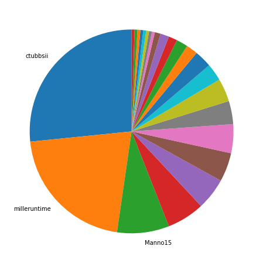
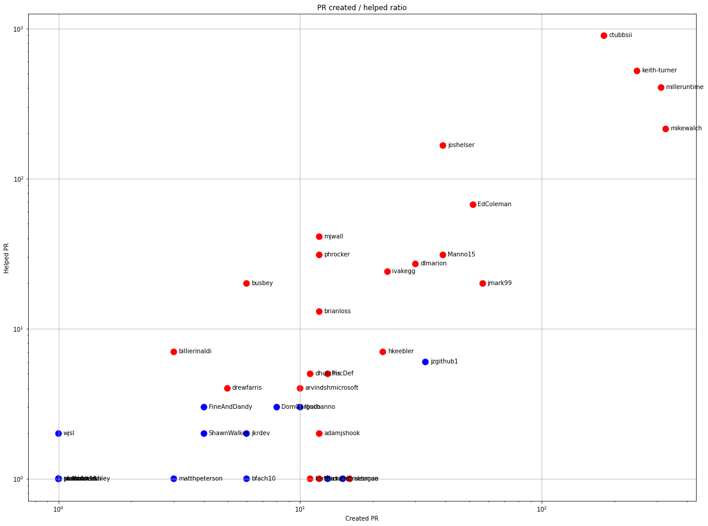
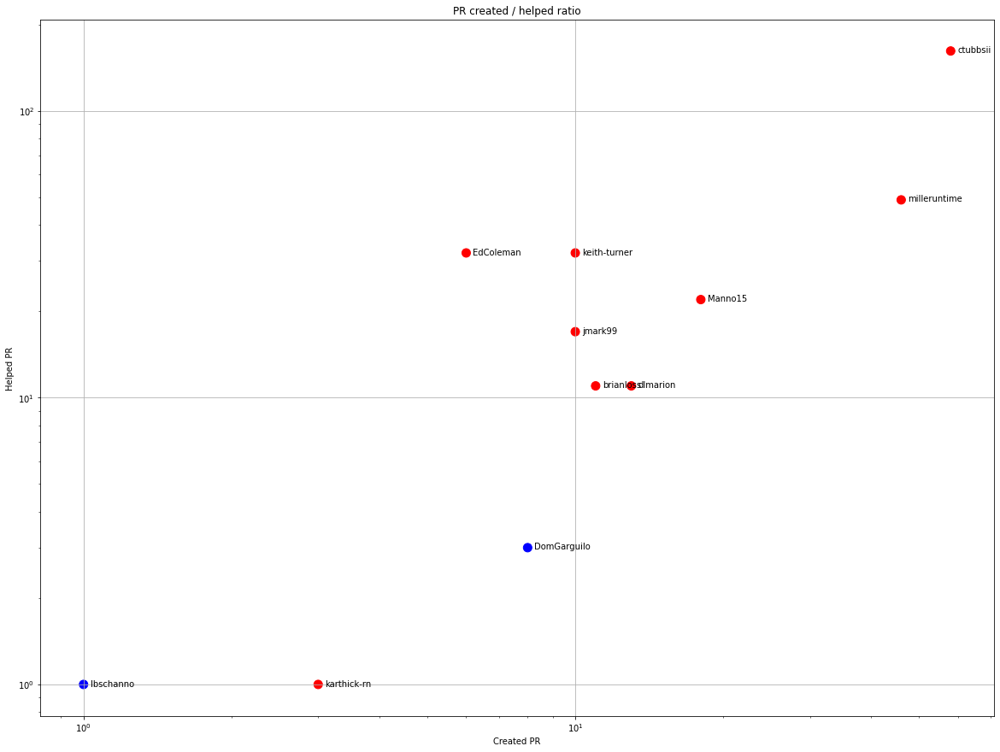
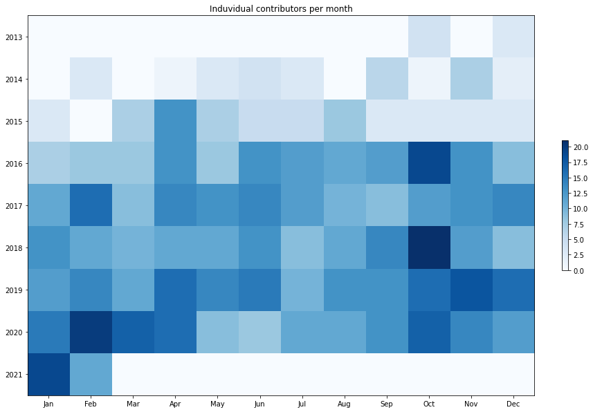
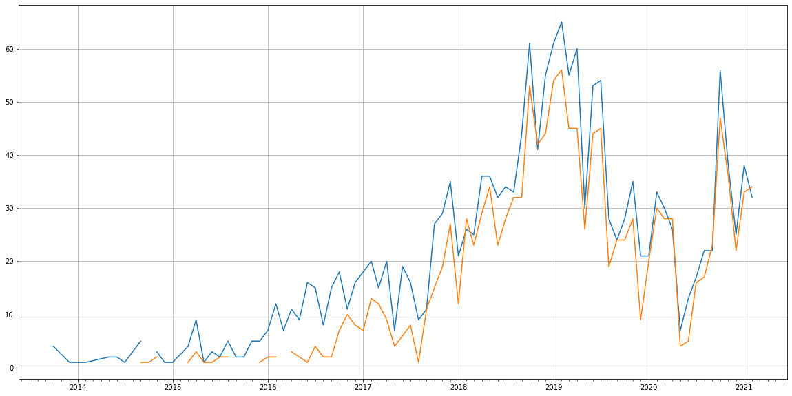
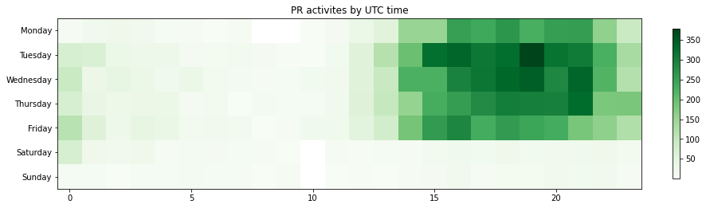

Latest record from the dataset:

<table border="1" class="dataframe">
  <thead>
    <tr style="text-align: right;">
      <th></th>
      <th>org</th>
      <th>repo</th>
      <th>type</th>
      <th>identifier</th>
      <th>subidentifier</th>
      <th>date</th>
      <th>author</th>
      <th>owner</th>
      <th>project</th>
    </tr>
  </thead>
  <tbody>
    <tr>
      <th>5968</th>
      <td>apache</td>
      <td>accumulo</td>
      <td>PR_COMMENTED</td>
      <td>1888</td>
      <td>NaN</td>
      <td>2021-02-12 22:29:40+00:00</td>
      <td>Manno15</td>
      <td>DomGarguilo</td>
      <td>accumulo</td>
    </tr>
  </tbody>
</table>

# Github Contributions per user

<table border="1" class="dataframe">
  <thead>
    <tr style="text-align: right;">
      <th></th>
      <th>contributions</th>
    </tr>
    <tr>
      <th>author</th>
      <th></th>
    </tr>
  </thead>
  <tbody>
    <tr>
      <th>ctubbsii</th>
      <td>2634</td>
    </tr>
    <tr>
      <th>keith-turner</th>
      <td>1760</td>
    </tr>
    <tr>
      <th>milleruntime</th>
      <td>917</td>
    </tr>
    <tr>
      <th>joshelser</th>
      <td>639</td>
    </tr>
    <tr>
      <th>mikewalch</th>
      <td>373</td>
    </tr>
    <tr>
      <th>asfgit</th>
      <td>179</td>
    </tr>
    <tr>
      <th>asfbot</th>
      <td>176</td>
    </tr>
    <tr>
      <th>EdColeman</th>
      <td>108</td>
    </tr>
    <tr>
      <th>ivakegg</th>
      <td>79</td>
    </tr>
    <tr>
      <th>mjwall</th>
      <td>76</td>
    </tr>
  </tbody>
</table>

## Contributors per participations in PRs which are not created by self (helping PRs)

<table border="1" class="dataframe">
  <thead>
    <tr style="text-align: right;">
      <th></th>
      <th>identifier</th>
    </tr>
    <tr>
      <th>author</th>
      <th></th>
    </tr>
  </thead>
  <tbody>
    <tr>
      <th>ctubbsii</th>
      <td>895</td>
    </tr>
    <tr>
      <th>keith-turner</th>
      <td>521</td>
    </tr>
    <tr>
      <th>milleruntime</th>
      <td>404</td>
    </tr>
    <tr>
      <th>mikewalch</th>
      <td>214</td>
    </tr>
    <tr>
      <th>joshelser</th>
      <td>166</td>
    </tr>
    <tr>
      <th>asfgit</th>
      <td>161</td>
    </tr>
    <tr>
      <th>EdColeman</th>
      <td>67</td>
    </tr>
    <tr>
      <th>mjwall</th>
      <td>41</td>
    </tr>
    <tr>
      <th>asfbot</th>
      <td>39</td>
    </tr>
    <tr>
      <th>phrocker</th>
      <td>31</td>
    </tr>
    <tr>
      <th>Manno15</th>
      <td>31</td>
    </tr>
    <tr>
      <th>dlmarion</th>
      <td>27</td>
    </tr>
    <tr>
      <th>ivakegg</th>
      <td>24</td>
    </tr>
    <tr>
      <th>busbey</th>
      <td>20</td>
    </tr>
    <tr>
      <th>jmark99</th>
      <td>20</td>
    </tr>
    <tr>
      <th>brianloss</th>
      <td>13</td>
    </tr>
    <tr>
      <th>madrob</th>
      <td>11</td>
    </tr>
    <tr>
      <th>hkeebler</th>
      <td>7</td>
    </tr>
    <tr>
      <th>billierinaldi</th>
      <td>7</td>
    </tr>
    <tr>
      <th>jzgithub1</th>
      <td>6</td>
    </tr>
  </tbody>
</table>

## Contributors per participations in any PRs

<table border="1" class="dataframe">
  <thead>
    <tr style="text-align: right;">
      <th></th>
      <th>identifier</th>
    </tr>
    <tr>
      <th>author</th>
      <th></th>
    </tr>
  </thead>
  <tbody>
    <tr>
      <th>ctubbsii</th>
      <td>1036</td>
    </tr>
    <tr>
      <th>keith-turner</th>
      <td>731</td>
    </tr>
    <tr>
      <th>milleruntime</th>
      <td>695</td>
    </tr>
    <tr>
      <th>mikewalch</th>
      <td>461</td>
    </tr>
    <tr>
      <th>joshelser</th>
      <td>203</td>
    </tr>
    <tr>
      <th>asfgit</th>
      <td>161</td>
    </tr>
    <tr>
      <th>EdColeman</th>
      <td>119</td>
    </tr>
    <tr>
      <th>jmark99</th>
      <td>76</td>
    </tr>
    <tr>
      <th>Manno15</th>
      <td>70</td>
    </tr>
    <tr>
      <th>dlmarion</th>
      <td>57</td>
    </tr>
    <tr>
      <th>mjwall</th>
      <td>52</td>
    </tr>
    <tr>
      <th>ivakegg</th>
      <td>47</td>
    </tr>
    <tr>
      <th>phrocker</th>
      <td>43</td>
    </tr>
    <tr>
      <th>jzgithub1</th>
      <td>39</td>
    </tr>
    <tr>
      <th>asfbot</th>
      <td>39</td>
    </tr>
    <tr>
      <th>hkeebler</th>
      <td>29</td>
    </tr>
    <tr>
      <th>busbey</th>
      <td>26</td>
    </tr>
    <tr>
      <th>brianloss</th>
      <td>25</td>
    </tr>
    <tr>
      <th>PircDef</th>
      <td>18</td>
    </tr>
    <tr>
      <th>alerman</th>
      <td>17</td>
    </tr>
  </tbody>
</table>

# Bus factor (number of contributors responsible for the 50% of the prs) from last half year

## Contributors until the half of the all contributions

<table border="1" class="dataframe">
  <thead>
    <tr style="text-align: right;">
      <th></th>
      <th>author</th>
      <th>identifier</th>
      <th>cs</th>
      <th>ratio</th>
    </tr>
  </thead>
  <tbody>
    <tr>
      <th>0</th>
      <td>ctubbsii</td>
      <td>58</td>
      <td>58</td>
      <td>26.605505</td>
    </tr>
    <tr>
      <th>1</th>
      <td>milleruntime</td>
      <td>46</td>
      <td>104</td>
      <td>21.100917</td>
    </tr>
  </tbody>
</table>

## Pony number (bus factor)

    3

## Dev power (All the contributions in the ration of the top contributor)

    3.7586206896551726

    

    

## People with created PRs > reviewed/commented PRS

    

    

## Same graph with focusing to the last 6 month

Only contributors with both created pr and helped pr visible

    

    

# Number of individual contributors per month

Number of different Github users who either created PR, commented PR, added review to a PR

Note: only events from apache/hadoop-ozone repository are included. Earlier PRs/comments are not here.

    

    

# Number of PRs closed/created per month

    /usr/lib/python3.9/site-packages/pandas/core/arrays/datetimes.py:1101: UserWarning: Converting to PeriodArray/Index representation will drop timezone information.
      warnings.warn(

    

    

# PR activity heatmap

    

    

