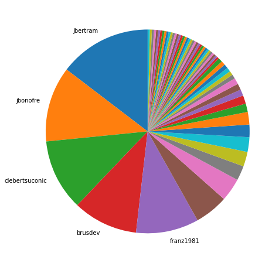
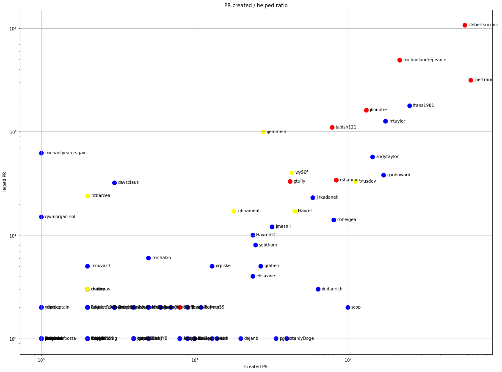
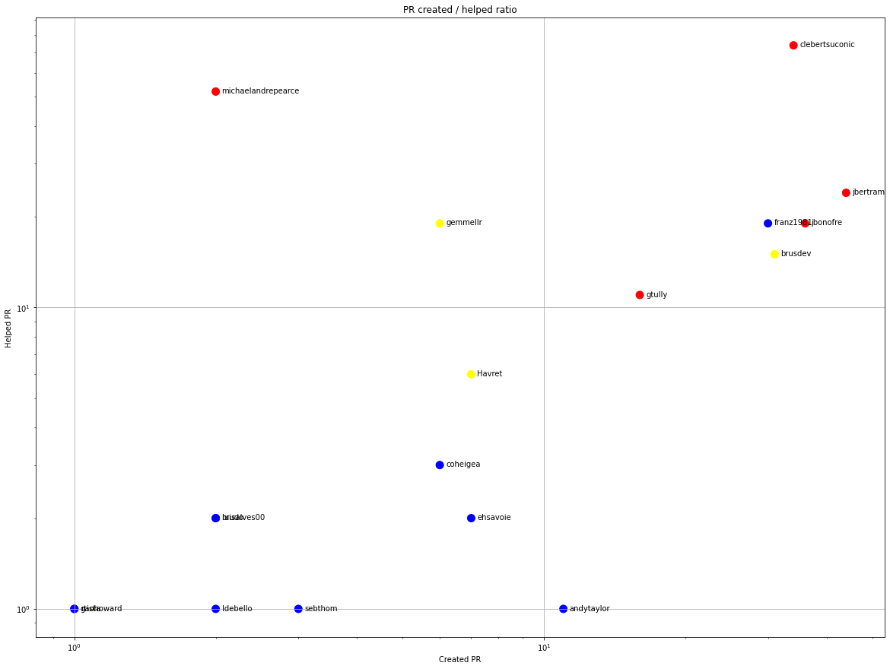
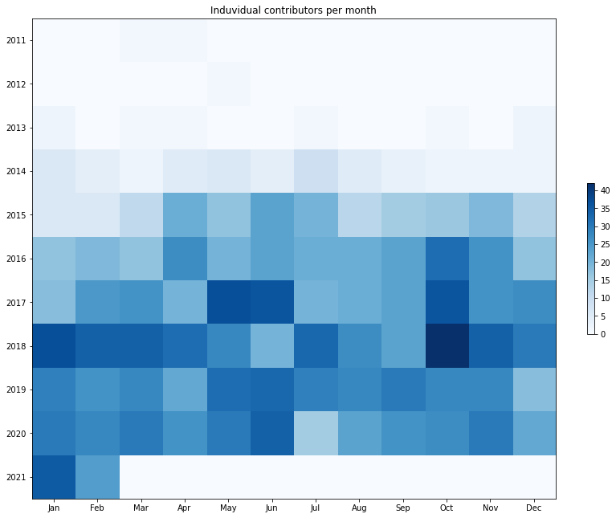
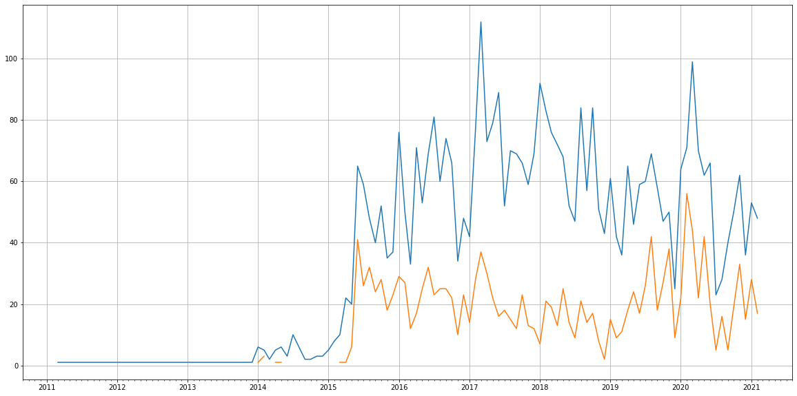
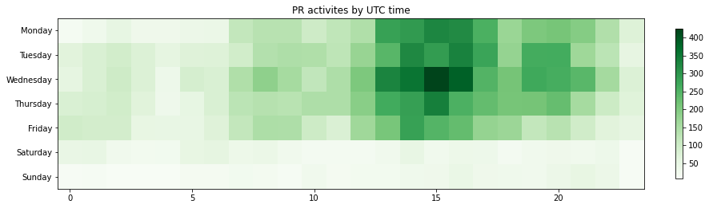

Latest record from the dataset:

<table border="1" class="dataframe">
  <thead>
    <tr style="text-align: right;">
      <th></th>
      <th>org</th>
      <th>repo</th>
      <th>type</th>
      <th>identifier</th>
      <th>subidentifier</th>
      <th>date</th>
      <th>author</th>
      <th>owner</th>
      <th>project</th>
    </tr>
  </thead>
  <tbody>
    <tr>
      <th>16592</th>
      <td>apache</td>
      <td>activemq-artemis</td>
      <td>PR_COMMENTED</td>
      <td>3451</td>
      <td>NaN</td>
      <td>2021-02-13 08:09:56+00:00</td>
      <td>jsmucr</td>
      <td>jsmucr</td>
      <td>activemq</td>
    </tr>
  </tbody>
</table>

# Github Contributions per user

<table border="1" class="dataframe">
  <thead>
    <tr style="text-align: right;">
      <th></th>
      <th>contributions</th>
    </tr>
    <tr>
      <th>author</th>
      <th></th>
    </tr>
  </thead>
  <tbody>
    <tr>
      <th>clebertsuconic</th>
      <td>2883</td>
    </tr>
    <tr>
      <th>michaelandrepearce</th>
      <td>1961</td>
    </tr>
    <tr>
      <th>asfgit</th>
      <td>1141</td>
    </tr>
    <tr>
      <th>jbertram</th>
      <td>603</td>
    </tr>
    <tr>
      <th>franz1981</th>
      <td>575</td>
    </tr>
    <tr>
      <th>asfbot</th>
      <td>463</td>
    </tr>
    <tr>
      <th>jbonofre</th>
      <td>320</td>
    </tr>
    <tr>
      <th>gemmellr</th>
      <td>276</td>
    </tr>
    <tr>
      <th>michaelpearce-gain</th>
      <td>251</td>
    </tr>
    <tr>
      <th>mtaylor</th>
      <td>223</td>
    </tr>
  </tbody>
</table>

## Contributors per participations in PRs which are not created by self (helping PRs)

<table border="1" class="dataframe">
  <thead>
    <tr style="text-align: right;">
      <th></th>
      <th>identifier</th>
    </tr>
    <tr>
      <th>author</th>
      <th></th>
    </tr>
  </thead>
  <tbody>
    <tr>
      <th>asfgit</th>
      <td>1092</td>
    </tr>
    <tr>
      <th>clebertsuconic</th>
      <td>1069</td>
    </tr>
    <tr>
      <th>michaelandrepearce</th>
      <td>491</td>
    </tr>
    <tr>
      <th>jbertram</th>
      <td>314</td>
    </tr>
    <tr>
      <th>asfbot</th>
      <td>188</td>
    </tr>
    <tr>
      <th>franz1981</th>
      <td>178</td>
    </tr>
    <tr>
      <th>jbonofre</th>
      <td>161</td>
    </tr>
    <tr>
      <th>mtaylor</th>
      <td>126</td>
    </tr>
    <tr>
      <th>tabish121</th>
      <td>110</td>
    </tr>
    <tr>
      <th>gemmellr</th>
      <td>99</td>
    </tr>
    <tr>
      <th>michaelpearce-gain</th>
      <td>62</td>
    </tr>
    <tr>
      <th>andytaylor</th>
      <td>57</td>
    </tr>
    <tr>
      <th>wy96f</th>
      <td>40</td>
    </tr>
    <tr>
      <th>gaohoward</th>
      <td>38</td>
    </tr>
    <tr>
      <th>cshannon</th>
      <td>34</td>
    </tr>
    <tr>
      <th>brusdev</th>
      <td>33</td>
    </tr>
    <tr>
      <th>gtully</th>
      <td>33</td>
    </tr>
    <tr>
      <th>davsclaus</th>
      <td>32</td>
    </tr>
    <tr>
      <th>hzbarcea</th>
      <td>24</td>
    </tr>
    <tr>
      <th>jirkadanek</th>
      <td>23</td>
    </tr>
  </tbody>
</table>

## Contributors per participations in any PRs

<table border="1" class="dataframe">
  <thead>
    <tr style="text-align: right;">
      <th></th>
      <th>identifier</th>
    </tr>
    <tr>
      <th>author</th>
      <th></th>
    </tr>
  </thead>
  <tbody>
    <tr>
      <th>clebertsuconic</th>
      <td>1636</td>
    </tr>
    <tr>
      <th>asfgit</th>
      <td>1092</td>
    </tr>
    <tr>
      <th>jbertram</th>
      <td>946</td>
    </tr>
    <tr>
      <th>michaelandrepearce</th>
      <td>700</td>
    </tr>
    <tr>
      <th>franz1981</th>
      <td>431</td>
    </tr>
    <tr>
      <th>mtaylor</th>
      <td>301</td>
    </tr>
    <tr>
      <th>jbonofre</th>
      <td>293</td>
    </tr>
    <tr>
      <th>gaohoward</th>
      <td>208</td>
    </tr>
    <tr>
      <th>andytaylor</th>
      <td>201</td>
    </tr>
    <tr>
      <th>tabish121</th>
      <td>189</td>
    </tr>
    <tr>
      <th>asfbot</th>
      <td>188</td>
    </tr>
    <tr>
      <th>brusdev</th>
      <td>145</td>
    </tr>
    <tr>
      <th>gemmellr</th>
      <td>127</td>
    </tr>
    <tr>
      <th>cshannon</th>
      <td>118</td>
    </tr>
    <tr>
      <th>scop</th>
      <td>102</td>
    </tr>
    <tr>
      <th>coheigea</th>
      <td>95</td>
    </tr>
    <tr>
      <th>wy96f</th>
      <td>83</td>
    </tr>
    <tr>
      <th>jirkadanek</th>
      <td>82</td>
    </tr>
    <tr>
      <th>gtully</th>
      <td>75</td>
    </tr>
    <tr>
      <th>dudaerich</th>
      <td>67</td>
    </tr>
  </tbody>
</table>

# Bus factor (number of contributors responsible for the 50% of the prs) from last half year

## Contributors until the half of the all contributions

<table border="1" class="dataframe">
  <thead>
    <tr style="text-align: right;">
      <th></th>
      <th>author</th>
      <th>identifier</th>
      <th>cs</th>
      <th>ratio</th>
    </tr>
  </thead>
  <tbody>
    <tr>
      <th>0</th>
      <td>jbertram</td>
      <td>44</td>
      <td>44</td>
      <td>14.617940</td>
    </tr>
    <tr>
      <th>1</th>
      <td>jbonofre</td>
      <td>36</td>
      <td>80</td>
      <td>11.960133</td>
    </tr>
    <tr>
      <th>2</th>
      <td>clebertsuconic</td>
      <td>34</td>
      <td>114</td>
      <td>11.295681</td>
    </tr>
    <tr>
      <th>3</th>
      <td>brusdev</td>
      <td>31</td>
      <td>145</td>
      <td>10.299003</td>
    </tr>
  </tbody>
</table>

## Pony number (bus factor)

    5

## Dev power (All the contributions in the ration of the top contributor)

    6.840909090909089

    

    

## People with created PRs > reviewed/commented PRS

    

    

## Same graph with focusing to the last 6 month

Only contributors with both created pr and helped pr visible

    

    

# Number of individual contributors per month

Number of different Github users who either created PR, commented PR, added review to a PR

Note: only events from apache/hadoop-ozone repository are included. Earlier PRs/comments are not here.

    

    

# Number of PRs closed/created per month

    /usr/lib/python3.9/site-packages/pandas/core/arrays/datetimes.py:1101: UserWarning: Converting to PeriodArray/Index representation will drop timezone information.
      warnings.warn(

    

    

# PR activity heatmap

    

    

