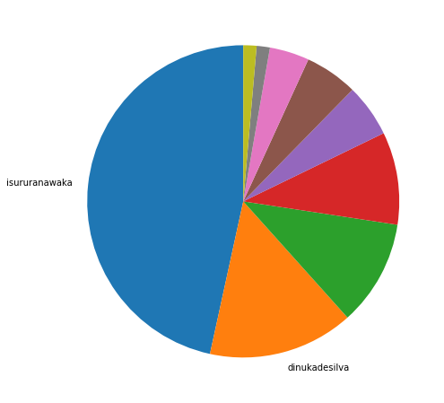
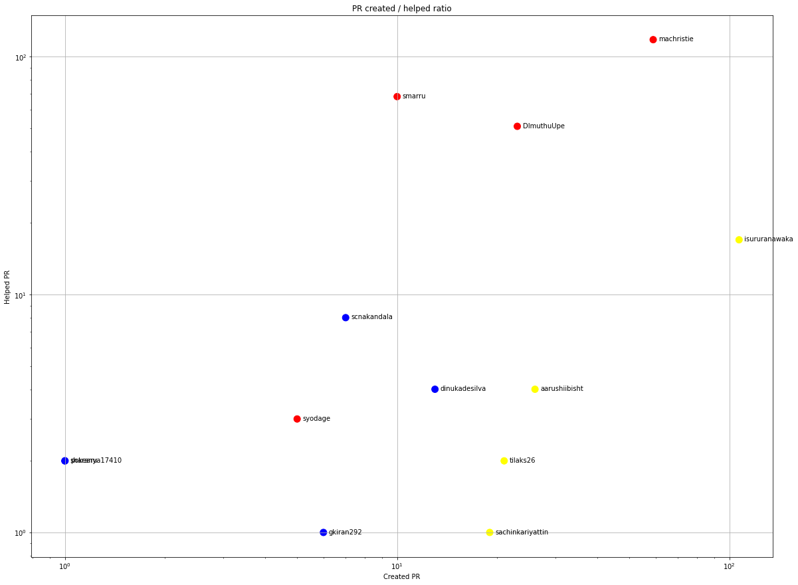
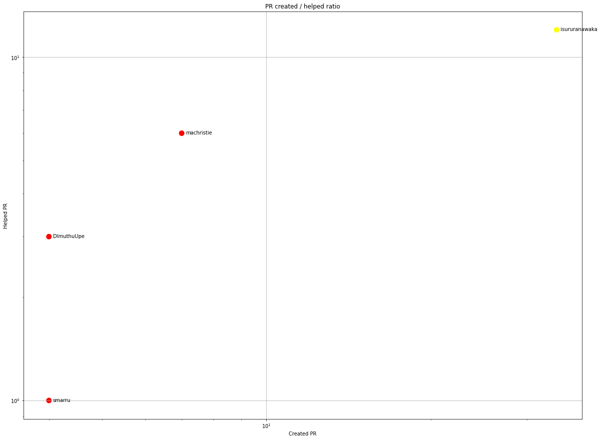
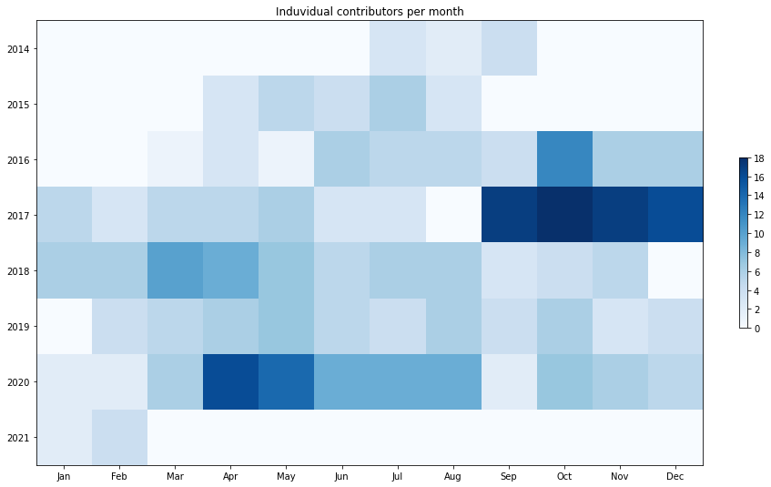
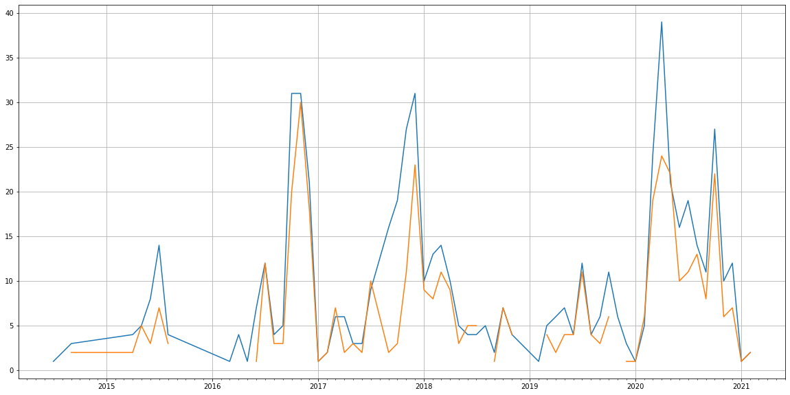
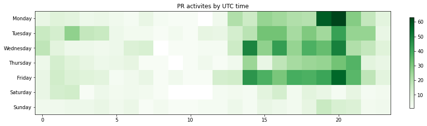

Latest record from the dataset:

<table border="1" class="dataframe">
  <thead>
    <tr style="text-align: right;">
      <th></th>
      <th>org</th>
      <th>repo</th>
      <th>type</th>
      <th>identifier</th>
      <th>subidentifier</th>
      <th>date</th>
      <th>author</th>
      <th>owner</th>
      <th>project</th>
    </tr>
  </thead>
  <tbody>
    <tr>
      <th>1699</th>
      <td>apache</td>
      <td>airavata-mft</td>
      <td>PR_COMMENTED</td>
      <td>28</td>
      <td>NaN</td>
      <td>2021-02-12 02:22:42+00:00</td>
      <td>DImuthuUpe</td>
      <td>machristie</td>
      <td>airavata</td>
    </tr>
  </tbody>
</table>

# Github Contributions per user

<table border="1" class="dataframe">
  <thead>
    <tr style="text-align: right;">
      <th></th>
      <th>contributions</th>
    </tr>
    <tr>
      <th>author</th>
      <th></th>
    </tr>
  </thead>
  <tbody>
    <tr>
      <th>machristie</th>
      <td>328</td>
    </tr>
    <tr>
      <th>DImuthuUpe</th>
      <td>206</td>
    </tr>
    <tr>
      <th>asfgit</th>
      <td>142</td>
    </tr>
    <tr>
      <th>smarru</th>
      <td>134</td>
    </tr>
    <tr>
      <th>isururanawaka</th>
      <td>18</td>
    </tr>
    <tr>
      <th>aniruddhavpatil</th>
      <td>17</td>
    </tr>
    <tr>
      <th>pokearu</th>
      <td>12</td>
    </tr>
    <tr>
      <th>scnakandala</th>
      <td>11</td>
    </tr>
    <tr>
      <th>syodage</th>
      <td>10</td>
    </tr>
    <tr>
      <th>aarushiibisht</th>
      <td>9</td>
    </tr>
  </tbody>
</table>

## Contributors per participations in PRs which are not created by self (helping PRs)

<table border="1" class="dataframe">
  <thead>
    <tr style="text-align: right;">
      <th></th>
      <th>identifier</th>
    </tr>
    <tr>
      <th>author</th>
      <th></th>
    </tr>
  </thead>
  <tbody>
    <tr>
      <th>machristie</th>
      <td>118</td>
    </tr>
    <tr>
      <th>asfgit</th>
      <td>103</td>
    </tr>
    <tr>
      <th>smarru</th>
      <td>68</td>
    </tr>
    <tr>
      <th>DImuthuUpe</th>
      <td>51</td>
    </tr>
    <tr>
      <th>isururanawaka</th>
      <td>17</td>
    </tr>
    <tr>
      <th>scnakandala</th>
      <td>8</td>
    </tr>
    <tr>
      <th>aarushiibisht</th>
      <td>4</td>
    </tr>
    <tr>
      <th>dinukadesilva</th>
      <td>4</td>
    </tr>
    <tr>
      <th>syodage</th>
      <td>3</td>
    </tr>
    <tr>
      <th>Ameya05</th>
      <td>3</td>
    </tr>
    <tr>
      <th>lahirug</th>
      <td>2</td>
    </tr>
    <tr>
      <th>pokearu</th>
      <td>2</td>
    </tr>
    <tr>
      <th>aniruddhavpatil</th>
      <td>2</td>
    </tr>
    <tr>
      <th>sharanya17410</th>
      <td>2</td>
    </tr>
    <tr>
      <th>tilaks26</th>
      <td>2</td>
    </tr>
    <tr>
      <th>gkiran292</th>
      <td>1</td>
    </tr>
    <tr>
      <th>ericfranz</th>
      <td>1</td>
    </tr>
    <tr>
      <th>docquantum</th>
      <td>1</td>
    </tr>
    <tr>
      <th>marcus</th>
      <td>1</td>
    </tr>
    <tr>
      <th>sachinkariyattin</th>
      <td>1</td>
    </tr>
  </tbody>
</table>

## Contributors per participations in any PRs

<table border="1" class="dataframe">
  <thead>
    <tr style="text-align: right;">
      <th></th>
      <th>identifier</th>
    </tr>
    <tr>
      <th>author</th>
      <th></th>
    </tr>
  </thead>
  <tbody>
    <tr>
      <th>machristie</th>
      <td>144</td>
    </tr>
    <tr>
      <th>isururanawaka</th>
      <td>111</td>
    </tr>
    <tr>
      <th>asfgit</th>
      <td>103</td>
    </tr>
    <tr>
      <th>smarru</th>
      <td>76</td>
    </tr>
    <tr>
      <th>DImuthuUpe</th>
      <td>71</td>
    </tr>
    <tr>
      <th>anujbhan</th>
      <td>27</td>
    </tr>
    <tr>
      <th>tilaks26</th>
      <td>23</td>
    </tr>
    <tr>
      <th>aarushiibisht</th>
      <td>22</td>
    </tr>
    <tr>
      <th>shivamriky</th>
      <td>20</td>
    </tr>
    <tr>
      <th>sachinkariyattin</th>
      <td>20</td>
    </tr>
    <tr>
      <th>jeffkinnison</th>
      <td>17</td>
    </tr>
    <tr>
      <th>dinukadesilva</th>
      <td>16</td>
    </tr>
    <tr>
      <th>bhaktinarvekar</th>
      <td>15</td>
    </tr>
    <tr>
      <th>scnakandala</th>
      <td>15</td>
    </tr>
    <tr>
      <th>gouravshenoy</th>
      <td>13</td>
    </tr>
    <tr>
      <th>stephenpaul2727</th>
      <td>12</td>
    </tr>
    <tr>
      <th>nikchett</th>
      <td>12</td>
    </tr>
    <tr>
      <th>harsha161992</th>
      <td>11</td>
    </tr>
    <tr>
      <th>madrinathapa</th>
      <td>11</td>
    </tr>
    <tr>
      <th>vivekshresta</th>
      <td>10</td>
    </tr>
  </tbody>
</table>

# Bus factor (number of contributors responsible for the 50% of the prs) from last half year

## Contributors until the half of the all contributions

<table border="1" class="dataframe">
  <thead>
    <tr style="text-align: right;">
      <th></th>
      <th>author</th>
      <th>identifier</th>
      <th>cs</th>
      <th>ratio</th>
    </tr>
  </thead>
  <tbody>
    <tr>
      <th>0</th>
      <td>isururanawaka</td>
      <td>34</td>
      <td>34</td>
      <td>46.575342</td>
    </tr>
  </tbody>
</table>

## Pony number (bus factor)

    2

## Dev power (All the contributions in the ration of the top contributor)

    2.1470588235294117

    

    

## People with created PRs > reviewed/commented PRS

    

    

## Same graph with focusing to the last 6 month

Only contributors with both created pr and helped pr visible

    

    

# Number of individual contributors per month

Number of different Github users who either created PR, commented PR, added review to a PR

Note: only events from apache/hadoop-ozone repository are included. Earlier PRs/comments are not here.

    

    

# Number of PRs closed/created per month

    /usr/lib/python3.9/site-packages/pandas/core/arrays/datetimes.py:1101: UserWarning: Converting to PeriodArray/Index representation will drop timezone information.
      warnings.warn(

    

    

# PR activity heatmap

    

    

