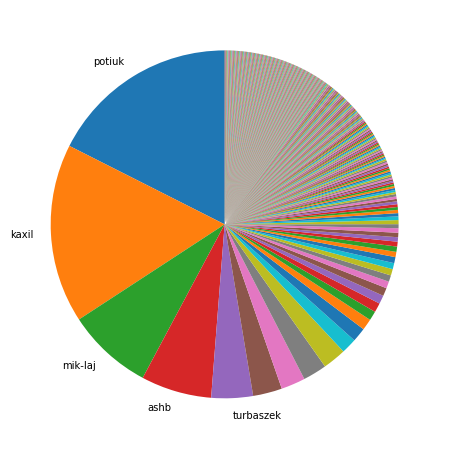
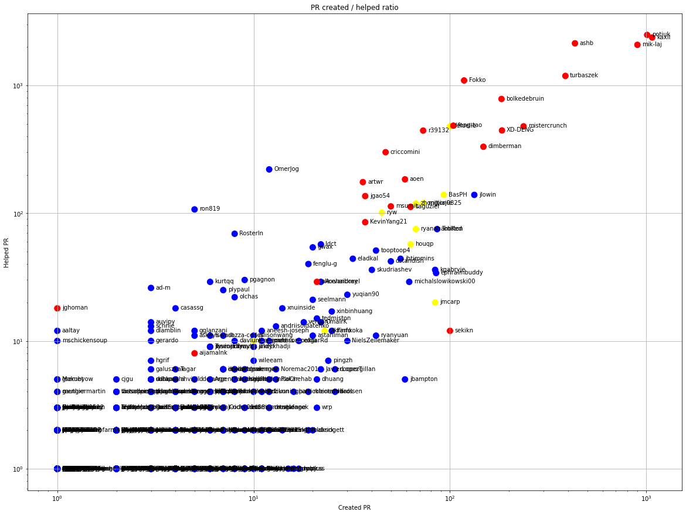
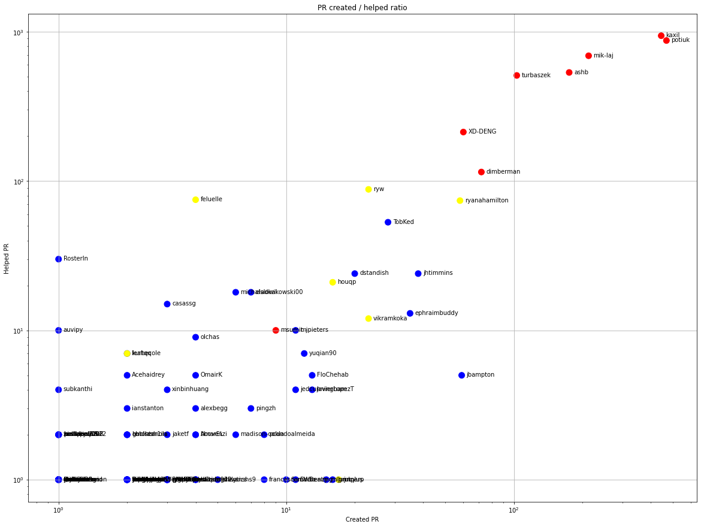
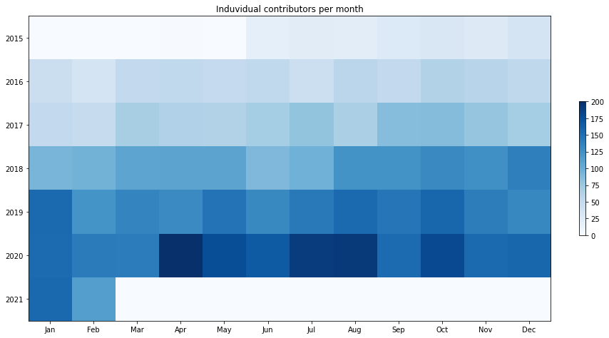
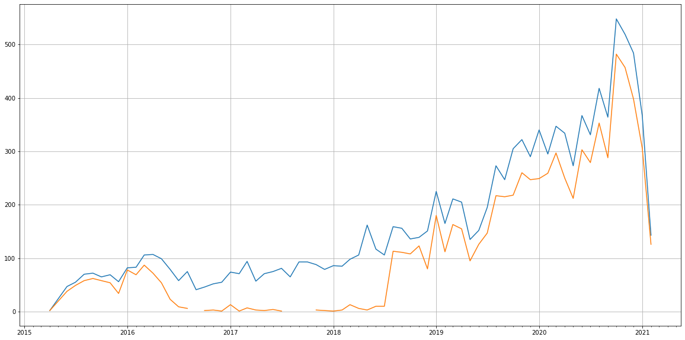
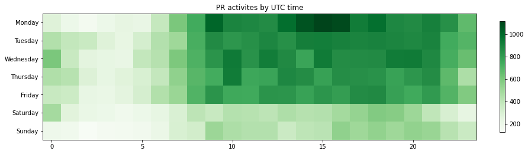

Latest record from the dataset:

<table border="1" class="dataframe">
  <thead>
    <tr style="text-align: right;">
      <th></th>
      <th>org</th>
      <th>repo</th>
      <th>type</th>
      <th>identifier</th>
      <th>subidentifier</th>
      <th>date</th>
      <th>author</th>
      <th>owner</th>
      <th>project</th>
    </tr>
  </thead>
  <tbody>
    <tr>
      <th>26150</th>
      <td>apache</td>
      <td>airflow</td>
      <td>PR_COMMENTED</td>
      <td>14224</td>
      <td>NaN</td>
      <td>2021-02-14 08:49:22+00:00</td>
      <td>github-actions</td>
      <td>mik-laj</td>
      <td>airflow</td>
    </tr>
  </tbody>
</table>

# Github Contributions per user

<table border="1" class="dataframe">
  <thead>
    <tr style="text-align: right;">
      <th></th>
      <th>contributions</th>
    </tr>
    <tr>
      <th>author</th>
      <th></th>
    </tr>
  </thead>
  <tbody>
    <tr>
      <th>ashb</th>
      <td>6731</td>
    </tr>
    <tr>
      <th>potiuk</th>
      <td>6226</td>
    </tr>
    <tr>
      <th>kaxil</th>
      <td>6177</td>
    </tr>
    <tr>
      <th>mik-laj</th>
      <td>6110</td>
    </tr>
    <tr>
      <th>codecov-io</th>
      <td>4175</td>
    </tr>
    <tr>
      <th>turbaszek</th>
      <td>3041</td>
    </tr>
    <tr>
      <th>github-actions</th>
      <td>2778</td>
    </tr>
    <tr>
      <th>Fokko</th>
      <td>2356</td>
    </tr>
    <tr>
      <th>bolkedebruin</th>
      <td>1696</td>
    </tr>
    <tr>
      <th>feluelle</th>
      <td>1224</td>
    </tr>
  </tbody>
</table>

## Contributors per participations in PRs which are not created by self (helping PRs)

<table border="1" class="dataframe">
  <thead>
    <tr style="text-align: right;">
      <th></th>
      <th>identifier</th>
    </tr>
    <tr>
      <th>author</th>
      <th></th>
    </tr>
  </thead>
  <tbody>
    <tr>
      <th>codecov-io</th>
      <td>4091</td>
    </tr>
    <tr>
      <th>potiuk</th>
      <td>2483</td>
    </tr>
    <tr>
      <th>kaxil</th>
      <td>2370</td>
    </tr>
    <tr>
      <th>ashb</th>
      <td>2134</td>
    </tr>
    <tr>
      <th>mik-laj</th>
      <td>2077</td>
    </tr>
    <tr>
      <th>github-actions</th>
      <td>1225</td>
    </tr>
    <tr>
      <th>turbaszek</th>
      <td>1186</td>
    </tr>
    <tr>
      <th>Fokko</th>
      <td>1093</td>
    </tr>
    <tr>
      <th>bolkedebruin</th>
      <td>783</td>
    </tr>
    <tr>
      <th>boring-cyborg</th>
      <td>719</td>
    </tr>
    <tr>
      <th>stale</th>
      <td>601</td>
    </tr>
    <tr>
      <th>feng-tao</th>
      <td>484</td>
    </tr>
    <tr>
      <th>feluelle</th>
      <td>479</td>
    </tr>
    <tr>
      <th>mistercrunch</th>
      <td>478</td>
    </tr>
    <tr>
      <th>XD-DENG</th>
      <td>444</td>
    </tr>
    <tr>
      <th>r39132</th>
      <td>443</td>
    </tr>
    <tr>
      <th>mention-bot</th>
      <td>362</td>
    </tr>
    <tr>
      <th>dimberman</th>
      <td>331</td>
    </tr>
    <tr>
      <th>criccomini</th>
      <td>300</td>
    </tr>
    <tr>
      <th>landscape-bot</th>
      <td>240</td>
    </tr>
  </tbody>
</table>

## Contributors per participations in any PRs

<table border="1" class="dataframe">
  <thead>
    <tr style="text-align: right;">
      <th></th>
      <th>identifier</th>
    </tr>
    <tr>
      <th>author</th>
      <th></th>
    </tr>
  </thead>
  <tbody>
    <tr>
      <th>codecov-io</th>
      <td>4091</td>
    </tr>
    <tr>
      <th>potiuk</th>
      <td>3489</td>
    </tr>
    <tr>
      <th>kaxil</th>
      <td>3440</td>
    </tr>
    <tr>
      <th>mik-laj</th>
      <td>2976</td>
    </tr>
    <tr>
      <th>ashb</th>
      <td>2566</td>
    </tr>
    <tr>
      <th>turbaszek</th>
      <td>1572</td>
    </tr>
    <tr>
      <th>github-actions</th>
      <td>1225</td>
    </tr>
    <tr>
      <th>Fokko</th>
      <td>1211</td>
    </tr>
    <tr>
      <th>bolkedebruin</th>
      <td>966</td>
    </tr>
    <tr>
      <th>boring-cyborg</th>
      <td>719</td>
    </tr>
    <tr>
      <th>mistercrunch</th>
      <td>715</td>
    </tr>
    <tr>
      <th>XD-DENG</th>
      <td>628</td>
    </tr>
    <tr>
      <th>stale</th>
      <td>601</td>
    </tr>
    <tr>
      <th>feng-tao</th>
      <td>588</td>
    </tr>
    <tr>
      <th>feluelle</th>
      <td>579</td>
    </tr>
    <tr>
      <th>r39132</th>
      <td>516</td>
    </tr>
    <tr>
      <th>dimberman</th>
      <td>479</td>
    </tr>
    <tr>
      <th>mention-bot</th>
      <td>362</td>
    </tr>
    <tr>
      <th>criccomini</th>
      <td>347</td>
    </tr>
    <tr>
      <th>jlowin</th>
      <td>272</td>
    </tr>
  </tbody>
</table>

# Bus factor (number of contributors responsible for the 50% of the prs) from last half year

## Contributors until the half of the all contributions

<table border="1" class="dataframe">
  <thead>
    <tr style="text-align: right;">
      <th></th>
      <th>author</th>
      <th>identifier</th>
      <th>cs</th>
      <th>ratio</th>
    </tr>
  </thead>
  <tbody>
    <tr>
      <th>0</th>
      <td>potiuk</td>
      <td>468</td>
      <td>468</td>
      <td>17.554389</td>
    </tr>
    <tr>
      <th>1</th>
      <td>kaxil</td>
      <td>444</td>
      <td>912</td>
      <td>16.654164</td>
    </tr>
    <tr>
      <th>2</th>
      <td>mik-laj</td>
      <td>213</td>
      <td>1125</td>
      <td>7.989497</td>
    </tr>
    <tr>
      <th>3</th>
      <td>ashb</td>
      <td>175</td>
      <td>1300</td>
      <td>6.564141</td>
    </tr>
  </tbody>
</table>

## Pony number (bus factor)

    5

## Dev power (All the contributions in the ration of the top contributor)

    5.696581196581195

    

    

## People with created PRs > reviewed/commented PRS

    

    

## Same graph with focusing to the last 6 month

Only contributors with both created pr and helped pr visible

    

    

# Number of individual contributors per month

Number of different Github users who either created PR, commented PR, added review to a PR

Note: only events from apache/hadoop-ozone repository are included. Earlier PRs/comments are not here.

    

    

# Number of PRs closed/created per month

    /usr/lib/python3.9/site-packages/pandas/core/arrays/datetimes.py:1101: UserWarning: Converting to PeriodArray/Index representation will drop timezone information.
      warnings.warn(

    

    

# PR activity heatmap

    

    

