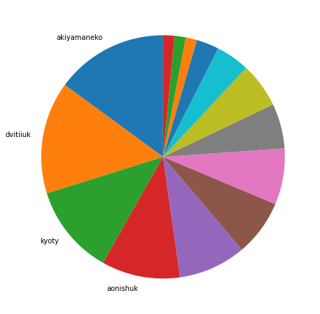
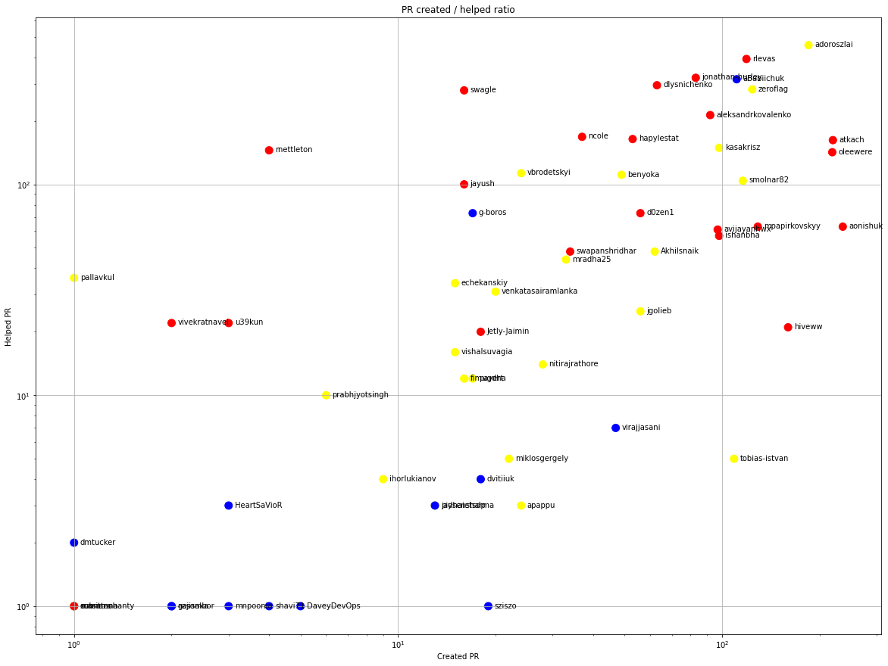
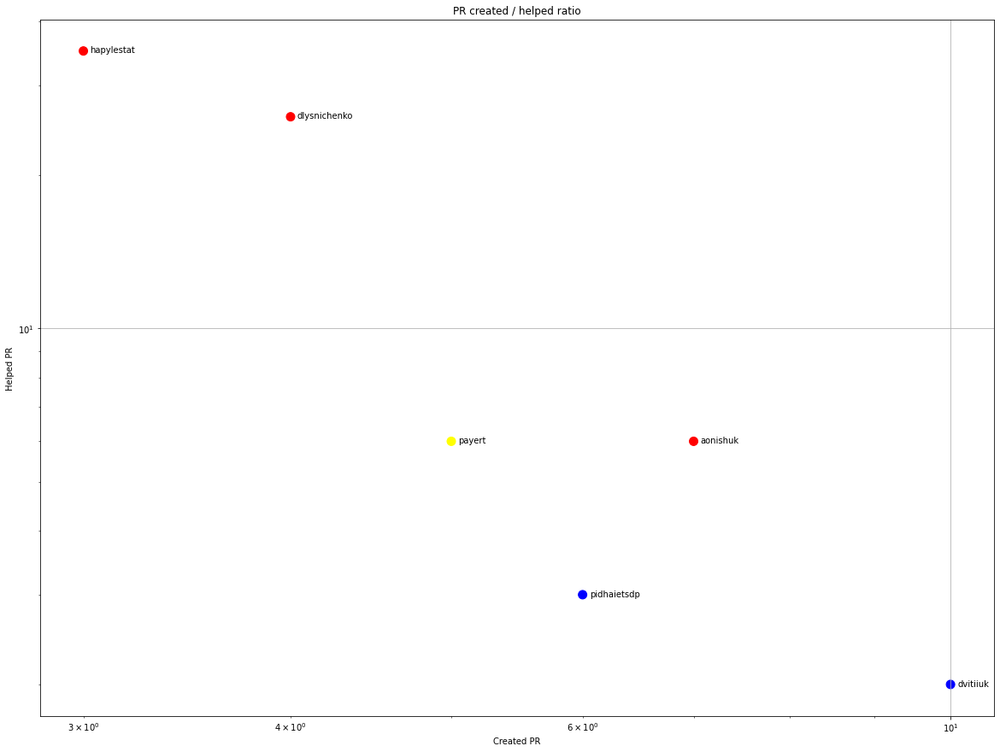
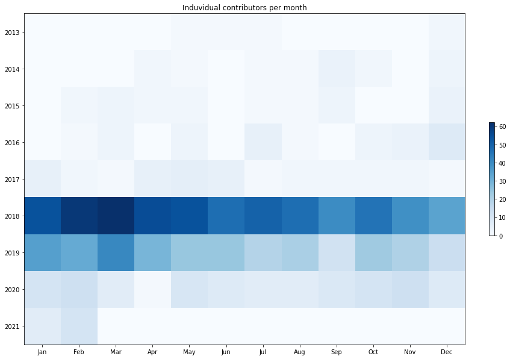
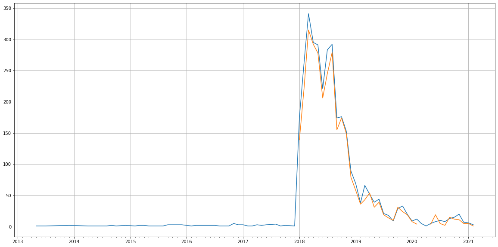
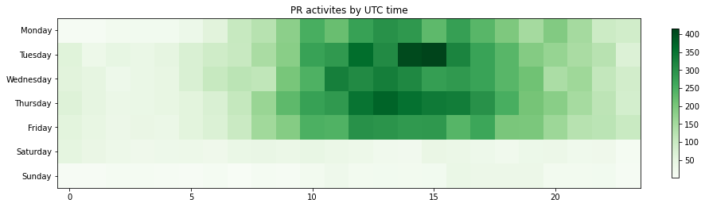

Latest record from the dataset:

<table border="1" class="dataframe">
  <thead>
    <tr style="text-align: right;">
      <th></th>
      <th>org</th>
      <th>repo</th>
      <th>type</th>
      <th>identifier</th>
      <th>subidentifier</th>
      <th>date</th>
      <th>author</th>
      <th>owner</th>
      <th>project</th>
    </tr>
  </thead>
  <tbody>
    <tr>
      <th>15773</th>
      <td>apache</td>
      <td>ambari</td>
      <td>PR_COMMENTED</td>
      <td>3283</td>
      <td>NaN</td>
      <td>2021-02-10 13:46:33+00:00</td>
      <td>NISHANTSHRIVASTAV</td>
      <td>sziszo</td>
      <td>ambari</td>
    </tr>
  </tbody>
</table>

# Github Contributions per user

<table border="1" class="dataframe">
  <thead>
    <tr style="text-align: right;">
      <th></th>
      <th>contributions</th>
    </tr>
    <tr>
      <th>author</th>
      <th></th>
    </tr>
  </thead>
  <tbody>
    <tr>
      <th>asfgit</th>
      <td>5489</td>
    </tr>
    <tr>
      <th>adoroszlai</th>
      <td>795</td>
    </tr>
    <tr>
      <th>rlevas</th>
      <td>636</td>
    </tr>
    <tr>
      <th>jonathan-hurley</th>
      <td>571</td>
    </tr>
    <tr>
      <th>swagle</th>
      <td>442</td>
    </tr>
    <tr>
      <th>aBabiichuk</th>
      <td>403</td>
    </tr>
    <tr>
      <th>zeroflag</th>
      <td>359</td>
    </tr>
    <tr>
      <th>dlysnichenko</th>
      <td>344</td>
    </tr>
    <tr>
      <th>hapylestat</th>
      <td>299</td>
    </tr>
    <tr>
      <th>oleewere</th>
      <td>234</td>
    </tr>
  </tbody>
</table>

## Contributors per participations in PRs which are not created by self (helping PRs)

<table border="1" class="dataframe">
  <thead>
    <tr style="text-align: right;">
      <th></th>
      <th>identifier</th>
    </tr>
    <tr>
      <th>author</th>
      <th></th>
    </tr>
  </thead>
  <tbody>
    <tr>
      <th>asfgit</th>
      <td>2935</td>
    </tr>
    <tr>
      <th>adoroszlai</th>
      <td>457</td>
    </tr>
    <tr>
      <th>rlevas</th>
      <td>393</td>
    </tr>
    <tr>
      <th>jonathan-hurley</th>
      <td>320</td>
    </tr>
    <tr>
      <th>aBabiichuk</th>
      <td>315</td>
    </tr>
    <tr>
      <th>dlysnichenko</th>
      <td>295</td>
    </tr>
    <tr>
      <th>zeroflag</th>
      <td>282</td>
    </tr>
    <tr>
      <th>swagle</th>
      <td>279</td>
    </tr>
    <tr>
      <th>aleksandrkovalenko</th>
      <td>213</td>
    </tr>
    <tr>
      <th>ncole</th>
      <td>168</td>
    </tr>
    <tr>
      <th>hapylestat</th>
      <td>164</td>
    </tr>
    <tr>
      <th>atkach</th>
      <td>162</td>
    </tr>
    <tr>
      <th>kasakrisz</th>
      <td>149</td>
    </tr>
    <tr>
      <th>rnettleton</th>
      <td>145</td>
    </tr>
    <tr>
      <th>oleewere</th>
      <td>142</td>
    </tr>
    <tr>
      <th>vbrodetskyi</th>
      <td>113</td>
    </tr>
    <tr>
      <th>benyoka</th>
      <td>111</td>
    </tr>
    <tr>
      <th>smolnar82</th>
      <td>104</td>
    </tr>
    <tr>
      <th>asf-ci</th>
      <td>102</td>
    </tr>
    <tr>
      <th>jayush</th>
      <td>100</td>
    </tr>
  </tbody>
</table>

## Contributors per participations in any PRs

<table border="1" class="dataframe">
  <thead>
    <tr style="text-align: right;">
      <th></th>
      <th>identifier</th>
    </tr>
    <tr>
      <th>author</th>
      <th></th>
    </tr>
  </thead>
  <tbody>
    <tr>
      <th>asfgit</th>
      <td>2935</td>
    </tr>
    <tr>
      <th>adoroszlai</th>
      <td>641</td>
    </tr>
    <tr>
      <th>rlevas</th>
      <td>512</td>
    </tr>
    <tr>
      <th>aBabiichuk</th>
      <td>426</td>
    </tr>
    <tr>
      <th>zeroflag</th>
      <td>406</td>
    </tr>
    <tr>
      <th>jonathan-hurley</th>
      <td>403</td>
    </tr>
    <tr>
      <th>atkach</th>
      <td>382</td>
    </tr>
    <tr>
      <th>dlysnichenko</th>
      <td>358</td>
    </tr>
    <tr>
      <th>oleewere</th>
      <td>345</td>
    </tr>
    <tr>
      <th>aleksandrkovalenko</th>
      <td>305</td>
    </tr>
    <tr>
      <th>aonishuk</th>
      <td>299</td>
    </tr>
    <tr>
      <th>swagle</th>
      <td>295</td>
    </tr>
    <tr>
      <th>kasakrisz</th>
      <td>236</td>
    </tr>
    <tr>
      <th>smolnar82</th>
      <td>220</td>
    </tr>
    <tr>
      <th>hapylestat</th>
      <td>217</td>
    </tr>
    <tr>
      <th>ncole</th>
      <td>205</td>
    </tr>
    <tr>
      <th>mpapirkovskyy</th>
      <td>192</td>
    </tr>
    <tr>
      <th>hiveww</th>
      <td>181</td>
    </tr>
    <tr>
      <th>benyoka</th>
      <td>160</td>
    </tr>
    <tr>
      <th>avijayanhwx</th>
      <td>158</td>
    </tr>
  </tbody>
</table>

# Bus factor (number of contributors responsible for the 50% of the prs) from last half year

## Contributors until the half of the all contributions

<table border="1" class="dataframe">
  <thead>
    <tr style="text-align: right;">
      <th></th>
      <th>author</th>
      <th>identifier</th>
      <th>cs</th>
      <th>ratio</th>
    </tr>
  </thead>
  <tbody>
    <tr>
      <th>0</th>
      <td>akiyamaneko</td>
      <td>10</td>
      <td>10</td>
      <td>14.925373</td>
    </tr>
    <tr>
      <th>1</th>
      <td>dvitiiuk</td>
      <td>10</td>
      <td>20</td>
      <td>14.925373</td>
    </tr>
    <tr>
      <th>2</th>
      <td>kyoty</td>
      <td>8</td>
      <td>28</td>
      <td>11.940299</td>
    </tr>
  </tbody>
</table>

## Pony number (bus factor)

    4

## Dev power (All the contributions in the ration of the top contributor)

    6.699999999999999

    

    

## People with created PRs > reviewed/commented PRS

    

    

## Same graph with focusing to the last 6 month

Only contributors with both created pr and helped pr visible

    

    

# Number of individual contributors per month

Number of different Github users who either created PR, commented PR, added review to a PR

Note: only events from apache/hadoop-ozone repository are included. Earlier PRs/comments are not here.

    

    

# Number of PRs closed/created per month

    /usr/lib/python3.9/site-packages/pandas/core/arrays/datetimes.py:1101: UserWarning: Converting to PeriodArray/Index representation will drop timezone information.
      warnings.warn(

    

    

# PR activity heatmap

    

    

