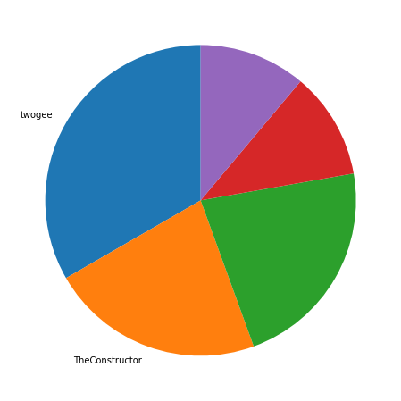
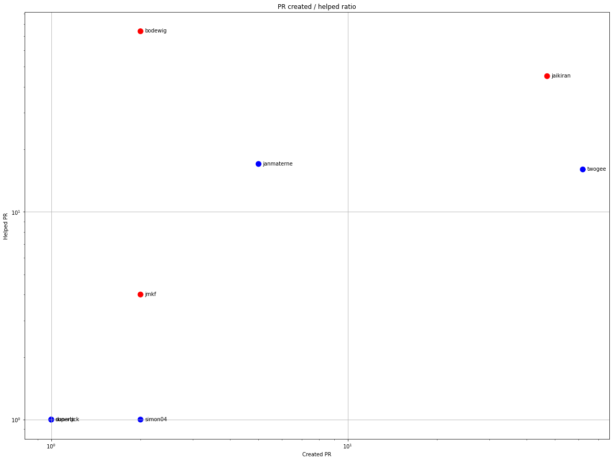
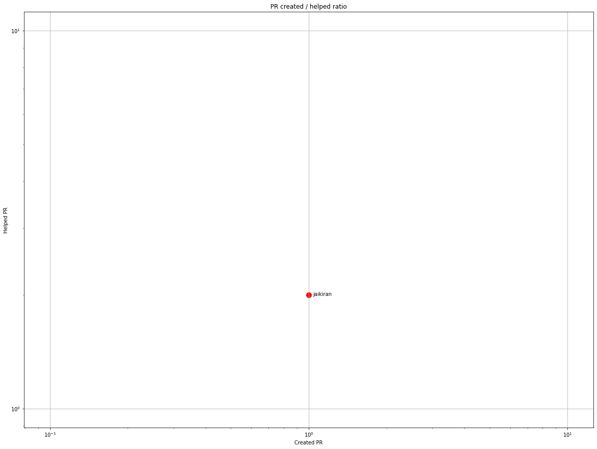
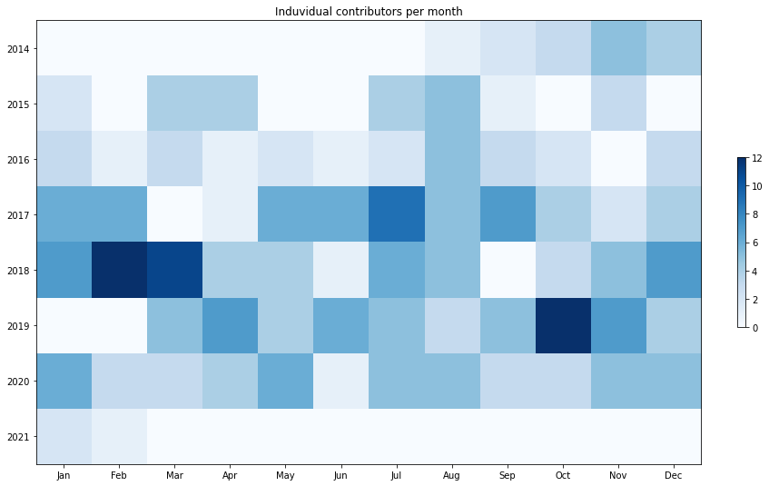
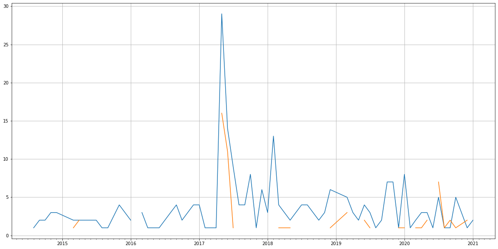
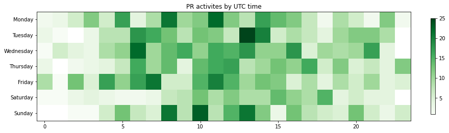

Latest record from the dataset:

<table border="1" class="dataframe">
  <thead>
    <tr style="text-align: right;">
      <th></th>
      <th>org</th>
      <th>repo</th>
      <th>type</th>
      <th>identifier</th>
      <th>subidentifier</th>
      <th>date</th>
      <th>author</th>
      <th>owner</th>
      <th>project</th>
    </tr>
  </thead>
  <tbody>
    <tr>
      <th>1488</th>
      <td>apache</td>
      <td>ant-ivy</td>
      <td>PR_COMMENTED</td>
      <td>92</td>
      <td>NaN</td>
      <td>2021-02-13 16:10:42+00:00</td>
      <td>twogee</td>
      <td>twogee</td>
      <td>ant</td>
    </tr>
  </tbody>
</table>

# Github Contributions per user

<table border="1" class="dataframe">
  <thead>
    <tr style="text-align: right;">
      <th></th>
      <th>contributions</th>
    </tr>
    <tr>
      <th>author</th>
      <th></th>
    </tr>
  </thead>
  <tbody>
    <tr>
      <th>asfgit</th>
      <td>367</td>
    </tr>
    <tr>
      <th>bodewig</th>
      <td>207</td>
    </tr>
    <tr>
      <th>jaikiran</th>
      <td>128</td>
    </tr>
    <tr>
      <th>asf-ci</th>
      <td>68</td>
    </tr>
    <tr>
      <th>twogee</th>
      <td>62</td>
    </tr>
    <tr>
      <th>janmaterne</th>
      <td>49</td>
    </tr>
    <tr>
      <th>hibnico</th>
      <td>20</td>
    </tr>
    <tr>
      <th>sutchark</th>
      <td>7</td>
    </tr>
    <tr>
      <th>jmkf</th>
      <td>6</td>
    </tr>
    <tr>
      <th>don-vip</th>
      <td>5</td>
    </tr>
  </tbody>
</table>

## Contributors per participations in PRs which are not created by self (helping PRs)

<table border="1" class="dataframe">
  <thead>
    <tr style="text-align: right;">
      <th></th>
      <th>identifier</th>
    </tr>
    <tr>
      <th>author</th>
      <th></th>
    </tr>
  </thead>
  <tbody>
    <tr>
      <th>asfgit</th>
      <td>83</td>
    </tr>
    <tr>
      <th>bodewig</th>
      <td>74</td>
    </tr>
    <tr>
      <th>jaikiran</th>
      <td>45</td>
    </tr>
    <tr>
      <th>janmaterne</th>
      <td>17</td>
    </tr>
    <tr>
      <th>twogee</th>
      <td>16</td>
    </tr>
    <tr>
      <th>hibnico</th>
      <td>16</td>
    </tr>
    <tr>
      <th>asf-ci</th>
      <td>15</td>
    </tr>
    <tr>
      <th>jmkf</th>
      <td>4</td>
    </tr>
    <tr>
      <th>asfbot</th>
      <td>3</td>
    </tr>
    <tr>
      <th>sutchark</th>
      <td>2</td>
    </tr>
    <tr>
      <th>jsuereth</th>
      <td>2</td>
    </tr>
    <tr>
      <th>mc1arke</th>
      <td>1</td>
    </tr>
    <tr>
      <th>supertick</th>
      <td>1</td>
    </tr>
    <tr>
      <th>simon04</th>
      <td>1</td>
    </tr>
    <tr>
      <th>AurelienLourot</th>
      <td>1</td>
    </tr>
    <tr>
      <th>lipnitsk</th>
      <td>1</td>
    </tr>
    <tr>
      <th>ajmas</th>
      <td>1</td>
    </tr>
    <tr>
      <th>don-vip</th>
      <td>1</td>
    </tr>
    <tr>
      <th>benmccann</th>
      <td>1</td>
    </tr>
    <tr>
      <th>avanishkant</th>
      <td>1</td>
    </tr>
  </tbody>
</table>

## Contributors per participations in any PRs

<table border="1" class="dataframe">
  <thead>
    <tr style="text-align: right;">
      <th></th>
      <th>identifier</th>
    </tr>
    <tr>
      <th>author</th>
      <th></th>
    </tr>
  </thead>
  <tbody>
    <tr>
      <th>asfgit</th>
      <td>83</td>
    </tr>
    <tr>
      <th>jaikiran</th>
      <td>82</td>
    </tr>
    <tr>
      <th>bodewig</th>
      <td>76</td>
    </tr>
    <tr>
      <th>twogee</th>
      <td>73</td>
    </tr>
    <tr>
      <th>janmaterne</th>
      <td>22</td>
    </tr>
    <tr>
      <th>hibnico</th>
      <td>16</td>
    </tr>
    <tr>
      <th>asf-ci</th>
      <td>15</td>
    </tr>
    <tr>
      <th>BruceKuiLiu</th>
      <td>7</td>
    </tr>
    <tr>
      <th>jwadamson</th>
      <td>6</td>
    </tr>
    <tr>
      <th>reudismam</th>
      <td>6</td>
    </tr>
    <tr>
      <th>jmkf</th>
      <td>6</td>
    </tr>
    <tr>
      <th>tzezula</th>
      <td>5</td>
    </tr>
    <tr>
      <th>asfbot</th>
      <td>3</td>
    </tr>
    <tr>
      <th>apupier</th>
      <td>3</td>
    </tr>
    <tr>
      <th>AQuillet</th>
      <td>3</td>
    </tr>
    <tr>
      <th>mguillem</th>
      <td>3</td>
    </tr>
    <tr>
      <th>simon04</th>
      <td>3</td>
    </tr>
    <tr>
      <th>jsuereth</th>
      <td>2</td>
    </tr>
    <tr>
      <th>jnsnkrllive</th>
      <td>2</td>
    </tr>
    <tr>
      <th>mguessan</th>
      <td>2</td>
    </tr>
  </tbody>
</table>

# Bus factor (number of contributors responsible for the 50% of the prs) from last half year

## Contributors until the half of the all contributions

<table border="1" class="dataframe">
  <thead>
    <tr style="text-align: right;">
      <th></th>
      <th>author</th>
      <th>identifier</th>
      <th>cs</th>
      <th>ratio</th>
    </tr>
  </thead>
  <tbody>
    <tr>
      <th>0</th>
      <td>twogee</td>
      <td>3</td>
      <td>3</td>
      <td>33.333333</td>
    </tr>
  </tbody>
</table>

## Pony number (bus factor)

    2

## Dev power (All the contributions in the ration of the top contributor)

    3.0

    

    

## People with created PRs > reviewed/commented PRS

    

    

## Same graph with focusing to the last 6 month

Only contributors with both created pr and helped pr visible

    

    

# Number of individual contributors per month

Number of different Github users who either created PR, commented PR, added review to a PR

Note: only events from apache/hadoop-ozone repository are included. Earlier PRs/comments are not here.

    

    

# Number of PRs closed/created per month

    /usr/lib/python3.9/site-packages/pandas/core/arrays/datetimes.py:1101: UserWarning: Converting to PeriodArray/Index representation will drop timezone information.
      warnings.warn(

    

    

# PR activity heatmap

    

    

