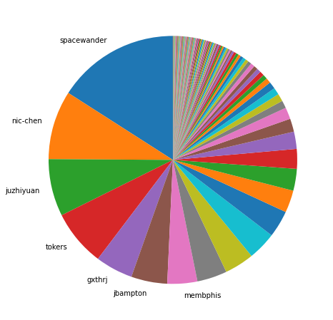
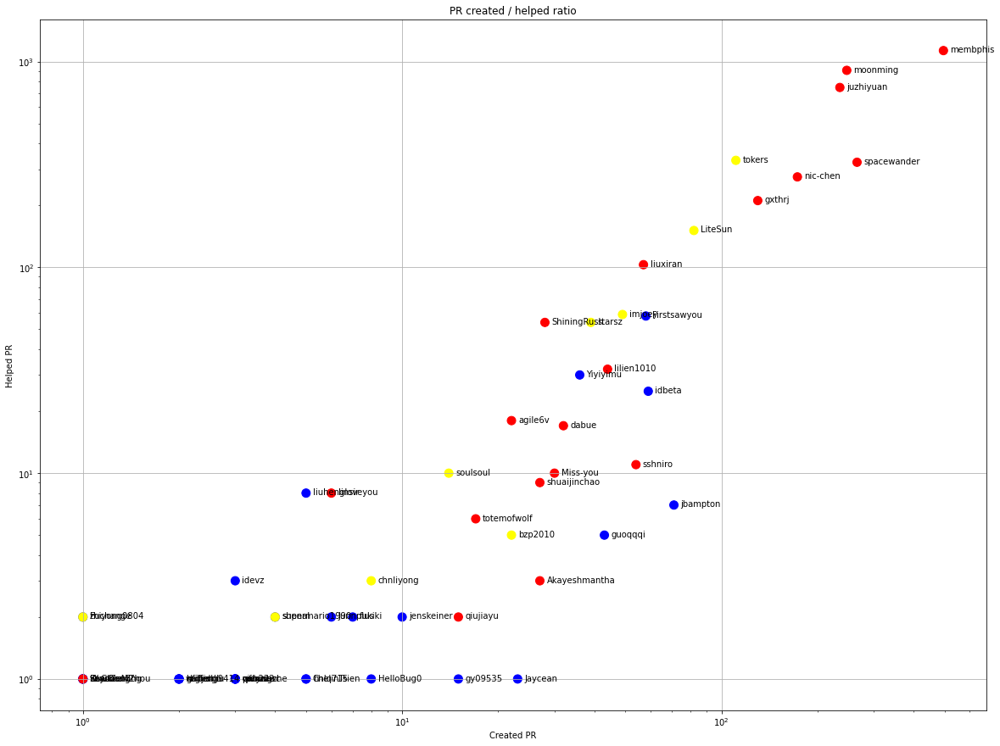
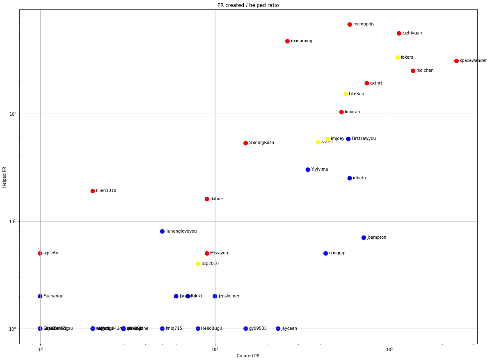
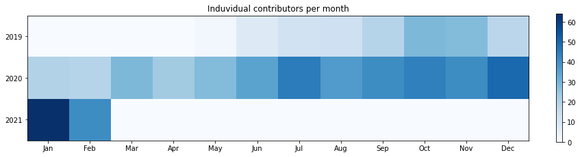
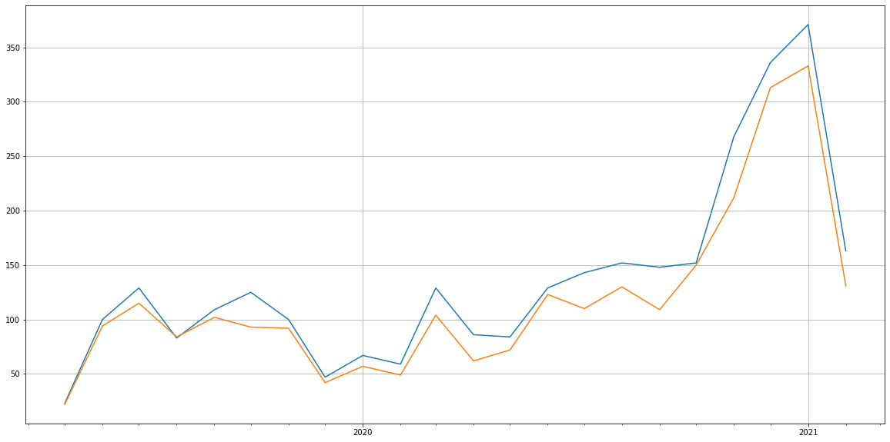
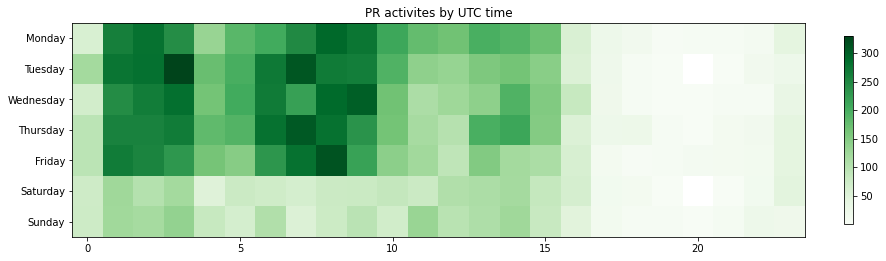

Latest record from the dataset:

<table border="1" class="dataframe">
  <thead>
    <tr style="text-align: right;">
      <th></th>
      <th>org</th>
      <th>repo</th>
      <th>type</th>
      <th>identifier</th>
      <th>subidentifier</th>
      <th>date</th>
      <th>author</th>
      <th>owner</th>
      <th>project</th>
    </tr>
  </thead>
  <tbody>
    <tr>
      <th>10025</th>
      <td>apache</td>
      <td>apisix</td>
      <td>PR_REVIEW_APPROVED</td>
      <td>3591</td>
      <td>NaN</td>
      <td>2021-02-14 08:43:32+00:00</td>
      <td>tokers</td>
      <td>membphis</td>
      <td>apisix</td>
    </tr>
  </tbody>
</table>

# Github Contributions per user

<table border="1" class="dataframe">
  <thead>
    <tr style="text-align: right;">
      <th></th>
      <th>contributions</th>
    </tr>
    <tr>
      <th>author</th>
      <th></th>
    </tr>
  </thead>
  <tbody>
    <tr>
      <th>membphis</th>
      <td>3463</td>
    </tr>
    <tr>
      <th>juzhiyuan</th>
      <td>2004</td>
    </tr>
    <tr>
      <th>moonming</th>
      <td>1988</td>
    </tr>
    <tr>
      <th>spacewander</th>
      <td>790</td>
    </tr>
    <tr>
      <th>tokers</th>
      <td>650</td>
    </tr>
    <tr>
      <th>nic-chen</th>
      <td>564</td>
    </tr>
    <tr>
      <th>gxthrj</th>
      <td>392</td>
    </tr>
    <tr>
      <th>codecov-io</th>
      <td>352</td>
    </tr>
    <tr>
      <th>LiteSun</th>
      <td>231</td>
    </tr>
    <tr>
      <th>liuxiran</th>
      <td>226</td>
    </tr>
  </tbody>
</table>

## Contributors per participations in PRs which are not created by self (helping PRs)

<table border="1" class="dataframe">
  <thead>
    <tr style="text-align: right;">
      <th></th>
      <th>identifier</th>
    </tr>
    <tr>
      <th>author</th>
      <th></th>
    </tr>
  </thead>
  <tbody>
    <tr>
      <th>membphis</th>
      <td>1130</td>
    </tr>
    <tr>
      <th>moonming</th>
      <td>906</td>
    </tr>
    <tr>
      <th>juzhiyuan</th>
      <td>748</td>
    </tr>
    <tr>
      <th>codecov-io</th>
      <td>352</td>
    </tr>
    <tr>
      <th>tokers</th>
      <td>331</td>
    </tr>
    <tr>
      <th>spacewander</th>
      <td>324</td>
    </tr>
    <tr>
      <th>nic-chen</th>
      <td>275</td>
    </tr>
    <tr>
      <th>gxthrj</th>
      <td>211</td>
    </tr>
    <tr>
      <th>LiteSun</th>
      <td>151</td>
    </tr>
    <tr>
      <th>liuxiran</th>
      <td>103</td>
    </tr>
    <tr>
      <th>imjoey</th>
      <td>59</td>
    </tr>
    <tr>
      <th>Firstsawyou</th>
      <td>58</td>
    </tr>
    <tr>
      <th>ShiningRush</th>
      <td>54</td>
    </tr>
    <tr>
      <th>starsz</th>
      <td>54</td>
    </tr>
    <tr>
      <th>CLAassistant</th>
      <td>50</td>
    </tr>
    <tr>
      <th>lilien1010</th>
      <td>32</td>
    </tr>
    <tr>
      <th>Yiyiyimu</th>
      <td>30</td>
    </tr>
    <tr>
      <th>idbeta</th>
      <td>25</td>
    </tr>
    <tr>
      <th>agile6v</th>
      <td>18</td>
    </tr>
    <tr>
      <th>dabue</th>
      <td>17</td>
    </tr>
  </tbody>
</table>

## Contributors per participations in any PRs

<table border="1" class="dataframe">
  <thead>
    <tr style="text-align: right;">
      <th></th>
      <th>identifier</th>
    </tr>
    <tr>
      <th>author</th>
      <th></th>
    </tr>
  </thead>
  <tbody>
    <tr>
      <th>membphis</th>
      <td>1555</td>
    </tr>
    <tr>
      <th>moonming</th>
      <td>1104</td>
    </tr>
    <tr>
      <th>juzhiyuan</th>
      <td>933</td>
    </tr>
    <tr>
      <th>spacewander</th>
      <td>590</td>
    </tr>
    <tr>
      <th>nic-chen</th>
      <td>446</td>
    </tr>
    <tr>
      <th>tokers</th>
      <td>433</td>
    </tr>
    <tr>
      <th>codecov-io</th>
      <td>352</td>
    </tr>
    <tr>
      <th>gxthrj</th>
      <td>317</td>
    </tr>
    <tr>
      <th>LiteSun</th>
      <td>233</td>
    </tr>
    <tr>
      <th>liuxiran</th>
      <td>160</td>
    </tr>
    <tr>
      <th>Firstsawyou</th>
      <td>116</td>
    </tr>
    <tr>
      <th>imjoey</th>
      <td>108</td>
    </tr>
    <tr>
      <th>starsz</th>
      <td>93</td>
    </tr>
    <tr>
      <th>idbeta</th>
      <td>84</td>
    </tr>
    <tr>
      <th>ShiningRush</th>
      <td>82</td>
    </tr>
    <tr>
      <th>jbampton</th>
      <td>78</td>
    </tr>
    <tr>
      <th>lilien1010</th>
      <td>76</td>
    </tr>
    <tr>
      <th>Yiyiyimu</th>
      <td>66</td>
    </tr>
    <tr>
      <th>sshniro</th>
      <td>65</td>
    </tr>
    <tr>
      <th>CLAassistant</th>
      <td>50</td>
    </tr>
  </tbody>
</table>

# Bus factor (number of contributors responsible for the 50% of the prs) from last half year

## Contributors until the half of the all contributions

<table border="1" class="dataframe">
  <thead>
    <tr style="text-align: right;">
      <th></th>
      <th>author</th>
      <th>identifier</th>
      <th>cs</th>
      <th>ratio</th>
    </tr>
  </thead>
  <tbody>
    <tr>
      <th>0</th>
      <td>spacewander</td>
      <td>241</td>
      <td>241</td>
      <td>15.918098</td>
    </tr>
    <tr>
      <th>1</th>
      <td>nic-chen</td>
      <td>136</td>
      <td>377</td>
      <td>8.982827</td>
    </tr>
    <tr>
      <th>2</th>
      <td>juzhiyuan</td>
      <td>113</td>
      <td>490</td>
      <td>7.463672</td>
    </tr>
    <tr>
      <th>3</th>
      <td>tokers</td>
      <td>111</td>
      <td>601</td>
      <td>7.331572</td>
    </tr>
    <tr>
      <th>4</th>
      <td>gxthrj</td>
      <td>74</td>
      <td>675</td>
      <td>4.887715</td>
    </tr>
    <tr>
      <th>5</th>
      <td>jbampton</td>
      <td>71</td>
      <td>746</td>
      <td>4.689564</td>
    </tr>
  </tbody>
</table>

## Pony number (bus factor)

    7

## Dev power (All the contributions in the ration of the top contributor)

    6.282157676348547

    

    

## People with created PRs > reviewed/commented PRS

    

    

## Same graph with focusing to the last 6 month

Only contributors with both created pr and helped pr visible

    

    

# Number of individual contributors per month

Number of different Github users who either created PR, commented PR, added review to a PR

Note: only events from apache/hadoop-ozone repository are included. Earlier PRs/comments are not here.

    

    

# Number of PRs closed/created per month

    /usr/lib/python3.9/site-packages/pandas/core/arrays/datetimes.py:1101: UserWarning: Converting to PeriodArray/Index representation will drop timezone information.
      warnings.warn(

    

    

# PR activity heatmap

    

    

