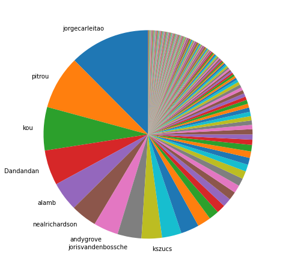
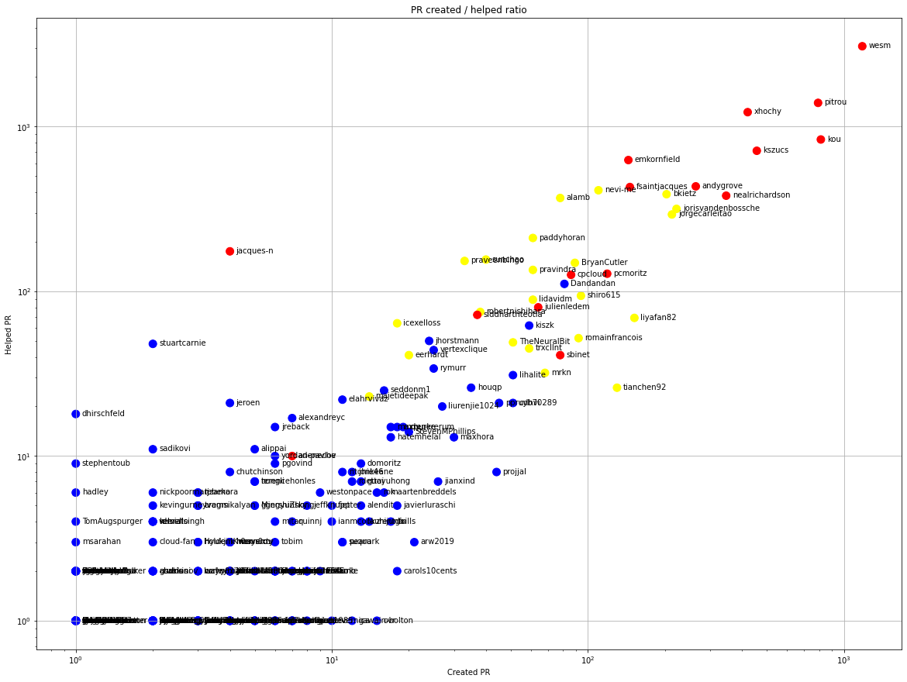
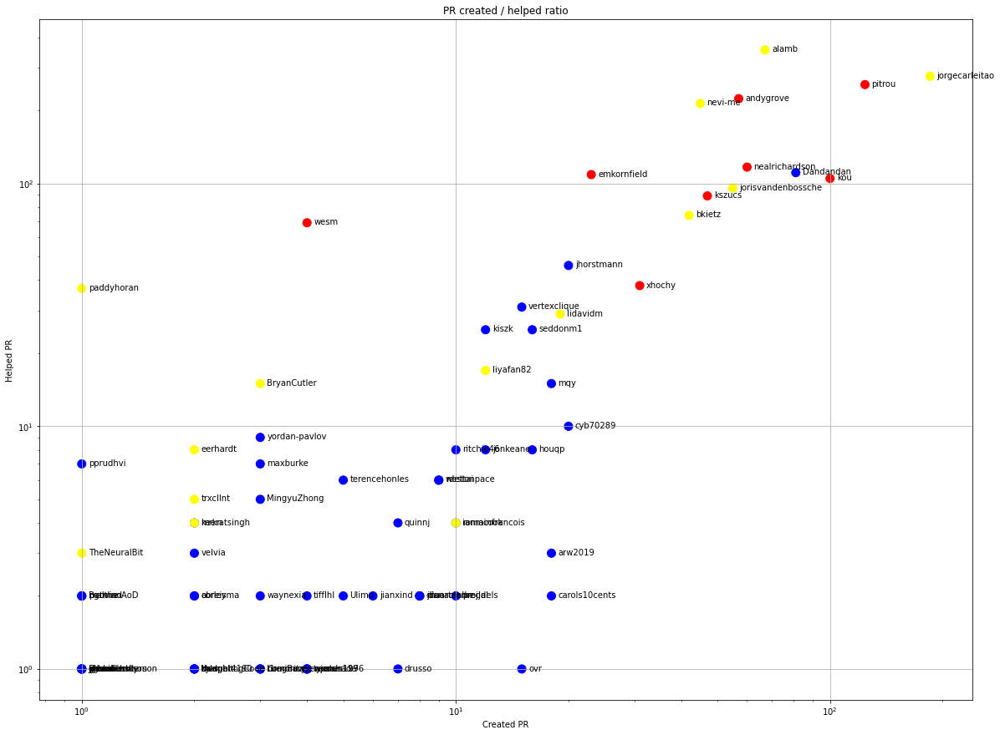
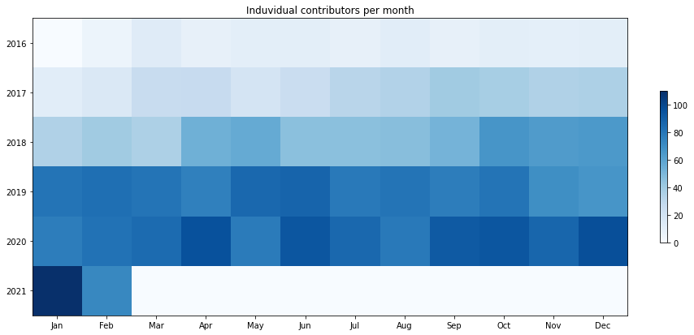
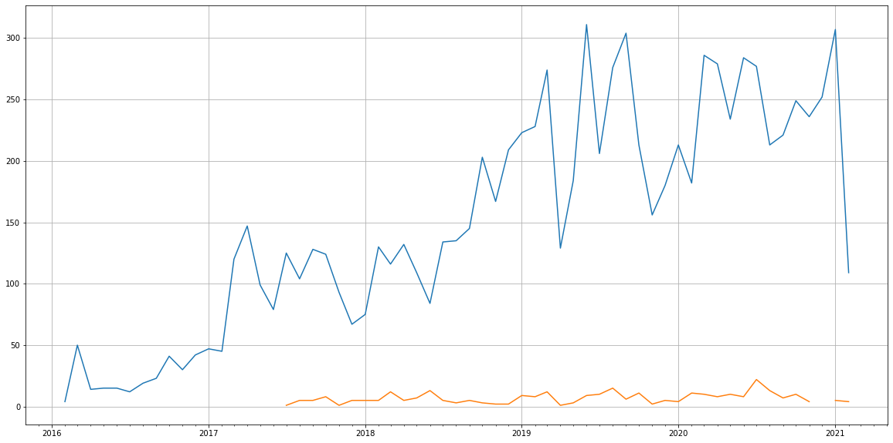
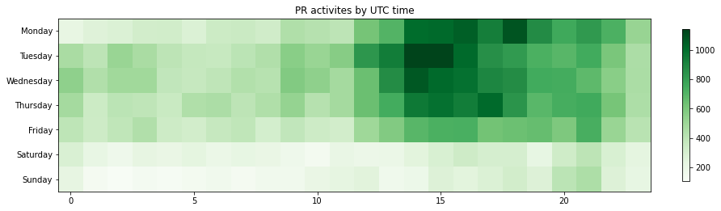

Latest record from the dataset:

<table border="1" class="dataframe">
  <thead>
    <tr style="text-align: right;">
      <th></th>
      <th>org</th>
      <th>repo</th>
      <th>type</th>
      <th>identifier</th>
      <th>subidentifier</th>
      <th>date</th>
      <th>author</th>
      <th>owner</th>
      <th>project</th>
    </tr>
  </thead>
  <tbody>
    <tr>
      <th>80836</th>
      <td>apache</td>
      <td>arrow</td>
      <td>PR_COMMENTED</td>
      <td>9492</td>
      <td>NaN</td>
      <td>2021-02-14 07:59:29+00:00</td>
      <td>nevi-me</td>
      <td>jorgecarleitao</td>
      <td>arrow</td>
    </tr>
  </tbody>
</table>

# Github Contributions per user

<table border="1" class="dataframe">
  <thead>
    <tr style="text-align: right;">
      <th></th>
      <th>contributions</th>
    </tr>
    <tr>
      <th>author</th>
      <th></th>
    </tr>
  </thead>
  <tbody>
    <tr>
      <th>wesm</th>
      <td>7977</td>
    </tr>
    <tr>
      <th>github-actions</th>
      <td>4947</td>
    </tr>
    <tr>
      <th>pitrou</th>
      <td>4525</td>
    </tr>
    <tr>
      <th>emkornfield</th>
      <td>2407</td>
    </tr>
    <tr>
      <th>kou</th>
      <td>2013</td>
    </tr>
    <tr>
      <th>xhochy</th>
      <td>1807</td>
    </tr>
    <tr>
      <th>codecov-io</th>
      <td>1683</td>
    </tr>
    <tr>
      <th>kszucs</th>
      <td>1553</td>
    </tr>
    <tr>
      <th>nealrichardson</th>
      <td>966</td>
    </tr>
    <tr>
      <th>fsaintjacques</th>
      <td>941</td>
    </tr>
  </tbody>
</table>

## Contributors per participations in PRs which are not created by self (helping PRs)

<table border="1" class="dataframe">
  <thead>
    <tr style="text-align: right;">
      <th></th>
      <th>identifier</th>
    </tr>
    <tr>
      <th>author</th>
      <th></th>
    </tr>
  </thead>
  <tbody>
    <tr>
      <th>github-actions</th>
      <td>3759</td>
    </tr>
    <tr>
      <th>wesm</th>
      <td>3079</td>
    </tr>
    <tr>
      <th>codecov-io</th>
      <td>1655</td>
    </tr>
    <tr>
      <th>pitrou</th>
      <td>1395</td>
    </tr>
    <tr>
      <th>xhochy</th>
      <td>1225</td>
    </tr>
    <tr>
      <th>kou</th>
      <td>836</td>
    </tr>
    <tr>
      <th>kszucs</th>
      <td>714</td>
    </tr>
    <tr>
      <th>emkornfield</th>
      <td>627</td>
    </tr>
    <tr>
      <th>andygrove</th>
      <td>434</td>
    </tr>
    <tr>
      <th>fsaintjacques</th>
      <td>430</td>
    </tr>
    <tr>
      <th>nevi-me</th>
      <td>411</td>
    </tr>
    <tr>
      <th>bkietz</th>
      <td>389</td>
    </tr>
    <tr>
      <th>nealrichardson</th>
      <td>381</td>
    </tr>
    <tr>
      <th>alamb</th>
      <td>369</td>
    </tr>
    <tr>
      <th>jorisvandenbossche</th>
      <td>317</td>
    </tr>
    <tr>
      <th>jorgecarleitao</th>
      <td>293</td>
    </tr>
    <tr>
      <th>ursabot</th>
      <td>227</td>
    </tr>
    <tr>
      <th>paddyhoran</th>
      <td>211</td>
    </tr>
    <tr>
      <th>jacques-n</th>
      <td>175</td>
    </tr>
    <tr>
      <th>sunchao</th>
      <td>156</td>
    </tr>
  </tbody>
</table>

## Contributors per participations in any PRs

<table border="1" class="dataframe">
  <thead>
    <tr style="text-align: right;">
      <th></th>
      <th>identifier</th>
    </tr>
    <tr>
      <th>author</th>
      <th></th>
    </tr>
  </thead>
  <tbody>
    <tr>
      <th>wesm</th>
      <td>4227</td>
    </tr>
    <tr>
      <th>github-actions</th>
      <td>3759</td>
    </tr>
    <tr>
      <th>pitrou</th>
      <td>2184</td>
    </tr>
    <tr>
      <th>codecov-io</th>
      <td>1655</td>
    </tr>
    <tr>
      <th>xhochy</th>
      <td>1644</td>
    </tr>
    <tr>
      <th>kou</th>
      <td>1639</td>
    </tr>
    <tr>
      <th>kszucs</th>
      <td>1171</td>
    </tr>
    <tr>
      <th>emkornfield</th>
      <td>771</td>
    </tr>
    <tr>
      <th>nealrichardson</th>
      <td>728</td>
    </tr>
    <tr>
      <th>andygrove</th>
      <td>698</td>
    </tr>
    <tr>
      <th>bkietz</th>
      <td>592</td>
    </tr>
    <tr>
      <th>fsaintjacques</th>
      <td>576</td>
    </tr>
    <tr>
      <th>jorisvandenbossche</th>
      <td>539</td>
    </tr>
    <tr>
      <th>nevi-me</th>
      <td>521</td>
    </tr>
    <tr>
      <th>jorgecarleitao</th>
      <td>506</td>
    </tr>
    <tr>
      <th>alamb</th>
      <td>447</td>
    </tr>
    <tr>
      <th>paddyhoran</th>
      <td>272</td>
    </tr>
    <tr>
      <th>pcmoritz</th>
      <td>247</td>
    </tr>
    <tr>
      <th>BryanCutler</th>
      <td>238</td>
    </tr>
    <tr>
      <th>ursabot</th>
      <td>227</td>
    </tr>
  </tbody>
</table>

# Bus factor (number of contributors responsible for the 50% of the prs) from last half year

## Contributors until the half of the all contributions

<table border="1" class="dataframe">
  <thead>
    <tr style="text-align: right;">
      <th></th>
      <th>author</th>
      <th>identifier</th>
      <th>cs</th>
      <th>ratio</th>
    </tr>
  </thead>
  <tbody>
    <tr>
      <th>0</th>
      <td>jorgecarleitao</td>
      <td>185</td>
      <td>185</td>
      <td>12.432796</td>
    </tr>
    <tr>
      <th>1</th>
      <td>pitrou</td>
      <td>124</td>
      <td>309</td>
      <td>8.333333</td>
    </tr>
    <tr>
      <th>2</th>
      <td>kou</td>
      <td>100</td>
      <td>409</td>
      <td>6.720430</td>
    </tr>
    <tr>
      <th>3</th>
      <td>Dandandan</td>
      <td>81</td>
      <td>490</td>
      <td>5.443548</td>
    </tr>
    <tr>
      <th>4</th>
      <td>alamb</td>
      <td>67</td>
      <td>557</td>
      <td>4.502688</td>
    </tr>
    <tr>
      <th>5</th>
      <td>nealrichardson</td>
      <td>60</td>
      <td>617</td>
      <td>4.032258</td>
    </tr>
    <tr>
      <th>6</th>
      <td>andygrove</td>
      <td>57</td>
      <td>674</td>
      <td>3.830645</td>
    </tr>
    <tr>
      <th>7</th>
      <td>jorisvandenbossche</td>
      <td>55</td>
      <td>729</td>
      <td>3.696237</td>
    </tr>
  </tbody>
</table>

## Pony number (bus factor)

    9

## Dev power (All the contributions in the ration of the top contributor)

    8.043243243243243

    

    

## People with created PRs > reviewed/commented PRS

    

    

## Same graph with focusing to the last 6 month

Only contributors with both created pr and helped pr visible

    

    

# Number of individual contributors per month

Number of different Github users who either created PR, commented PR, added review to a PR

Note: only events from apache/hadoop-ozone repository are included. Earlier PRs/comments are not here.

    

    

# Number of PRs closed/created per month

    /usr/lib/python3.9/site-packages/pandas/core/arrays/datetimes.py:1101: UserWarning: Converting to PeriodArray/Index representation will drop timezone information.
      warnings.warn(

    

    

# PR activity heatmap

    

    

