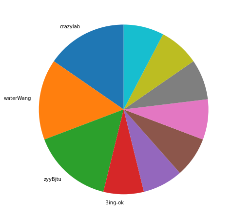
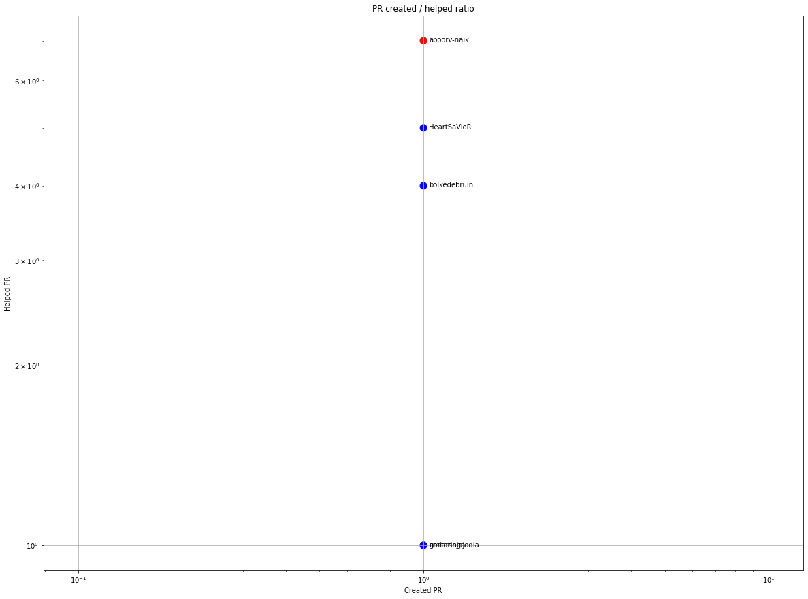
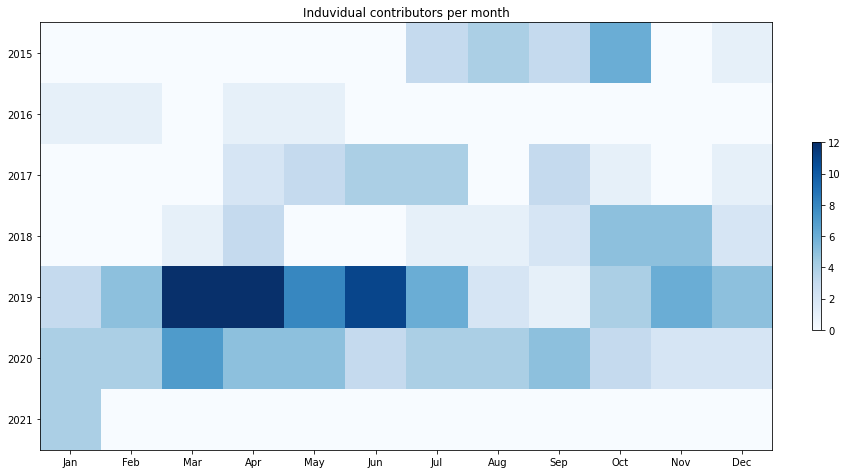
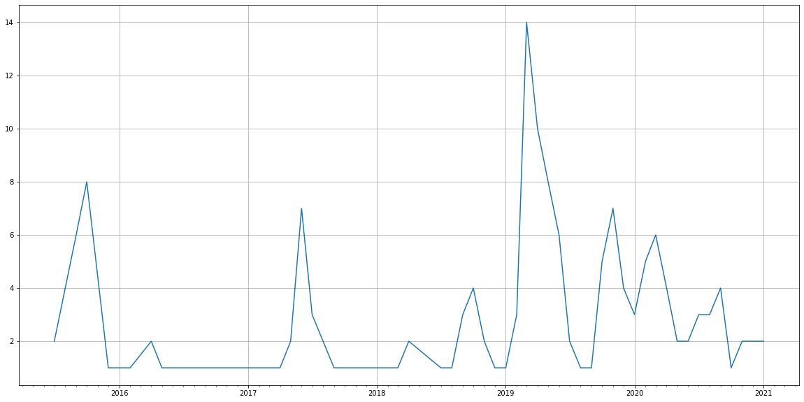
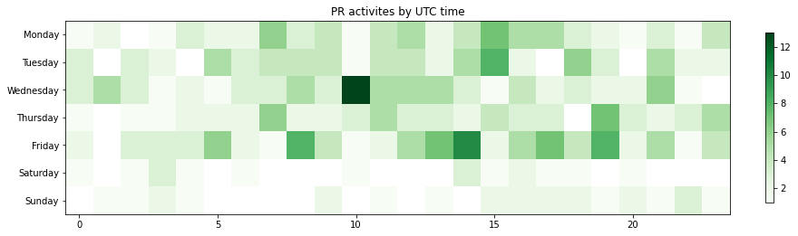

Latest record from the dataset:

<table border="1" class="dataframe">
  <thead>
    <tr style="text-align: right;">
      <th></th>
      <th>org</th>
      <th>repo</th>
      <th>type</th>
      <th>identifier</th>
      <th>subidentifier</th>
      <th>date</th>
      <th>author</th>
      <th>owner</th>
      <th>project</th>
    </tr>
  </thead>
  <tbody>
    <tr>
      <th>41</th>
      <td>apache</td>
      <td>atlas</td>
      <td>PR_COMMENTED</td>
      <td>118</td>
      <td>NaN</td>
      <td>2021-01-28 19:02:45+00:00</td>
      <td>sarathsubramanian</td>
      <td>bmaidics</td>
      <td>atlas</td>
    </tr>
  </tbody>
</table>

# Github Contributions per user

<table border="1" class="dataframe">
  <thead>
    <tr style="text-align: right;">
      <th></th>
      <th>contributions</th>
    </tr>
    <tr>
      <th>author</th>
      <th></th>
    </tr>
  </thead>
  <tbody>
    <tr>
      <th>mneethiraj</th>
      <td>42</td>
    </tr>
    <tr>
      <th>nixonrodrigues</th>
      <td>40</td>
    </tr>
    <tr>
      <th>sarathsubramanian</th>
      <td>33</td>
    </tr>
    <tr>
      <th>apoorv-naik</th>
      <td>7</td>
    </tr>
    <tr>
      <th>HeartSaVioR</th>
      <td>7</td>
    </tr>
    <tr>
      <th>bolkedebruin</th>
      <td>5</td>
    </tr>
    <tr>
      <th>ashutoshm</th>
      <td>4</td>
    </tr>
    <tr>
      <th>shwethags</th>
      <td>3</td>
    </tr>
    <tr>
      <th>Aka-shi</th>
      <td>2</td>
    </tr>
    <tr>
      <th>sidharthkmishra</th>
      <td>2</td>
    </tr>
  </tbody>
</table>

## Contributors per participations in PRs which are not created by self (helping PRs)

<table border="1" class="dataframe">
  <thead>
    <tr style="text-align: right;">
      <th></th>
      <th>identifier</th>
    </tr>
    <tr>
      <th>author</th>
      <th></th>
    </tr>
  </thead>
  <tbody>
    <tr>
      <th>nixonrodrigues</th>
      <td>27</td>
    </tr>
    <tr>
      <th>mneethiraj</th>
      <td>22</td>
    </tr>
    <tr>
      <th>sarathsubramanian</th>
      <td>14</td>
    </tr>
    <tr>
      <th>apoorv-naik</th>
      <td>7</td>
    </tr>
    <tr>
      <th>HeartSaVioR</th>
      <td>5</td>
    </tr>
    <tr>
      <th>bolkedebruin</th>
      <td>4</td>
    </tr>
    <tr>
      <th>ashutoshm</th>
      <td>3</td>
    </tr>
    <tr>
      <th>shwethags</th>
      <td>3</td>
    </tr>
    <tr>
      <th>mayanknj</th>
      <td>2</td>
    </tr>
    <tr>
      <th>Aka-shi</th>
      <td>1</td>
    </tr>
    <tr>
      <th>thealmightygrant</th>
      <td>1</td>
    </tr>
    <tr>
      <th>sumashivaprasad</th>
      <td>1</td>
    </tr>
    <tr>
      <th>sidharthkmishra</th>
      <td>1</td>
    </tr>
    <tr>
      <th>shawnweeks</th>
      <td>1</td>
    </tr>
    <tr>
      <th>gmcoringa</th>
      <td>1</td>
    </tr>
    <tr>
      <th>lyyprean</th>
      <td>1</td>
    </tr>
    <tr>
      <th>kell18</th>
      <td>1</td>
    </tr>
    <tr>
      <th>fusonghe</th>
      <td>1</td>
    </tr>
    <tr>
      <th>fpompermaier</th>
      <td>1</td>
    </tr>
    <tr>
      <th>fadimaali</th>
      <td>1</td>
    </tr>
  </tbody>
</table>

## Contributors per participations in any PRs

<table border="1" class="dataframe">
  <thead>
    <tr style="text-align: right;">
      <th></th>
      <th>identifier</th>
    </tr>
    <tr>
      <th>author</th>
      <th></th>
    </tr>
  </thead>
  <tbody>
    <tr>
      <th>nixonrodrigues</th>
      <td>27</td>
    </tr>
    <tr>
      <th>mneethiraj</th>
      <td>22</td>
    </tr>
    <tr>
      <th>ZepHakase22</th>
      <td>14</td>
    </tr>
    <tr>
      <th>sarathsubramanian</th>
      <td>14</td>
    </tr>
    <tr>
      <th>AnilGayakwad</th>
      <td>9</td>
    </tr>
    <tr>
      <th>apoorv-naik</th>
      <td>8</td>
    </tr>
    <tr>
      <th>andrewluotechnologies</th>
      <td>6</td>
    </tr>
    <tr>
      <th>HeartSaVioR</th>
      <td>6</td>
    </tr>
    <tr>
      <th>vladhlinsky</th>
      <td>5</td>
    </tr>
    <tr>
      <th>bolkedebruin</th>
      <td>5</td>
    </tr>
    <tr>
      <th>dependabot</th>
      <td>4</td>
    </tr>
    <tr>
      <th>ashutoshm</th>
      <td>3</td>
    </tr>
    <tr>
      <th>qinglin</th>
      <td>3</td>
    </tr>
    <tr>
      <th>shwethags</th>
      <td>3</td>
    </tr>
    <tr>
      <th>bpgergo</th>
      <td>3</td>
    </tr>
    <tr>
      <th>mahaha000</th>
      <td>3</td>
    </tr>
    <tr>
      <th>khavert</th>
      <td>3</td>
    </tr>
    <tr>
      <th>mgorsk1</th>
      <td>3</td>
    </tr>
    <tr>
      <th>developersLxz</th>
      <td>2</td>
    </tr>
    <tr>
      <th>dggs123</th>
      <td>2</td>
    </tr>
  </tbody>
</table>

# Bus factor (number of contributors responsible for the 50% of the prs) from last half year

## Contributors until the half of the all contributions

<table border="1" class="dataframe">
  <thead>
    <tr style="text-align: right;">
      <th></th>
      <th>author</th>
      <th>identifier</th>
      <th>cs</th>
      <th>ratio</th>
    </tr>
  </thead>
  <tbody>
    <tr>
      <th>0</th>
      <td>crazylab</td>
      <td>2</td>
      <td>2</td>
      <td>15.384615</td>
    </tr>
    <tr>
      <th>1</th>
      <td>waterWang</td>
      <td>2</td>
      <td>4</td>
      <td>15.384615</td>
    </tr>
    <tr>
      <th>2</th>
      <td>zyyBjtu</td>
      <td>2</td>
      <td>6</td>
      <td>15.384615</td>
    </tr>
  </tbody>
</table>

## Pony number (bus factor)

    4

## Dev power (All the contributions in the ration of the top contributor)

    6.5

    

    

## People with created PRs > reviewed/commented PRS

    

    

## Same graph with focusing to the last 6 month

Only contributors with both created pr and helped pr visible

    

    

# Number of individual contributors per month

Number of different Github users who either created PR, commented PR, added review to a PR

Note: only events from apache/hadoop-ozone repository are included. Earlier PRs/comments are not here.

    

    

# Number of PRs closed/created per month

    /usr/lib/python3.9/site-packages/pandas/core/arrays/datetimes.py:1101: UserWarning: Converting to PeriodArray/Index representation will drop timezone information.
      warnings.warn(

    

    

# PR activity heatmap

    

    

