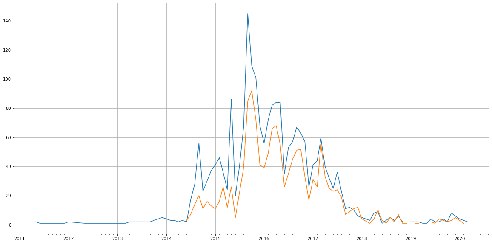

Latest record from the dataset:

<table border="1" class="dataframe">
  <thead>
    <tr style="text-align: right;">
      <th></th>
      <th>org</th>
      <th>repo</th>
      <th>type</th>
      <th>identifier</th>
      <th>subidentifier</th>
      <th>date</th>
      <th>author</th>
      <th>owner</th>
      <th>project</th>
    </tr>
  </thead>
  <tbody>
    <tr>
      <th>4739</th>
      <td>apache</td>
      <td>attic-apex-core</td>
      <td>PR_CREATED</td>
      <td>610</td>
      <td>NaN</td>
      <td>2020-03-22 22:40:03+00:00</td>
      <td>asutosh936</td>
      <td>asutosh936</td>
      <td>attic</td>
    </tr>
  </tbody>
</table>

# Github Contributions per user

<table border="1" class="dataframe">
  <thead>
    <tr style="text-align: right;">
      <th></th>
      <th>contributions</th>
    </tr>
    <tr>
      <th>author</th>
      <th></th>
    </tr>
  </thead>
  <tbody>
    <tr>
      <th>asfgit</th>
      <td>1284</td>
    </tr>
    <tr>
      <th>tweise</th>
      <td>1055</td>
    </tr>
    <tr>
      <th>vrozov</th>
      <td>874</td>
    </tr>
    <tr>
      <th>PramodSSImmaneni</th>
      <td>610</td>
    </tr>
    <tr>
      <th>amberarrow</th>
      <td>440</td>
    </tr>
    <tr>
      <th>sanjaypujare</th>
      <td>231</td>
    </tr>
    <tr>
      <th>davidyan74</th>
      <td>190</td>
    </tr>
    <tr>
      <th>chinmaykolhatkar</th>
      <td>142</td>
    </tr>
    <tr>
      <th>bhupeshchawda</th>
      <td>139</td>
    </tr>
    <tr>
      <th>otterc</th>
      <td>131</td>
    </tr>
  </tbody>
</table>

## Contributors per participations in PRs which are not created by self (helping PRs)

<table border="1" class="dataframe">
  <thead>
    <tr style="text-align: right;">
      <th></th>
      <th>identifier</th>
    </tr>
    <tr>
      <th>author</th>
      <th></th>
    </tr>
  </thead>
  <tbody>
    <tr>
      <th>asfgit</th>
      <td>589</td>
    </tr>
    <tr>
      <th>tweise</th>
      <td>317</td>
    </tr>
    <tr>
      <th>vrozov</th>
      <td>187</td>
    </tr>
    <tr>
      <th>PramodSSImmaneni</th>
      <td>136</td>
    </tr>
    <tr>
      <th>imesh</th>
      <td>102</td>
    </tr>
    <tr>
      <th>davidyan74</th>
      <td>66</td>
    </tr>
    <tr>
      <th>otterc</th>
      <td>57</td>
    </tr>
    <tr>
      <th>amberarrow</th>
      <td>54</td>
    </tr>
    <tr>
      <th>bhupeshchawda</th>
      <td>53</td>
    </tr>
    <tr>
      <th>chinmaykolhatkar</th>
      <td>50</td>
    </tr>
    <tr>
      <th>sandeshh</th>
      <td>43</td>
    </tr>
    <tr>
      <th>gauravgopi123</th>
      <td>39</td>
    </tr>
    <tr>
      <th>tushargosavi</th>
      <td>36</td>
    </tr>
    <tr>
      <th>siyuanh</th>
      <td>29</td>
    </tr>
    <tr>
      <th>ilooner</th>
      <td>27</td>
    </tr>
    <tr>
      <th>chaithu14</th>
      <td>26</td>
    </tr>
    <tr>
      <th>sanjaypujare</th>
      <td>25</td>
    </tr>
    <tr>
      <th>mfranklin</th>
      <td>21</td>
    </tr>
    <tr>
      <th>ridv</th>
      <td>18</td>
    </tr>
    <tr>
      <th>DT-Priyanka</th>
      <td>18</td>
    </tr>
  </tbody>
</table>

## Contributors per participations in any PRs

<table border="1" class="dataframe">
  <thead>
    <tr style="text-align: right;">
      <th></th>
      <th>identifier</th>
    </tr>
    <tr>
      <th>author</th>
      <th></th>
    </tr>
  </thead>
  <tbody>
    <tr>
      <th>asfgit</th>
      <td>589</td>
    </tr>
    <tr>
      <th>tweise</th>
      <td>417</td>
    </tr>
    <tr>
      <th>vrozov</th>
      <td>327</td>
    </tr>
    <tr>
      <th>PramodSSImmaneni</th>
      <td>217</td>
    </tr>
    <tr>
      <th>davidyan74</th>
      <td>171</td>
    </tr>
    <tr>
      <th>otterc</th>
      <td>156</td>
    </tr>
    <tr>
      <th>imesh</th>
      <td>103</td>
    </tr>
    <tr>
      <th>dinithis</th>
      <td>87</td>
    </tr>
    <tr>
      <th>chinmaykolhatkar</th>
      <td>85</td>
    </tr>
    <tr>
      <th>bhupeshchawda</th>
      <td>83</td>
    </tr>
    <tr>
      <th>sandeshh</th>
      <td>83</td>
    </tr>
    <tr>
      <th>ilooner</th>
      <td>74</td>
    </tr>
    <tr>
      <th>amberarrow</th>
      <td>68</td>
    </tr>
    <tr>
      <th>tushargosavi</th>
      <td>66</td>
    </tr>
    <tr>
      <th>chaithu14</th>
      <td>63</td>
    </tr>
    <tr>
      <th>DT-Priyanka</th>
      <td>59</td>
    </tr>
    <tr>
      <th>nwellnhof</th>
      <td>58</td>
    </tr>
    <tr>
      <th>rectang</th>
      <td>58</td>
    </tr>
    <tr>
      <th>gauravgopi123</th>
      <td>55</td>
    </tr>
    <tr>
      <th>siyuanh</th>
      <td>55</td>
    </tr>
  </tbody>
</table>

# Bus factor (number of contributors responsible for the 50% of the prs)

## Contributors until the half of the all contributions

<table border="1" class="dataframe">
  <thead>
    <tr style="text-align: right;">
      <th></th>
      <th>author</th>
      <th>identifier</th>
      <th>cs</th>
      <th>ratio</th>
    </tr>
  </thead>
  <tbody>
    <tr>
      <th>0</th>
      <td>vrozov</td>
      <td>152</td>
      <td>152</td>
      <td>6.994938</td>
    </tr>
    <tr>
      <th>1</th>
      <td>tweise</td>
      <td>149</td>
      <td>301</td>
      <td>6.856880</td>
    </tr>
    <tr>
      <th>2</th>
      <td>otterc</td>
      <td>114</td>
      <td>415</td>
      <td>5.246203</td>
    </tr>
    <tr>
      <th>3</th>
      <td>davidyan74</td>
      <td>113</td>
      <td>528</td>
      <td>5.200184</td>
    </tr>
    <tr>
      <th>4</th>
      <td>dinithis</td>
      <td>87</td>
      <td>615</td>
      <td>4.003682</td>
    </tr>
    <tr>
      <th>5</th>
      <td>PramodSSImmaneni</td>
      <td>85</td>
      <td>700</td>
      <td>3.911643</td>
    </tr>
    <tr>
      <th>6</th>
      <td>rectang</td>
      <td>80</td>
      <td>780</td>
      <td>3.681546</td>
    </tr>
    <tr>
      <th>7</th>
      <td>nwellnhof</td>
      <td>52</td>
      <td>832</td>
      <td>2.393005</td>
    </tr>
    <tr>
      <th>8</th>
      <td>Thanu</td>
      <td>52</td>
      <td>884</td>
      <td>2.393005</td>
    </tr>
    <tr>
      <th>9</th>
      <td>ilooner</td>
      <td>48</td>
      <td>932</td>
      <td>2.208928</td>
    </tr>
    <tr>
      <th>10</th>
      <td>Vishanth</td>
      <td>48</td>
      <td>980</td>
      <td>2.208928</td>
    </tr>
    <tr>
      <th>11</th>
      <td>brightchen</td>
      <td>46</td>
      <td>1026</td>
      <td>2.116889</td>
    </tr>
    <tr>
      <th>12</th>
      <td>swgkg</td>
      <td>46</td>
      <td>1072</td>
      <td>2.116889</td>
    </tr>
  </tbody>
</table>

## Pony number (bus factor)

    14

## Dev power (All the contributions in the ration of the top contributor)

    14.296052631578945

    

    

## People with created PRs > reviewed/commented PRS

    

    

## Same graph with focusing to the last 6 month

Only contributors with both created pr and helped pr visible

    

    

# Number of individual contributors per month

Number of different Github users who either created PR, commented PR, added review to a PR

Note: only events from apache/hadoop-ozone repository are included. Earlier PRs/comments are not here.

    /usr/lib/python3.9/site-packages/pandas/core/arrays/datetimes.py:1101: UserWarning: Converting to PeriodArray/Index representation will drop timezone information.
      warnings.warn(

<table border="1" class="dataframe">
  <thead>
    <tr style="text-align: right;">
      <th></th>
      <th>date</th>
      <th>author</th>
    </tr>
  </thead>
  <tbody>
    <tr>
      <th>77</th>
      <td>2019-04</td>
      <td>4</td>
    </tr>
    <tr>
      <th>78</th>
      <td>2019-05</td>
      <td>3</td>
    </tr>
    <tr>
      <th>79</th>
      <td>2019-06</td>
      <td>8</td>
    </tr>
    <tr>
      <th>80</th>
      <td>2019-07</td>
      <td>2</td>
    </tr>
    <tr>
      <th>81</th>
      <td>2019-08</td>
      <td>5</td>
    </tr>
    <tr>
      <th>82</th>
      <td>2019-09</td>
      <td>5</td>
    </tr>
    <tr>
      <th>83</th>
      <td>2019-10</td>
      <td>3</td>
    </tr>
    <tr>
      <th>84</th>
      <td>2019-11</td>
      <td>5</td>
    </tr>
    <tr>
      <th>85</th>
      <td>2019-12</td>
      <td>4</td>
    </tr>
    <tr>
      <th>86</th>
      <td>2020-01</td>
      <td>4</td>
    </tr>
    <tr>
      <th>87</th>
      <td>2020-02</td>
      <td>2</td>
    </tr>
    <tr>
      <th>88</th>
      <td>2020-03</td>
      <td>2</td>
    </tr>
  </tbody>
</table>

    

    

# Number of PRs closed/created per month

    /usr/lib/python3.9/site-packages/pandas/core/arrays/datetimes.py:1101: UserWarning: Converting to PeriodArray/Index representation will drop timezone information.
      warnings.warn(

    

    

## Monthly comments

    /usr/lib/python3.9/site-packages/pandas/core/arrays/datetimes.py:1101: UserWarning: Converting to PeriodArray/Index representation will drop timezone information.
      warnings.warn(

<table border="1" class="dataframe">
  <thead>
    <tr style="text-align: right;">
      <th></th>
      <th>identifier</th>
    </tr>
    <tr>
      <th>date</th>
      <th></th>
    </tr>
  </thead>
  <tbody>
    <tr>
      <th>2011-05</th>
      <td>1</td>
    </tr>
    <tr>
      <th>2011-06</th>
      <td>1</td>
    </tr>
    <tr>
      <th>2011-10</th>
      <td>5</td>
    </tr>
    <tr>
      <th>2011-11</th>
      <td>2</td>
    </tr>
    <tr>
      <th>2011-12</th>
      <td>1</td>
    </tr>
    <tr>
      <th>2012-01</th>
      <td>5</td>
    </tr>
    <tr>
      <th>2013-06</th>
      <td>1</td>
    </tr>
    <tr>
      <th>2014-02</th>
      <td>3</td>
    </tr>
    <tr>
      <th>2014-04</th>
      <td>1</td>
    </tr>
    <tr>
      <th>2014-05</th>
      <td>4</td>
    </tr>
    <tr>
      <th>2014-06</th>
      <td>5</td>
    </tr>
    <tr>
      <th>2014-07</th>
      <td>40</td>
    </tr>
    <tr>
      <th>2014-08</th>
      <td>32</td>
    </tr>
    <tr>
      <th>2014-09</th>
      <td>51</td>
    </tr>
    <tr>
      <th>2014-10</th>
      <td>24</td>
    </tr>
    <tr>
      <th>2014-11</th>
      <td>22</td>
    </tr>
    <tr>
      <th>2014-12</th>
      <td>25</td>
    </tr>
    <tr>
      <th>2015-01</th>
      <td>65</td>
    </tr>
    <tr>
      <th>2015-02</th>
      <td>38</td>
    </tr>
    <tr>
      <th>2015-03</th>
      <td>16</td>
    </tr>
    <tr>
      <th>2015-04</th>
      <td>20</td>
    </tr>
    <tr>
      <th>2015-05</th>
      <td>31</td>
    </tr>
    <tr>
      <th>2015-06</th>
      <td>14</td>
    </tr>
    <tr>
      <th>2015-07</th>
      <td>10</td>
    </tr>
    <tr>
      <th>2015-08</th>
      <td>35</td>
    </tr>
    <tr>
      <th>2015-09</th>
      <td>205</td>
    </tr>
    <tr>
      <th>2015-10</th>
      <td>244</td>
    </tr>
    <tr>
      <th>2015-11</th>
      <td>197</td>
    </tr>
    <tr>
      <th>2015-12</th>
      <td>213</td>
    </tr>
    <tr>
      <th>2016-01</th>
      <td>196</td>
    </tr>
    <tr>
      <th>2016-02</th>
      <td>132</td>
    </tr>
    <tr>
      <th>2016-03</th>
      <td>147</td>
    </tr>
    <tr>
      <th>2016-04</th>
      <td>176</td>
    </tr>
    <tr>
      <th>2016-05</th>
      <td>202</td>
    </tr>
    <tr>
      <th>2016-06</th>
      <td>140</td>
    </tr>
    <tr>
      <th>2016-07</th>
      <td>148</td>
    </tr>
    <tr>
      <th>2016-08</th>
      <td>206</td>
    </tr>
    <tr>
      <th>2016-09</th>
      <td>154</td>
    </tr>
    <tr>
      <th>2016-10</th>
      <td>207</td>
    </tr>
    <tr>
      <th>2016-11</th>
      <td>142</td>
    </tr>
    <tr>
      <th>2016-12</th>
      <td>81</td>
    </tr>
    <tr>
      <th>2017-01</th>
      <td>130</td>
    </tr>
    <tr>
      <th>2017-02</th>
      <td>100</td>
    </tr>
    <tr>
      <th>2017-03</th>
      <td>254</td>
    </tr>
    <tr>
      <th>2017-04</th>
      <td>130</td>
    </tr>
    <tr>
      <th>2017-05</th>
      <td>134</td>
    </tr>
    <tr>
      <th>2017-06</th>
      <td>136</td>
    </tr>
    <tr>
      <th>2017-07</th>
      <td>146</td>
    </tr>
    <tr>
      <th>2017-08</th>
      <td>133</td>
    </tr>
    <tr>
      <th>2017-09</th>
      <td>60</td>
    </tr>
    <tr>
      <th>2017-10</th>
      <td>117</td>
    </tr>
    <tr>
      <th>2017-11</th>
      <td>81</td>
    </tr>
    <tr>
      <th>2017-12</th>
      <td>22</td>
    </tr>
    <tr>
      <th>2018-01</th>
      <td>8</td>
    </tr>
    <tr>
      <th>2018-02</th>
      <td>6</td>
    </tr>
    <tr>
      <th>2018-03</th>
      <td>7</td>
    </tr>
    <tr>
      <th>2018-04</th>
      <td>1</td>
    </tr>
    <tr>
      <th>2018-05</th>
      <td>23</td>
    </tr>
    <tr>
      <th>2018-06</th>
      <td>13</td>
    </tr>
    <tr>
      <th>2018-08</th>
      <td>4</td>
    </tr>
    <tr>
      <th>2018-09</th>
      <td>5</td>
    </tr>
    <tr>
      <th>2018-10</th>
      <td>16</td>
    </tr>
    <tr>
      <th>2018-11</th>
      <td>4</td>
    </tr>
    <tr>
      <th>2018-12</th>
      <td>2</td>
    </tr>
    <tr>
      <th>2019-01</th>
      <td>18</td>
    </tr>
    <tr>
      <th>2019-02</th>
      <td>2</td>
    </tr>
    <tr>
      <th>2019-03</th>
      <td>1</td>
    </tr>
    <tr>
      <th>2019-04</th>
      <td>3</td>
    </tr>
    <tr>
      <th>2019-05</th>
      <td>3</td>
    </tr>
    <tr>
      <th>2019-06</th>
      <td>5</td>
    </tr>
    <tr>
      <th>2019-07</th>
      <td>1</td>
    </tr>
    <tr>
      <th>2019-08</th>
      <td>12</td>
    </tr>
    <tr>
      <th>2019-09</th>
      <td>4</td>
    </tr>
    <tr>
      <th>2019-10</th>
      <td>2</td>
    </tr>
    <tr>
      <th>2019-11</th>
      <td>3</td>
    </tr>
    <tr>
      <th>2019-12</th>
      <td>6</td>
    </tr>
    <tr>
      <th>2020-01</th>
      <td>4</td>
    </tr>
  </tbody>
</table>

# PR activity heatmap

    

    

