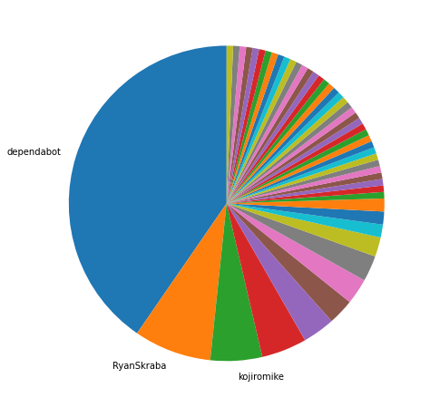
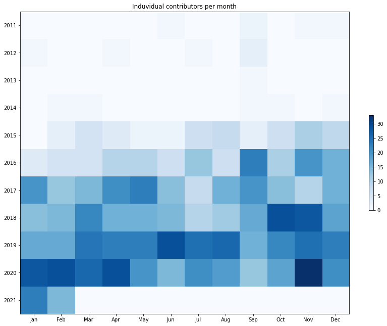

Latest record from the dataset:

<table border="1" class="dataframe">
  <thead>
    <tr style="text-align: right;">
      <th></th>
      <th>org</th>
      <th>repo</th>
      <th>type</th>
      <th>identifier</th>
      <th>subidentifier</th>
      <th>date</th>
      <th>author</th>
      <th>owner</th>
      <th>project</th>
    </tr>
  </thead>
  <tbody>
    <tr>
      <th>285</th>
      <td>apache</td>
      <td>avro</td>
      <td>PR_CREATED</td>
      <td>1096</td>
      <td>NaN</td>
      <td>2021-02-14 05:15:08+00:00</td>
      <td>dependabot</td>
      <td>dependabot</td>
      <td>avro</td>
    </tr>
  </tbody>
</table>

# Github Contributions per user

<table border="1" class="dataframe">
  <thead>
    <tr style="text-align: right;">
      <th></th>
      <th>contributions</th>
    </tr>
    <tr>
      <th>author</th>
      <th></th>
    </tr>
  </thead>
  <tbody>
    <tr>
      <th>Fokko</th>
      <td>668</td>
    </tr>
    <tr>
      <th>RyanSkraba</th>
      <td>265</td>
    </tr>
    <tr>
      <th>kojiromike</th>
      <td>248</td>
    </tr>
    <tr>
      <th>nandorKollar</th>
      <td>184</td>
    </tr>
    <tr>
      <th>iemejia</th>
      <td>181</td>
    </tr>
    <tr>
      <th>dkulp</th>
      <td>178</td>
    </tr>
    <tr>
      <th>busbey</th>
      <td>103</td>
    </tr>
    <tr>
      <th>blachniet</th>
      <td>82</td>
    </tr>
    <tr>
      <th>rdblue</th>
      <td>73</td>
    </tr>
    <tr>
      <th>tjwp</th>
      <td>64</td>
    </tr>
  </tbody>
</table>

## Contributors per participations in PRs which are not created by self (helping PRs)

<table border="1" class="dataframe">
  <thead>
    <tr style="text-align: right;">
      <th></th>
      <th>identifier</th>
    </tr>
    <tr>
      <th>author</th>
      <th></th>
    </tr>
  </thead>
  <tbody>
    <tr>
      <th>Fokko</th>
      <td>305</td>
    </tr>
    <tr>
      <th>dkulp</th>
      <td>165</td>
    </tr>
    <tr>
      <th>RyanSkraba</th>
      <td>131</td>
    </tr>
    <tr>
      <th>nandorKollar</th>
      <td>93</td>
    </tr>
    <tr>
      <th>iemejia</th>
      <td>91</td>
    </tr>
    <tr>
      <th>kojiromike</th>
      <td>71</td>
    </tr>
    <tr>
      <th>busbey</th>
      <td>62</td>
    </tr>
    <tr>
      <th>rdblue</th>
      <td>49</td>
    </tr>
    <tr>
      <th>thiru-mg</th>
      <td>32</td>
    </tr>
    <tr>
      <th>spacharya</th>
      <td>31</td>
    </tr>
    <tr>
      <th>tjwp</th>
      <td>31</td>
    </tr>
    <tr>
      <th>cutting</th>
      <td>31</td>
    </tr>
    <tr>
      <th>gszadovszky</th>
      <td>31</td>
    </tr>
    <tr>
      <th>blachniet</th>
      <td>27</td>
    </tr>
    <tr>
      <th>nielsbasjes</th>
      <td>16</td>
    </tr>
    <tr>
      <th>johnsgill3</th>
      <td>12</td>
    </tr>
    <tr>
      <th>zivanfi</th>
      <td>12</td>
    </tr>
    <tr>
      <th>asfgit</th>
      <td>9</td>
    </tr>
    <tr>
      <th>sekikn</th>
      <td>8</td>
    </tr>
    <tr>
      <th>jacobtolar</th>
      <td>7</td>
    </tr>
  </tbody>
</table>

## Contributors per participations in any PRs

<table border="1" class="dataframe">
  <thead>
    <tr style="text-align: right;">
      <th></th>
      <th>identifier</th>
    </tr>
    <tr>
      <th>author</th>
      <th></th>
    </tr>
  </thead>
  <tbody>
    <tr>
      <th>Fokko</th>
      <td>375</td>
    </tr>
    <tr>
      <th>RyanSkraba</th>
      <td>173</td>
    </tr>
    <tr>
      <th>dkulp</th>
      <td>170</td>
    </tr>
    <tr>
      <th>kojiromike</th>
      <td>149</td>
    </tr>
    <tr>
      <th>iemejia</th>
      <td>146</td>
    </tr>
    <tr>
      <th>nandorKollar</th>
      <td>108</td>
    </tr>
    <tr>
      <th>sekikn</th>
      <td>70</td>
    </tr>
    <tr>
      <th>rdblue</th>
      <td>64</td>
    </tr>
    <tr>
      <th>busbey</th>
      <td>63</td>
    </tr>
    <tr>
      <th>dependabot</th>
      <td>61</td>
    </tr>
    <tr>
      <th>thiru-mg</th>
      <td>57</td>
    </tr>
    <tr>
      <th>blachniet</th>
      <td>49</td>
    </tr>
    <tr>
      <th>tjwp</th>
      <td>48</td>
    </tr>
    <tr>
      <th>belugabehr</th>
      <td>46</td>
    </tr>
    <tr>
      <th>gszadovszky</th>
      <td>45</td>
    </tr>
    <tr>
      <th>nielsbasjes</th>
      <td>42</td>
    </tr>
    <tr>
      <th>spacharya</th>
      <td>35</td>
    </tr>
    <tr>
      <th>cutting</th>
      <td>33</td>
    </tr>
    <tr>
      <th>zeshuai007</th>
      <td>31</td>
    </tr>
    <tr>
      <th>rstata</th>
      <td>21</td>
    </tr>
  </tbody>
</table>

# Bus factor (number of contributors responsible for the 50% of the prs) from last half year

## Contributors until the half of the all contributions

<table border="1" class="dataframe">
  <thead>
    <tr style="text-align: right;">
      <th></th>
      <th>author</th>
      <th>identifier</th>
      <th>cs</th>
      <th>ratio</th>
    </tr>
  </thead>
  <tbody>
    <tr>
      <th>0</th>
      <td>dependabot</td>
      <td>61</td>
      <td>61</td>
      <td>40.397351</td>
    </tr>
    <tr>
      <th>1</th>
      <td>RyanSkraba</td>
      <td>12</td>
      <td>73</td>
      <td>7.947020</td>
    </tr>
  </tbody>
</table>

## Pony number (bus factor)

    3

## Dev power (All the contributions in the ration of the top contributor)

    2.4754098360655736

    

    

## People with created PRs > reviewed/commented PRS

    

    

## Same graph with focusing to the last 6 month

Only contributors with both created pr and helped pr visible

    

    

# Number of individual contributors per month

Number of different Github users who either created PR, commented PR, added review to a PR

Note: only events from apache/hadoop-ozone repository are included. Earlier PRs/comments are not here.

    

    

# Number of PRs closed/created per month

    /usr/lib/python3.9/site-packages/pandas/core/arrays/datetimes.py:1101: UserWarning: Converting to PeriodArray/Index representation will drop timezone information.
      warnings.warn(

    

    

# PR activity heatmap

    

    

