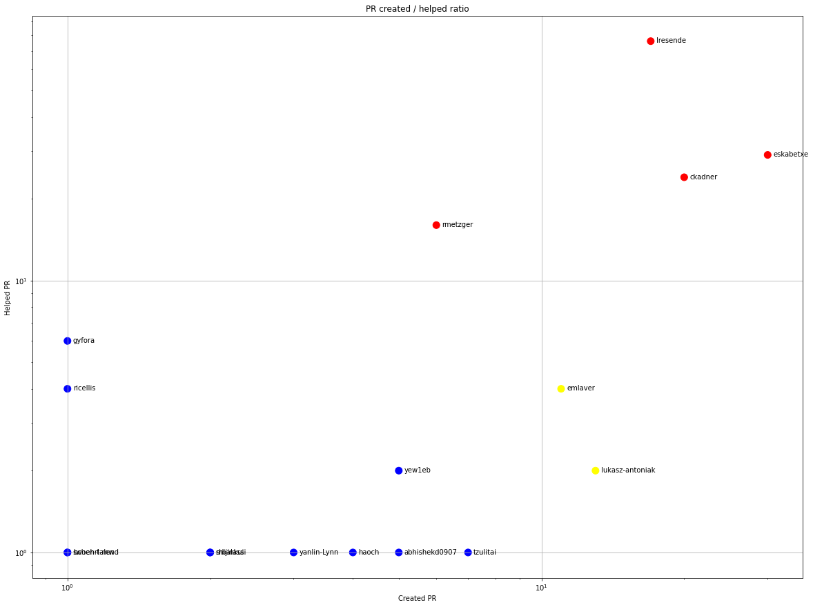

Latest record from the dataset:

<table border="1" class="dataframe">
  <thead>
    <tr style="text-align: right;">
      <th></th>
      <th>org</th>
      <th>repo</th>
      <th>type</th>
      <th>identifier</th>
      <th>subidentifier</th>
      <th>date</th>
      <th>author</th>
      <th>owner</th>
      <th>project</th>
    </tr>
  </thead>
  <tbody>
    <tr>
      <th>931</th>
      <td>apache</td>
      <td>bahir-flink</td>
      <td>PR_CREATED</td>
      <td>111</td>
      <td>NaN</td>
      <td>2021-02-10 13:54:06+00:00</td>
      <td>raminqaf</td>
      <td>raminqaf</td>
      <td>bahir</td>
    </tr>
  </tbody>
</table>

# Github Contributions per user

<table border="1" class="dataframe">
  <thead>
    <tr style="text-align: right;">
      <th></th>
      <th>contributions</th>
    </tr>
    <tr>
      <th>author</th>
      <th></th>
    </tr>
  </thead>
  <tbody>
    <tr>
      <th>ApacheBahir</th>
      <td>251</td>
    </tr>
    <tr>
      <th>lresende</th>
      <td>209</td>
    </tr>
    <tr>
      <th>ckadner</th>
      <td>91</td>
    </tr>
    <tr>
      <th>eskabetxe</th>
      <td>57</td>
    </tr>
    <tr>
      <th>rmetzger</th>
      <td>43</td>
    </tr>
    <tr>
      <th>gyfora</th>
      <td>29</td>
    </tr>
    <tr>
      <th>mayya-sharipova</th>
      <td>13</td>
    </tr>
    <tr>
      <th>ricellis</th>
      <td>11</td>
    </tr>
    <tr>
      <th>emlaver</th>
      <td>10</td>
    </tr>
    <tr>
      <th>jodersky</th>
      <td>8</td>
    </tr>
  </tbody>
</table>

## Contributors per participations in PRs which are not created by self (helping PRs)

<table border="1" class="dataframe">
  <thead>
    <tr style="text-align: right;">
      <th></th>
      <th>identifier</th>
    </tr>
    <tr>
      <th>author</th>
      <th></th>
    </tr>
  </thead>
  <tbody>
    <tr>
      <th>lresende</th>
      <td>76</td>
    </tr>
    <tr>
      <th>ApacheBahir</th>
      <td>36</td>
    </tr>
    <tr>
      <th>eskabetxe</th>
      <td>29</td>
    </tr>
    <tr>
      <th>ckadner</th>
      <td>24</td>
    </tr>
    <tr>
      <th>rmetzger</th>
      <td>16</td>
    </tr>
    <tr>
      <th>gyfora</th>
      <td>6</td>
    </tr>
    <tr>
      <th>deroneriksson</th>
      <td>5</td>
    </tr>
    <tr>
      <th>tedyu</th>
      <td>5</td>
    </tr>
    <tr>
      <th>ricellis</th>
      <td>4</td>
    </tr>
    <tr>
      <th>jodersky</th>
      <td>4</td>
    </tr>
    <tr>
      <th>emlaver</th>
      <td>4</td>
    </tr>
    <tr>
      <th>thebalu</th>
      <td>2</td>
    </tr>
    <tr>
      <th>mridulm</th>
      <td>2</td>
    </tr>
    <tr>
      <th>lukasz-antoniak</th>
      <td>2</td>
    </tr>
    <tr>
      <th>yew1eb</th>
      <td>2</td>
    </tr>
    <tr>
      <th>akchinSTC</th>
      <td>2</td>
    </tr>
    <tr>
      <th>steveloughran</th>
      <td>1</td>
    </tr>
    <tr>
      <th>nutony111</th>
      <td>1</td>
    </tr>
    <tr>
      <th>pushpendra-jaiswal-90</th>
      <td>1</td>
    </tr>
    <tr>
      <th>abhishekd0907</th>
      <td>1</td>
    </tr>
  </tbody>
</table>

## Contributors per participations in any PRs

<table border="1" class="dataframe">
  <thead>
    <tr style="text-align: right;">
      <th></th>
      <th>identifier</th>
    </tr>
    <tr>
      <th>author</th>
      <th></th>
    </tr>
  </thead>
  <tbody>
    <tr>
      <th>lresende</th>
      <td>85</td>
    </tr>
    <tr>
      <th>eskabetxe</th>
      <td>59</td>
    </tr>
    <tr>
      <th>ckadner</th>
      <td>42</td>
    </tr>
    <tr>
      <th>ApacheBahir</th>
      <td>36</td>
    </tr>
    <tr>
      <th>rmetzger</th>
      <td>21</td>
    </tr>
    <tr>
      <th>emlaver</th>
      <td>15</td>
    </tr>
    <tr>
      <th>lukasz-antoniak</th>
      <td>15</td>
    </tr>
    <tr>
      <th>gyfora</th>
      <td>7</td>
    </tr>
    <tr>
      <th>yew1eb</th>
      <td>7</td>
    </tr>
    <tr>
      <th>tzulitai</th>
      <td>7</td>
    </tr>
    <tr>
      <th>abhishekd0907</th>
      <td>6</td>
    </tr>
    <tr>
      <th>ricellis</th>
      <td>5</td>
    </tr>
    <tr>
      <th>haoch</th>
      <td>5</td>
    </tr>
    <tr>
      <th>ScrapCodes</th>
      <td>5</td>
    </tr>
    <tr>
      <th>deroneriksson</th>
      <td>5</td>
    </tr>
    <tr>
      <th>tedyu</th>
      <td>5</td>
    </tr>
    <tr>
      <th>Wosin</th>
      <td>4</td>
    </tr>
    <tr>
      <th>mnmhouse</th>
      <td>4</td>
    </tr>
    <tr>
      <th>sbcd90</th>
      <td>4</td>
    </tr>
    <tr>
      <th>jodersky</th>
      <td>4</td>
    </tr>
  </tbody>
</table>

# Bus factor (number of contributors responsible for the 50% of the prs) from last half year

## Contributors until the half of the all contributions

<table border="1" class="dataframe">
  <thead>
    <tr style="text-align: right;">
      <th></th>
      <th>author</th>
      <th>identifier</th>
      <th>cs</th>
      <th>ratio</th>
    </tr>
  </thead>
  <tbody>
    <tr>
      <th>0</th>
      <td>eskabetxe</td>
      <td>4</td>
      <td>4</td>
      <td>22.222222</td>
    </tr>
    <tr>
      <th>1</th>
      <td>mnmhouse</td>
      <td>4</td>
      <td>8</td>
      <td>22.222222</td>
    </tr>
  </tbody>
</table>

## Pony number (bus factor)

    3

## Dev power (All the contributions in the ration of the top contributor)

    4.5

    

    

## People with created PRs > reviewed/commented PRS

    

    

## Same graph with focusing to the last 6 month

Only contributors with both created pr and helped pr visible

    

    

# Number of individual contributors per month

Number of different Github users who either created PR, commented PR, added review to a PR

Note: only events from apache/hadoop-ozone repository are included. Earlier PRs/comments are not here.

    

    

# Number of PRs closed/created per month

    /usr/lib/python3.9/site-packages/pandas/core/arrays/datetimes.py:1101: UserWarning: Converting to PeriodArray/Index representation will drop timezone information.
      warnings.warn(

    

    

# PR activity heatmap

    

    

