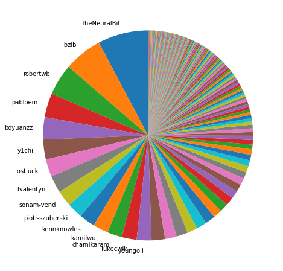
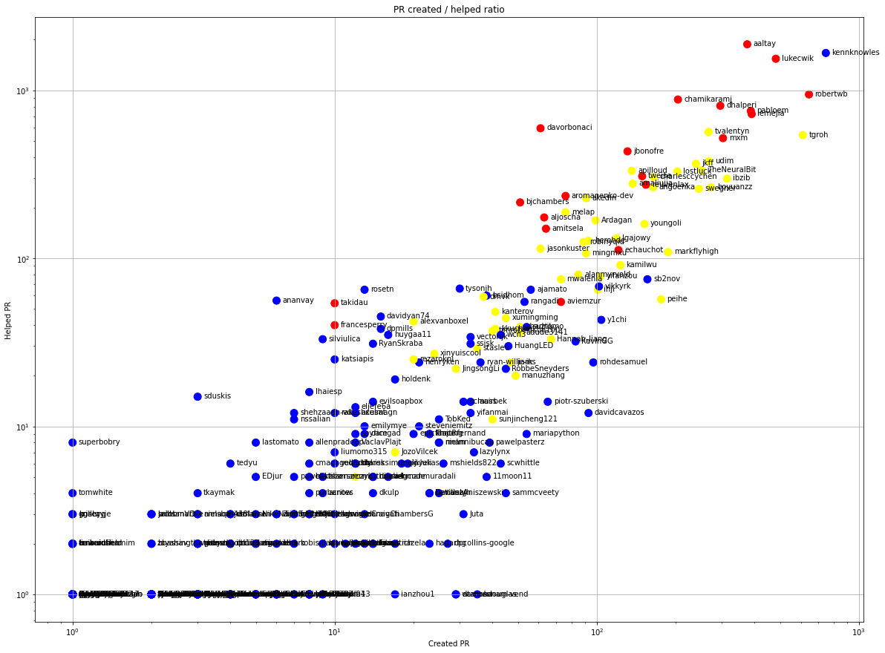
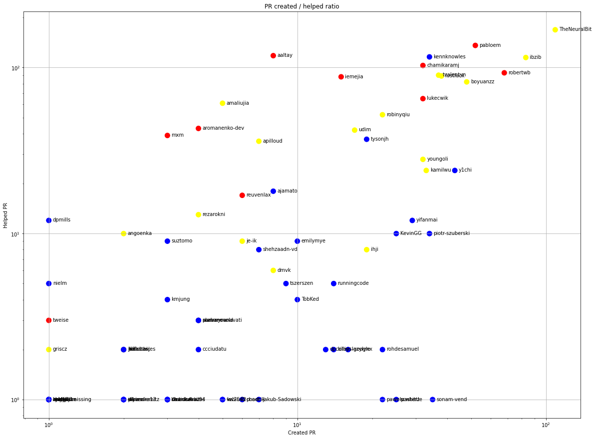
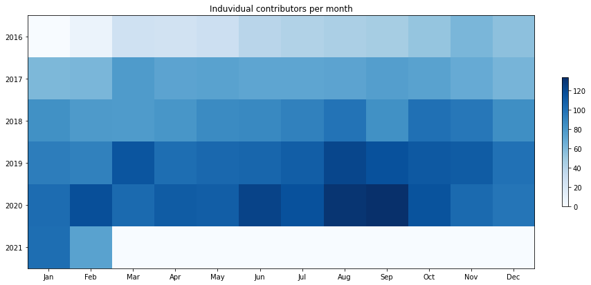
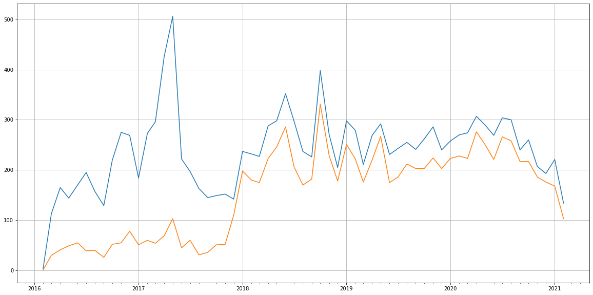
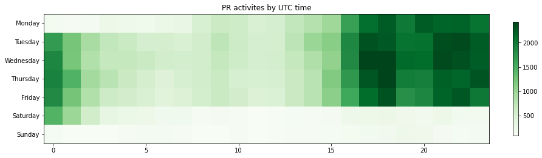

Latest record from the dataset:

<table border="1" class="dataframe">
  <thead>
    <tr style="text-align: right;">
      <th></th>
      <th>org</th>
      <th>repo</th>
      <th>type</th>
      <th>identifier</th>
      <th>subidentifier</th>
      <th>date</th>
      <th>author</th>
      <th>owner</th>
      <th>project</th>
    </tr>
  </thead>
  <tbody>
    <tr>
      <th>49212</th>
      <td>apache</td>
      <td>beam</td>
      <td>PR_CREATED</td>
      <td>13992</td>
      <td>NaN</td>
      <td>2021-02-14 02:02:04+00:00</td>
      <td>chamikaramj</td>
      <td>chamikaramj</td>
      <td>beam</td>
    </tr>
  </tbody>
</table>

# Github Contributions per user

<table border="1" class="dataframe">
  <thead>
    <tr style="text-align: right;">
      <th></th>
      <th>contributions</th>
    </tr>
    <tr>
      <th>author</th>
      <th></th>
    </tr>
  </thead>
  <tbody>
    <tr>
      <th>asfbot</th>
      <td>5441</td>
    </tr>
    <tr>
      <th>coveralls</th>
      <td>4718</td>
    </tr>
    <tr>
      <th>aaltay</th>
      <td>4579</td>
    </tr>
    <tr>
      <th>lukecwik</th>
      <td>4531</td>
    </tr>
    <tr>
      <th>kennknowles</th>
      <td>4363</td>
    </tr>
    <tr>
      <th>pabloem</th>
      <td>2824</td>
    </tr>
    <tr>
      <th>chamikaramj</th>
      <td>2744</td>
    </tr>
    <tr>
      <th>iemejia</th>
      <td>2313</td>
    </tr>
    <tr>
      <th>robertwb</th>
      <td>2265</td>
    </tr>
    <tr>
      <th>tvalentyn</th>
      <td>2072</td>
    </tr>
  </tbody>
</table>

## Contributors per participations in PRs which are not created by self (helping PRs)

<table border="1" class="dataframe">
  <thead>
    <tr style="text-align: right;">
      <th></th>
      <th>identifier</th>
    </tr>
    <tr>
      <th>author</th>
      <th></th>
    </tr>
  </thead>
  <tbody>
    <tr>
      <th>coveralls</th>
      <td>1931</td>
    </tr>
    <tr>
      <th>aaltay</th>
      <td>1878</td>
    </tr>
    <tr>
      <th>kennknowles</th>
      <td>1667</td>
    </tr>
    <tr>
      <th>lukecwik</th>
      <td>1540</td>
    </tr>
    <tr>
      <th>asfbot</th>
      <td>1393</td>
    </tr>
    <tr>
      <th>asfgit</th>
      <td>1237</td>
    </tr>
    <tr>
      <th>robertwb</th>
      <td>945</td>
    </tr>
    <tr>
      <th>chamikaramj</th>
      <td>881</td>
    </tr>
    <tr>
      <th>dhalperi</th>
      <td>809</td>
    </tr>
    <tr>
      <th>pabloem</th>
      <td>753</td>
    </tr>
    <tr>
      <th>iemejia</th>
      <td>722</td>
    </tr>
    <tr>
      <th>davorbonaci</th>
      <td>594</td>
    </tr>
    <tr>
      <th>tvalentyn</th>
      <td>565</td>
    </tr>
    <tr>
      <th>tgroh</th>
      <td>541</td>
    </tr>
    <tr>
      <th>mxm</th>
      <td>519</td>
    </tr>
    <tr>
      <th>jbonofre</th>
      <td>433</td>
    </tr>
    <tr>
      <th>stale</th>
      <td>396</td>
    </tr>
    <tr>
      <th>codecov</th>
      <td>390</td>
    </tr>
    <tr>
      <th>udim</th>
      <td>378</td>
    </tr>
    <tr>
      <th>jkff</th>
      <td>365</td>
    </tr>
  </tbody>
</table>

## Contributors per participations in any PRs

<table border="1" class="dataframe">
  <thead>
    <tr style="text-align: right;">
      <th></th>
      <th>identifier</th>
    </tr>
    <tr>
      <th>author</th>
      <th></th>
    </tr>
  </thead>
  <tbody>
    <tr>
      <th>kennknowles</th>
      <td>2391</td>
    </tr>
    <tr>
      <th>aaltay</th>
      <td>2249</td>
    </tr>
    <tr>
      <th>lukecwik</th>
      <td>2020</td>
    </tr>
    <tr>
      <th>coveralls</th>
      <td>1931</td>
    </tr>
    <tr>
      <th>robertwb</th>
      <td>1590</td>
    </tr>
    <tr>
      <th>asfbot</th>
      <td>1393</td>
    </tr>
    <tr>
      <th>asfgit</th>
      <td>1237</td>
    </tr>
    <tr>
      <th>tgroh</th>
      <td>1143</td>
    </tr>
    <tr>
      <th>pabloem</th>
      <td>1140</td>
    </tr>
    <tr>
      <th>iemejia</th>
      <td>1112</td>
    </tr>
    <tr>
      <th>dhalperi</th>
      <td>1096</td>
    </tr>
    <tr>
      <th>chamikaramj</th>
      <td>1085</td>
    </tr>
    <tr>
      <th>tvalentyn</th>
      <td>832</td>
    </tr>
    <tr>
      <th>mxm</th>
      <td>822</td>
    </tr>
    <tr>
      <th>udim</th>
      <td>646</td>
    </tr>
    <tr>
      <th>davorbonaci</th>
      <td>639</td>
    </tr>
    <tr>
      <th>ibzib</th>
      <td>612</td>
    </tr>
    <tr>
      <th>jkff</th>
      <td>604</td>
    </tr>
    <tr>
      <th>TheNeuralBit</th>
      <td>585</td>
    </tr>
    <tr>
      <th>jbonofre</th>
      <td>563</td>
    </tr>
  </tbody>
</table>

# Bus factor (number of contributors responsible for the 50% of the prs) from last half year

## Contributors until the half of the all contributions

<table border="1" class="dataframe">
  <thead>
    <tr style="text-align: right;">
      <th></th>
      <th>author</th>
      <th>identifier</th>
      <th>cs</th>
      <th>ratio</th>
    </tr>
  </thead>
  <tbody>
    <tr>
      <th>0</th>
      <td>TheNeuralBit</td>
      <td>109</td>
      <td>109</td>
      <td>7.758007</td>
    </tr>
    <tr>
      <th>1</th>
      <td>ibzib</td>
      <td>83</td>
      <td>192</td>
      <td>5.907473</td>
    </tr>
    <tr>
      <th>2</th>
      <td>robertwb</td>
      <td>68</td>
      <td>260</td>
      <td>4.839858</td>
    </tr>
    <tr>
      <th>3</th>
      <td>pabloem</td>
      <td>52</td>
      <td>312</td>
      <td>3.701068</td>
    </tr>
    <tr>
      <th>4</th>
      <td>boyuanzz</td>
      <td>48</td>
      <td>360</td>
      <td>3.416370</td>
    </tr>
    <tr>
      <th>5</th>
      <td>y1chi</td>
      <td>43</td>
      <td>403</td>
      <td>3.060498</td>
    </tr>
    <tr>
      <th>6</th>
      <td>lostluck</td>
      <td>38</td>
      <td>441</td>
      <td>2.704626</td>
    </tr>
    <tr>
      <th>7</th>
      <td>tvalentyn</td>
      <td>37</td>
      <td>478</td>
      <td>2.633452</td>
    </tr>
    <tr>
      <th>8</th>
      <td>sonam-vend</td>
      <td>35</td>
      <td>513</td>
      <td>2.491103</td>
    </tr>
    <tr>
      <th>9</th>
      <td>piotr-szuberski</td>
      <td>34</td>
      <td>547</td>
      <td>2.419929</td>
    </tr>
    <tr>
      <th>10</th>
      <td>kennknowles</td>
      <td>34</td>
      <td>581</td>
      <td>2.419929</td>
    </tr>
    <tr>
      <th>11</th>
      <td>kamilwu</td>
      <td>33</td>
      <td>614</td>
      <td>2.348754</td>
    </tr>
    <tr>
      <th>12</th>
      <td>chamikaramj</td>
      <td>32</td>
      <td>646</td>
      <td>2.277580</td>
    </tr>
    <tr>
      <th>13</th>
      <td>lukecwik</td>
      <td>32</td>
      <td>678</td>
      <td>2.277580</td>
    </tr>
  </tbody>
</table>

## Pony number (bus factor)

    15

## Dev power (All the contributions in the ration of the top contributor)

    12.889908256880734

    

    

## People with created PRs > reviewed/commented PRS

    

    

## Same graph with focusing to the last 6 month

Only contributors with both created pr and helped pr visible

    

    

# Number of individual contributors per month

Number of different Github users who either created PR, commented PR, added review to a PR

Note: only events from apache/hadoop-ozone repository are included. Earlier PRs/comments are not here.

    

    

# Number of PRs closed/created per month

    /usr/lib/python3.9/site-packages/pandas/core/arrays/datetimes.py:1101: UserWarning: Converting to PeriodArray/Index representation will drop timezone information.
      warnings.warn(

    

    

# PR activity heatmap

    

    

