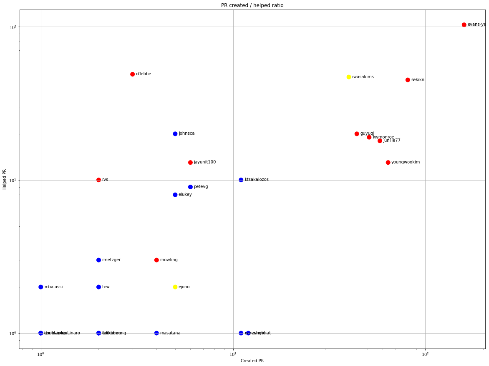

Latest record from the dataset:

<table border="1" class="dataframe">
  <thead>
    <tr style="text-align: right;">
      <th></th>
      <th>org</th>
      <th>repo</th>
      <th>type</th>
      <th>identifier</th>
      <th>subidentifier</th>
      <th>date</th>
      <th>author</th>
      <th>owner</th>
      <th>project</th>
    </tr>
  </thead>
  <tbody>
    <tr>
      <th>2445</th>
      <td>apache</td>
      <td>bigtop</td>
      <td>PR_COMMENTED</td>
      <td>733</td>
      <td>NaN</td>
      <td>2021-02-13 14:02:33+00:00</td>
      <td>sekikn</td>
      <td>sekikn</td>
      <td>bigtop</td>
    </tr>
  </tbody>
</table>

# Github Contributions per user

<table border="1" class="dataframe">
  <thead>
    <tr style="text-align: right;">
      <th></th>
      <th>contributions</th>
    </tr>
    <tr>
      <th>author</th>
      <th></th>
    </tr>
  </thead>
  <tbody>
    <tr>
      <th>evans-ye</th>
      <td>265</td>
    </tr>
    <tr>
      <th>sekikn</th>
      <td>113</td>
    </tr>
    <tr>
      <th>iwasakims</th>
      <td>112</td>
    </tr>
    <tr>
      <th>oflebbe</th>
      <td>88</td>
    </tr>
    <tr>
      <th>kwmonroe</th>
      <td>36</td>
    </tr>
    <tr>
      <th>guyuqi</th>
      <td>32</td>
    </tr>
    <tr>
      <th>asfgit</th>
      <td>31</td>
    </tr>
    <tr>
      <th>johnsca</th>
      <td>31</td>
    </tr>
    <tr>
      <th>JunHe77</th>
      <td>30</td>
    </tr>
    <tr>
      <th>youngwookim</th>
      <td>24</td>
    </tr>
  </tbody>
</table>

## Contributors per participations in PRs which are not created by self (helping PRs)

<table border="1" class="dataframe">
  <thead>
    <tr style="text-align: right;">
      <th></th>
      <th>identifier</th>
    </tr>
    <tr>
      <th>author</th>
      <th></th>
    </tr>
  </thead>
  <tbody>
    <tr>
      <th>evans-ye</th>
      <td>103</td>
    </tr>
    <tr>
      <th>oflebbe</th>
      <td>49</td>
    </tr>
    <tr>
      <th>iwasakims</th>
      <td>47</td>
    </tr>
    <tr>
      <th>sekikn</th>
      <td>45</td>
    </tr>
    <tr>
      <th>asfgit</th>
      <td>31</td>
    </tr>
    <tr>
      <th>johnsca</th>
      <td>20</td>
    </tr>
    <tr>
      <th>guyuqi</th>
      <td>20</td>
    </tr>
    <tr>
      <th>kwmonroe</th>
      <td>19</td>
    </tr>
    <tr>
      <th>JunHe77</th>
      <td>18</td>
    </tr>
    <tr>
      <th>youngwookim</th>
      <td>13</td>
    </tr>
    <tr>
      <th>jayunit100</th>
      <td>13</td>
    </tr>
    <tr>
      <th>rvs</th>
      <td>10</td>
    </tr>
    <tr>
      <th>ktsakalozos</th>
      <td>10</td>
    </tr>
    <tr>
      <th>petevg</th>
      <td>9</td>
    </tr>
    <tr>
      <th>elukey</th>
      <td>8</td>
    </tr>
    <tr>
      <th>rnowling</th>
      <td>3</td>
    </tr>
    <tr>
      <th>rmetzger</th>
      <td>3</td>
    </tr>
    <tr>
      <th>mxm</th>
      <td>3</td>
    </tr>
    <tr>
      <th>ejono</th>
      <td>2</td>
    </tr>
    <tr>
      <th>smarthi</th>
      <td>2</td>
    </tr>
  </tbody>
</table>

## Contributors per participations in any PRs

<table border="1" class="dataframe">
  <thead>
    <tr style="text-align: right;">
      <th></th>
      <th>identifier</th>
    </tr>
    <tr>
      <th>author</th>
      <th></th>
    </tr>
  </thead>
  <tbody>
    <tr>
      <th>evans-ye</th>
      <td>262</td>
    </tr>
    <tr>
      <th>sekikn</th>
      <td>126</td>
    </tr>
    <tr>
      <th>iwasakims</th>
      <td>87</td>
    </tr>
    <tr>
      <th>youngwookim</th>
      <td>77</td>
    </tr>
    <tr>
      <th>JunHe77</th>
      <td>76</td>
    </tr>
    <tr>
      <th>kwmonroe</th>
      <td>70</td>
    </tr>
    <tr>
      <th>guyuqi</th>
      <td>64</td>
    </tr>
    <tr>
      <th>oflebbe</th>
      <td>52</td>
    </tr>
    <tr>
      <th>asfgit</th>
      <td>31</td>
    </tr>
    <tr>
      <th>johnsca</th>
      <td>25</td>
    </tr>
    <tr>
      <th>ktsakalozos</th>
      <td>21</td>
    </tr>
    <tr>
      <th>jayunit100</th>
      <td>19</td>
    </tr>
    <tr>
      <th>petevg</th>
      <td>15</td>
    </tr>
    <tr>
      <th>elukey</th>
      <td>13</td>
    </tr>
    <tr>
      <th>acmnu</th>
      <td>13</td>
    </tr>
    <tr>
      <th>nareshgbhat</th>
      <td>12</td>
    </tr>
    <tr>
      <th>rvs</th>
      <td>12</td>
    </tr>
    <tr>
      <th>fsareshwala</th>
      <td>11</td>
    </tr>
    <tr>
      <th>alaunay</th>
      <td>8</td>
    </tr>
    <tr>
      <th>ejono</th>
      <td>7</td>
    </tr>
  </tbody>
</table>

# Bus factor (number of contributors responsible for the 50% of the prs) from last half year

## Contributors until the half of the all contributions

<table border="1" class="dataframe">
  <thead>
    <tr style="text-align: right;">
      <th></th>
      <th>author</th>
      <th>identifier</th>
      <th>cs</th>
      <th>ratio</th>
    </tr>
  </thead>
  <tbody>
  </tbody>
</table>

## Pony number (bus factor)

    1

## Dev power (All the contributions in the ration of the top contributor)

    1.6170212765957448

    

    

## People with created PRs > reviewed/commented PRS

    

    

## Same graph with focusing to the last 6 month

Only contributors with both created pr and helped pr visible

    

    

# Number of individual contributors per month

Number of different Github users who either created PR, commented PR, added review to a PR

Note: only events from apache/hadoop-ozone repository are included. Earlier PRs/comments are not here.

    

    

# Number of PRs closed/created per month

    /usr/lib/python3.9/site-packages/pandas/core/arrays/datetimes.py:1101: UserWarning: Converting to PeriodArray/Index representation will drop timezone information.
      warnings.warn(

    

    

# PR activity heatmap

    

    

