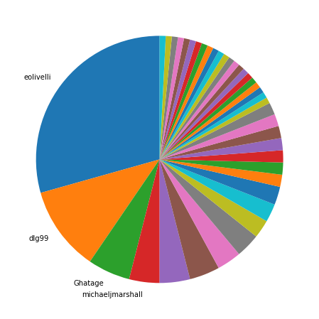
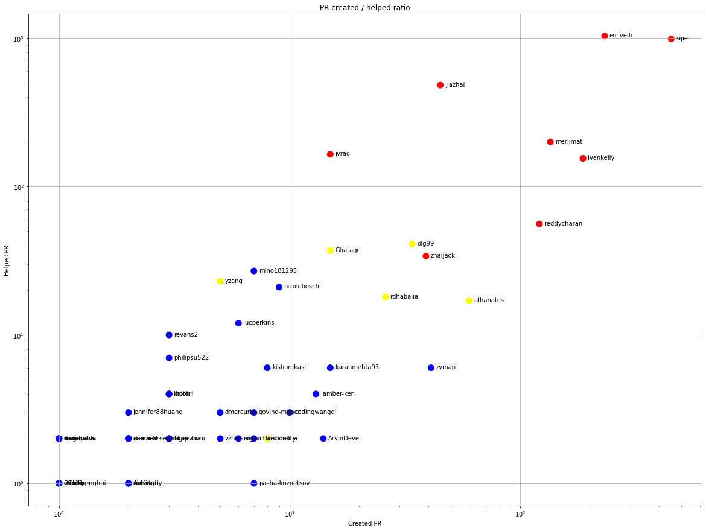
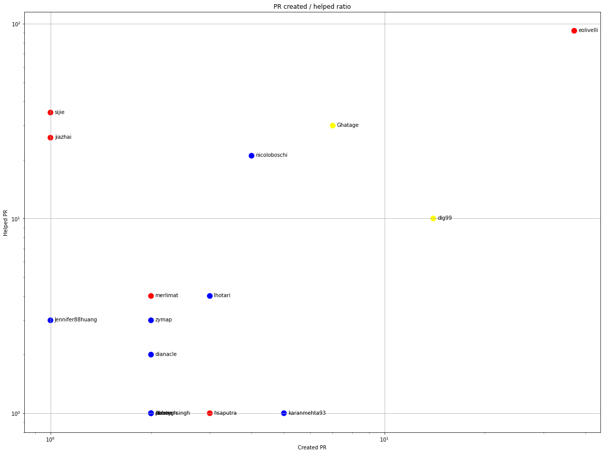
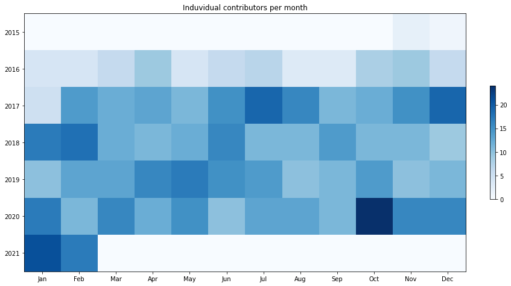
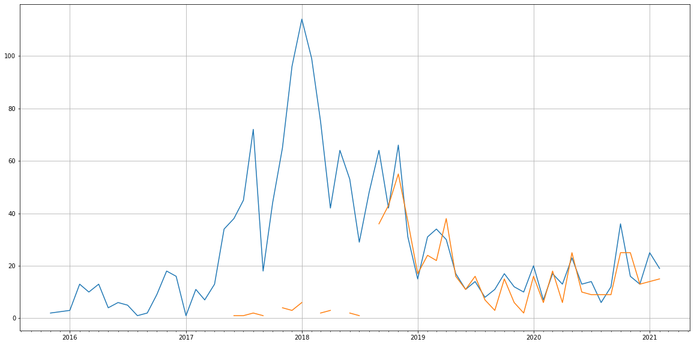
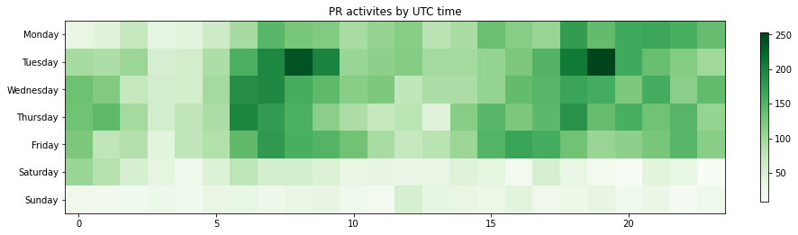

Latest record from the dataset:

<table border="1" class="dataframe">
  <thead>
    <tr style="text-align: right;">
      <th></th>
      <th>org</th>
      <th>repo</th>
      <th>type</th>
      <th>identifier</th>
      <th>subidentifier</th>
      <th>date</th>
      <th>author</th>
      <th>owner</th>
      <th>project</th>
    </tr>
  </thead>
  <tbody>
    <tr>
      <th>11566</th>
      <td>apache</td>
      <td>bookkeeper</td>
      <td>PR_COMMENTED</td>
      <td>2603</td>
      <td>NaN</td>
      <td>2021-02-14 08:33:32+00:00</td>
      <td>dianacle</td>
      <td>dianacle</td>
      <td>bookkeeper</td>
    </tr>
  </tbody>
</table>

# Github Contributions per user

<table border="1" class="dataframe">
  <thead>
    <tr style="text-align: right;">
      <th></th>
      <th>contributions</th>
    </tr>
    <tr>
      <th>author</th>
      <th></th>
    </tr>
  </thead>
  <tbody>
    <tr>
      <th>sijie</th>
      <td>2939</td>
    </tr>
    <tr>
      <th>eolivelli</th>
      <td>2804</td>
    </tr>
    <tr>
      <th>jiazhai</th>
      <td>735</td>
    </tr>
    <tr>
      <th>ivankelly</th>
      <td>484</td>
    </tr>
    <tr>
      <th>jvrao</th>
      <td>421</td>
    </tr>
    <tr>
      <th>asfgit</th>
      <td>329</td>
    </tr>
    <tr>
      <th>reddycharan</th>
      <td>294</td>
    </tr>
    <tr>
      <th>merlimat</th>
      <td>281</td>
    </tr>
    <tr>
      <th>dlg99</th>
      <td>89</td>
    </tr>
    <tr>
      <th>Ghatage</th>
      <td>71</td>
    </tr>
  </tbody>
</table>

## Contributors per participations in PRs which are not created by self (helping PRs)

<table border="1" class="dataframe">
  <thead>
    <tr style="text-align: right;">
      <th></th>
      <th>identifier</th>
    </tr>
    <tr>
      <th>author</th>
      <th></th>
    </tr>
  </thead>
  <tbody>
    <tr>
      <th>eolivelli</th>
      <td>1036</td>
    </tr>
    <tr>
      <th>sijie</th>
      <td>989</td>
    </tr>
    <tr>
      <th>jiazhai</th>
      <td>483</td>
    </tr>
    <tr>
      <th>merlimat</th>
      <td>200</td>
    </tr>
    <tr>
      <th>jvrao</th>
      <td>165</td>
    </tr>
    <tr>
      <th>ivankelly</th>
      <td>155</td>
    </tr>
    <tr>
      <th>asfgit</th>
      <td>138</td>
    </tr>
    <tr>
      <th>reddycharan</th>
      <td>56</td>
    </tr>
    <tr>
      <th>dlg99</th>
      <td>41</td>
    </tr>
    <tr>
      <th>Ghatage</th>
      <td>37</td>
    </tr>
    <tr>
      <th>zhaijack</th>
      <td>34</td>
    </tr>
    <tr>
      <th>mino181295</th>
      <td>27</td>
    </tr>
    <tr>
      <th>yzang</th>
      <td>23</td>
    </tr>
    <tr>
      <th>nicoloboschi</th>
      <td>21</td>
    </tr>
    <tr>
      <th>rdhabalia</th>
      <td>18</td>
    </tr>
    <tr>
      <th>athanatos</th>
      <td>17</td>
    </tr>
    <tr>
      <th>lucperkins</th>
      <td>12</td>
    </tr>
    <tr>
      <th>fpj</th>
      <td>10</td>
    </tr>
    <tr>
      <th>revans2</th>
      <td>10</td>
    </tr>
    <tr>
      <th>philipsu522</th>
      <td>7</td>
    </tr>
  </tbody>
</table>

## Contributors per participations in any PRs

<table border="1" class="dataframe">
  <thead>
    <tr style="text-align: right;">
      <th></th>
      <th>identifier</th>
    </tr>
    <tr>
      <th>author</th>
      <th></th>
    </tr>
  </thead>
  <tbody>
    <tr>
      <th>sijie</th>
      <td>1440</td>
    </tr>
    <tr>
      <th>eolivelli</th>
      <td>1268</td>
    </tr>
    <tr>
      <th>jiazhai</th>
      <td>528</td>
    </tr>
    <tr>
      <th>ivankelly</th>
      <td>342</td>
    </tr>
    <tr>
      <th>merlimat</th>
      <td>335</td>
    </tr>
    <tr>
      <th>jvrao</th>
      <td>180</td>
    </tr>
    <tr>
      <th>reddycharan</th>
      <td>177</td>
    </tr>
    <tr>
      <th>asfgit</th>
      <td>138</td>
    </tr>
    <tr>
      <th>athanatos</th>
      <td>77</td>
    </tr>
    <tr>
      <th>dlg99</th>
      <td>75</td>
    </tr>
    <tr>
      <th>zhaijack</th>
      <td>73</td>
    </tr>
    <tr>
      <th>Ghatage</th>
      <td>52</td>
    </tr>
    <tr>
      <th>zymap</th>
      <td>47</td>
    </tr>
    <tr>
      <th>rdhabalia</th>
      <td>44</td>
    </tr>
    <tr>
      <th>mino181295</th>
      <td>34</td>
    </tr>
    <tr>
      <th>nicoloboschi</th>
      <td>30</td>
    </tr>
    <tr>
      <th>yzang</th>
      <td>28</td>
    </tr>
    <tr>
      <th>karanmehta93</th>
      <td>21</td>
    </tr>
    <tr>
      <th>lucperkins</th>
      <td>18</td>
    </tr>
    <tr>
      <th>lamber-ken</th>
      <td>17</td>
    </tr>
  </tbody>
</table>

# Bus factor (number of contributors responsible for the 50% of the prs) from last half year

## Contributors until the half of the all contributions

<table border="1" class="dataframe">
  <thead>
    <tr style="text-align: right;">
      <th></th>
      <th>author</th>
      <th>identifier</th>
      <th>cs</th>
      <th>ratio</th>
    </tr>
  </thead>
  <tbody>
    <tr>
      <th>0</th>
      <td>eolivelli</td>
      <td>37</td>
      <td>37</td>
      <td>29.365079</td>
    </tr>
    <tr>
      <th>1</th>
      <td>dlg99</td>
      <td>14</td>
      <td>51</td>
      <td>11.111111</td>
    </tr>
    <tr>
      <th>2</th>
      <td>Ghatage</td>
      <td>7</td>
      <td>58</td>
      <td>5.555556</td>
    </tr>
  </tbody>
</table>

## Pony number (bus factor)

    4

## Dev power (All the contributions in the ration of the top contributor)

    3.4054054054054053

    

    

## People with created PRs > reviewed/commented PRS

    

    

## Same graph with focusing to the last 6 month

Only contributors with both created pr and helped pr visible

    

    

# Number of individual contributors per month

Number of different Github users who either created PR, commented PR, added review to a PR

Note: only events from apache/hadoop-ozone repository are included. Earlier PRs/comments are not here.

    

    

# Number of PRs closed/created per month

    /usr/lib/python3.9/site-packages/pandas/core/arrays/datetimes.py:1101: UserWarning: Converting to PeriodArray/Index representation will drop timezone information.
      warnings.warn(

    

    

# PR activity heatmap

    

    

