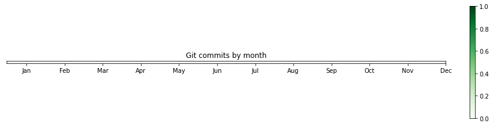
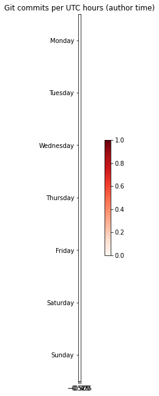

    <ipython-input-1-2a3d33c45f58>:2: UserWarning: Attempting to set identical left == right == -0.5 results in singular transformations; automatically expanding.
      im = plt.imshow(a, cmap="Greens")
    <ipython-input-1-2a3d33c45f58>:2: UserWarning: Attempting to set identical bottom == top == -0.5 results in singular transformations; automatically expanding.
      im = plt.imshow(a, cmap="Greens")

    

    

    <ipython-input-1-5ff2d2ae8b15>:2: UserWarning: Attempting to set identical left == right == -0.5 results in singular transformations; automatically expanding.
      im = plt.imshow(a, cmap="Reds")

    

    

