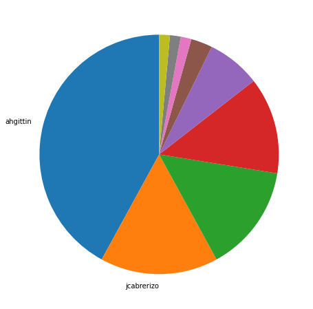
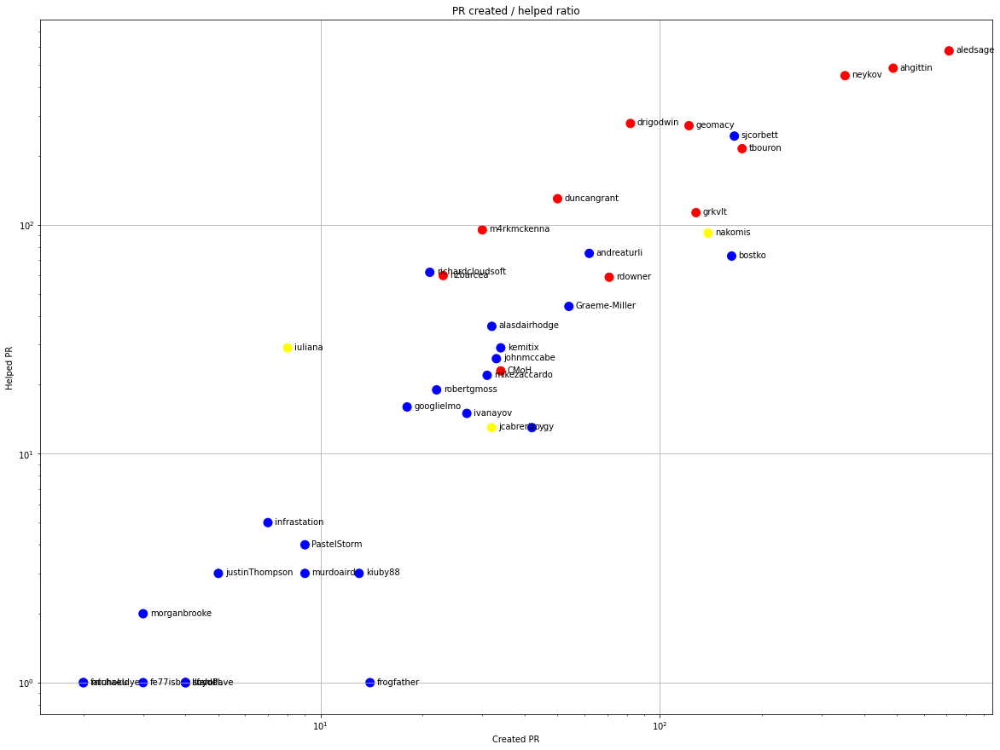
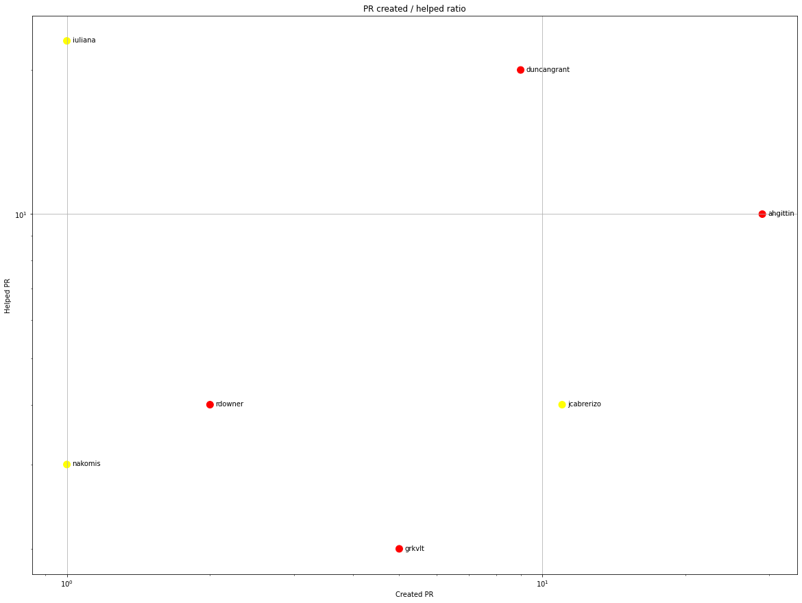
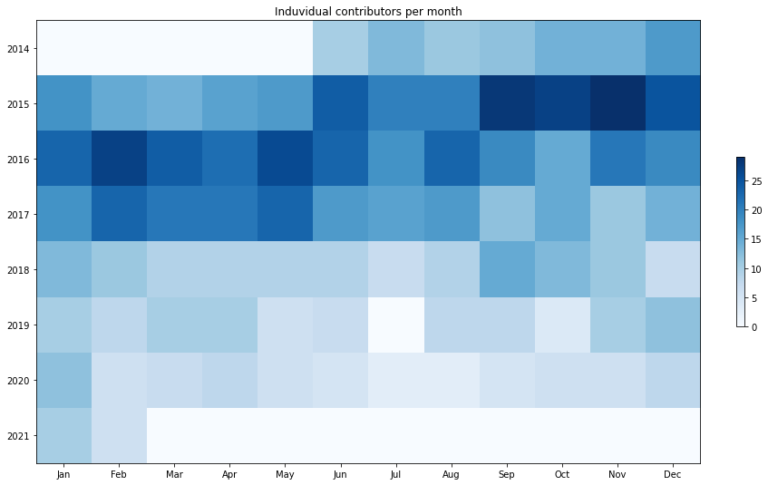
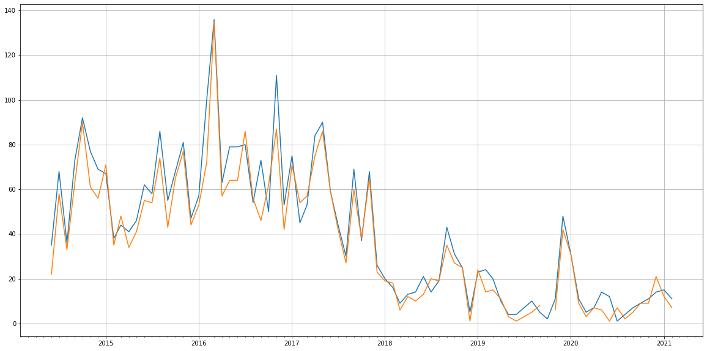
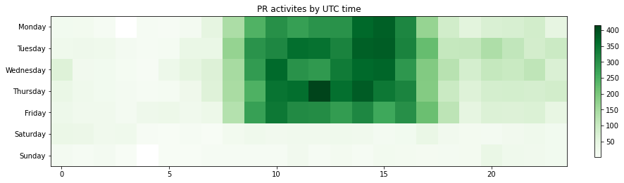

Latest record from the dataset:

<table border="1" class="dataframe">
  <thead>
    <tr style="text-align: right;">
      <th></th>
      <th>org</th>
      <th>repo</th>
      <th>type</th>
      <th>identifier</th>
      <th>subidentifier</th>
      <th>date</th>
      <th>author</th>
      <th>owner</th>
      <th>project</th>
    </tr>
  </thead>
  <tbody>
    <tr>
      <th>10866</th>
      <td>apache</td>
      <td>brooklyn-ui</td>
      <td>PR_MERGED</td>
      <td>190</td>
      <td>NaN</td>
      <td>2021-02-11 19:24:31+00:00</td>
      <td>iuliana</td>
      <td>alasdairhodge</td>
      <td>brooklyn</td>
    </tr>
  </tbody>
</table>

# Github Contributions per user

<table border="1" class="dataframe">
  <thead>
    <tr style="text-align: right;">
      <th></th>
      <th>contributions</th>
    </tr>
    <tr>
      <th>author</th>
      <th></th>
    </tr>
  </thead>
  <tbody>
    <tr>
      <th>asfgit</th>
      <td>2827</td>
    </tr>
    <tr>
      <th>asfbot</th>
      <td>1850</td>
    </tr>
    <tr>
      <th>aledsage</th>
      <td>1287</td>
    </tr>
    <tr>
      <th>ahgittin</th>
      <td>1081</td>
    </tr>
    <tr>
      <th>neykov</th>
      <td>1046</td>
    </tr>
    <tr>
      <th>geomacy</th>
      <td>567</td>
    </tr>
    <tr>
      <th>tbouron</th>
      <td>523</td>
    </tr>
    <tr>
      <th>sjcorbett</th>
      <td>412</td>
    </tr>
    <tr>
      <th>drigodwin</th>
      <td>349</td>
    </tr>
    <tr>
      <th>duncangrant</th>
      <td>215</td>
    </tr>
  </tbody>
</table>

## Contributors per participations in PRs which are not created by self (helping PRs)

<table border="1" class="dataframe">
  <thead>
    <tr style="text-align: right;">
      <th></th>
      <th>identifier</th>
    </tr>
    <tr>
      <th>author</th>
      <th></th>
    </tr>
  </thead>
  <tbody>
    <tr>
      <th>asfgit</th>
      <td>1163</td>
    </tr>
    <tr>
      <th>asfbot</th>
      <td>712</td>
    </tr>
    <tr>
      <th>aledsage</th>
      <td>575</td>
    </tr>
    <tr>
      <th>ahgittin</th>
      <td>483</td>
    </tr>
    <tr>
      <th>neykov</th>
      <td>448</td>
    </tr>
    <tr>
      <th>drigodwin</th>
      <td>277</td>
    </tr>
    <tr>
      <th>geomacy</th>
      <td>271</td>
    </tr>
    <tr>
      <th>sjcorbett</th>
      <td>244</td>
    </tr>
    <tr>
      <th>tbouron</th>
      <td>215</td>
    </tr>
    <tr>
      <th>duncangrant</th>
      <td>130</td>
    </tr>
    <tr>
      <th>grkvlt</th>
      <td>113</td>
    </tr>
    <tr>
      <th>m4rkmckenna</th>
      <td>95</td>
    </tr>
    <tr>
      <th>nakomis</th>
      <td>92</td>
    </tr>
    <tr>
      <th>andreaturli</th>
      <td>75</td>
    </tr>
    <tr>
      <th>bostko</th>
      <td>73</td>
    </tr>
    <tr>
      <th>richardcloudsoft</th>
      <td>62</td>
    </tr>
    <tr>
      <th>hzbarcea</th>
      <td>60</td>
    </tr>
    <tr>
      <th>rdowner</th>
      <td>59</td>
    </tr>
    <tr>
      <th>Graeme-Miller</th>
      <td>44</td>
    </tr>
    <tr>
      <th>alasdairhodge</th>
      <td>36</td>
    </tr>
  </tbody>
</table>

## Contributors per participations in any PRs

<table border="1" class="dataframe">
  <thead>
    <tr style="text-align: right;">
      <th></th>
      <th>identifier</th>
    </tr>
    <tr>
      <th>author</th>
      <th></th>
    </tr>
  </thead>
  <tbody>
    <tr>
      <th>asfgit</th>
      <td>1163</td>
    </tr>
    <tr>
      <th>aledsage</th>
      <td>947</td>
    </tr>
    <tr>
      <th>ahgittin</th>
      <td>752</td>
    </tr>
    <tr>
      <th>asfbot</th>
      <td>712</td>
    </tr>
    <tr>
      <th>neykov</th>
      <td>623</td>
    </tr>
    <tr>
      <th>sjcorbett</th>
      <td>377</td>
    </tr>
    <tr>
      <th>geomacy</th>
      <td>349</td>
    </tr>
    <tr>
      <th>drigodwin</th>
      <td>341</td>
    </tr>
    <tr>
      <th>tbouron</th>
      <td>328</td>
    </tr>
    <tr>
      <th>grkvlt</th>
      <td>225</td>
    </tr>
    <tr>
      <th>bostko</th>
      <td>218</td>
    </tr>
    <tr>
      <th>nakomis</th>
      <td>217</td>
    </tr>
    <tr>
      <th>duncangrant</th>
      <td>179</td>
    </tr>
    <tr>
      <th>andreaturli</th>
      <td>129</td>
    </tr>
    <tr>
      <th>rdowner</th>
      <td>127</td>
    </tr>
    <tr>
      <th>m4rkmckenna</th>
      <td>123</td>
    </tr>
    <tr>
      <th>Graeme-Miller</th>
      <td>97</td>
    </tr>
    <tr>
      <th>hzbarcea</th>
      <td>83</td>
    </tr>
    <tr>
      <th>richardcloudsoft</th>
      <td>79</td>
    </tr>
    <tr>
      <th>alasdairhodge</th>
      <td>67</td>
    </tr>
  </tbody>
</table>

# Bus factor (number of contributors responsible for the 50% of the prs) from last half year

## Contributors until the half of the all contributions

<table border="1" class="dataframe">
  <thead>
    <tr style="text-align: right;">
      <th></th>
      <th>author</th>
      <th>identifier</th>
      <th>cs</th>
      <th>ratio</th>
    </tr>
  </thead>
  <tbody>
    <tr>
      <th>0</th>
      <td>ahgittin</td>
      <td>29</td>
      <td>29</td>
      <td>42.028986</td>
    </tr>
  </tbody>
</table>

## Pony number (bus factor)

    2

## Dev power (All the contributions in the ration of the top contributor)

    2.379310344827586

    

    

## People with created PRs > reviewed/commented PRS

    

    

## Same graph with focusing to the last 6 month

Only contributors with both created pr and helped pr visible

    

    

# Number of individual contributors per month

Number of different Github users who either created PR, commented PR, added review to a PR

Note: only events from apache/hadoop-ozone repository are included. Earlier PRs/comments are not here.

    

    

# Number of PRs closed/created per month

    /usr/lib/python3.9/site-packages/pandas/core/arrays/datetimes.py:1101: UserWarning: Converting to PeriodArray/Index representation will drop timezone information.
      warnings.warn(

    

    

# PR activity heatmap

    

    

