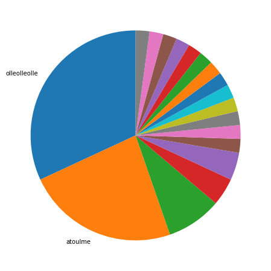
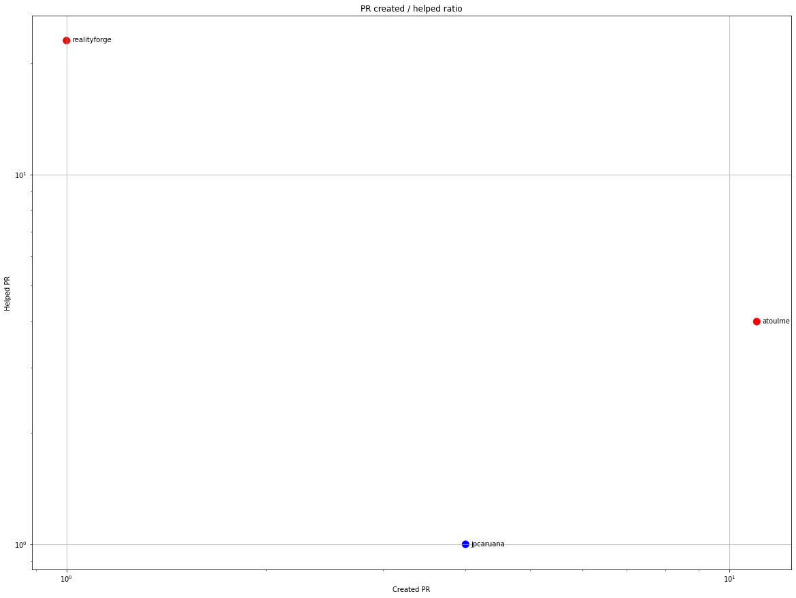
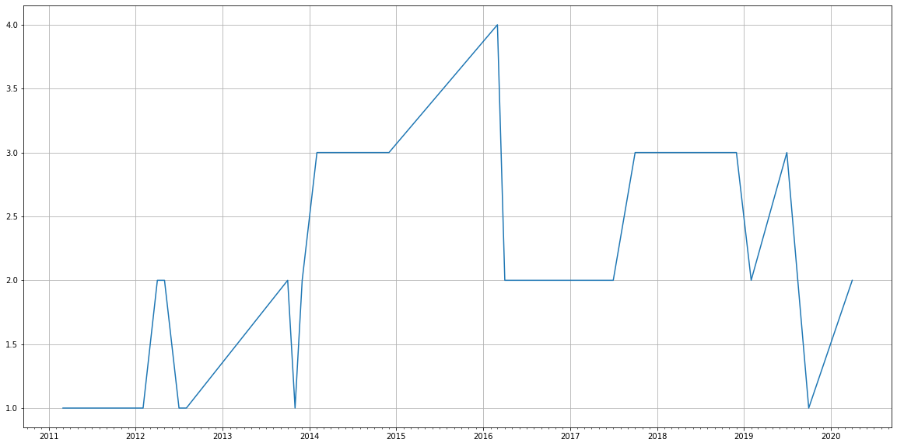
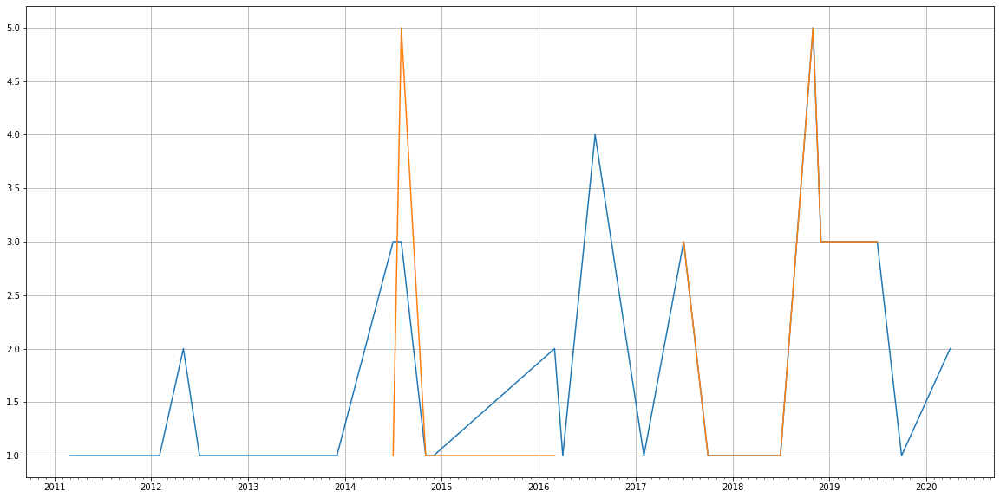
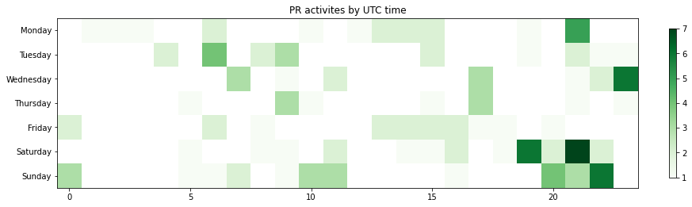

Latest record from the dataset:

<table border="1" class="dataframe">
  <thead>
    <tr style="text-align: right;">
      <th></th>
      <th>org</th>
      <th>repo</th>
      <th>type</th>
      <th>identifier</th>
      <th>subidentifier</th>
      <th>date</th>
      <th>author</th>
      <th>owner</th>
      <th>project</th>
    </tr>
  </thead>
  <tbody>
    <tr>
      <th>118</th>
      <td>apache</td>
      <td>buildr</td>
      <td>PR_MERGED</td>
      <td>47</td>
      <td>NaN</td>
      <td>2020-04-03 15:11:23+00:00</td>
      <td>atoulme</td>
      <td>olleolleolle</td>
      <td>buildr</td>
    </tr>
  </tbody>
</table>

# Github Contributions per user

<table border="1" class="dataframe">
  <thead>
    <tr style="text-align: right;">
      <th></th>
      <th>contributions</th>
    </tr>
    <tr>
      <th>author</th>
      <th></th>
    </tr>
  </thead>
  <tbody>
    <tr>
      <th>realityforge</th>
      <td>31</td>
    </tr>
    <tr>
      <th>asfgit</th>
      <td>26</td>
    </tr>
    <tr>
      <th>atoulme</th>
      <td>4</td>
    </tr>
    <tr>
      <th>jfarrell</th>
      <td>3</td>
    </tr>
    <tr>
      <th>Humbedooh</th>
      <td>2</td>
    </tr>
    <tr>
      <th>jpcaruana</th>
      <td>2</td>
    </tr>
    <tr>
      <th>asfbot</th>
      <td>1</td>
    </tr>
    <tr>
      <th>gardiner</th>
      <td>1</td>
    </tr>
  </tbody>
</table>

## Contributors per participations in PRs which are not created by self (helping PRs)

<table border="1" class="dataframe">
  <thead>
    <tr style="text-align: right;">
      <th></th>
      <th>identifier</th>
    </tr>
    <tr>
      <th>author</th>
      <th></th>
    </tr>
  </thead>
  <tbody>
    <tr>
      <th>asfgit</th>
      <td>26</td>
    </tr>
    <tr>
      <th>realityforge</th>
      <td>23</td>
    </tr>
    <tr>
      <th>atoulme</th>
      <td>4</td>
    </tr>
    <tr>
      <th>jfarrell</th>
      <td>3</td>
    </tr>
    <tr>
      <th>Humbedooh</th>
      <td>1</td>
    </tr>
    <tr>
      <th>asfbot</th>
      <td>1</td>
    </tr>
    <tr>
      <th>gardiner</th>
      <td>1</td>
    </tr>
    <tr>
      <th>jpcaruana</th>
      <td>1</td>
    </tr>
  </tbody>
</table>

## Contributors per participations in any PRs

<table border="1" class="dataframe">
  <thead>
    <tr style="text-align: right;">
      <th></th>
      <th>identifier</th>
    </tr>
    <tr>
      <th>author</th>
      <th></th>
    </tr>
  </thead>
  <tbody>
    <tr>
      <th>asfgit</th>
      <td>26</td>
    </tr>
    <tr>
      <th>realityforge</th>
      <td>24</td>
    </tr>
    <tr>
      <th>atoulme</th>
      <td>15</td>
    </tr>
    <tr>
      <th>olleolleolle</th>
      <td>15</td>
    </tr>
    <tr>
      <th>jpcaruana</th>
      <td>5</td>
    </tr>
    <tr>
      <th>jfarrell</th>
      <td>3</td>
    </tr>
    <tr>
      <th>pepijnve</th>
      <td>2</td>
    </tr>
    <tr>
      <th>neher</th>
      <td>2</td>
    </tr>
    <tr>
      <th>FreedomBen</th>
      <td>1</td>
    </tr>
    <tr>
      <th>jimmycasey</th>
      <td>1</td>
    </tr>
    <tr>
      <th>rajeevsood</th>
      <td>1</td>
    </tr>
    <tr>
      <th>ngiger</th>
      <td>1</td>
    </tr>
    <tr>
      <th>msainz</th>
      <td>1</td>
    </tr>
    <tr>
      <th>gardiner</th>
      <td>1</td>
    </tr>
    <tr>
      <th>Humbedooh</th>
      <td>1</td>
    </tr>
    <tr>
      <th>dependabot</th>
      <td>1</td>
    </tr>
    <tr>
      <th>daniperez</th>
      <td>1</td>
    </tr>
    <tr>
      <th>croes</th>
      <td>1</td>
    </tr>
    <tr>
      <th>cacoco</th>
      <td>1</td>
    </tr>
    <tr>
      <th>asfbot</th>
      <td>1</td>
    </tr>
  </tbody>
</table>

# Bus factor (number of contributors responsible for the 50% of the prs)

## Contributors until the half of the all contributions

<table border="1" class="dataframe">
  <thead>
    <tr style="text-align: right;">
      <th></th>
      <th>author</th>
      <th>identifier</th>
      <th>cs</th>
      <th>ratio</th>
    </tr>
  </thead>
  <tbody>
    <tr>
      <th>0</th>
      <td>olleolleolle</td>
      <td>15</td>
      <td>15</td>
      <td>31.914894</td>
    </tr>
  </tbody>
</table>

## Pony number (bus factor)

    2

## Dev power (All the contributions in the ration of the top contributor)

    3.1333333333333337

    

    

## People with created PRs > reviewed/commented PRS

    

    

## Same graph with focusing to the last 6 month

Only contributors with both created pr and helped pr visible

    

    

# Number of individual contributors per month

Number of different Github users who either created PR, commented PR, added review to a PR

Note: only events from apache/hadoop-ozone repository are included. Earlier PRs/comments are not here.

    /usr/lib/python3.9/site-packages/pandas/core/arrays/datetimes.py:1101: UserWarning: Converting to PeriodArray/Index representation will drop timezone information.
      warnings.warn(

<table border="1" class="dataframe">
  <thead>
    <tr style="text-align: right;">
      <th></th>
      <th>date</th>
      <th>author</th>
    </tr>
  </thead>
  <tbody>
    <tr>
      <th>17</th>
      <td>2016-08</td>
      <td>2</td>
    </tr>
    <tr>
      <th>18</th>
      <td>2017-02</td>
      <td>2</td>
    </tr>
    <tr>
      <th>19</th>
      <td>2017-07</td>
      <td>2</td>
    </tr>
    <tr>
      <th>20</th>
      <td>2017-10</td>
      <td>3</td>
    </tr>
    <tr>
      <th>21</th>
      <td>2018-03</td>
      <td>3</td>
    </tr>
    <tr>
      <th>22</th>
      <td>2018-07</td>
      <td>3</td>
    </tr>
    <tr>
      <th>23</th>
      <td>2018-11</td>
      <td>3</td>
    </tr>
    <tr>
      <th>24</th>
      <td>2018-12</td>
      <td>3</td>
    </tr>
    <tr>
      <th>25</th>
      <td>2019-02</td>
      <td>2</td>
    </tr>
    <tr>
      <th>26</th>
      <td>2019-07</td>
      <td>3</td>
    </tr>
    <tr>
      <th>27</th>
      <td>2019-10</td>
      <td>1</td>
    </tr>
    <tr>
      <th>28</th>
      <td>2020-04</td>
      <td>2</td>
    </tr>
  </tbody>
</table>

    

    

# Number of PRs closed/created per month

    /usr/lib/python3.9/site-packages/pandas/core/arrays/datetimes.py:1101: UserWarning: Converting to PeriodArray/Index representation will drop timezone information.
      warnings.warn(

    

    

## Monthly comments

    /usr/lib/python3.9/site-packages/pandas/core/arrays/datetimes.py:1101: UserWarning: Converting to PeriodArray/Index representation will drop timezone information.
      warnings.warn(

<table border="1" class="dataframe">
  <thead>
    <tr style="text-align: right;">
      <th></th>
      <th>identifier</th>
    </tr>
    <tr>
      <th>date</th>
      <th></th>
    </tr>
  </thead>
  <tbody>
    <tr>
      <th>2012-04</th>
      <td>2</td>
    </tr>
    <tr>
      <th>2012-08</th>
      <td>1</td>
    </tr>
    <tr>
      <th>2013-10</th>
      <td>3</td>
    </tr>
    <tr>
      <th>2013-11</th>
      <td>1</td>
    </tr>
    <tr>
      <th>2013-12</th>
      <td>1</td>
    </tr>
    <tr>
      <th>2014-02</th>
      <td>4</td>
    </tr>
    <tr>
      <th>2014-07</th>
      <td>6</td>
    </tr>
    <tr>
      <th>2014-11</th>
      <td>1</td>
    </tr>
    <tr>
      <th>2014-12</th>
      <td>1</td>
    </tr>
    <tr>
      <th>2016-03</th>
      <td>5</td>
    </tr>
    <tr>
      <th>2016-04</th>
      <td>1</td>
    </tr>
    <tr>
      <th>2017-02</th>
      <td>4</td>
    </tr>
    <tr>
      <th>2017-10</th>
      <td>2</td>
    </tr>
    <tr>
      <th>2018-03</th>
      <td>1</td>
    </tr>
    <tr>
      <th>2018-07</th>
      <td>1</td>
    </tr>
    <tr>
      <th>2018-11</th>
      <td>11</td>
    </tr>
    <tr>
      <th>2018-12</th>
      <td>3</td>
    </tr>
    <tr>
      <th>2019-02</th>
      <td>3</td>
    </tr>
    <tr>
      <th>2019-07</th>
      <td>3</td>
    </tr>
  </tbody>
</table>

# PR activity heatmap

    

    

