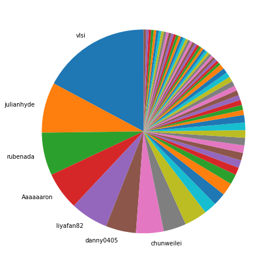
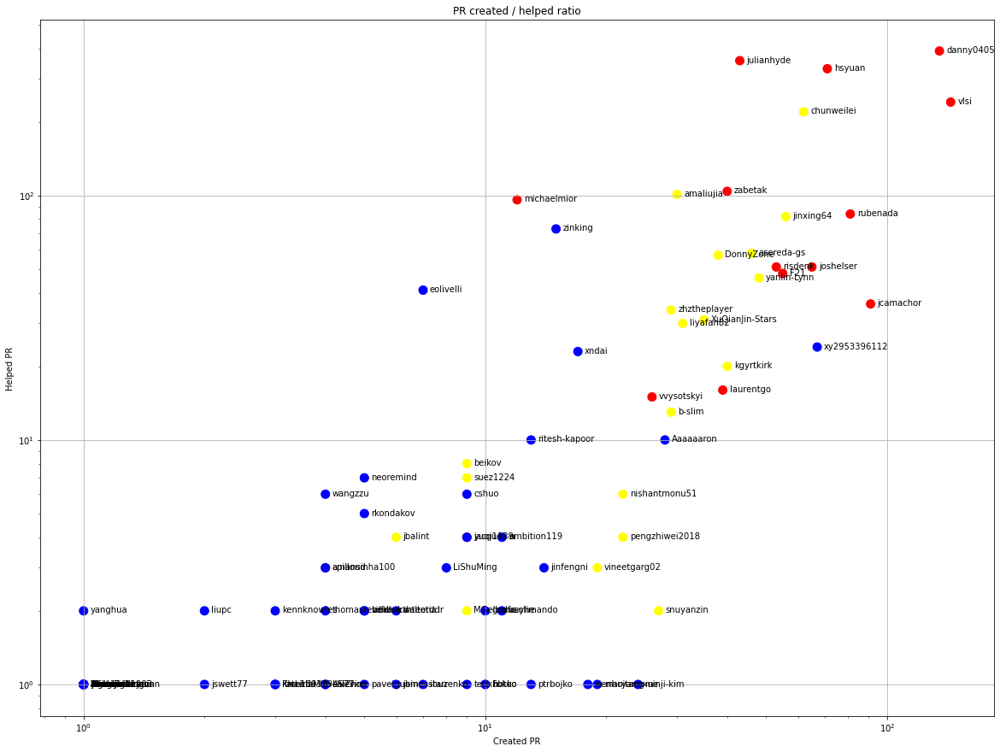
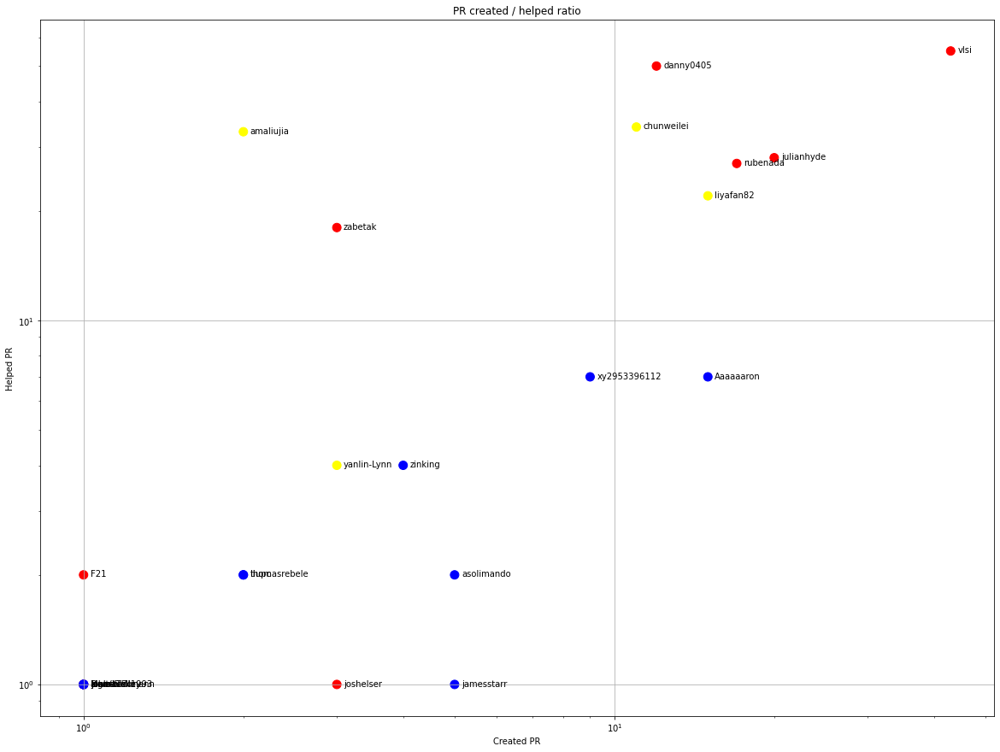
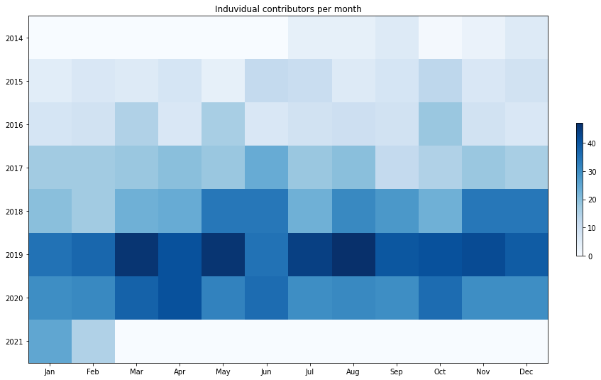
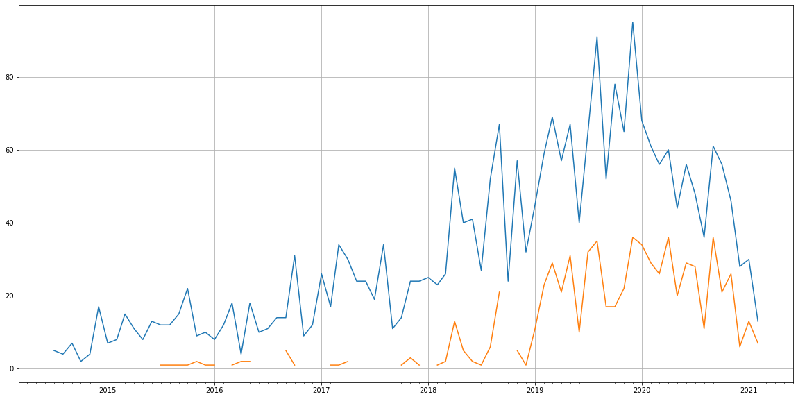
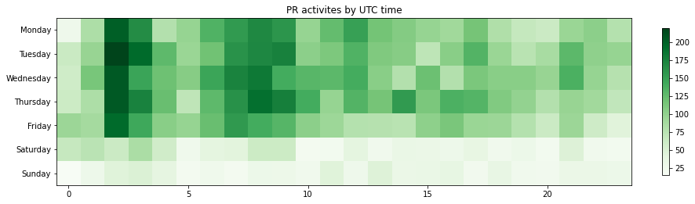

Latest record from the dataset:

<table border="1" class="dataframe">
  <thead>
    <tr style="text-align: right;">
      <th></th>
      <th>org</th>
      <th>repo</th>
      <th>type</th>
      <th>identifier</th>
      <th>subidentifier</th>
      <th>date</th>
      <th>author</th>
      <th>owner</th>
      <th>project</th>
    </tr>
  </thead>
  <tbody>
    <tr>
      <th>11765</th>
      <td>apache</td>
      <td>calcite</td>
      <td>PR_COMMENTED</td>
      <td>2347</td>
      <td>NaN</td>
      <td>2021-02-12 10:53:48+00:00</td>
      <td>aigor</td>
      <td>aigor</td>
      <td>calcite</td>
    </tr>
  </tbody>
</table>

# Github Contributions per user

<table border="1" class="dataframe">
  <thead>
    <tr style="text-align: right;">
      <th></th>
      <th>contributions</th>
    </tr>
    <tr>
      <th>author</th>
      <th></th>
    </tr>
  </thead>
  <tbody>
    <tr>
      <th>danny0405</th>
      <td>1091</td>
    </tr>
    <tr>
      <th>hsyuan</th>
      <td>910</td>
    </tr>
    <tr>
      <th>vlsi</th>
      <td>864</td>
    </tr>
    <tr>
      <th>julianhyde</th>
      <td>633</td>
    </tr>
    <tr>
      <th>chunweilei</th>
      <td>443</td>
    </tr>
    <tr>
      <th>rubenada</th>
      <td>336</td>
    </tr>
    <tr>
      <th>zabetak</th>
      <td>289</td>
    </tr>
    <tr>
      <th>amaliujia</th>
      <td>252</td>
    </tr>
    <tr>
      <th>asereda-gs</th>
      <td>244</td>
    </tr>
    <tr>
      <th>michaelmior</th>
      <td>226</td>
    </tr>
  </tbody>
</table>

## Contributors per participations in PRs which are not created by self (helping PRs)

<table border="1" class="dataframe">
  <thead>
    <tr style="text-align: right;">
      <th></th>
      <th>identifier</th>
    </tr>
    <tr>
      <th>author</th>
      <th></th>
    </tr>
  </thead>
  <tbody>
    <tr>
      <th>danny0405</th>
      <td>390</td>
    </tr>
    <tr>
      <th>julianhyde</th>
      <td>356</td>
    </tr>
    <tr>
      <th>hsyuan</th>
      <td>330</td>
    </tr>
    <tr>
      <th>vlsi</th>
      <td>241</td>
    </tr>
    <tr>
      <th>chunweilei</th>
      <td>220</td>
    </tr>
    <tr>
      <th>zabetak</th>
      <td>104</td>
    </tr>
    <tr>
      <th>amaliujia</th>
      <td>101</td>
    </tr>
    <tr>
      <th>asfgit</th>
      <td>98</td>
    </tr>
    <tr>
      <th>michaelmior</th>
      <td>96</td>
    </tr>
    <tr>
      <th>rubenada</th>
      <td>84</td>
    </tr>
    <tr>
      <th>jinxing64</th>
      <td>82</td>
    </tr>
    <tr>
      <th>zinking</th>
      <td>73</td>
    </tr>
    <tr>
      <th>asereda-gs</th>
      <td>58</td>
    </tr>
    <tr>
      <th>DonnyZone</th>
      <td>57</td>
    </tr>
    <tr>
      <th>risdenk</th>
      <td>51</td>
    </tr>
    <tr>
      <th>joshelser</th>
      <td>51</td>
    </tr>
    <tr>
      <th>F21</th>
      <td>48</td>
    </tr>
    <tr>
      <th>yanlin-Lynn</th>
      <td>46</td>
    </tr>
    <tr>
      <th>eolivelli</th>
      <td>41</td>
    </tr>
    <tr>
      <th>jcamachor</th>
      <td>36</td>
    </tr>
  </tbody>
</table>

## Contributors per participations in any PRs

<table border="1" class="dataframe">
  <thead>
    <tr style="text-align: right;">
      <th></th>
      <th>identifier</th>
    </tr>
    <tr>
      <th>author</th>
      <th></th>
    </tr>
  </thead>
  <tbody>
    <tr>
      <th>danny0405</th>
      <td>525</td>
    </tr>
    <tr>
      <th>hsyuan</th>
      <td>401</td>
    </tr>
    <tr>
      <th>julianhyde</th>
      <td>397</td>
    </tr>
    <tr>
      <th>vlsi</th>
      <td>385</td>
    </tr>
    <tr>
      <th>chunweilei</th>
      <td>282</td>
    </tr>
    <tr>
      <th>rubenada</th>
      <td>165</td>
    </tr>
    <tr>
      <th>zabetak</th>
      <td>144</td>
    </tr>
    <tr>
      <th>jinxing64</th>
      <td>138</td>
    </tr>
    <tr>
      <th>amaliujia</th>
      <td>131</td>
    </tr>
    <tr>
      <th>jcamachor</th>
      <td>127</td>
    </tr>
    <tr>
      <th>joshelser</th>
      <td>114</td>
    </tr>
    <tr>
      <th>michaelmior</th>
      <td>108</td>
    </tr>
    <tr>
      <th>asereda-gs</th>
      <td>104</td>
    </tr>
    <tr>
      <th>risdenk</th>
      <td>104</td>
    </tr>
    <tr>
      <th>asfgit</th>
      <td>98</td>
    </tr>
    <tr>
      <th>DonnyZone</th>
      <td>95</td>
    </tr>
    <tr>
      <th>F21</th>
      <td>94</td>
    </tr>
    <tr>
      <th>yanlin-Lynn</th>
      <td>94</td>
    </tr>
    <tr>
      <th>xy2953396112</th>
      <td>91</td>
    </tr>
    <tr>
      <th>zinking</th>
      <td>88</td>
    </tr>
  </tbody>
</table>

# Bus factor (number of contributors responsible for the 50% of the prs) from last half year

## Contributors until the half of the all contributions

<table border="1" class="dataframe">
  <thead>
    <tr style="text-align: right;">
      <th></th>
      <th>author</th>
      <th>identifier</th>
      <th>cs</th>
      <th>ratio</th>
    </tr>
  </thead>
  <tbody>
    <tr>
      <th>0</th>
      <td>vlsi</td>
      <td>43</td>
      <td>43</td>
      <td>17.2</td>
    </tr>
    <tr>
      <th>1</th>
      <td>julianhyde</td>
      <td>20</td>
      <td>63</td>
      <td>8.0</td>
    </tr>
    <tr>
      <th>2</th>
      <td>rubenada</td>
      <td>17</td>
      <td>80</td>
      <td>6.8</td>
    </tr>
    <tr>
      <th>3</th>
      <td>Aaaaaaron</td>
      <td>15</td>
      <td>95</td>
      <td>6.0</td>
    </tr>
    <tr>
      <th>4</th>
      <td>liyafan82</td>
      <td>15</td>
      <td>110</td>
      <td>6.0</td>
    </tr>
    <tr>
      <th>5</th>
      <td>danny0405</td>
      <td>12</td>
      <td>122</td>
      <td>4.8</td>
    </tr>
  </tbody>
</table>

## Pony number (bus factor)

    7

## Dev power (All the contributions in the ration of the top contributor)

    5.8139534883720945

    

    

## People with created PRs > reviewed/commented PRS

    

    

## Same graph with focusing to the last 6 month

Only contributors with both created pr and helped pr visible

    

    

# Number of individual contributors per month

Number of different Github users who either created PR, commented PR, added review to a PR

Note: only events from apache/hadoop-ozone repository are included. Earlier PRs/comments are not here.

    

    

# Number of PRs closed/created per month

    /usr/lib/python3.9/site-packages/pandas/core/arrays/datetimes.py:1101: UserWarning: Converting to PeriodArray/Index representation will drop timezone information.
      warnings.warn(

    

    

# PR activity heatmap

    

    

