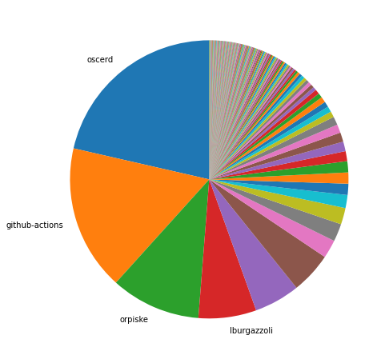
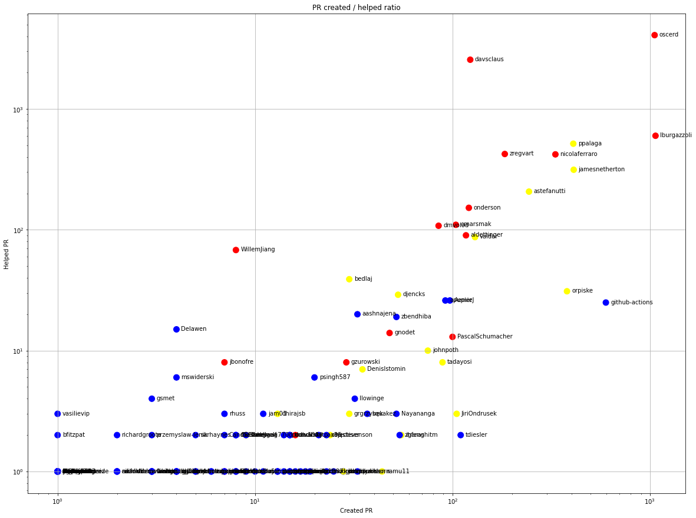
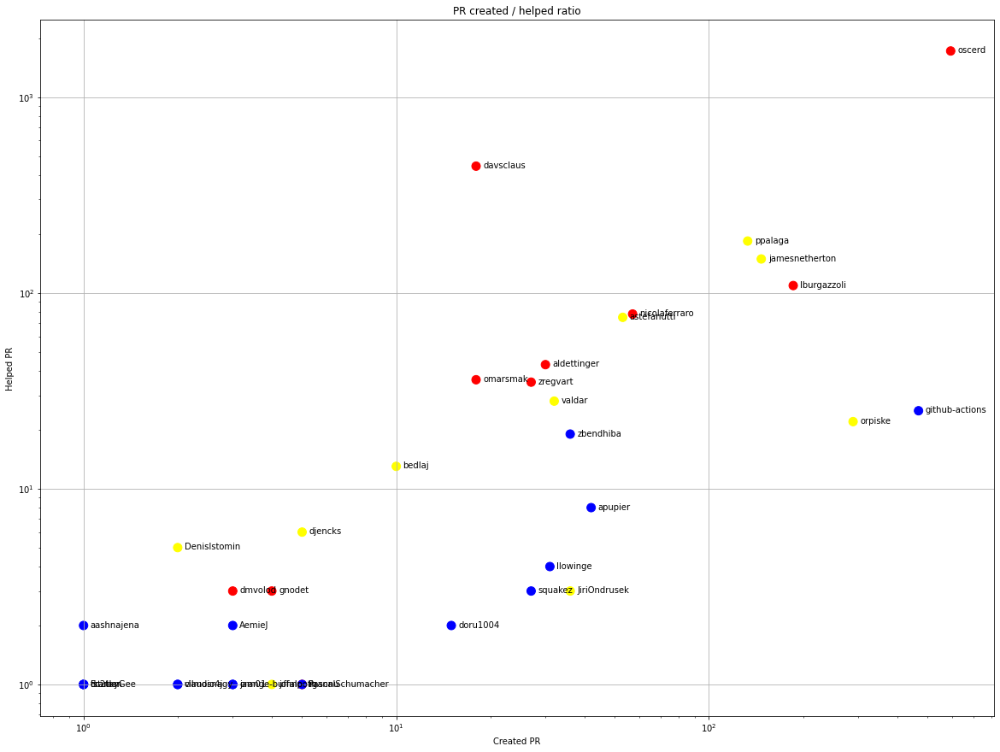
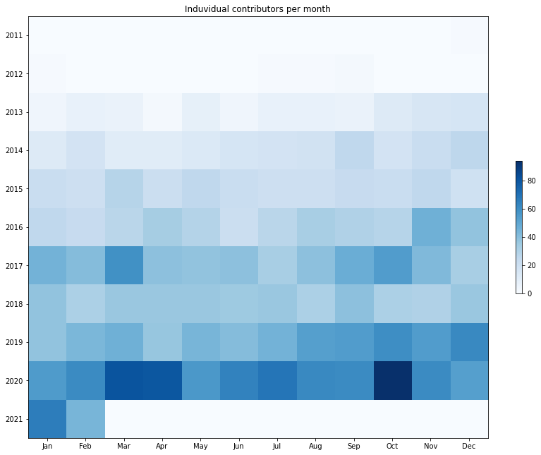
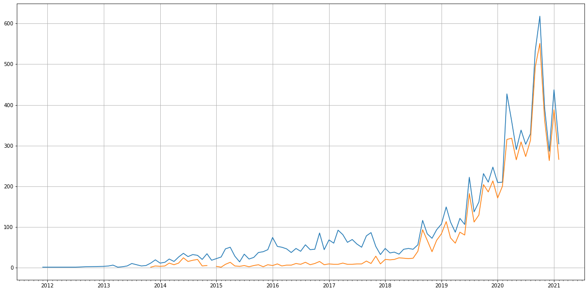
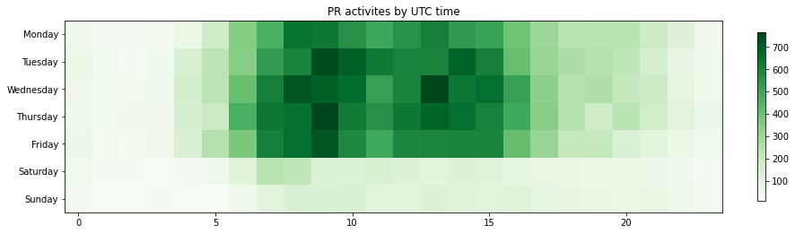

Latest record from the dataset:

<table border="1" class="dataframe">
  <thead>
    <tr style="text-align: right;">
      <th></th>
      <th>org</th>
      <th>repo</th>
      <th>type</th>
      <th>identifier</th>
      <th>subidentifier</th>
      <th>date</th>
      <th>author</th>
      <th>owner</th>
      <th>project</th>
    </tr>
  </thead>
  <tbody>
    <tr>
      <th>45116</th>
      <td>apache</td>
      <td>camel-website</td>
      <td>PR_REVIEW_APPROVED</td>
      <td>535</td>
      <td>NaN</td>
      <td>2021-02-14 08:36:23+00:00</td>
      <td>oscerd</td>
      <td>davsclaus</td>
      <td>camel</td>
    </tr>
  </tbody>
</table>

# Github Contributions per user

<table border="1" class="dataframe">
  <thead>
    <tr style="text-align: right;">
      <th></th>
      <th>contributions</th>
    </tr>
    <tr>
      <th>author</th>
      <th></th>
    </tr>
  </thead>
  <tbody>
    <tr>
      <th>oscerd</th>
      <td>10169</td>
    </tr>
    <tr>
      <th>davsclaus</th>
      <td>5172</td>
    </tr>
    <tr>
      <th>lburgazzoli</th>
      <td>1424</td>
    </tr>
    <tr>
      <th>zregvart</th>
      <td>1155</td>
    </tr>
    <tr>
      <th>ppalaga</th>
      <td>1040</td>
    </tr>
    <tr>
      <th>nicolaferraro</th>
      <td>873</td>
    </tr>
    <tr>
      <th>astefanutti</th>
      <td>549</td>
    </tr>
    <tr>
      <th>asf-ci</th>
      <td>505</td>
    </tr>
    <tr>
      <th>jamesnetherton</th>
      <td>466</td>
    </tr>
    <tr>
      <th>asfgit</th>
      <td>421</td>
    </tr>
  </tbody>
</table>

## Contributors per participations in PRs which are not created by self (helping PRs)

<table border="1" class="dataframe">
  <thead>
    <tr style="text-align: right;">
      <th></th>
      <th>identifier</th>
    </tr>
    <tr>
      <th>author</th>
      <th></th>
    </tr>
  </thead>
  <tbody>
    <tr>
      <th>oscerd</th>
      <td>4084</td>
    </tr>
    <tr>
      <th>davsclaus</th>
      <td>2556</td>
    </tr>
    <tr>
      <th>lburgazzoli</th>
      <td>600</td>
    </tr>
    <tr>
      <th>ppalaga</th>
      <td>516</td>
    </tr>
    <tr>
      <th>zregvart</th>
      <td>424</td>
    </tr>
    <tr>
      <th>nicolaferraro</th>
      <td>421</td>
    </tr>
    <tr>
      <th>asfgit</th>
      <td>418</td>
    </tr>
    <tr>
      <th>jamesnetherton</th>
      <td>314</td>
    </tr>
    <tr>
      <th>asf-ci</th>
      <td>269</td>
    </tr>
    <tr>
      <th>astefanutti</th>
      <td>207</td>
    </tr>
    <tr>
      <th>onderson</th>
      <td>152</td>
    </tr>
    <tr>
      <th>omarsmak</th>
      <td>110</td>
    </tr>
    <tr>
      <th>dmvolod</th>
      <td>108</td>
    </tr>
    <tr>
      <th>aldettinger</th>
      <td>90</td>
    </tr>
    <tr>
      <th>valdar</th>
      <td>87</td>
    </tr>
    <tr>
      <th>WillemJiang</th>
      <td>68</td>
    </tr>
    <tr>
      <th>bedlaj</th>
      <td>39</td>
    </tr>
    <tr>
      <th>orpiske</th>
      <td>31</td>
    </tr>
    <tr>
      <th>djencks</th>
      <td>29</td>
    </tr>
    <tr>
      <th>apupier</th>
      <td>26</td>
    </tr>
  </tbody>
</table>

## Contributors per participations in any PRs

<table border="1" class="dataframe">
  <thead>
    <tr style="text-align: right;">
      <th></th>
      <th>identifier</th>
    </tr>
    <tr>
      <th>author</th>
      <th></th>
    </tr>
  </thead>
  <tbody>
    <tr>
      <th>oscerd</th>
      <td>4245</td>
    </tr>
    <tr>
      <th>davsclaus</th>
      <td>2655</td>
    </tr>
    <tr>
      <th>lburgazzoli</th>
      <td>1245</td>
    </tr>
    <tr>
      <th>ppalaga</th>
      <td>910</td>
    </tr>
    <tr>
      <th>nicolaferraro</th>
      <td>719</td>
    </tr>
    <tr>
      <th>jamesnetherton</th>
      <td>695</td>
    </tr>
    <tr>
      <th>github-actions</th>
      <td>609</td>
    </tr>
    <tr>
      <th>zregvart</th>
      <td>598</td>
    </tr>
    <tr>
      <th>astefanutti</th>
      <td>445</td>
    </tr>
    <tr>
      <th>asfgit</th>
      <td>418</td>
    </tr>
    <tr>
      <th>orpiske</th>
      <td>408</td>
    </tr>
    <tr>
      <th>onderson</th>
      <td>273</td>
    </tr>
    <tr>
      <th>asf-ci</th>
      <td>269</td>
    </tr>
    <tr>
      <th>omarsmak</th>
      <td>214</td>
    </tr>
    <tr>
      <th>valdar</th>
      <td>211</td>
    </tr>
    <tr>
      <th>aldettinger</th>
      <td>202</td>
    </tr>
    <tr>
      <th>dmvolod</th>
      <td>193</td>
    </tr>
    <tr>
      <th>AemieJ</th>
      <td>123</td>
    </tr>
    <tr>
      <th>apupier</th>
      <td>117</td>
    </tr>
    <tr>
      <th>PascalSchumacher</th>
      <td>113</td>
    </tr>
  </tbody>
</table>

# Bus factor (number of contributors responsible for the 50% of the prs) from last half year

## Contributors until the half of the all contributions

<table border="1" class="dataframe">
  <thead>
    <tr style="text-align: right;">
      <th></th>
      <th>author</th>
      <th>identifier</th>
      <th>cs</th>
      <th>ratio</th>
    </tr>
  </thead>
  <tbody>
    <tr>
      <th>0</th>
      <td>oscerd</td>
      <td>593</td>
      <td>593</td>
      <td>21.415674</td>
    </tr>
    <tr>
      <th>1</th>
      <td>github-actions</td>
      <td>468</td>
      <td>1061</td>
      <td>16.901408</td>
    </tr>
    <tr>
      <th>2</th>
      <td>orpiske</td>
      <td>289</td>
      <td>1350</td>
      <td>10.436981</td>
    </tr>
  </tbody>
</table>

## Pony number (bus factor)

    4

## Dev power (All the contributions in the ration of the top contributor)

    4.66947723440135

    

    

## People with created PRs > reviewed/commented PRS

    

    

## Same graph with focusing to the last 6 month

Only contributors with both created pr and helped pr visible

    

    

# Number of individual contributors per month

Number of different Github users who either created PR, commented PR, added review to a PR

Note: only events from apache/hadoop-ozone repository are included. Earlier PRs/comments are not here.

    

    

# Number of PRs closed/created per month

    /usr/lib/python3.9/site-packages/pandas/core/arrays/datetimes.py:1101: UserWarning: Converting to PeriodArray/Index representation will drop timezone information.
      warnings.warn(

    

    

# PR activity heatmap

    

    

