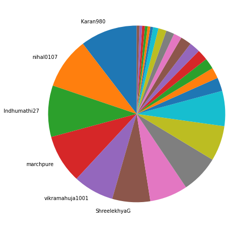
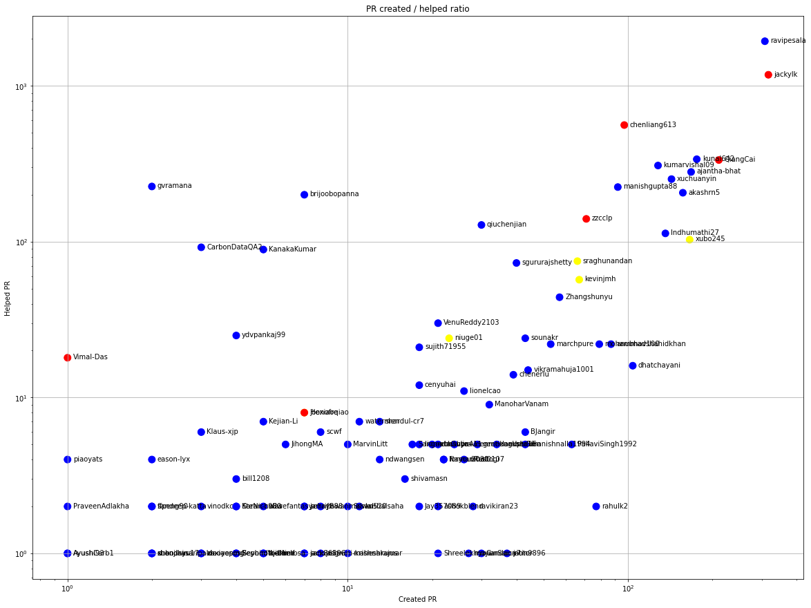
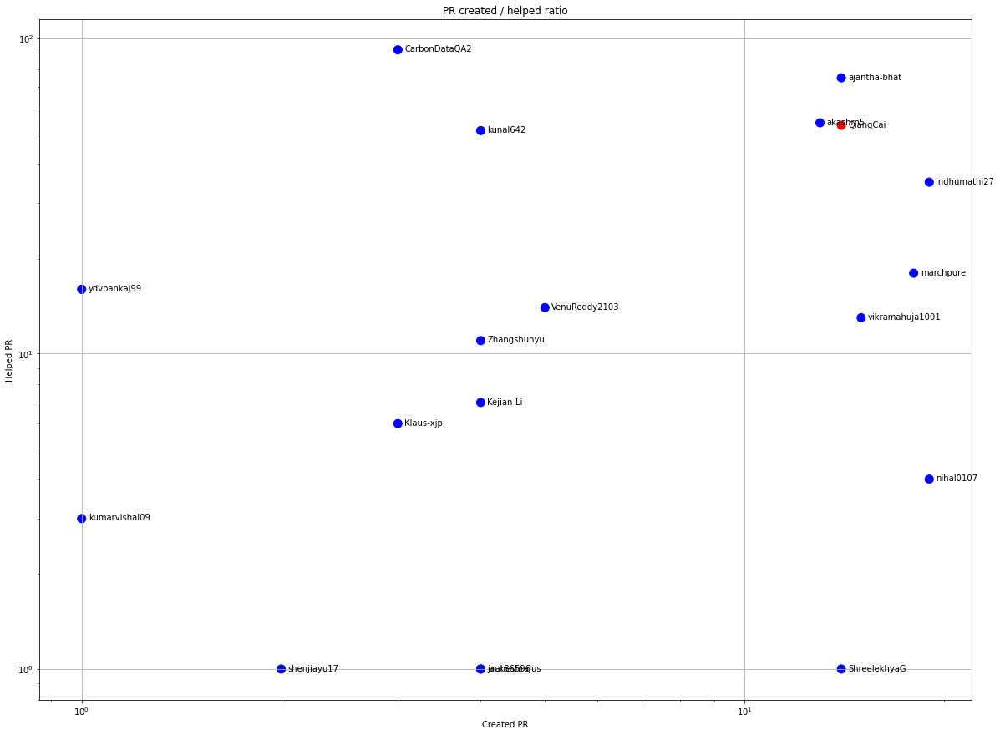
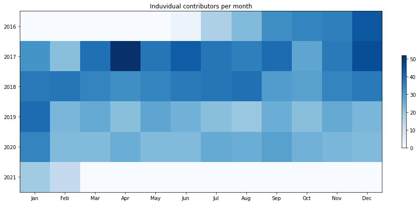
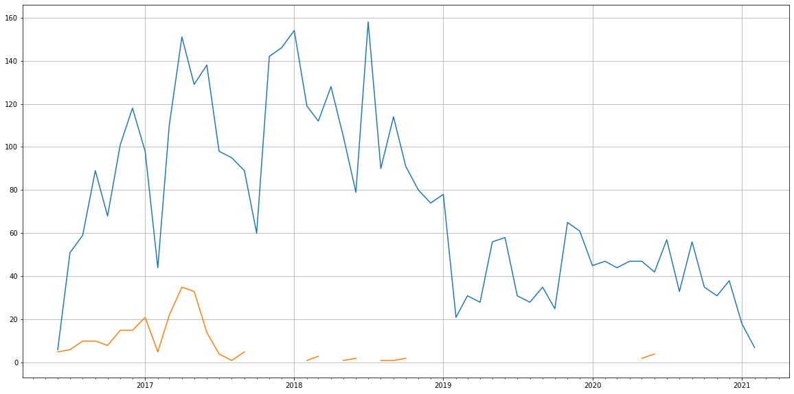
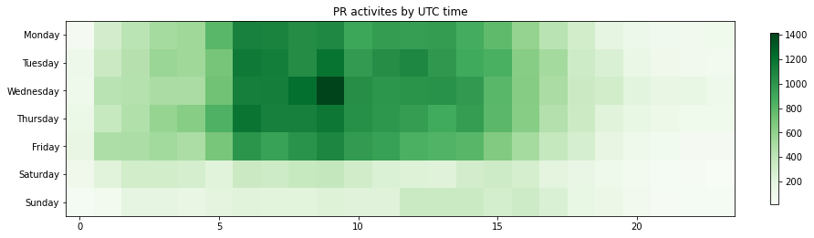

Latest record from the dataset:

<table border="1" class="dataframe">
  <thead>
    <tr style="text-align: right;">
      <th></th>
      <th>org</th>
      <th>repo</th>
      <th>type</th>
      <th>identifier</th>
      <th>subidentifier</th>
      <th>date</th>
      <th>author</th>
      <th>owner</th>
      <th>project</th>
    </tr>
  </thead>
  <tbody>
    <tr>
      <th>75723</th>
      <td>apache</td>
      <td>carbondata</td>
      <td>PR_COMMENTED</td>
      <td>4088</td>
      <td>NaN</td>
      <td>2021-02-12 15:17:13+00:00</td>
      <td>CarbonDataQA2</td>
      <td>Karan980</td>
      <td>carbondata</td>
    </tr>
  </tbody>
</table>

# Github Contributions per user

<table border="1" class="dataframe">
  <thead>
    <tr style="text-align: right;">
      <th></th>
      <th>contributions</th>
    </tr>
    <tr>
      <th>author</th>
      <th></th>
    </tr>
  </thead>
  <tbody>
    <tr>
      <th>CarbonDataQA</th>
      <td>31799</td>
    </tr>
    <tr>
      <th>ravipesala</th>
      <td>8721</td>
    </tr>
    <tr>
      <th>CarbonDataQA1</th>
      <td>6438</td>
    </tr>
    <tr>
      <th>jackylk</th>
      <td>3921</td>
    </tr>
    <tr>
      <th>asfbot</th>
      <td>1804</td>
    </tr>
    <tr>
      <th>asfgit</th>
      <td>1345</td>
    </tr>
    <tr>
      <th>ajantha-bhat</th>
      <td>1271</td>
    </tr>
    <tr>
      <th>CarbonDataQA2</th>
      <td>1257</td>
    </tr>
    <tr>
      <th>chenliang613</th>
      <td>1115</td>
    </tr>
    <tr>
      <th>kunal642</th>
      <td>789</td>
    </tr>
  </tbody>
</table>

## Contributors per participations in PRs which are not created by self (helping PRs)

<table border="1" class="dataframe">
  <thead>
    <tr style="text-align: right;">
      <th></th>
      <th>identifier</th>
    </tr>
    <tr>
      <th>author</th>
      <th></th>
    </tr>
  </thead>
  <tbody>
    <tr>
      <th>CarbonDataQA</th>
      <td>3015</td>
    </tr>
    <tr>
      <th>ravipesala</th>
      <td>1932</td>
    </tr>
    <tr>
      <th>jackylk</th>
      <td>1177</td>
    </tr>
    <tr>
      <th>CarbonDataQA1</th>
      <td>628</td>
    </tr>
    <tr>
      <th>chenliang613</th>
      <td>560</td>
    </tr>
    <tr>
      <th>asfgit</th>
      <td>488</td>
    </tr>
    <tr>
      <th>kunal642</th>
      <td>338</td>
    </tr>
    <tr>
      <th>QiangCai</th>
      <td>334</td>
    </tr>
    <tr>
      <th>asfbot</th>
      <td>312</td>
    </tr>
    <tr>
      <th>kumarvishal09</th>
      <td>308</td>
    </tr>
    <tr>
      <th>ajantha-bhat</th>
      <td>280</td>
    </tr>
    <tr>
      <th>xuchuanyin</th>
      <td>252</td>
    </tr>
    <tr>
      <th>gvramana</th>
      <td>226</td>
    </tr>
    <tr>
      <th>manishgupta88</th>
      <td>224</td>
    </tr>
    <tr>
      <th>akashrn5</th>
      <td>206</td>
    </tr>
    <tr>
      <th>brijoobopanna</th>
      <td>200</td>
    </tr>
    <tr>
      <th>zzcclp</th>
      <td>140</td>
    </tr>
    <tr>
      <th>qiuchenjian</th>
      <td>128</td>
    </tr>
    <tr>
      <th>Indhumathi27</th>
      <td>113</td>
    </tr>
    <tr>
      <th>xubo245</th>
      <td>103</td>
    </tr>
  </tbody>
</table>

## Contributors per participations in any PRs

<table border="1" class="dataframe">
  <thead>
    <tr style="text-align: right;">
      <th></th>
      <th>identifier</th>
    </tr>
    <tr>
      <th>author</th>
      <th></th>
    </tr>
  </thead>
  <tbody>
    <tr>
      <th>CarbonDataQA</th>
      <td>3015</td>
    </tr>
    <tr>
      <th>ravipesala</th>
      <td>2240</td>
    </tr>
    <tr>
      <th>jackylk</th>
      <td>1494</td>
    </tr>
    <tr>
      <th>chenliang613</th>
      <td>656</td>
    </tr>
    <tr>
      <th>CarbonDataQA1</th>
      <td>628</td>
    </tr>
    <tr>
      <th>QiangCai</th>
      <td>545</td>
    </tr>
    <tr>
      <th>kunal642</th>
      <td>514</td>
    </tr>
    <tr>
      <th>asfgit</th>
      <td>488</td>
    </tr>
    <tr>
      <th>ajantha-bhat</th>
      <td>448</td>
    </tr>
    <tr>
      <th>kumarvishal09</th>
      <td>436</td>
    </tr>
    <tr>
      <th>xuchuanyin</th>
      <td>395</td>
    </tr>
    <tr>
      <th>akashrn5</th>
      <td>363</td>
    </tr>
    <tr>
      <th>manishgupta88</th>
      <td>316</td>
    </tr>
    <tr>
      <th>asfbot</th>
      <td>312</td>
    </tr>
    <tr>
      <th>xubo245</th>
      <td>269</td>
    </tr>
    <tr>
      <th>Indhumathi27</th>
      <td>249</td>
    </tr>
    <tr>
      <th>gvramana</th>
      <td>228</td>
    </tr>
    <tr>
      <th>zzcclp</th>
      <td>211</td>
    </tr>
    <tr>
      <th>brijoobopanna</th>
      <td>207</td>
    </tr>
    <tr>
      <th>qiuchenjian</th>
      <td>158</td>
    </tr>
  </tbody>
</table>

# Bus factor (number of contributors responsible for the 50% of the prs) from last half year

## Contributors until the half of the all contributions

<table border="1" class="dataframe">
  <thead>
    <tr style="text-align: right;">
      <th></th>
      <th>author</th>
      <th>identifier</th>
      <th>cs</th>
      <th>ratio</th>
    </tr>
  </thead>
  <tbody>
    <tr>
      <th>0</th>
      <td>Karan980</td>
      <td>21</td>
      <td>21</td>
      <td>10.396040</td>
    </tr>
    <tr>
      <th>1</th>
      <td>nihal0107</td>
      <td>19</td>
      <td>40</td>
      <td>9.405941</td>
    </tr>
    <tr>
      <th>2</th>
      <td>Indhumathi27</td>
      <td>19</td>
      <td>59</td>
      <td>9.405941</td>
    </tr>
    <tr>
      <th>3</th>
      <td>marchpure</td>
      <td>18</td>
      <td>77</td>
      <td>8.910891</td>
    </tr>
    <tr>
      <th>4</th>
      <td>vikramahuja1001</td>
      <td>15</td>
      <td>92</td>
      <td>7.425743</td>
    </tr>
  </tbody>
</table>

## Pony number (bus factor)

    6

## Dev power (All the contributions in the ration of the top contributor)

    9.619047619047617

    

    

## People with created PRs > reviewed/commented PRS

    

    

## Same graph with focusing to the last 6 month

Only contributors with both created pr and helped pr visible

    

    

# Number of individual contributors per month

Number of different Github users who either created PR, commented PR, added review to a PR

Note: only events from apache/hadoop-ozone repository are included. Earlier PRs/comments are not here.

    

    

# Number of PRs closed/created per month

    /usr/lib/python3.9/site-packages/pandas/core/arrays/datetimes.py:1101: UserWarning: Converting to PeriodArray/Index representation will drop timezone information.
      warnings.warn(

    

    

# PR activity heatmap

    

    

