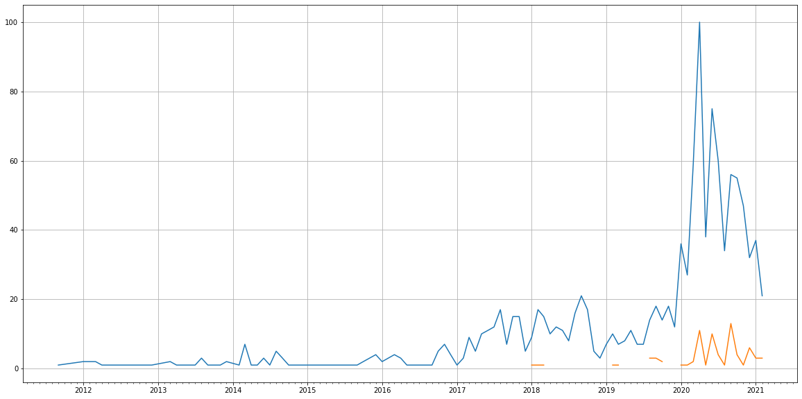

Latest record from the dataset:

<table border="1" class="dataframe">
  <thead>
    <tr style="text-align: right;">
      <th></th>
      <th>org</th>
      <th>repo</th>
      <th>type</th>
      <th>identifier</th>
      <th>subidentifier</th>
      <th>date</th>
      <th>author</th>
      <th>owner</th>
      <th>project</th>
    </tr>
  </thead>
  <tbody>
    <tr>
      <th>4086</th>
      <td>apache</td>
      <td>cassandra</td>
      <td>PR_REVIEW_COMMENTED</td>
      <td>891</td>
      <td>NaN</td>
      <td>2021-02-14 01:39:43+00:00</td>
      <td>yifan-c</td>
      <td>jacek-lewandowski</td>
      <td>cassandra</td>
    </tr>
  </tbody>
</table>

# Github Contributions per user

<table border="1" class="dataframe">
  <thead>
    <tr style="text-align: right;">
      <th></th>
      <th>contributions</th>
    </tr>
    <tr>
      <th>author</th>
      <th></th>
    </tr>
  </thead>
  <tbody>
    <tr>
      <th>maedhroz</th>
      <td>280</td>
    </tr>
    <tr>
      <th>dcapwell</th>
      <td>186</td>
    </tr>
    <tr>
      <th>michaelsembwever</th>
      <td>185</td>
    </tr>
    <tr>
      <th>aweisberg</th>
      <td>163</td>
    </tr>
    <tr>
      <th>adelapena</th>
      <td>157</td>
    </tr>
    <tr>
      <th>blerer</th>
      <td>69</td>
    </tr>
    <tr>
      <th>dineshjoshi</th>
      <td>57</td>
    </tr>
    <tr>
      <th>yifan-c</th>
      <td>55</td>
    </tr>
    <tr>
      <th>ifesdjeen</th>
      <td>52</td>
    </tr>
    <tr>
      <th>belliottsmith</th>
      <td>44</td>
    </tr>
  </tbody>
</table>

## Contributors per participations in PRs which are not created by self (helping PRs)

<table border="1" class="dataframe">
  <thead>
    <tr style="text-align: right;">
      <th></th>
      <th>identifier</th>
    </tr>
    <tr>
      <th>author</th>
      <th></th>
    </tr>
  </thead>
  <tbody>
    <tr>
      <th>michaelsembwever</th>
      <td>65</td>
    </tr>
    <tr>
      <th>dcapwell</th>
      <td>60</td>
    </tr>
    <tr>
      <th>ifesdjeen</th>
      <td>31</td>
    </tr>
    <tr>
      <th>blerer</th>
      <td>31</td>
    </tr>
    <tr>
      <th>dineshjoshi</th>
      <td>30</td>
    </tr>
    <tr>
      <th>adelapena</th>
      <td>29</td>
    </tr>
    <tr>
      <th>jeffjirsa</th>
      <td>27</td>
    </tr>
    <tr>
      <th>maedhroz</th>
      <td>25</td>
    </tr>
    <tr>
      <th>krummas</th>
      <td>24</td>
    </tr>
    <tr>
      <th>yifan-c</th>
      <td>19</td>
    </tr>
    <tr>
      <th>jfarrell</th>
      <td>18</td>
    </tr>
    <tr>
      <th>nastra</th>
      <td>16</td>
    </tr>
    <tr>
      <th>aweisberg</th>
      <td>15</td>
    </tr>
    <tr>
      <th>JeremiahDJordan</th>
      <td>15</td>
    </tr>
    <tr>
      <th>belliottsmith</th>
      <td>15</td>
    </tr>
    <tr>
      <th>mshuler</th>
      <td>14</td>
    </tr>
    <tr>
      <th>clohfink</th>
      <td>11</td>
    </tr>
    <tr>
      <th>ptnapoleon</th>
      <td>11</td>
    </tr>
    <tr>
      <th>bereng</th>
      <td>11</td>
    </tr>
    <tr>
      <th>spodkowinski</th>
      <td>10</td>
    </tr>
  </tbody>
</table>

## Contributors per participations in any PRs

<table border="1" class="dataframe">
  <thead>
    <tr style="text-align: right;">
      <th></th>
      <th>identifier</th>
    </tr>
    <tr>
      <th>author</th>
      <th></th>
    </tr>
  </thead>
  <tbody>
    <tr>
      <th>dcapwell</th>
      <td>121</td>
    </tr>
    <tr>
      <th>michaelsembwever</th>
      <td>77</td>
    </tr>
    <tr>
      <th>ifesdjeen</th>
      <td>76</td>
    </tr>
    <tr>
      <th>bereng</th>
      <td>75</td>
    </tr>
    <tr>
      <th>yifan-c</th>
      <td>61</td>
    </tr>
    <tr>
      <th>maedhroz</th>
      <td>61</td>
    </tr>
    <tr>
      <th>adelapena</th>
      <td>61</td>
    </tr>
    <tr>
      <th>blerer</th>
      <td>53</td>
    </tr>
    <tr>
      <th>smiklosovic</th>
      <td>52</td>
    </tr>
    <tr>
      <th>clohfink</th>
      <td>45</td>
    </tr>
    <tr>
      <th>jonmeredith</th>
      <td>42</td>
    </tr>
    <tr>
      <th>jasonstack</th>
      <td>38</td>
    </tr>
    <tr>
      <th>dineshjoshi</th>
      <td>38</td>
    </tr>
    <tr>
      <th>krummas</th>
      <td>34</td>
    </tr>
    <tr>
      <th>nastra</th>
      <td>33</td>
    </tr>
    <tr>
      <th>aweisberg</th>
      <td>31</td>
    </tr>
    <tr>
      <th>jeffjirsa</th>
      <td>30</td>
    </tr>
    <tr>
      <th>snazy</th>
      <td>26</td>
    </tr>
    <tr>
      <th>ekaterinadimitrova2</th>
      <td>24</td>
    </tr>
    <tr>
      <th>Gerrrr</th>
      <td>22</td>
    </tr>
  </tbody>
</table>

# Bus factor (number of contributors responsible for the 50% of the prs) from last half year

## Contributors until the half of the all contributions

<table border="1" class="dataframe">
  <thead>
    <tr style="text-align: right;">
      <th></th>
      <th>author</th>
      <th>identifier</th>
      <th>cs</th>
      <th>ratio</th>
    </tr>
  </thead>
  <tbody>
    <tr>
      <th>0</th>
      <td>bereng</td>
      <td>27</td>
      <td>27</td>
      <td>10.037175</td>
    </tr>
    <tr>
      <th>1</th>
      <td>ifesdjeen</td>
      <td>24</td>
      <td>51</td>
      <td>8.921933</td>
    </tr>
    <tr>
      <th>2</th>
      <td>maedhroz</td>
      <td>23</td>
      <td>74</td>
      <td>8.550186</td>
    </tr>
    <tr>
      <th>3</th>
      <td>smiklosovic</td>
      <td>22</td>
      <td>96</td>
      <td>8.178439</td>
    </tr>
    <tr>
      <th>4</th>
      <td>blerer</td>
      <td>20</td>
      <td>116</td>
      <td>7.434944</td>
    </tr>
    <tr>
      <th>5</th>
      <td>yifan-c</td>
      <td>17</td>
      <td>133</td>
      <td>6.319703</td>
    </tr>
  </tbody>
</table>

## Pony number (bus factor)

    7

## Dev power (All the contributions in the ration of the top contributor)

    9.962962962962957

    

    

## People with created PRs > reviewed/commented PRS

    

    

## Same graph with focusing to the last 6 month

Only contributors with both created pr and helped pr visible

    

    

# Number of individual contributors per month

Number of different Github users who either created PR, commented PR, added review to a PR

Note: only events from apache/hadoop-ozone repository are included. Earlier PRs/comments are not here.

    

    

# Number of PRs closed/created per month

    /usr/lib/python3.9/site-packages/pandas/core/arrays/datetimes.py:1101: UserWarning: Converting to PeriodArray/Index representation will drop timezone information.
      warnings.warn(

    

    

# PR activity heatmap

    

    

