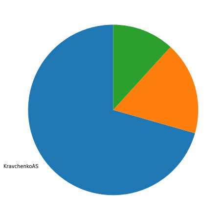
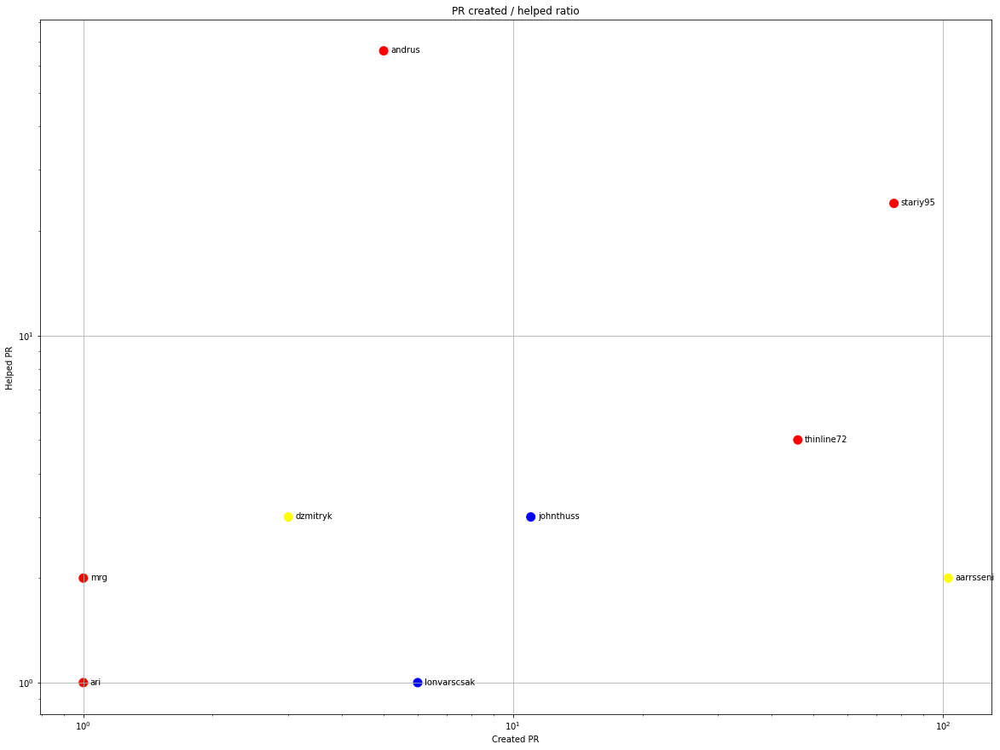
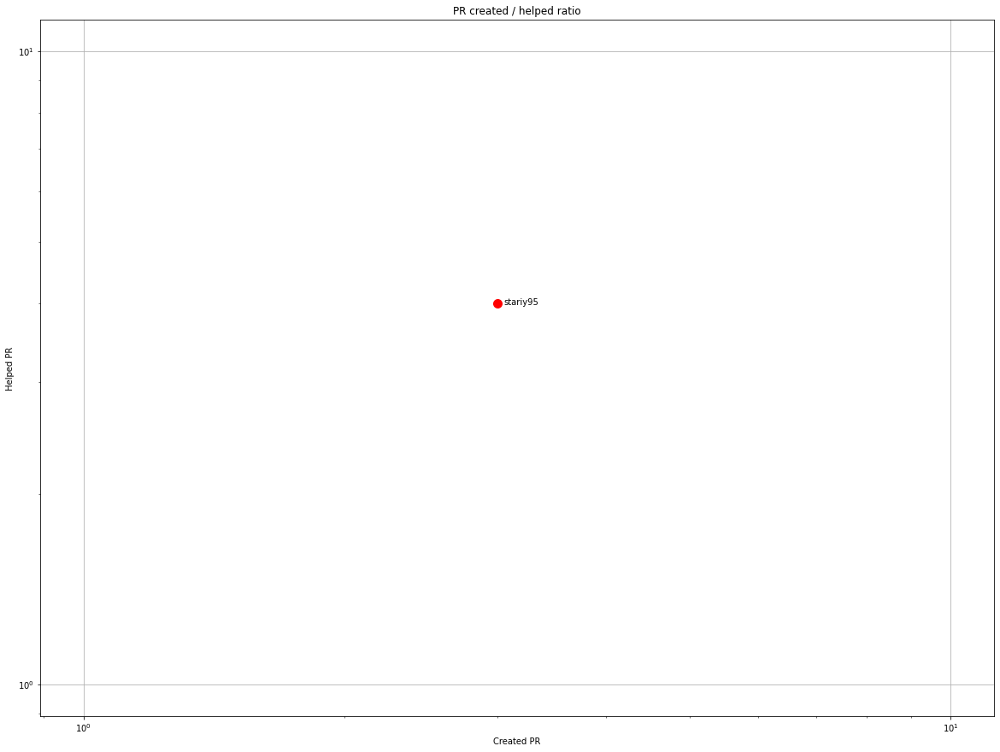
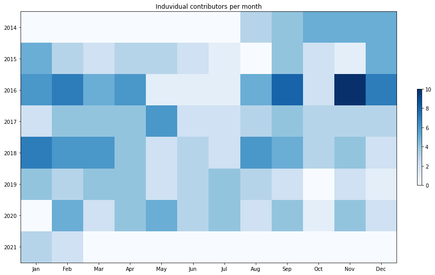
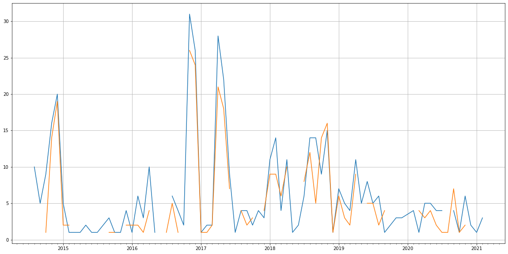
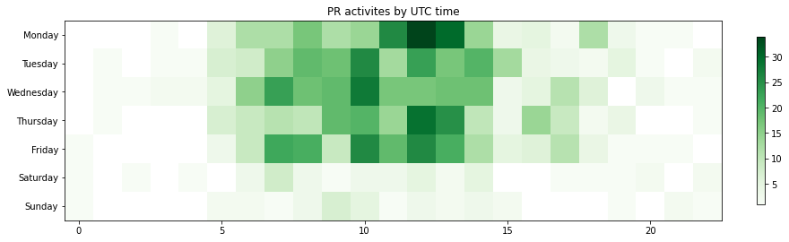

Latest record from the dataset:

<table border="1" class="dataframe">
  <thead>
    <tr style="text-align: right;">
      <th></th>
      <th>org</th>
      <th>repo</th>
      <th>type</th>
      <th>identifier</th>
      <th>subidentifier</th>
      <th>date</th>
      <th>author</th>
      <th>owner</th>
      <th>project</th>
    </tr>
  </thead>
  <tbody>
    <tr>
      <th>887</th>
      <td>apache</td>
      <td>cayenne</td>
      <td>PR_CREATED</td>
      <td>448</td>
      <td>NaN</td>
      <td>2021-02-08 12:53:46+00:00</td>
      <td>KravchenkoAS</td>
      <td>KravchenkoAS</td>
      <td>cayenne</td>
    </tr>
  </tbody>
</table>

# Github Contributions per user

<table border="1" class="dataframe">
  <thead>
    <tr style="text-align: right;">
      <th></th>
      <th>contributions</th>
    </tr>
    <tr>
      <th>author</th>
      <th></th>
    </tr>
  </thead>
  <tbody>
    <tr>
      <th>asfgit</th>
      <td>305</td>
    </tr>
    <tr>
      <th>andrus</th>
      <td>83</td>
    </tr>
    <tr>
      <th>asfbot</th>
      <td>77</td>
    </tr>
    <tr>
      <th>stariy95</th>
      <td>39</td>
    </tr>
    <tr>
      <th>thinline72</th>
      <td>6</td>
    </tr>
    <tr>
      <th>aarrsseni</th>
      <td>5</td>
    </tr>
    <tr>
      <th>johnthuss</th>
      <td>4</td>
    </tr>
    <tr>
      <th>ben-manes</th>
      <td>3</td>
    </tr>
    <tr>
      <th>dzmitryk</th>
      <td>3</td>
    </tr>
    <tr>
      <th>lonvarscsak</th>
      <td>2</td>
    </tr>
  </tbody>
</table>

## Contributors per participations in PRs which are not created by self (helping PRs)

<table border="1" class="dataframe">
  <thead>
    <tr style="text-align: right;">
      <th></th>
      <th>identifier</th>
    </tr>
    <tr>
      <th>author</th>
      <th></th>
    </tr>
  </thead>
  <tbody>
    <tr>
      <th>asfgit</th>
      <td>306</td>
    </tr>
    <tr>
      <th>andrus</th>
      <td>66</td>
    </tr>
    <tr>
      <th>asfbot</th>
      <td>53</td>
    </tr>
    <tr>
      <th>stariy95</th>
      <td>24</td>
    </tr>
    <tr>
      <th>thinline72</th>
      <td>5</td>
    </tr>
    <tr>
      <th>dzmitryk</th>
      <td>3</td>
    </tr>
    <tr>
      <th>johnthuss</th>
      <td>3</td>
    </tr>
    <tr>
      <th>aarrsseni</th>
      <td>2</td>
    </tr>
    <tr>
      <th>ben-manes</th>
      <td>2</td>
    </tr>
    <tr>
      <th>mrg</th>
      <td>2</td>
    </tr>
    <tr>
      <th>ari</th>
      <td>1</td>
    </tr>
    <tr>
      <th>lonvarscsak</th>
      <td>1</td>
    </tr>
    <tr>
      <th>mkienenb</th>
      <td>1</td>
    </tr>
    <tr>
      <th>peter-hvass</th>
      <td>1</td>
    </tr>
  </tbody>
</table>

## Contributors per participations in any PRs

<table border="1" class="dataframe">
  <thead>
    <tr style="text-align: right;">
      <th></th>
      <th>identifier</th>
    </tr>
    <tr>
      <th>author</th>
      <th></th>
    </tr>
  </thead>
  <tbody>
    <tr>
      <th>asfgit</th>
      <td>306</td>
    </tr>
    <tr>
      <th>aarrsseni</th>
      <td>105</td>
    </tr>
    <tr>
      <th>stariy95</th>
      <td>101</td>
    </tr>
    <tr>
      <th>andrus</th>
      <td>71</td>
    </tr>
    <tr>
      <th>asfbot</th>
      <td>53</td>
    </tr>
    <tr>
      <th>thinline72</th>
      <td>51</td>
    </tr>
    <tr>
      <th>nismooooooo</th>
      <td>41</td>
    </tr>
    <tr>
      <th>AlexKolonitsky</th>
      <td>25</td>
    </tr>
    <tr>
      <th>const1993</th>
      <td>23</td>
    </tr>
    <tr>
      <th>MegaPapa</th>
      <td>22</td>
    </tr>
    <tr>
      <th>KravchenkoAS</th>
      <td>15</td>
    </tr>
    <tr>
      <th>johnthuss</th>
      <td>14</td>
    </tr>
    <tr>
      <th>ollybondareva</th>
      <td>12</td>
    </tr>
    <tr>
      <th>lonvarscsak</th>
      <td>7</td>
    </tr>
    <tr>
      <th>dzmitryk</th>
      <td>6</td>
    </tr>
    <tr>
      <th>atomashpolskiy</th>
      <td>6</td>
    </tr>
    <tr>
      <th>sarvaratchagan</th>
      <td>5</td>
    </tr>
    <tr>
      <th>AbleOne</th>
      <td>4</td>
    </tr>
    <tr>
      <th>mattraydub</th>
      <td>3</td>
    </tr>
    <tr>
      <th>laakhbeenor</th>
      <td>3</td>
    </tr>
  </tbody>
</table>

# Bus factor (number of contributors responsible for the 50% of the prs) from last half year

## Contributors until the half of the all contributions

<table border="1" class="dataframe">
  <thead>
    <tr style="text-align: right;">
      <th></th>
      <th>author</th>
      <th>identifier</th>
      <th>cs</th>
      <th>ratio</th>
    </tr>
  </thead>
  <tbody>
  </tbody>
</table>

## Pony number (bus factor)

    1

## Dev power (All the contributions in the ration of the top contributor)

    1.4166666666666667

    

    

## People with created PRs > reviewed/commented PRS

    

    

## Same graph with focusing to the last 6 month

Only contributors with both created pr and helped pr visible

    

    

# Number of individual contributors per month

Number of different Github users who either created PR, commented PR, added review to a PR

Note: only events from apache/hadoop-ozone repository are included. Earlier PRs/comments are not here.

    

    

# Number of PRs closed/created per month

    /usr/lib/python3.9/site-packages/pandas/core/arrays/datetimes.py:1101: UserWarning: Converting to PeriodArray/Index representation will drop timezone information.
      warnings.warn(

    

    

# PR activity heatmap

    

    

