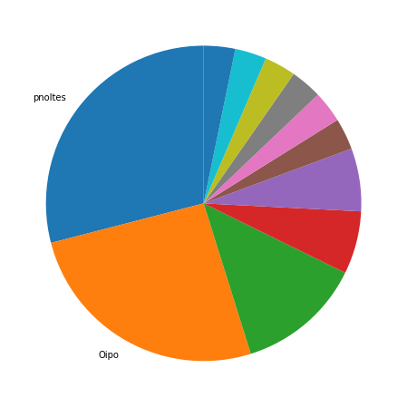
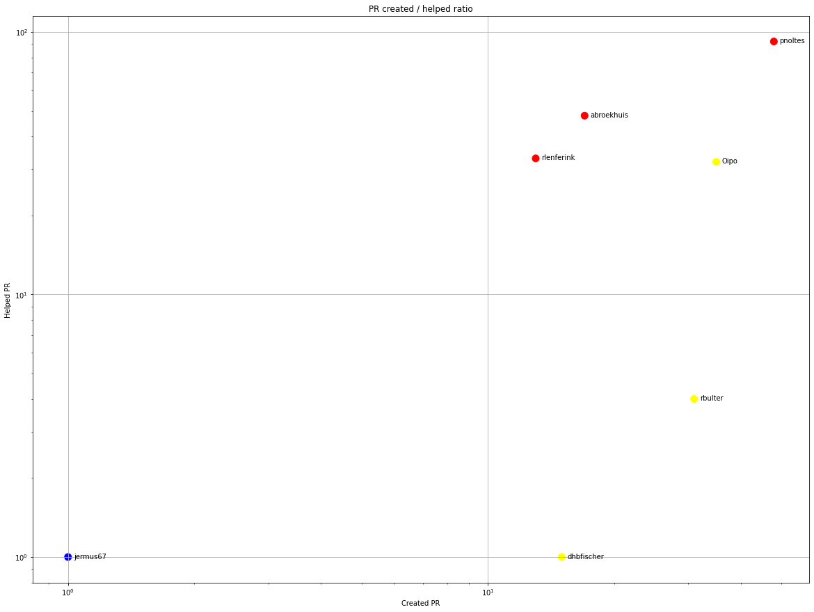
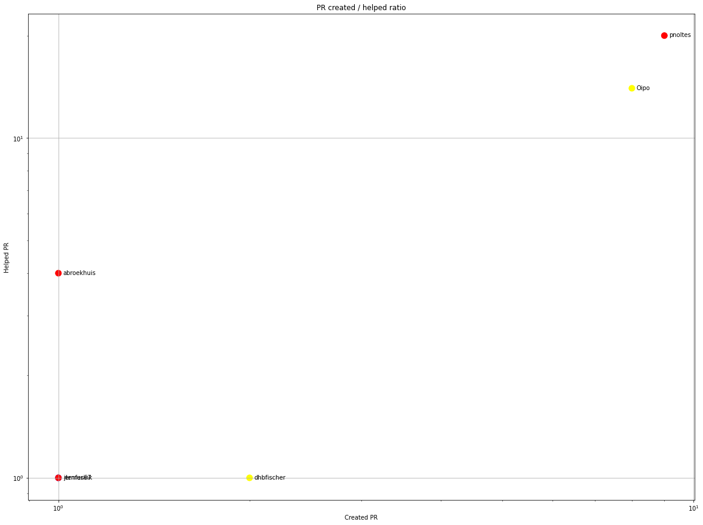
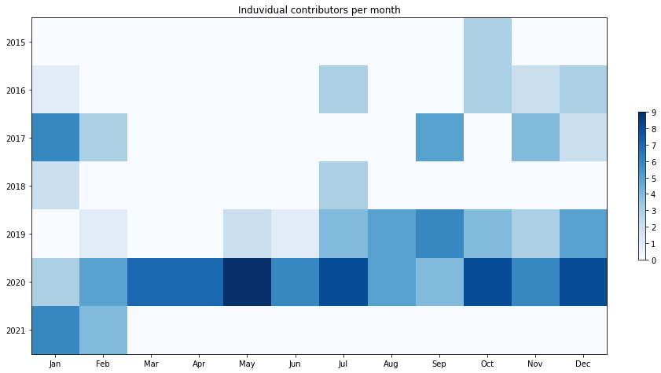
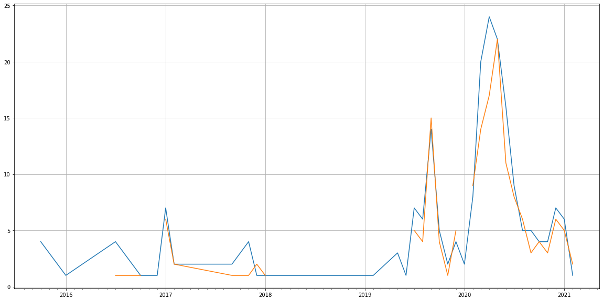
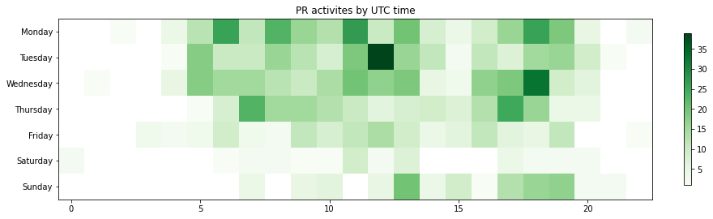

Latest record from the dataset:

<table border="1" class="dataframe">
  <thead>
    <tr style="text-align: right;">
      <th></th>
      <th>org</th>
      <th>repo</th>
      <th>type</th>
      <th>identifier</th>
      <th>subidentifier</th>
      <th>date</th>
      <th>author</th>
      <th>owner</th>
      <th>project</th>
    </tr>
  </thead>
  <tbody>
    <tr>
      <th>1005</th>
      <td>apache</td>
      <td>celix</td>
      <td>PR_MERGED</td>
      <td>313</td>
      <td>NaN</td>
      <td>2021-02-09 19:22:14+00:00</td>
      <td>pnoltes</td>
      <td>pnoltes</td>
      <td>celix</td>
    </tr>
  </tbody>
</table>

# Github Contributions per user

<table border="1" class="dataframe">
  <thead>
    <tr style="text-align: right;">
      <th></th>
      <th>contributions</th>
    </tr>
    <tr>
      <th>author</th>
      <th></th>
    </tr>
  </thead>
  <tbody>
    <tr>
      <th>pnoltes</th>
      <td>186</td>
    </tr>
    <tr>
      <th>abroekhuis</th>
      <td>120</td>
    </tr>
    <tr>
      <th>Oipo</th>
      <td>97</td>
    </tr>
    <tr>
      <th>rlenferink</th>
      <td>65</td>
    </tr>
    <tr>
      <th>coveralls</th>
      <td>43</td>
    </tr>
    <tr>
      <th>codecov-commenter</th>
      <td>20</td>
    </tr>
    <tr>
      <th>codecov-io</th>
      <td>16</td>
    </tr>
    <tr>
      <th>asfgit</th>
      <td>15</td>
    </tr>
    <tr>
      <th>Webserver28</th>
      <td>7</td>
    </tr>
    <tr>
      <th>rbulter</th>
      <td>6</td>
    </tr>
  </tbody>
</table>

## Contributors per participations in PRs which are not created by self (helping PRs)

<table border="1" class="dataframe">
  <thead>
    <tr style="text-align: right;">
      <th></th>
      <th>identifier</th>
    </tr>
    <tr>
      <th>author</th>
      <th></th>
    </tr>
  </thead>
  <tbody>
    <tr>
      <th>pnoltes</th>
      <td>92</td>
    </tr>
    <tr>
      <th>abroekhuis</th>
      <td>48</td>
    </tr>
    <tr>
      <th>rlenferink</th>
      <td>33</td>
    </tr>
    <tr>
      <th>Oipo</th>
      <td>32</td>
    </tr>
    <tr>
      <th>codecov-commenter</th>
      <td>20</td>
    </tr>
    <tr>
      <th>coveralls</th>
      <td>18</td>
    </tr>
    <tr>
      <th>asfgit</th>
      <td>15</td>
    </tr>
    <tr>
      <th>codecov-io</th>
      <td>15</td>
    </tr>
    <tr>
      <th>Webserver28</th>
      <td>6</td>
    </tr>
    <tr>
      <th>rbulter</th>
      <td>4</td>
    </tr>
    <tr>
      <th>netlify</th>
      <td>3</td>
    </tr>
    <tr>
      <th>sveldhuis</th>
      <td>2</td>
    </tr>
    <tr>
      <th>mdelangthales</th>
      <td>2</td>
    </tr>
    <tr>
      <th>pjw</th>
      <td>1</td>
    </tr>
    <tr>
      <th>jermus67</th>
      <td>1</td>
    </tr>
    <tr>
      <th>dhbfischer</th>
      <td>1</td>
    </tr>
    <tr>
      <th>glimmerveen</th>
      <td>1</td>
    </tr>
  </tbody>
</table>

## Contributors per participations in any PRs

<table border="1" class="dataframe">
  <thead>
    <tr style="text-align: right;">
      <th></th>
      <th>identifier</th>
    </tr>
    <tr>
      <th>author</th>
      <th></th>
    </tr>
  </thead>
  <tbody>
    <tr>
      <th>pnoltes</th>
      <td>140</td>
    </tr>
    <tr>
      <th>Oipo</th>
      <td>67</td>
    </tr>
    <tr>
      <th>abroekhuis</th>
      <td>65</td>
    </tr>
    <tr>
      <th>rlenferink</th>
      <td>46</td>
    </tr>
    <tr>
      <th>rbulter</th>
      <td>35</td>
    </tr>
    <tr>
      <th>codecov-commenter</th>
      <td>20</td>
    </tr>
    <tr>
      <th>coveralls</th>
      <td>18</td>
    </tr>
    <tr>
      <th>dhbfischer</th>
      <td>16</td>
    </tr>
    <tr>
      <th>asfgit</th>
      <td>15</td>
    </tr>
    <tr>
      <th>codecov-io</th>
      <td>15</td>
    </tr>
    <tr>
      <th>ErjanAltena</th>
      <td>11</td>
    </tr>
    <tr>
      <th>idzardh</th>
      <td>7</td>
    </tr>
    <tr>
      <th>ESmink</th>
      <td>6</td>
    </tr>
    <tr>
      <th>Webserver28</th>
      <td>6</td>
    </tr>
    <tr>
      <th>PengZheng</th>
      <td>4</td>
    </tr>
    <tr>
      <th>bpetri</th>
      <td>3</td>
    </tr>
    <tr>
      <th>netlify</th>
      <td>3</td>
    </tr>
    <tr>
      <th>gerritbinnenmars</th>
      <td>2</td>
    </tr>
    <tr>
      <th>sveldhuis</th>
      <td>2</td>
    </tr>
    <tr>
      <th>unitink72</th>
      <td>2</td>
    </tr>
  </tbody>
</table>

# Bus factor (number of contributors responsible for the 50% of the prs) from last half year

## Contributors until the half of the all contributions

<table border="1" class="dataframe">
  <thead>
    <tr style="text-align: right;">
      <th></th>
      <th>author</th>
      <th>identifier</th>
      <th>cs</th>
      <th>ratio</th>
    </tr>
  </thead>
  <tbody>
    <tr>
      <th>0</th>
      <td>pnoltes</td>
      <td>9</td>
      <td>9</td>
      <td>29.032258</td>
    </tr>
  </tbody>
</table>

## Pony number (bus factor)

    2

## Dev power (All the contributions in the ration of the top contributor)

    3.444444444444444

    

    

## People with created PRs > reviewed/commented PRS

    

    

## Same graph with focusing to the last 6 month

Only contributors with both created pr and helped pr visible

    

    

# Number of individual contributors per month

Number of different Github users who either created PR, commented PR, added review to a PR

Note: only events from apache/hadoop-ozone repository are included. Earlier PRs/comments are not here.

    

    

# Number of PRs closed/created per month

    /usr/lib/python3.9/site-packages/pandas/core/arrays/datetimes.py:1101: UserWarning: Converting to PeriodArray/Index representation will drop timezone information.
      warnings.warn(

    

    

# PR activity heatmap

    

    

