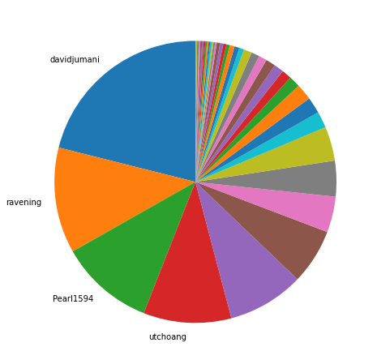
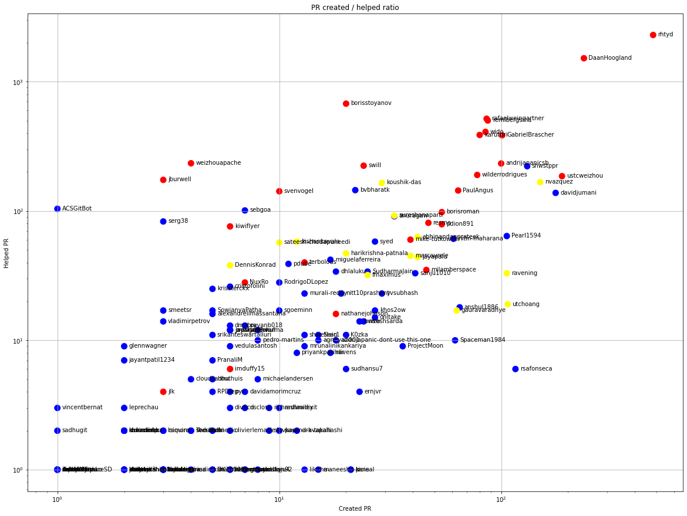
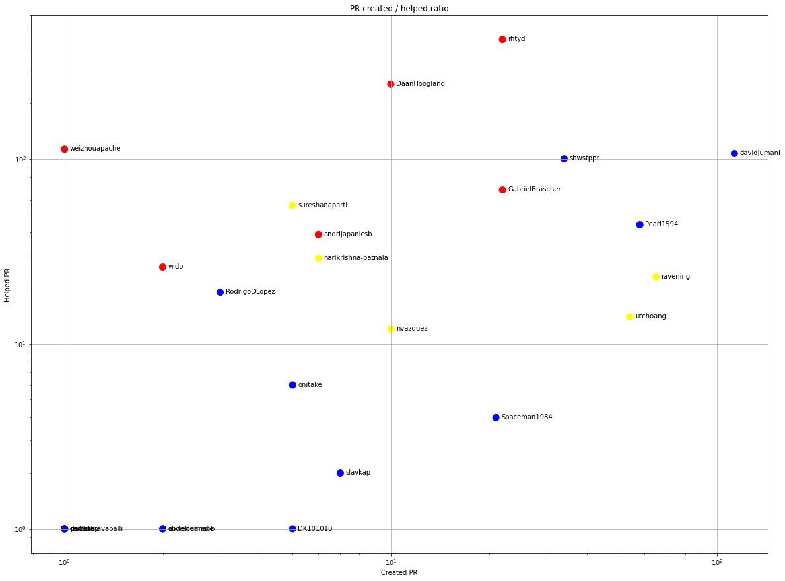
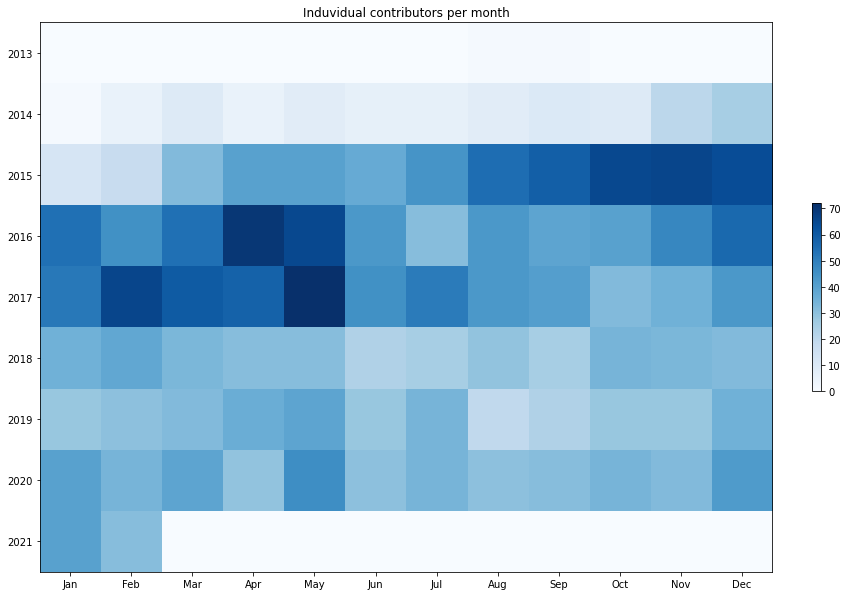
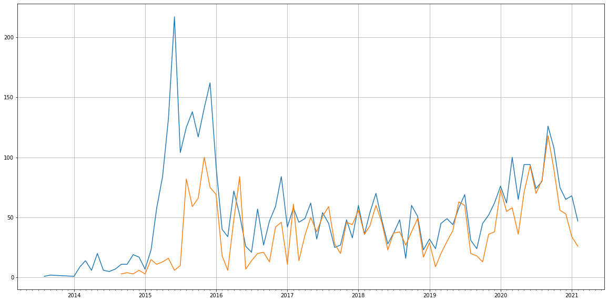
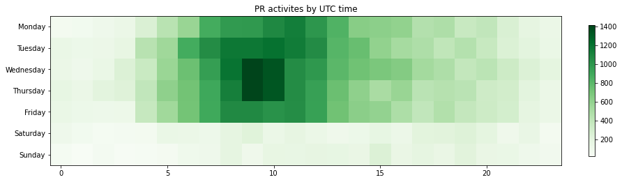

Latest record from the dataset:

<table border="1" class="dataframe">
  <thead>
    <tr style="text-align: right;">
      <th></th>
      <th>org</th>
      <th>repo</th>
      <th>type</th>
      <th>identifier</th>
      <th>subidentifier</th>
      <th>date</th>
      <th>author</th>
      <th>owner</th>
      <th>project</th>
    </tr>
  </thead>
  <tbody>
    <tr>
      <th>58586</th>
      <td>apache</td>
      <td>cloudstack</td>
      <td>PR_COMMENTED</td>
      <td>4543</td>
      <td>NaN</td>
      <td>2021-02-14 08:53:37+00:00</td>
      <td>blueorangutan</td>
      <td>DaanHoogland</td>
      <td>cloudstack</td>
    </tr>
  </tbody>
</table>

# Github Contributions per user

<table border="1" class="dataframe">
  <thead>
    <tr style="text-align: right;">
      <th></th>
      <th>contributions</th>
    </tr>
    <tr>
      <th>author</th>
      <th></th>
    </tr>
  </thead>
  <tbody>
    <tr>
      <th>blueorangutan</th>
      <td>17062</td>
    </tr>
    <tr>
      <th>rhtyd</th>
      <td>10488</td>
    </tr>
    <tr>
      <th>DaanHoogland</th>
      <td>4423</td>
    </tr>
    <tr>
      <th>asfbot</th>
      <td>2701</td>
    </tr>
    <tr>
      <th>borisstoyanov</th>
      <td>2117</td>
    </tr>
    <tr>
      <th>rafaelweingartner</th>
      <td>1646</td>
    </tr>
    <tr>
      <th>remibergsma</th>
      <td>1038</td>
    </tr>
    <tr>
      <th>swill</th>
      <td>1017</td>
    </tr>
    <tr>
      <th>asfgit</th>
      <td>955</td>
    </tr>
    <tr>
      <th>andrijapanicsb</th>
      <td>861</td>
    </tr>
  </tbody>
</table>

## Contributors per participations in PRs which are not created by self (helping PRs)

<table border="1" class="dataframe">
  <thead>
    <tr style="text-align: right;">
      <th></th>
      <th>identifier</th>
    </tr>
    <tr>
      <th>author</th>
      <th></th>
    </tr>
  </thead>
  <tbody>
    <tr>
      <th>rhtyd</th>
      <td>2296</td>
    </tr>
    <tr>
      <th>blueorangutan</th>
      <td>1969</td>
    </tr>
    <tr>
      <th>DaanHoogland</th>
      <td>1518</td>
    </tr>
    <tr>
      <th>asfgit</th>
      <td>942</td>
    </tr>
    <tr>
      <th>asfbot</th>
      <td>793</td>
    </tr>
    <tr>
      <th>borisstoyanov</th>
      <td>676</td>
    </tr>
    <tr>
      <th>rafaelweingartner</th>
      <td>517</td>
    </tr>
    <tr>
      <th>remibergsma</th>
      <td>501</td>
    </tr>
    <tr>
      <th>wido</th>
      <td>409</td>
    </tr>
    <tr>
      <th>karuturi</th>
      <td>387</td>
    </tr>
    <tr>
      <th>GabrielBrascher</th>
      <td>385</td>
    </tr>
    <tr>
      <th>cloudmonger</th>
      <td>254</td>
    </tr>
    <tr>
      <th>weizhouapache</th>
      <td>234</td>
    </tr>
    <tr>
      <th>andrijapanicsb</th>
      <td>233</td>
    </tr>
    <tr>
      <th>swill</th>
      <td>224</td>
    </tr>
    <tr>
      <th>shwstppr</th>
      <td>222</td>
    </tr>
    <tr>
      <th>wilderrodrigues</th>
      <td>190</td>
    </tr>
    <tr>
      <th>ustcweizhou</th>
      <td>186</td>
    </tr>
    <tr>
      <th>jburwell</th>
      <td>174</td>
    </tr>
    <tr>
      <th>nvazquez</th>
      <td>167</td>
    </tr>
  </tbody>
</table>

## Contributors per participations in any PRs

<table border="1" class="dataframe">
  <thead>
    <tr style="text-align: right;">
      <th></th>
      <th>identifier</th>
    </tr>
    <tr>
      <th>author</th>
      <th></th>
    </tr>
  </thead>
  <tbody>
    <tr>
      <th>rhtyd</th>
      <td>2731</td>
    </tr>
    <tr>
      <th>blueorangutan</th>
      <td>1969</td>
    </tr>
    <tr>
      <th>DaanHoogland</th>
      <td>1750</td>
    </tr>
    <tr>
      <th>asfgit</th>
      <td>942</td>
    </tr>
    <tr>
      <th>asfbot</th>
      <td>793</td>
    </tr>
    <tr>
      <th>borisstoyanov</th>
      <td>696</td>
    </tr>
    <tr>
      <th>rafaelweingartner</th>
      <td>601</td>
    </tr>
    <tr>
      <th>remibergsma</th>
      <td>588</td>
    </tr>
    <tr>
      <th>wido</th>
      <td>494</td>
    </tr>
    <tr>
      <th>GabrielBrascher</th>
      <td>485</td>
    </tr>
    <tr>
      <th>karuturi</th>
      <td>459</td>
    </tr>
    <tr>
      <th>ustcweizhou</th>
      <td>374</td>
    </tr>
    <tr>
      <th>shwstppr</th>
      <td>352</td>
    </tr>
    <tr>
      <th>andrijapanicsb</th>
      <td>326</td>
    </tr>
    <tr>
      <th>nvazquez</th>
      <td>317</td>
    </tr>
    <tr>
      <th>davidjumani</th>
      <td>314</td>
    </tr>
    <tr>
      <th>wilderrodrigues</th>
      <td>268</td>
    </tr>
    <tr>
      <th>cloudmonger</th>
      <td>254</td>
    </tr>
    <tr>
      <th>swill</th>
      <td>244</td>
    </tr>
    <tr>
      <th>weizhouapache</th>
      <td>238</td>
    </tr>
  </tbody>
</table>

# Bus factor (number of contributors responsible for the 50% of the prs) from last half year

## Contributors until the half of the all contributions

<table border="1" class="dataframe">
  <thead>
    <tr style="text-align: right;">
      <th></th>
      <th>author</th>
      <th>identifier</th>
      <th>cs</th>
      <th>ratio</th>
    </tr>
  </thead>
  <tbody>
    <tr>
      <th>0</th>
      <td>davidjumani</td>
      <td>113</td>
      <td>113</td>
      <td>21.082090</td>
    </tr>
    <tr>
      <th>1</th>
      <td>ravening</td>
      <td>65</td>
      <td>178</td>
      <td>12.126866</td>
    </tr>
    <tr>
      <th>2</th>
      <td>Pearl1594</td>
      <td>58</td>
      <td>236</td>
      <td>10.820896</td>
    </tr>
  </tbody>
</table>

## Pony number (bus factor)

    4

## Dev power (All the contributions in the ration of the top contributor)

    4.743362831858409

    

    

## People with created PRs > reviewed/commented PRS

    

    

## Same graph with focusing to the last 6 month

Only contributors with both created pr and helped pr visible

    

    

# Number of individual contributors per month

Number of different Github users who either created PR, commented PR, added review to a PR

Note: only events from apache/hadoop-ozone repository are included. Earlier PRs/comments are not here.

    

    

# Number of PRs closed/created per month

    /usr/lib/python3.9/site-packages/pandas/core/arrays/datetimes.py:1101: UserWarning: Converting to PeriodArray/Index representation will drop timezone information.
      warnings.warn(

    

    

# PR activity heatmap

    

    

