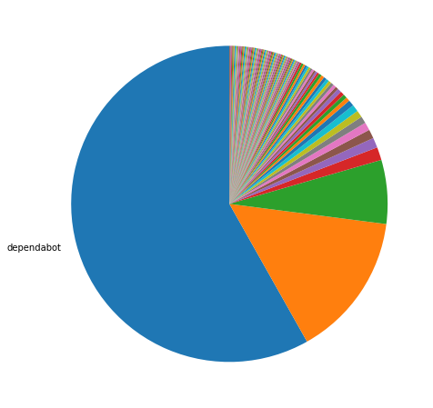
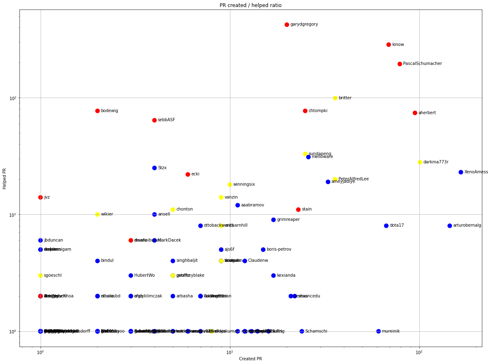
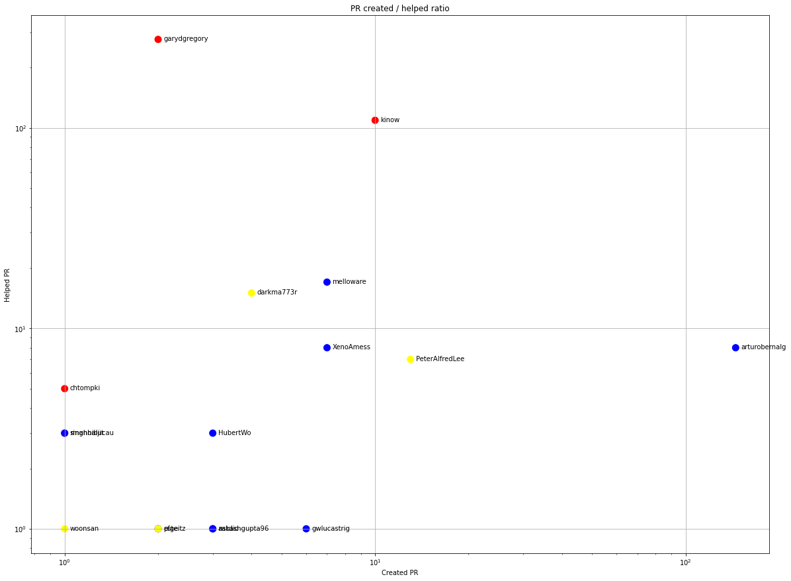
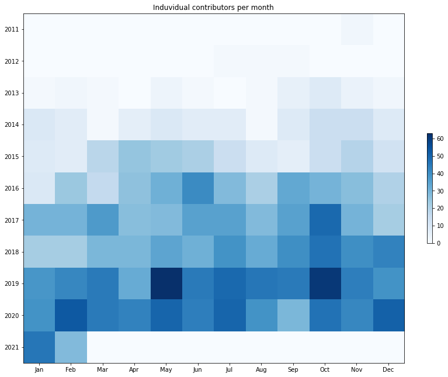
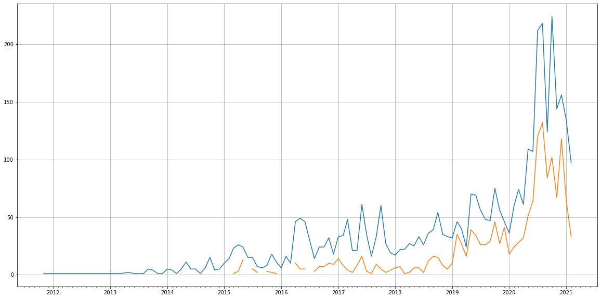
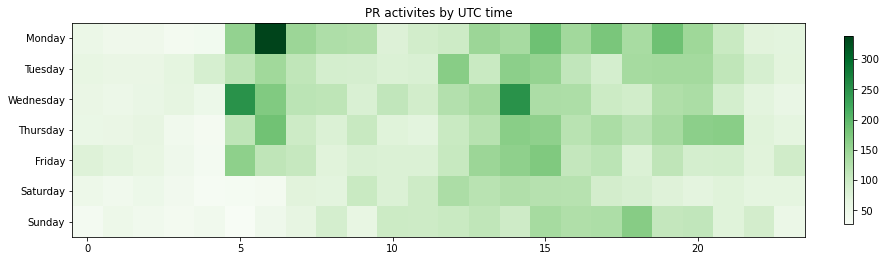

Latest record from the dataset:

<table border="1" class="dataframe">
  <thead>
    <tr style="text-align: right;">
      <th></th>
      <th>org</th>
      <th>repo</th>
      <th>type</th>
      <th>identifier</th>
      <th>subidentifier</th>
      <th>date</th>
      <th>author</th>
      <th>owner</th>
      <th>project</th>
    </tr>
  </thead>
  <tbody>
    <tr>
      <th>6370</th>
      <td>apache</td>
      <td>commons-imaging</td>
      <td>PR_COMMENTED</td>
      <td>120</td>
      <td>NaN</td>
      <td>2021-02-12 10:54:34+00:00</td>
      <td>dependabot</td>
      <td>dependabot</td>
      <td>commons</td>
    </tr>
  </tbody>
</table>

# Github Contributions per user

<table border="1" class="dataframe">
  <thead>
    <tr style="text-align: right;">
      <th></th>
      <th>contributions</th>
    </tr>
    <tr>
      <th>author</th>
      <th></th>
    </tr>
  </thead>
  <tbody>
    <tr>
      <th>garydgregory</th>
      <td>2205</td>
    </tr>
    <tr>
      <th>coveralls</th>
      <td>2125</td>
    </tr>
    <tr>
      <th>kinow</th>
      <td>1017</td>
    </tr>
    <tr>
      <th>asfgit</th>
      <td>430</td>
    </tr>
    <tr>
      <th>PascalSchumacher</th>
      <td>375</td>
    </tr>
    <tr>
      <th>britter</th>
      <td>258</td>
    </tr>
    <tr>
      <th>aherbert</th>
      <td>257</td>
    </tr>
    <tr>
      <th>chtompki</th>
      <td>185</td>
    </tr>
    <tr>
      <th>bodewig</th>
      <td>181</td>
    </tr>
    <tr>
      <th>sebbASF</th>
      <td>154</td>
    </tr>
  </tbody>
</table>

## Contributors per participations in PRs which are not created by self (helping PRs)

<table border="1" class="dataframe">
  <thead>
    <tr style="text-align: right;">
      <th></th>
      <th>identifier</th>
    </tr>
    <tr>
      <th>author</th>
      <th></th>
    </tr>
  </thead>
  <tbody>
    <tr>
      <th>coveralls</th>
      <td>625</td>
    </tr>
    <tr>
      <th>garydgregory</th>
      <td>421</td>
    </tr>
    <tr>
      <th>kinow</th>
      <td>284</td>
    </tr>
    <tr>
      <th>PascalSchumacher</th>
      <td>194</td>
    </tr>
    <tr>
      <th>asfgit</th>
      <td>183</td>
    </tr>
    <tr>
      <th>britter</th>
      <td>99</td>
    </tr>
    <tr>
      <th>chtompki</th>
      <td>77</td>
    </tr>
    <tr>
      <th>bodewig</th>
      <td>77</td>
    </tr>
    <tr>
      <th>aherbert</th>
      <td>74</td>
    </tr>
    <tr>
      <th>sebbASF</th>
      <td>64</td>
    </tr>
    <tr>
      <th>jochenw</th>
      <td>48</td>
    </tr>
    <tr>
      <th>michael-o</th>
      <td>41</td>
    </tr>
    <tr>
      <th>sundapeng</th>
      <td>33</td>
    </tr>
    <tr>
      <th>melloware</th>
      <td>31</td>
    </tr>
    <tr>
      <th>darkma773r</th>
      <td>28</td>
    </tr>
    <tr>
      <th>lukaszlenart</th>
      <td>28</td>
    </tr>
    <tr>
      <th>Stzx</th>
      <td>25</td>
    </tr>
    <tr>
      <th>henrib</th>
      <td>24</td>
    </tr>
    <tr>
      <th>markt-asf</th>
      <td>23</td>
    </tr>
    <tr>
      <th>XenoAmess</th>
      <td>23</td>
    </tr>
  </tbody>
</table>

## Contributors per participations in any PRs

<table border="1" class="dataframe">
  <thead>
    <tr style="text-align: right;">
      <th></th>
      <th>identifier</th>
    </tr>
    <tr>
      <th>author</th>
      <th></th>
    </tr>
  </thead>
  <tbody>
    <tr>
      <th>coveralls</th>
      <td>625</td>
    </tr>
    <tr>
      <th>garydgregory</th>
      <td>427</td>
    </tr>
    <tr>
      <th>kinow</th>
      <td>303</td>
    </tr>
    <tr>
      <th>dependabot</th>
      <td>253</td>
    </tr>
    <tr>
      <th>PascalSchumacher</th>
      <td>251</td>
    </tr>
    <tr>
      <th>asfgit</th>
      <td>183</td>
    </tr>
    <tr>
      <th>XenoAmess</th>
      <td>154</td>
    </tr>
    <tr>
      <th>arturobernalg</th>
      <td>126</td>
    </tr>
    <tr>
      <th>britter</th>
      <td>119</td>
    </tr>
    <tr>
      <th>aherbert</th>
      <td>115</td>
    </tr>
    <tr>
      <th>darkma773r</th>
      <td>110</td>
    </tr>
    <tr>
      <th>chtompki</th>
      <td>87</td>
    </tr>
    <tr>
      <th>bodewig</th>
      <td>78</td>
    </tr>
    <tr>
      <th>dota17</th>
      <td>75</td>
    </tr>
    <tr>
      <th>sebbASF</th>
      <td>67</td>
    </tr>
    <tr>
      <th>mureinik</th>
      <td>62</td>
    </tr>
    <tr>
      <th>nhojpatrick</th>
      <td>60</td>
    </tr>
    <tr>
      <th>sundapeng</th>
      <td>58</td>
    </tr>
    <tr>
      <th>melloware</th>
      <td>54</td>
    </tr>
    <tr>
      <th>jochenw</th>
      <td>48</td>
    </tr>
  </tbody>
</table>

# Bus factor (number of contributors responsible for the 50% of the prs) from last half year

## Contributors until the half of the all contributions

<table border="1" class="dataframe">
  <thead>
    <tr style="text-align: right;">
      <th></th>
      <th>author</th>
      <th>identifier</th>
      <th>cs</th>
      <th>ratio</th>
    </tr>
  </thead>
  <tbody>
  </tbody>
</table>

## Pony number (bus factor)

    1

## Dev power (All the contributions in the ration of the top contributor)

    1.7192982456140353

    

    

## People with created PRs > reviewed/commented PRS

    

    

## Same graph with focusing to the last 6 month

Only contributors with both created pr and helped pr visible

    

    

# Number of individual contributors per month

Number of different Github users who either created PR, commented PR, added review to a PR

Note: only events from apache/hadoop-ozone repository are included. Earlier PRs/comments are not here.

    

    

# Number of PRs closed/created per month

    /usr/lib/python3.9/site-packages/pandas/core/arrays/datetimes.py:1101: UserWarning: Converting to PeriodArray/Index representation will drop timezone information.
      warnings.warn(

    

    

# PR activity heatmap

    

    

