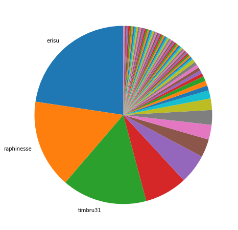

Latest record from the dataset:

<table border="1" class="dataframe">
  <thead>
    <tr style="text-align: right;">
      <th></th>
      <th>org</th>
      <th>repo</th>
      <th>type</th>
      <th>identifier</th>
      <th>subidentifier</th>
      <th>date</th>
      <th>author</th>
      <th>owner</th>
      <th>project</th>
    </tr>
  </thead>
  <tbody>
    <tr>
      <th>29022</th>
      <td>apache</td>
      <td>cordova-plugin-file</td>
      <td>PR_CREATED</td>
      <td>457</td>
      <td>NaN</td>
      <td>2021-02-12 06:27:41+00:00</td>
      <td>Durzan666</td>
      <td>Durzan666</td>
      <td>cordova</td>
    </tr>
  </tbody>
</table>

# Github Contributions per user

<table border="1" class="dataframe">
  <thead>
    <tr style="text-align: right;">
      <th></th>
      <th>contributions</th>
    </tr>
    <tr>
      <th>author</th>
      <th></th>
    </tr>
  </thead>
  <tbody>
    <tr>
      <th>asfgit</th>
      <td>1893</td>
    </tr>
    <tr>
      <th>janpio</th>
      <td>1743</td>
    </tr>
    <tr>
      <th>shazron</th>
      <td>1032</td>
    </tr>
    <tr>
      <th>erisu</th>
      <td>1030</td>
    </tr>
    <tr>
      <th>codecov-io</th>
      <td>928</td>
    </tr>
    <tr>
      <th>cordova-qa</th>
      <td>927</td>
    </tr>
    <tr>
      <th>purplecabbage</th>
      <td>807</td>
    </tr>
    <tr>
      <th>brodybits</th>
      <td>797</td>
    </tr>
    <tr>
      <th>stevengill</th>
      <td>760</td>
    </tr>
    <tr>
      <th>dpogue</th>
      <td>743</td>
    </tr>
  </tbody>
</table>

## Contributors per participations in PRs which are not created by self (helping PRs)

<table border="1" class="dataframe">
  <thead>
    <tr style="text-align: right;">
      <th></th>
      <th>identifier</th>
    </tr>
    <tr>
      <th>author</th>
      <th></th>
    </tr>
  </thead>
  <tbody>
    <tr>
      <th>codecov-io</th>
      <td>665</td>
    </tr>
    <tr>
      <th>erisu</th>
      <td>510</td>
    </tr>
    <tr>
      <th>asfgit</th>
      <td>469</td>
    </tr>
    <tr>
      <th>janpio</th>
      <td>467</td>
    </tr>
    <tr>
      <th>dpogue</th>
      <td>397</td>
    </tr>
    <tr>
      <th>timbru31</th>
      <td>340</td>
    </tr>
    <tr>
      <th>stevengill</th>
      <td>336</td>
    </tr>
    <tr>
      <th>shazron</th>
      <td>317</td>
    </tr>
    <tr>
      <th>jcesarmobile</th>
      <td>269</td>
    </tr>
    <tr>
      <th>purplecabbage</th>
      <td>265</td>
    </tr>
    <tr>
      <th>cordova-qa</th>
      <td>259</td>
    </tr>
    <tr>
      <th>brodybits</th>
      <td>254</td>
    </tr>
    <tr>
      <th>nikhilkh</th>
      <td>251</td>
    </tr>
    <tr>
      <th>breautek</th>
      <td>247</td>
    </tr>
    <tr>
      <th>dblotsky</th>
      <td>244</td>
    </tr>
    <tr>
      <th>raphinesse</th>
      <td>244</td>
    </tr>
    <tr>
      <th>vladimir-kotikov</th>
      <td>218</td>
    </tr>
    <tr>
      <th>infil00p</th>
      <td>195</td>
    </tr>
    <tr>
      <th>filmaj</th>
      <td>164</td>
    </tr>
    <tr>
      <th>agrieve</th>
      <td>145</td>
    </tr>
  </tbody>
</table>

## Contributors per participations in any PRs

<table border="1" class="dataframe">
  <thead>
    <tr style="text-align: right;">
      <th></th>
      <th>identifier</th>
    </tr>
    <tr>
      <th>author</th>
      <th></th>
    </tr>
  </thead>
  <tbody>
    <tr>
      <th>erisu</th>
      <td>723</td>
    </tr>
    <tr>
      <th>codecov-io</th>
      <td>665</td>
    </tr>
    <tr>
      <th>janpio</th>
      <td>559</td>
    </tr>
    <tr>
      <th>raphinesse</th>
      <td>522</td>
    </tr>
    <tr>
      <th>brodybits</th>
      <td>470</td>
    </tr>
    <tr>
      <th>dpogue</th>
      <td>470</td>
    </tr>
    <tr>
      <th>asfgit</th>
      <td>469</td>
    </tr>
    <tr>
      <th>stevengill</th>
      <td>423</td>
    </tr>
    <tr>
      <th>timbru31</th>
      <td>414</td>
    </tr>
    <tr>
      <th>shazron</th>
      <td>411</td>
    </tr>
    <tr>
      <th>jcesarmobile</th>
      <td>370</td>
    </tr>
    <tr>
      <th>vladimir-kotikov</th>
      <td>361</td>
    </tr>
    <tr>
      <th>breautek</th>
      <td>317</td>
    </tr>
    <tr>
      <th>purplecabbage</th>
      <td>317</td>
    </tr>
    <tr>
      <th>dblotsky</th>
      <td>313</td>
    </tr>
    <tr>
      <th>nikhilkh</th>
      <td>294</td>
    </tr>
    <tr>
      <th>cordova-qa</th>
      <td>259</td>
    </tr>
    <tr>
      <th>daserge</th>
      <td>245</td>
    </tr>
    <tr>
      <th>infil00p</th>
      <td>244</td>
    </tr>
    <tr>
      <th>riknoll</th>
      <td>224</td>
    </tr>
  </tbody>
</table>

# Bus factor (number of contributors responsible for the 50% of the prs) from last half year

## Contributors until the half of the all contributions

<table border="1" class="dataframe">
  <thead>
    <tr style="text-align: right;">
      <th></th>
      <th>author</th>
      <th>identifier</th>
      <th>cs</th>
      <th>ratio</th>
    </tr>
  </thead>
  <tbody>
    <tr>
      <th>0</th>
      <td>erisu</td>
      <td>76</td>
      <td>76</td>
      <td>22.619048</td>
    </tr>
    <tr>
      <th>1</th>
      <td>raphinesse</td>
      <td>54</td>
      <td>130</td>
      <td>16.071429</td>
    </tr>
  </tbody>
</table>

## Pony number (bus factor)

    3

## Dev power (All the contributions in the ration of the top contributor)

    4.421052631578948

    

    

## People with created PRs > reviewed/commented PRS

    

    

## Same graph with focusing to the last 6 month

Only contributors with both created pr and helped pr visible

    

    

# Number of individual contributors per month

Number of different Github users who either created PR, commented PR, added review to a PR

Note: only events from apache/hadoop-ozone repository are included. Earlier PRs/comments are not here.

    

    

# Number of PRs closed/created per month

    /usr/lib/python3.9/site-packages/pandas/core/arrays/datetimes.py:1101: UserWarning: Converting to PeriodArray/Index representation will drop timezone information.
      warnings.warn(

    

    

# PR activity heatmap

    

    

