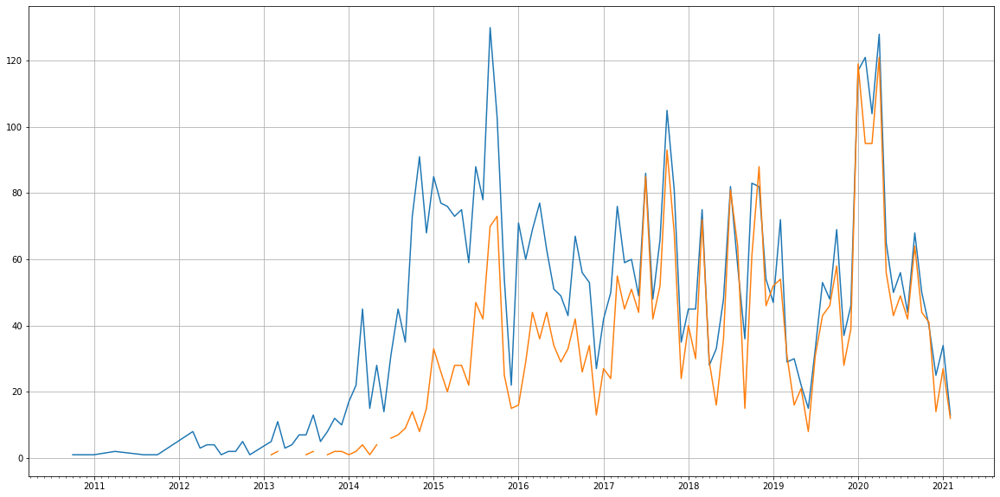

Latest record from the dataset:

<table border="1" class="dataframe">
  <thead>
    <tr style="text-align: right;">
      <th></th>
      <th>org</th>
      <th>repo</th>
      <th>type</th>
      <th>identifier</th>
      <th>subidentifier</th>
      <th>date</th>
      <th>author</th>
      <th>owner</th>
      <th>project</th>
    </tr>
  </thead>
  <tbody>
    <tr>
      <th>9310</th>
      <td>apache</td>
      <td>couchdb</td>
      <td>PR_COMMENTED</td>
      <td>3366</td>
      <td>NaN</td>
      <td>2021-02-13 00:50:37+00:00</td>
      <td>wohali</td>
      <td>rnewson</td>
      <td>couchdb</td>
    </tr>
  </tbody>
</table>

# Github Contributions per user

<table border="1" class="dataframe">
  <thead>
    <tr style="text-align: right;">
      <th></th>
      <th>contributions</th>
    </tr>
    <tr>
      <th>author</th>
      <th></th>
    </tr>
  </thead>
  <tbody>
    <tr>
      <th>wohali</th>
      <td>1610</td>
    </tr>
    <tr>
      <th>kxepal</th>
      <td>1458</td>
    </tr>
    <tr>
      <th>davisp</th>
      <td>1191</td>
    </tr>
    <tr>
      <th>garrensmith</th>
      <td>1169</td>
    </tr>
    <tr>
      <th>nickva</th>
      <td>1152</td>
    </tr>
    <tr>
      <th>rnewson</th>
      <td>1069</td>
    </tr>
    <tr>
      <th>asfgit</th>
      <td>1000</td>
    </tr>
    <tr>
      <th>robertkowalski</th>
      <td>725</td>
    </tr>
    <tr>
      <th>iilyak</th>
      <td>644</td>
    </tr>
    <tr>
      <th>janl</th>
      <td>621</td>
    </tr>
  </tbody>
</table>

## Contributors per participations in PRs which are not created by self (helping PRs)

<table border="1" class="dataframe">
  <thead>
    <tr style="text-align: right;">
      <th></th>
      <th>identifier</th>
    </tr>
    <tr>
      <th>author</th>
      <th></th>
    </tr>
  </thead>
  <tbody>
    <tr>
      <th>wohali</th>
      <td>611</td>
    </tr>
    <tr>
      <th>garrensmith</th>
      <td>607</td>
    </tr>
    <tr>
      <th>davisp</th>
      <td>496</td>
    </tr>
    <tr>
      <th>nickva</th>
      <td>473</td>
    </tr>
    <tr>
      <th>asfgit</th>
      <td>454</td>
    </tr>
    <tr>
      <th>rnewson</th>
      <td>381</td>
    </tr>
    <tr>
      <th>robertkowalski</th>
      <td>334</td>
    </tr>
    <tr>
      <th>kxepal</th>
      <td>333</td>
    </tr>
    <tr>
      <th>janl</th>
      <td>324</td>
    </tr>
    <tr>
      <th>iilyak</th>
      <td>208</td>
    </tr>
    <tr>
      <th>benkeen</th>
      <td>169</td>
    </tr>
    <tr>
      <th>eiri</th>
      <td>168</td>
    </tr>
    <tr>
      <th>michellephung</th>
      <td>158</td>
    </tr>
    <tr>
      <th>flimzy</th>
      <td>121</td>
    </tr>
    <tr>
      <th>jaydoane</th>
      <td>108</td>
    </tr>
    <tr>
      <th>tonysun83</th>
      <td>82</td>
    </tr>
    <tr>
      <th>Antonio-Maranhao</th>
      <td>77</td>
    </tr>
    <tr>
      <th>kocolosk</th>
      <td>71</td>
    </tr>
    <tr>
      <th>jiangphcn</th>
      <td>68</td>
    </tr>
    <tr>
      <th>willholley</th>
      <td>62</td>
    </tr>
  </tbody>
</table>

## Contributors per participations in any PRs

<table border="1" class="dataframe">
  <thead>
    <tr style="text-align: right;">
      <th></th>
      <th>identifier</th>
    </tr>
    <tr>
      <th>author</th>
      <th></th>
    </tr>
  </thead>
  <tbody>
    <tr>
      <th>wohali</th>
      <td>941</td>
    </tr>
    <tr>
      <th>garrensmith</th>
      <td>860</td>
    </tr>
    <tr>
      <th>nickva</th>
      <td>846</td>
    </tr>
    <tr>
      <th>davisp</th>
      <td>641</td>
    </tr>
    <tr>
      <th>robertkowalski</th>
      <td>640</td>
    </tr>
    <tr>
      <th>rnewson</th>
      <td>534</td>
    </tr>
    <tr>
      <th>janl</th>
      <td>480</td>
    </tr>
    <tr>
      <th>asfgit</th>
      <td>454</td>
    </tr>
    <tr>
      <th>iilyak</th>
      <td>439</td>
    </tr>
    <tr>
      <th>benkeen</th>
      <td>430</td>
    </tr>
    <tr>
      <th>kxepal</th>
      <td>365</td>
    </tr>
    <tr>
      <th>eiri</th>
      <td>291</td>
    </tr>
    <tr>
      <th>michellephung</th>
      <td>241</td>
    </tr>
    <tr>
      <th>jaydoane</th>
      <td>199</td>
    </tr>
    <tr>
      <th>Antonio-Maranhao</th>
      <td>192</td>
    </tr>
    <tr>
      <th>flimzy</th>
      <td>184</td>
    </tr>
    <tr>
      <th>willholley</th>
      <td>161</td>
    </tr>
    <tr>
      <th>jiangphcn</th>
      <td>148</td>
    </tr>
    <tr>
      <th>tonysun83</th>
      <td>145</td>
    </tr>
    <tr>
      <th>kocolosk</th>
      <td>133</td>
    </tr>
  </tbody>
</table>

# Bus factor (number of contributors responsible for the 50% of the prs) from last half year

## Contributors until the half of the all contributions

<table border="1" class="dataframe">
  <thead>
    <tr style="text-align: right;">
      <th></th>
      <th>author</th>
      <th>identifier</th>
      <th>cs</th>
      <th>ratio</th>
    </tr>
  </thead>
  <tbody>
    <tr>
      <th>0</th>
      <td>wohali</td>
      <td>32</td>
      <td>32</td>
      <td>12.749004</td>
    </tr>
    <tr>
      <th>1</th>
      <td>rnewson</td>
      <td>29</td>
      <td>61</td>
      <td>11.553785</td>
    </tr>
    <tr>
      <th>2</th>
      <td>nickva</td>
      <td>25</td>
      <td>86</td>
      <td>9.960159</td>
    </tr>
    <tr>
      <th>3</th>
      <td>bessbd</td>
      <td>21</td>
      <td>107</td>
      <td>8.366534</td>
    </tr>
    <tr>
      <th>4</th>
      <td>davisp</td>
      <td>18</td>
      <td>125</td>
      <td>7.171315</td>
    </tr>
  </tbody>
</table>

## Pony number (bus factor)

    6

## Dev power (All the contributions in the ration of the top contributor)

    7.84375

    

    

## People with created PRs > reviewed/commented PRS

    

    

## Same graph with focusing to the last 6 month

Only contributors with both created pr and helped pr visible

    

    

# Number of individual contributors per month

Number of different Github users who either created PR, commented PR, added review to a PR

Note: only events from apache/hadoop-ozone repository are included. Earlier PRs/comments are not here.

    

    

# Number of PRs closed/created per month

    /usr/lib/python3.9/site-packages/pandas/core/arrays/datetimes.py:1101: UserWarning: Converting to PeriodArray/Index representation will drop timezone information.
      warnings.warn(

    

    

# PR activity heatmap

    

    

