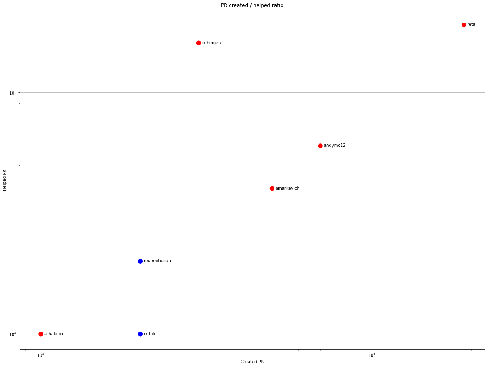

Latest record from the dataset:

<table border="1" class="dataframe">
  <thead>
    <tr style="text-align: right;">
      <th></th>
      <th>org</th>
      <th>repo</th>
      <th>type</th>
      <th>identifier</th>
      <th>subidentifier</th>
      <th>date</th>
      <th>author</th>
      <th>owner</th>
      <th>project</th>
    </tr>
  </thead>
  <tbody>
    <tr>
      <th>3313</th>
      <td>apache</td>
      <td>cxf</td>
      <td>PR_MERGED</td>
      <td>744</td>
      <td>NaN</td>
      <td>2021-02-06 15:39:29+00:00</td>
      <td>reta</td>
      <td>reta</td>
      <td>cxf</td>
    </tr>
  </tbody>
</table>

# Github Contributions per user

<table border="1" class="dataframe">
  <thead>
    <tr style="text-align: right;">
      <th></th>
      <th>contributions</th>
    </tr>
    <tr>
      <th>author</th>
      <th></th>
    </tr>
  </thead>
  <tbody>
    <tr>
      <th>reta</th>
      <td>515</td>
    </tr>
    <tr>
      <th>coheigea</th>
      <td>360</td>
    </tr>
    <tr>
      <th>rmannibucau</th>
      <td>127</td>
    </tr>
    <tr>
      <th>sberyozkin</th>
      <td>121</td>
    </tr>
    <tr>
      <th>deki</th>
      <td>110</td>
    </tr>
    <tr>
      <th>dkulp</th>
      <td>67</td>
    </tr>
    <tr>
      <th>andymc12</th>
      <td>49</td>
    </tr>
    <tr>
      <th>ffang</th>
      <td>49</td>
    </tr>
    <tr>
      <th>asfgit</th>
      <td>42</td>
    </tr>
    <tr>
      <th>cschneider</th>
      <td>33</td>
    </tr>
  </tbody>
</table>

## Contributors per participations in PRs which are not created by self (helping PRs)

<table border="1" class="dataframe">
  <thead>
    <tr style="text-align: right;">
      <th></th>
      <th>identifier</th>
    </tr>
    <tr>
      <th>author</th>
      <th></th>
    </tr>
  </thead>
  <tbody>
    <tr>
      <th>coheigea</th>
      <td>183</td>
    </tr>
    <tr>
      <th>reta</th>
      <td>109</td>
    </tr>
    <tr>
      <th>deki</th>
      <td>69</td>
    </tr>
    <tr>
      <th>sberyozkin</th>
      <td>61</td>
    </tr>
    <tr>
      <th>dkulp</th>
      <td>50</td>
    </tr>
    <tr>
      <th>asfgit</th>
      <td>42</td>
    </tr>
    <tr>
      <th>ffang</th>
      <td>34</td>
    </tr>
    <tr>
      <th>andymc12</th>
      <td>31</td>
    </tr>
    <tr>
      <th>rmannibucau</th>
      <td>27</td>
    </tr>
    <tr>
      <th>asoldano</th>
      <td>14</td>
    </tr>
    <tr>
      <th>johnament</th>
      <td>14</td>
    </tr>
    <tr>
      <th>cschneider</th>
      <td>14</td>
    </tr>
    <tr>
      <th>amarkevich</th>
      <td>13</td>
    </tr>
    <tr>
      <th>tomitribe-dev</th>
      <td>12</td>
    </tr>
    <tr>
      <th>andrei-ivanov</th>
      <td>10</td>
    </tr>
    <tr>
      <th>ilgrosso</th>
      <td>4</td>
    </tr>
    <tr>
      <th>elakito</th>
      <td>4</td>
    </tr>
    <tr>
      <th>jimma</th>
      <td>3</td>
    </tr>
    <tr>
      <th>jbonofre</th>
      <td>2</td>
    </tr>
    <tr>
      <th>ashakirin</th>
      <td>2</td>
    </tr>
  </tbody>
</table>

## Contributors per participations in any PRs

<table border="1" class="dataframe">
  <thead>
    <tr style="text-align: right;">
      <th></th>
      <th>identifier</th>
    </tr>
    <tr>
      <th>author</th>
      <th></th>
    </tr>
  </thead>
  <tbody>
    <tr>
      <th>coheigea</th>
      <td>198</td>
    </tr>
    <tr>
      <th>reta</th>
      <td>157</td>
    </tr>
    <tr>
      <th>amarkevich</th>
      <td>108</td>
    </tr>
    <tr>
      <th>deki</th>
      <td>96</td>
    </tr>
    <tr>
      <th>andymc12</th>
      <td>82</td>
    </tr>
    <tr>
      <th>sberyozkin</th>
      <td>62</td>
    </tr>
    <tr>
      <th>dkulp</th>
      <td>50</td>
    </tr>
    <tr>
      <th>rmannibucau</th>
      <td>44</td>
    </tr>
    <tr>
      <th>asfgit</th>
      <td>42</td>
    </tr>
    <tr>
      <th>ffang</th>
      <td>35</td>
    </tr>
    <tr>
      <th>johnament</th>
      <td>35</td>
    </tr>
    <tr>
      <th>gonzalad</th>
      <td>27</td>
    </tr>
    <tr>
      <th>asoldano</th>
      <td>23</td>
    </tr>
    <tr>
      <th>jimma</th>
      <td>17</td>
    </tr>
    <tr>
      <th>cschneider</th>
      <td>15</td>
    </tr>
    <tr>
      <th>davidkarlsen</th>
      <td>14</td>
    </tr>
    <tr>
      <th>tomitribe-dev</th>
      <td>12</td>
    </tr>
    <tr>
      <th>spark404</th>
      <td>12</td>
    </tr>
    <tr>
      <th>janbernhardt</th>
      <td>11</td>
    </tr>
    <tr>
      <th>grgrzybek</th>
      <td>11</td>
    </tr>
  </tbody>
</table>

# Bus factor (number of contributors responsible for the 50% of the prs) from last half year

## Contributors until the half of the all contributions

<table border="1" class="dataframe">
  <thead>
    <tr style="text-align: right;">
      <th></th>
      <th>author</th>
      <th>identifier</th>
      <th>cs</th>
      <th>ratio</th>
    </tr>
  </thead>
  <tbody>
    <tr>
      <th>0</th>
      <td>reta</td>
      <td>19</td>
      <td>19</td>
      <td>33.333333</td>
    </tr>
    <tr>
      <th>1</th>
      <td>andymc12</td>
      <td>7</td>
      <td>26</td>
      <td>12.280702</td>
    </tr>
  </tbody>
</table>

## Pony number (bus factor)

    3

## Dev power (All the contributions in the ration of the top contributor)

    3.0000000000000004

    

    

## People with created PRs > reviewed/commented PRS

    

    

## Same graph with focusing to the last 6 month

Only contributors with both created pr and helped pr visible

    

    

# Number of individual contributors per month

Number of different Github users who either created PR, commented PR, added review to a PR

Note: only events from apache/hadoop-ozone repository are included. Earlier PRs/comments are not here.

    

    

# Number of PRs closed/created per month

    /usr/lib/python3.9/site-packages/pandas/core/arrays/datetimes.py:1101: UserWarning: Converting to PeriodArray/Index representation will drop timezone information.
      warnings.warn(

    

    

# PR activity heatmap

    

    

