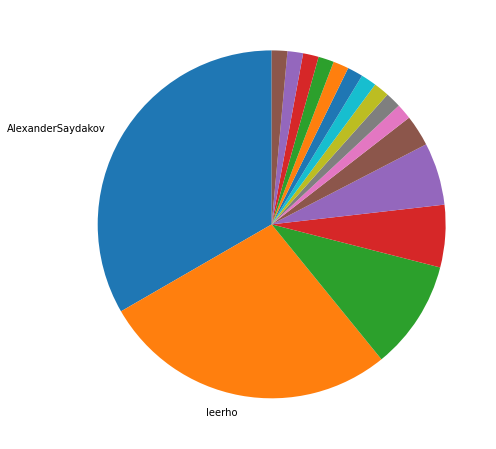
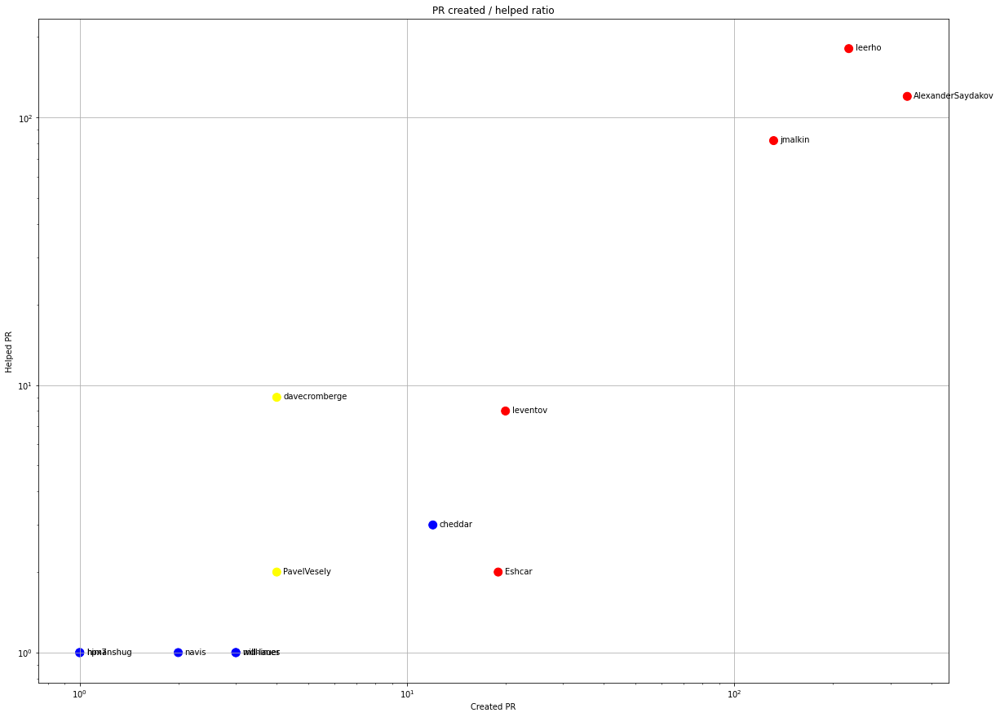
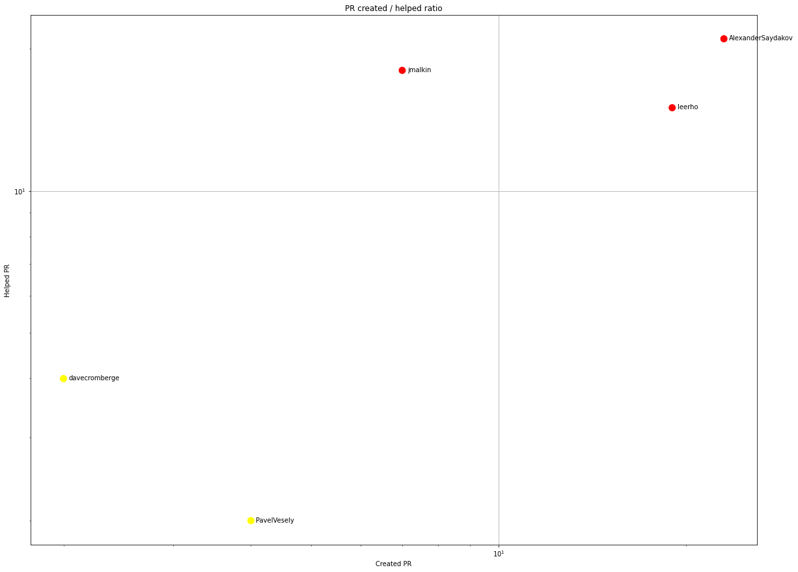
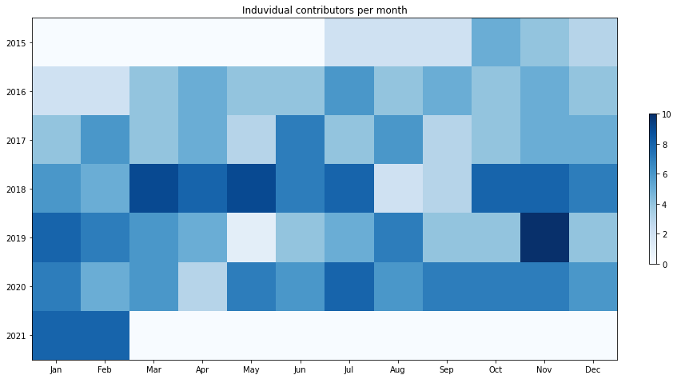
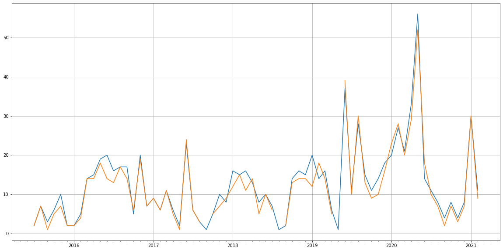
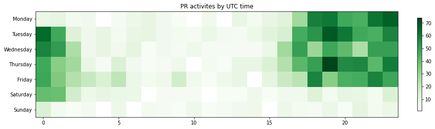

Latest record from the dataset:

<table border="1" class="dataframe">
  <thead>
    <tr style="text-align: right;">
      <th></th>
      <th>org</th>
      <th>repo</th>
      <th>type</th>
      <th>identifier</th>
      <th>subidentifier</th>
      <th>date</th>
      <th>author</th>
      <th>owner</th>
      <th>project</th>
    </tr>
  </thead>
  <tbody>
    <tr>
      <th>1778</th>
      <td>apache</td>
      <td>datasketches-java</td>
      <td>PR_CREATED</td>
      <td>350</td>
      <td>NaN</td>
      <td>2021-02-14 03:58:28+00:00</td>
      <td>prateekiiest</td>
      <td>prateekiiest</td>
      <td>datasketches</td>
    </tr>
  </tbody>
</table>

# Github Contributions per user

<table border="1" class="dataframe">
  <thead>
    <tr style="text-align: right;">
      <th></th>
      <th>contributions</th>
    </tr>
    <tr>
      <th>author</th>
      <th></th>
    </tr>
  </thead>
  <tbody>
    <tr>
      <th>leerho</th>
      <td>504</td>
    </tr>
    <tr>
      <th>coveralls</th>
      <td>303</td>
    </tr>
    <tr>
      <th>AlexanderSaydakov</th>
      <td>186</td>
    </tr>
    <tr>
      <th>jmalkin</th>
      <td>154</td>
    </tr>
    <tr>
      <th>codecov</th>
      <td>82</td>
    </tr>
    <tr>
      <th>davecromberge</th>
      <td>33</td>
    </tr>
    <tr>
      <th>lgtm-com</th>
      <td>25</td>
    </tr>
    <tr>
      <th>leventov</th>
      <td>17</td>
    </tr>
    <tr>
      <th>yahoocla</th>
      <td>8</td>
    </tr>
    <tr>
      <th>Eshcar</th>
      <td>4</td>
    </tr>
  </tbody>
</table>

## Contributors per participations in PRs which are not created by self (helping PRs)

<table border="1" class="dataframe">
  <thead>
    <tr style="text-align: right;">
      <th></th>
      <th>identifier</th>
    </tr>
    <tr>
      <th>author</th>
      <th></th>
    </tr>
  </thead>
  <tbody>
    <tr>
      <th>leerho</th>
      <td>181</td>
    </tr>
    <tr>
      <th>coveralls</th>
      <td>145</td>
    </tr>
    <tr>
      <th>AlexanderSaydakov</th>
      <td>120</td>
    </tr>
    <tr>
      <th>jmalkin</th>
      <td>82</td>
    </tr>
    <tr>
      <th>codecov</th>
      <td>82</td>
    </tr>
    <tr>
      <th>davecromberge</th>
      <td>9</td>
    </tr>
    <tr>
      <th>leventov</th>
      <td>8</td>
    </tr>
    <tr>
      <th>yahoocla</th>
      <td>8</td>
    </tr>
    <tr>
      <th>lgtm-com</th>
      <td>5</td>
    </tr>
    <tr>
      <th>codecov-io</th>
      <td>3</td>
    </tr>
    <tr>
      <th>cheddar</th>
      <td>3</td>
    </tr>
    <tr>
      <th>Eshcar</th>
      <td>2</td>
    </tr>
    <tr>
      <th>PavelVesely</th>
      <td>2</td>
    </tr>
    <tr>
      <th>ebortnik</th>
      <td>1</td>
    </tr>
    <tr>
      <th>himanshug</th>
      <td>1</td>
    </tr>
    <tr>
      <th>hpx7</th>
      <td>1</td>
    </tr>
    <tr>
      <th>Lordshinjo</th>
      <td>1</td>
    </tr>
    <tr>
      <th>mdhimes</th>
      <td>1</td>
    </tr>
    <tr>
      <th>navis</th>
      <td>1</td>
    </tr>
    <tr>
      <th>will-lauer</th>
      <td>1</td>
    </tr>
  </tbody>
</table>

## Contributors per participations in any PRs

<table border="1" class="dataframe">
  <thead>
    <tr style="text-align: right;">
      <th></th>
      <th>identifier</th>
    </tr>
    <tr>
      <th>author</th>
      <th></th>
    </tr>
  </thead>
  <tbody>
    <tr>
      <th>leerho</th>
      <td>289</td>
    </tr>
    <tr>
      <th>AlexanderSaydakov</th>
      <td>228</td>
    </tr>
    <tr>
      <th>jmalkin</th>
      <td>166</td>
    </tr>
    <tr>
      <th>coveralls</th>
      <td>145</td>
    </tr>
    <tr>
      <th>codecov</th>
      <td>82</td>
    </tr>
    <tr>
      <th>leventov</th>
      <td>28</td>
    </tr>
    <tr>
      <th>Eshcar</th>
      <td>21</td>
    </tr>
    <tr>
      <th>cheddar</th>
      <td>15</td>
    </tr>
    <tr>
      <th>davecromberge</th>
      <td>13</td>
    </tr>
    <tr>
      <th>niketh</th>
      <td>11</td>
    </tr>
    <tr>
      <th>yahoocla</th>
      <td>8</td>
    </tr>
    <tr>
      <th>kirbdee</th>
      <td>7</td>
    </tr>
    <tr>
      <th>PavelVesely</th>
      <td>6</td>
    </tr>
    <tr>
      <th>georgekankava</th>
      <td>5</td>
    </tr>
    <tr>
      <th>lgtm-com</th>
      <td>5</td>
    </tr>
    <tr>
      <th>chufucun</th>
      <td>4</td>
    </tr>
    <tr>
      <th>mdhimes</th>
      <td>4</td>
    </tr>
    <tr>
      <th>apete</th>
      <td>4</td>
    </tr>
    <tr>
      <th>will-lauer</th>
      <td>3</td>
    </tr>
    <tr>
      <th>navis</th>
      <td>3</td>
    </tr>
  </tbody>
</table>

# Bus factor (number of contributors responsible for the 50% of the prs) from last half year

## Contributors until the half of the all contributions

<table border="1" class="dataframe">
  <thead>
    <tr style="text-align: right;">
      <th></th>
      <th>author</th>
      <th>identifier</th>
      <th>cs</th>
      <th>ratio</th>
    </tr>
  </thead>
  <tbody>
    <tr>
      <th>0</th>
      <td>AlexanderSaydakov</td>
      <td>23</td>
      <td>23</td>
      <td>33.333333</td>
    </tr>
  </tbody>
</table>

## Pony number (bus factor)

    2

## Dev power (All the contributions in the ration of the top contributor)

    3.0

    

    

## People with created PRs > reviewed/commented PRS

    

    

## Same graph with focusing to the last 6 month

Only contributors with both created pr and helped pr visible

    

    

# Number of individual contributors per month

Number of different Github users who either created PR, commented PR, added review to a PR

Note: only events from apache/hadoop-ozone repository are included. Earlier PRs/comments are not here.

    

    

# Number of PRs closed/created per month

    /usr/lib/python3.9/site-packages/pandas/core/arrays/datetimes.py:1101: UserWarning: Converting to PeriodArray/Index representation will drop timezone information.
      warnings.warn(

    

    

# PR activity heatmap

    

    

