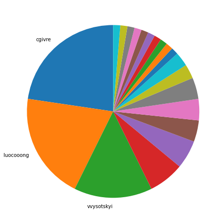

Latest record from the dataset:

<table border="1" class="dataframe">
  <thead>
    <tr style="text-align: right;">
      <th></th>
      <th>org</th>
      <th>repo</th>
      <th>type</th>
      <th>identifier</th>
      <th>subidentifier</th>
      <th>date</th>
      <th>author</th>
      <th>owner</th>
      <th>project</th>
    </tr>
  </thead>
  <tbody>
    <tr>
      <th>12208</th>
      <td>apache</td>
      <td>drill</td>
      <td>PR_CREATED</td>
      <td>2171</td>
      <td>NaN</td>
      <td>2021-02-14 06:06:06+00:00</td>
      <td>cgivre</td>
      <td>cgivre</td>
      <td>drill</td>
    </tr>
  </tbody>
</table>

# Github Contributions per user

<table border="1" class="dataframe">
  <thead>
    <tr style="text-align: right;">
      <th></th>
      <th>contributions</th>
    </tr>
    <tr>
      <th>author</th>
      <th></th>
    </tr>
  </thead>
  <tbody>
    <tr>
      <th>arina-ielchiieva</th>
      <td>1566</td>
    </tr>
    <tr>
      <th>paul-rogers</th>
      <td>862</td>
    </tr>
    <tr>
      <th>vvysotskyi</th>
      <td>686</td>
    </tr>
    <tr>
      <th>amansinha100</th>
      <td>458</td>
    </tr>
    <tr>
      <th>vrozov</th>
      <td>419</td>
    </tr>
    <tr>
      <th>sohami</th>
      <td>384</td>
    </tr>
    <tr>
      <th>cgivre</th>
      <td>315</td>
    </tr>
    <tr>
      <th>parthchandra</th>
      <td>314</td>
    </tr>
    <tr>
      <th>vdiravka</th>
      <td>254</td>
    </tr>
    <tr>
      <th>ilooner</th>
      <td>246</td>
    </tr>
  </tbody>
</table>

## Contributors per participations in PRs which are not created by self (helping PRs)

<table border="1" class="dataframe">
  <thead>
    <tr style="text-align: right;">
      <th></th>
      <th>identifier</th>
    </tr>
    <tr>
      <th>author</th>
      <th></th>
    </tr>
  </thead>
  <tbody>
    <tr>
      <th>arina-ielchiieva</th>
      <td>533</td>
    </tr>
    <tr>
      <th>paul-rogers</th>
      <td>342</td>
    </tr>
    <tr>
      <th>vvysotskyi</th>
      <td>279</td>
    </tr>
    <tr>
      <th>amansinha100</th>
      <td>211</td>
    </tr>
    <tr>
      <th>parthchandra</th>
      <td>185</td>
    </tr>
    <tr>
      <th>sohami</th>
      <td>151</td>
    </tr>
    <tr>
      <th>sudheeshkatkam</th>
      <td>124</td>
    </tr>
    <tr>
      <th>Ben-Zvi</th>
      <td>119</td>
    </tr>
    <tr>
      <th>ilooner</th>
      <td>114</td>
    </tr>
    <tr>
      <th>vdiravka</th>
      <td>114</td>
    </tr>
    <tr>
      <th>jinfengni</th>
      <td>96</td>
    </tr>
    <tr>
      <th>cgivre</th>
      <td>94</td>
    </tr>
    <tr>
      <th>priteshm</th>
      <td>83</td>
    </tr>
    <tr>
      <th>asfgit</th>
      <td>83</td>
    </tr>
    <tr>
      <th>jacques-n</th>
      <td>79</td>
    </tr>
    <tr>
      <th>vrozov</th>
      <td>73</td>
    </tr>
    <tr>
      <th>kkhatua</th>
      <td>68</td>
    </tr>
    <tr>
      <th>jaltekruse</th>
      <td>58</td>
    </tr>
    <tr>
      <th>ihuzenko</th>
      <td>43</td>
    </tr>
    <tr>
      <th>adeneche</th>
      <td>37</td>
    </tr>
  </tbody>
</table>

## Contributors per participations in any PRs

<table border="1" class="dataframe">
  <thead>
    <tr style="text-align: right;">
      <th></th>
      <th>identifier</th>
    </tr>
    <tr>
      <th>author</th>
      <th></th>
    </tr>
  </thead>
  <tbody>
    <tr>
      <th>arina-ielchiieva</th>
      <td>703</td>
    </tr>
    <tr>
      <th>paul-rogers</th>
      <td>520</td>
    </tr>
    <tr>
      <th>vvysotskyi</th>
      <td>427</td>
    </tr>
    <tr>
      <th>amansinha100</th>
      <td>251</td>
    </tr>
    <tr>
      <th>parthchandra</th>
      <td>229</td>
    </tr>
    <tr>
      <th>sohami</th>
      <td>225</td>
    </tr>
    <tr>
      <th>vdiravka</th>
      <td>196</td>
    </tr>
    <tr>
      <th>kkhatua</th>
      <td>169</td>
    </tr>
    <tr>
      <th>ilooner</th>
      <td>168</td>
    </tr>
    <tr>
      <th>sudheeshkatkam</th>
      <td>157</td>
    </tr>
    <tr>
      <th>cgivre</th>
      <td>157</td>
    </tr>
    <tr>
      <th>Ben-Zvi</th>
      <td>152</td>
    </tr>
    <tr>
      <th>jinfengni</th>
      <td>130</td>
    </tr>
    <tr>
      <th>jacques-n</th>
      <td>105</td>
    </tr>
    <tr>
      <th>vrozov</th>
      <td>103</td>
    </tr>
    <tr>
      <th>priteshm</th>
      <td>84</td>
    </tr>
    <tr>
      <th>asfgit</th>
      <td>83</td>
    </tr>
    <tr>
      <th>adeneche</th>
      <td>81</td>
    </tr>
    <tr>
      <th>ppadma</th>
      <td>78</td>
    </tr>
    <tr>
      <th>jaltekruse</th>
      <td>76</td>
    </tr>
  </tbody>
</table>

# Bus factor (number of contributors responsible for the 50% of the prs) from last half year

## Contributors until the half of the all contributions

<table border="1" class="dataframe">
  <thead>
    <tr style="text-align: right;">
      <th></th>
      <th>author</th>
      <th>identifier</th>
      <th>cs</th>
      <th>ratio</th>
    </tr>
  </thead>
  <tbody>
    <tr>
      <th>0</th>
      <td>cgivre</td>
      <td>17</td>
      <td>17</td>
      <td>22.666667</td>
    </tr>
    <tr>
      <th>1</th>
      <td>luocooong</td>
      <td>15</td>
      <td>32</td>
      <td>20.000000</td>
    </tr>
  </tbody>
</table>

## Pony number (bus factor)

    3

## Dev power (All the contributions in the ration of the top contributor)

    4.411764705882352

    

    

## People with created PRs > reviewed/commented PRS

    

    

## Same graph with focusing to the last 6 month

Only contributors with both created pr and helped pr visible

    

    

# Number of individual contributors per month

Number of different Github users who either created PR, commented PR, added review to a PR

Note: only events from apache/hadoop-ozone repository are included. Earlier PRs/comments are not here.

    

    

# Number of PRs closed/created per month

    /usr/lib/python3.9/site-packages/pandas/core/arrays/datetimes.py:1101: UserWarning: Converting to PeriodArray/Index representation will drop timezone information.
      warnings.warn(

    

    

# PR activity heatmap

    

    

