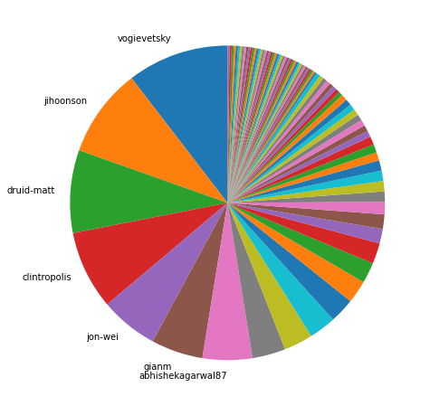
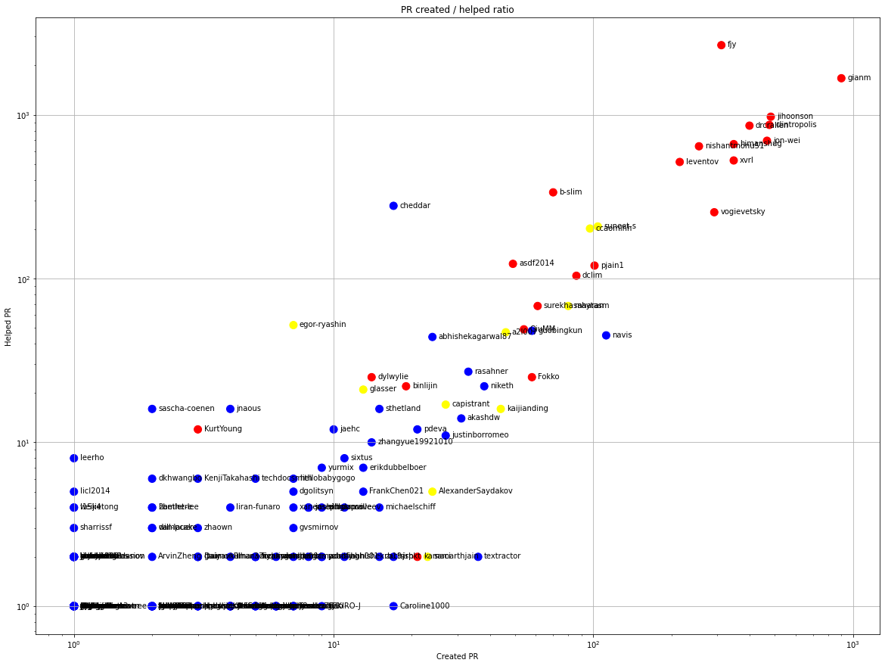
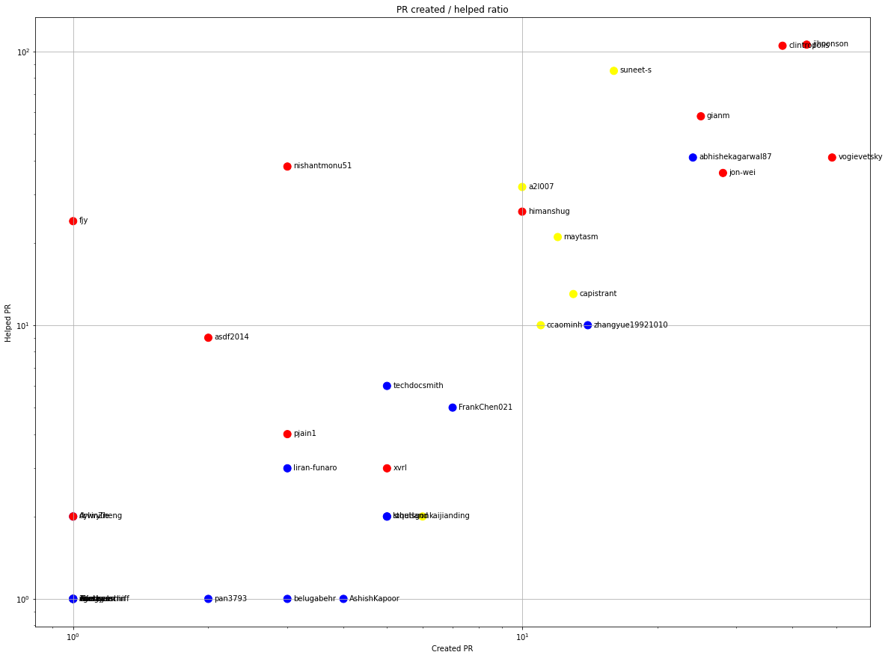
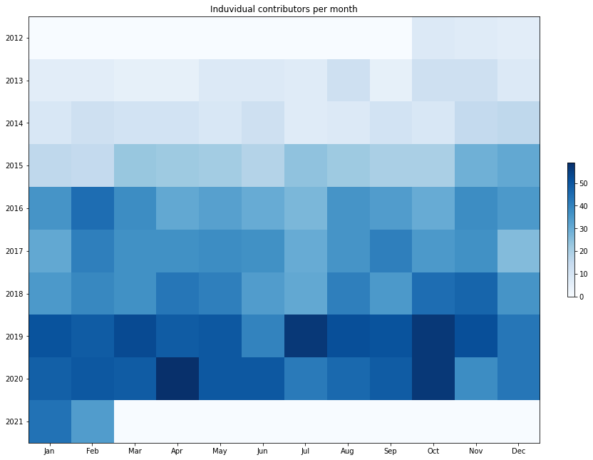
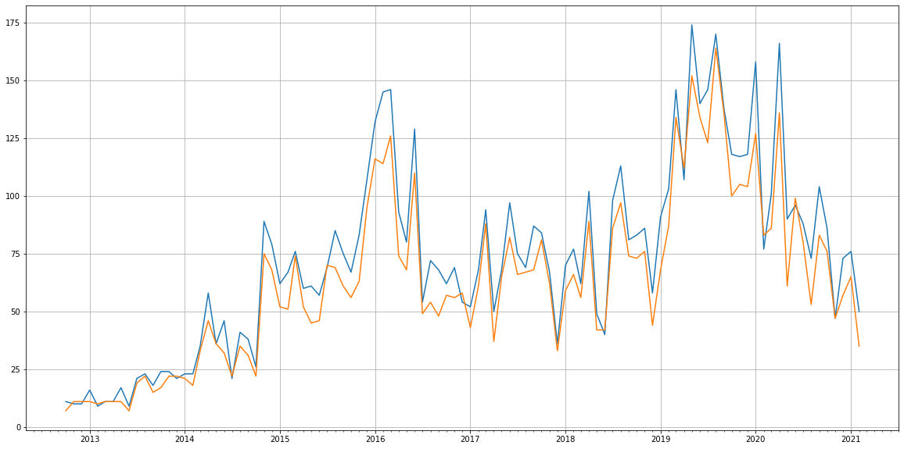
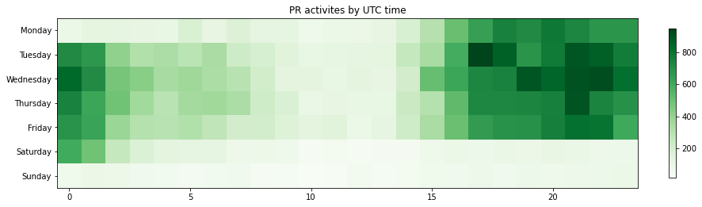

Latest record from the dataset:

<table border="1" class="dataframe">
  <thead>
    <tr style="text-align: right;">
      <th></th>
      <th>org</th>
      <th>repo</th>
      <th>type</th>
      <th>identifier</th>
      <th>subidentifier</th>
      <th>date</th>
      <th>author</th>
      <th>owner</th>
      <th>project</th>
    </tr>
  </thead>
  <tbody>
    <tr>
      <th>4870</th>
      <td>apache</td>
      <td>druid</td>
      <td>PR_CREATED</td>
      <td>10889</td>
      <td>NaN</td>
      <td>2021-02-13 08:14:11+00:00</td>
      <td>asdf2014</td>
      <td>asdf2014</td>
      <td>druid</td>
    </tr>
  </tbody>
</table>

# Github Contributions per user

<table border="1" class="dataframe">
  <thead>
    <tr style="text-align: right;">
      <th></th>
      <th>contributions</th>
    </tr>
    <tr>
      <th>author</th>
      <th></th>
    </tr>
  </thead>
  <tbody>
    <tr>
      <th>fjy</th>
      <td>4272</td>
    </tr>
    <tr>
      <th>gianm</th>
      <td>4256</td>
    </tr>
    <tr>
      <th>jihoonson</th>
      <td>2852</td>
    </tr>
    <tr>
      <th>drcrallen</th>
      <td>2230</td>
    </tr>
    <tr>
      <th>leventov</th>
      <td>1936</td>
    </tr>
    <tr>
      <th>himanshug</th>
      <td>1798</td>
    </tr>
    <tr>
      <th>clintropolis</th>
      <td>1748</td>
    </tr>
    <tr>
      <th>jon-wei</th>
      <td>1685</td>
    </tr>
    <tr>
      <th>nishantmonu51</th>
      <td>976</td>
    </tr>
    <tr>
      <th>b-slim</th>
      <td>929</td>
    </tr>
  </tbody>
</table>

## Contributors per participations in PRs which are not created by self (helping PRs)

<table border="1" class="dataframe">
  <thead>
    <tr style="text-align: right;">
      <th></th>
      <th>identifier</th>
    </tr>
    <tr>
      <th>author</th>
      <th></th>
    </tr>
  </thead>
  <tbody>
    <tr>
      <th>fjy</th>
      <td>2660</td>
    </tr>
    <tr>
      <th>gianm</th>
      <td>1671</td>
    </tr>
    <tr>
      <th>jihoonson</th>
      <td>973</td>
    </tr>
    <tr>
      <th>clintropolis</th>
      <td>867</td>
    </tr>
    <tr>
      <th>drcrallen</th>
      <td>858</td>
    </tr>
    <tr>
      <th>jon-wei</th>
      <td>694</td>
    </tr>
    <tr>
      <th>himanshug</th>
      <td>662</td>
    </tr>
    <tr>
      <th>nishantmonu51</th>
      <td>642</td>
    </tr>
    <tr>
      <th>xvrl</th>
      <td>526</td>
    </tr>
    <tr>
      <th>leventov</th>
      <td>515</td>
    </tr>
    <tr>
      <th>b-slim</th>
      <td>336</td>
    </tr>
    <tr>
      <th>cheddar</th>
      <td>278</td>
    </tr>
    <tr>
      <th>stale</th>
      <td>264</td>
    </tr>
    <tr>
      <th>vogievetsky</th>
      <td>254</td>
    </tr>
    <tr>
      <th>suneet-s</th>
      <td>208</td>
    </tr>
    <tr>
      <th>ccaominh</th>
      <td>202</td>
    </tr>
    <tr>
      <th>asdf2014</th>
      <td>123</td>
    </tr>
    <tr>
      <th>pjain1</th>
      <td>120</td>
    </tr>
    <tr>
      <th>dclim</th>
      <td>104</td>
    </tr>
    <tr>
      <th>lgtm-com</th>
      <td>103</td>
    </tr>
  </tbody>
</table>

## Contributors per participations in any PRs

<table border="1" class="dataframe">
  <thead>
    <tr style="text-align: right;">
      <th></th>
      <th>identifier</th>
    </tr>
    <tr>
      <th>author</th>
      <th></th>
    </tr>
  </thead>
  <tbody>
    <tr>
      <th>fjy</th>
      <td>2955</td>
    </tr>
    <tr>
      <th>gianm</th>
      <td>2565</td>
    </tr>
    <tr>
      <th>jihoonson</th>
      <td>1453</td>
    </tr>
    <tr>
      <th>clintropolis</th>
      <td>1341</td>
    </tr>
    <tr>
      <th>drcrallen</th>
      <td>1257</td>
    </tr>
    <tr>
      <th>jon-wei</th>
      <td>1157</td>
    </tr>
    <tr>
      <th>himanshug</th>
      <td>1009</td>
    </tr>
    <tr>
      <th>nishantmonu51</th>
      <td>897</td>
    </tr>
    <tr>
      <th>xvrl</th>
      <td>873</td>
    </tr>
    <tr>
      <th>leventov</th>
      <td>730</td>
    </tr>
    <tr>
      <th>vogievetsky</th>
      <td>523</td>
    </tr>
    <tr>
      <th>b-slim</th>
      <td>406</td>
    </tr>
    <tr>
      <th>suneet-s</th>
      <td>312</td>
    </tr>
    <tr>
      <th>ccaominh</th>
      <td>299</td>
    </tr>
    <tr>
      <th>cheddar</th>
      <td>295</td>
    </tr>
    <tr>
      <th>stale</th>
      <td>264</td>
    </tr>
    <tr>
      <th>pjain1</th>
      <td>221</td>
    </tr>
    <tr>
      <th>dclim</th>
      <td>190</td>
    </tr>
    <tr>
      <th>asdf2014</th>
      <td>172</td>
    </tr>
    <tr>
      <th>navis</th>
      <td>157</td>
    </tr>
  </tbody>
</table>

# Bus factor (number of contributors responsible for the 50% of the prs) from last half year

## Contributors until the half of the all contributions

<table border="1" class="dataframe">
  <thead>
    <tr style="text-align: right;">
      <th></th>
      <th>author</th>
      <th>identifier</th>
      <th>cs</th>
      <th>ratio</th>
    </tr>
  </thead>
  <tbody>
    <tr>
      <th>0</th>
      <td>vogievetsky</td>
      <td>49</td>
      <td>49</td>
      <td>10.425532</td>
    </tr>
    <tr>
      <th>1</th>
      <td>jihoonson</td>
      <td>43</td>
      <td>92</td>
      <td>9.148936</td>
    </tr>
    <tr>
      <th>2</th>
      <td>druid-matt</td>
      <td>40</td>
      <td>132</td>
      <td>8.510638</td>
    </tr>
    <tr>
      <th>3</th>
      <td>clintropolis</td>
      <td>38</td>
      <td>170</td>
      <td>8.085106</td>
    </tr>
    <tr>
      <th>4</th>
      <td>jon-wei</td>
      <td>28</td>
      <td>198</td>
      <td>5.957447</td>
    </tr>
    <tr>
      <th>5</th>
      <td>gianm</td>
      <td>25</td>
      <td>223</td>
      <td>5.319149</td>
    </tr>
  </tbody>
</table>

## Pony number (bus factor)

    7

## Dev power (All the contributions in the ration of the top contributor)

    9.591836734693882

    

    

## People with created PRs > reviewed/commented PRS

    

    

## Same graph with focusing to the last 6 month

Only contributors with both created pr and helped pr visible

    

    

# Number of individual contributors per month

Number of different Github users who either created PR, commented PR, added review to a PR

Note: only events from apache/hadoop-ozone repository are included. Earlier PRs/comments are not here.

    

    

# Number of PRs closed/created per month

    /usr/lib/python3.9/site-packages/pandas/core/arrays/datetimes.py:1101: UserWarning: Converting to PeriodArray/Index representation will drop timezone information.
      warnings.warn(

    

    

# PR activity heatmap

    

    

