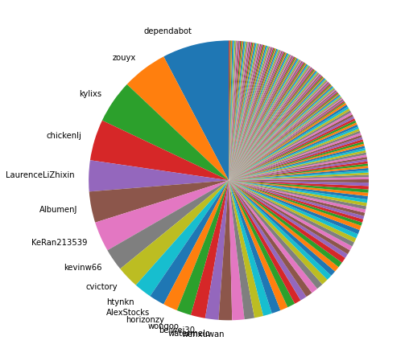
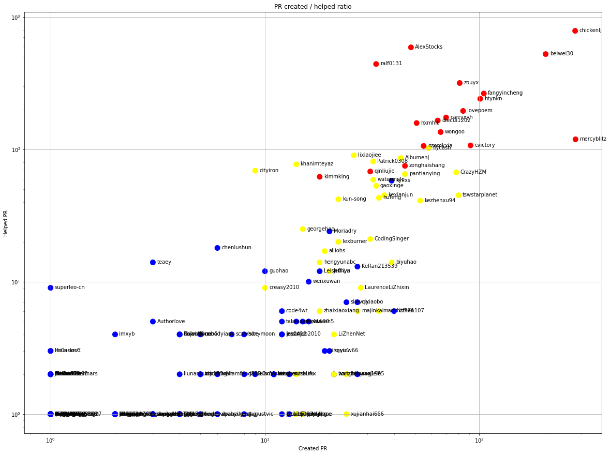
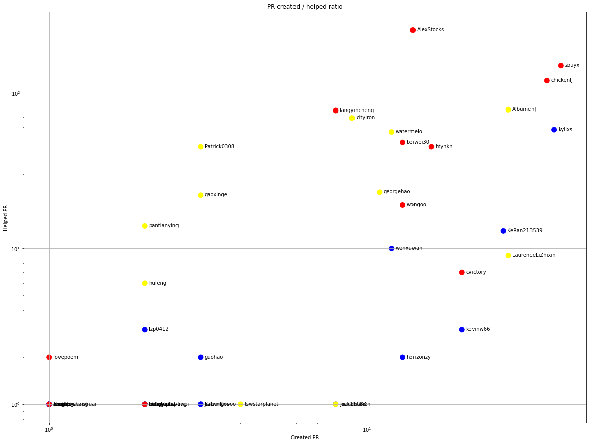
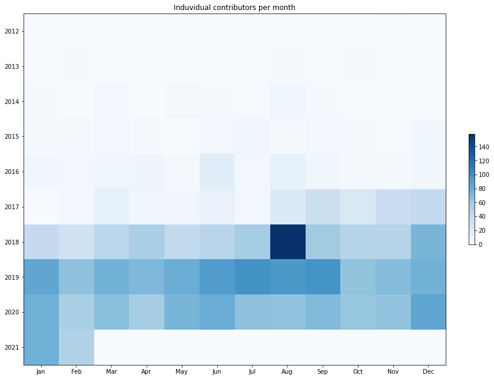
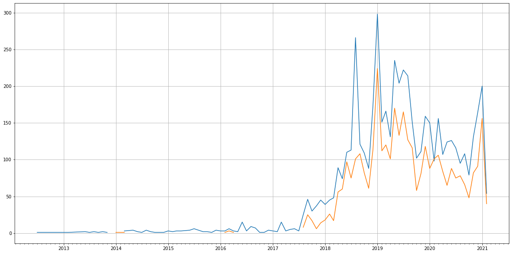
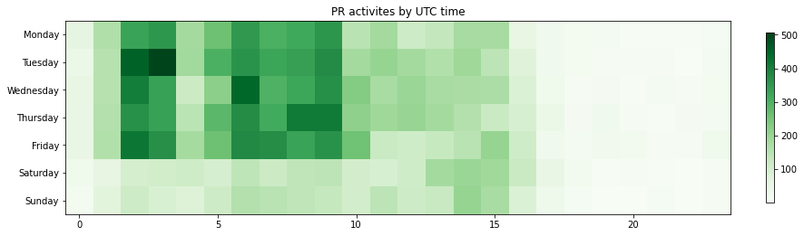

Latest record from the dataset:

<table border="1" class="dataframe">
  <thead>
    <tr style="text-align: right;">
      <th></th>
      <th>org</th>
      <th>repo</th>
      <th>type</th>
      <th>identifier</th>
      <th>subidentifier</th>
      <th>date</th>
      <th>author</th>
      <th>owner</th>
      <th>project</th>
    </tr>
  </thead>
  <tbody>
    <tr>
      <th>13065</th>
      <td>apache</td>
      <td>dubbo</td>
      <td>PR_CREATED</td>
      <td>7189</td>
      <td>NaN</td>
      <td>2021-02-14 02:57:23+00:00</td>
      <td>AlbumenJ</td>
      <td>AlbumenJ</td>
      <td>dubbo</td>
    </tr>
  </tbody>
</table>

# Github Contributions per user

<table border="1" class="dataframe">
  <thead>
    <tr style="text-align: right;">
      <th></th>
      <th>contributions</th>
    </tr>
    <tr>
      <th>author</th>
      <th></th>
    </tr>
  </thead>
  <tbody>
    <tr>
      <th>codecov-io</th>
      <td>2161</td>
    </tr>
    <tr>
      <th>AlexStocks</th>
      <td>1394</td>
    </tr>
    <tr>
      <th>chickenlj</th>
      <td>1256</td>
    </tr>
    <tr>
      <th>beiwei30</th>
      <td>1093</td>
    </tr>
    <tr>
      <th>ralf0131</th>
      <td>992</td>
    </tr>
    <tr>
      <th>zouyx</th>
      <td>638</td>
    </tr>
    <tr>
      <th>htynkn</th>
      <td>493</td>
    </tr>
    <tr>
      <th>fangyincheng</th>
      <td>418</td>
    </tr>
    <tr>
      <th>wongoo</th>
      <td>396</td>
    </tr>
    <tr>
      <th>carryxyh</th>
      <td>372</td>
    </tr>
  </tbody>
</table>

## Contributors per participations in PRs which are not created by self (helping PRs)

<table border="1" class="dataframe">
  <thead>
    <tr style="text-align: right;">
      <th></th>
      <th>identifier</th>
    </tr>
    <tr>
      <th>author</th>
      <th></th>
    </tr>
  </thead>
  <tbody>
    <tr>
      <th>codecov-io</th>
      <td>2051</td>
    </tr>
    <tr>
      <th>chickenlj</th>
      <td>785</td>
    </tr>
    <tr>
      <th>AlexStocks</th>
      <td>589</td>
    </tr>
    <tr>
      <th>beiwei30</th>
      <td>524</td>
    </tr>
    <tr>
      <th>ralf0131</th>
      <td>441</td>
    </tr>
    <tr>
      <th>CLAassistant</th>
      <td>323</td>
    </tr>
    <tr>
      <th>zouyx</th>
      <td>317</td>
    </tr>
    <tr>
      <th>fangyincheng</th>
      <td>264</td>
    </tr>
    <tr>
      <th>htynkn</th>
      <td>241</td>
    </tr>
    <tr>
      <th>lovepoem</th>
      <td>195</td>
    </tr>
    <tr>
      <th>carryxyh</th>
      <td>174</td>
    </tr>
    <tr>
      <th>diecui1202</th>
      <td>165</td>
    </tr>
    <tr>
      <th>hxmhlt</th>
      <td>158</td>
    </tr>
    <tr>
      <th>wongoo</th>
      <td>135</td>
    </tr>
    <tr>
      <th>codecov-commenter</th>
      <td>131</td>
    </tr>
    <tr>
      <th>mercyblitz</th>
      <td>119</td>
    </tr>
    <tr>
      <th>cvictory</th>
      <td>107</td>
    </tr>
    <tr>
      <th>nzomkxia</th>
      <td>106</td>
    </tr>
    <tr>
      <th>flycash</th>
      <td>102</td>
    </tr>
    <tr>
      <th>lixiaojiee</th>
      <td>90</td>
    </tr>
  </tbody>
</table>

## Contributors per participations in any PRs

<table border="1" class="dataframe">
  <thead>
    <tr style="text-align: right;">
      <th></th>
      <th>identifier</th>
    </tr>
    <tr>
      <th>author</th>
      <th></th>
    </tr>
  </thead>
  <tbody>
    <tr>
      <th>codecov-io</th>
      <td>2051</td>
    </tr>
    <tr>
      <th>chickenlj</th>
      <td>1060</td>
    </tr>
    <tr>
      <th>beiwei30</th>
      <td>724</td>
    </tr>
    <tr>
      <th>AlexStocks</th>
      <td>617</td>
    </tr>
    <tr>
      <th>ralf0131</th>
      <td>472</td>
    </tr>
    <tr>
      <th>mercyblitz</th>
      <td>399</td>
    </tr>
    <tr>
      <th>zouyx</th>
      <td>397</td>
    </tr>
    <tr>
      <th>fangyincheng</th>
      <td>344</td>
    </tr>
    <tr>
      <th>htynkn</th>
      <td>336</td>
    </tr>
    <tr>
      <th>CLAassistant</th>
      <td>323</td>
    </tr>
    <tr>
      <th>lovepoem</th>
      <td>268</td>
    </tr>
    <tr>
      <th>carryxyh</th>
      <td>243</td>
    </tr>
    <tr>
      <th>diecui1202</th>
      <td>224</td>
    </tr>
    <tr>
      <th>hxmhlt</th>
      <td>209</td>
    </tr>
    <tr>
      <th>cvictory</th>
      <td>198</td>
    </tr>
    <tr>
      <th>wongoo</th>
      <td>188</td>
    </tr>
    <tr>
      <th>flycash</th>
      <td>160</td>
    </tr>
    <tr>
      <th>nzomkxia</th>
      <td>157</td>
    </tr>
    <tr>
      <th>CrazyHZM</th>
      <td>145</td>
    </tr>
    <tr>
      <th>codecov-commenter</th>
      <td>131</td>
    </tr>
  </tbody>
</table>

# Bus factor (number of contributors responsible for the 50% of the prs) from last half year

## Contributors until the half of the all contributions

<table border="1" class="dataframe">
  <thead>
    <tr style="text-align: right;">
      <th></th>
      <th>author</th>
      <th>identifier</th>
      <th>cs</th>
      <th>ratio</th>
    </tr>
  </thead>
  <tbody>
    <tr>
      <th>0</th>
      <td>dependabot</td>
      <td>60</td>
      <td>60</td>
      <td>7.692308</td>
    </tr>
    <tr>
      <th>1</th>
      <td>zouyx</td>
      <td>41</td>
      <td>101</td>
      <td>5.256410</td>
    </tr>
    <tr>
      <th>2</th>
      <td>kylixs</td>
      <td>39</td>
      <td>140</td>
      <td>5.000000</td>
    </tr>
    <tr>
      <th>3</th>
      <td>chickenlj</td>
      <td>37</td>
      <td>177</td>
      <td>4.743590</td>
    </tr>
    <tr>
      <th>4</th>
      <td>LaurenceLiZhixin</td>
      <td>28</td>
      <td>205</td>
      <td>3.589744</td>
    </tr>
    <tr>
      <th>5</th>
      <td>AlbumenJ</td>
      <td>28</td>
      <td>233</td>
      <td>3.589744</td>
    </tr>
    <tr>
      <th>6</th>
      <td>KeRan213539</td>
      <td>27</td>
      <td>260</td>
      <td>3.461538</td>
    </tr>
    <tr>
      <th>7</th>
      <td>kevinw66</td>
      <td>20</td>
      <td>280</td>
      <td>2.564103</td>
    </tr>
    <tr>
      <th>8</th>
      <td>cvictory</td>
      <td>20</td>
      <td>300</td>
      <td>2.564103</td>
    </tr>
    <tr>
      <th>9</th>
      <td>htynkn</td>
      <td>16</td>
      <td>316</td>
      <td>2.051282</td>
    </tr>
    <tr>
      <th>10</th>
      <td>AlexStocks</td>
      <td>14</td>
      <td>330</td>
      <td>1.794872</td>
    </tr>
    <tr>
      <th>11</th>
      <td>horizonzy</td>
      <td>13</td>
      <td>343</td>
      <td>1.666667</td>
    </tr>
    <tr>
      <th>12</th>
      <td>wongoo</td>
      <td>13</td>
      <td>356</td>
      <td>1.666667</td>
    </tr>
    <tr>
      <th>13</th>
      <td>beiwei30</td>
      <td>13</td>
      <td>369</td>
      <td>1.666667</td>
    </tr>
    <tr>
      <th>14</th>
      <td>watermelo</td>
      <td>12</td>
      <td>381</td>
      <td>1.538462</td>
    </tr>
  </tbody>
</table>

## Pony number (bus factor)

    16

## Dev power (All the contributions in the ration of the top contributor)

    13.000000000000002

    

    

## People with created PRs > reviewed/commented PRS

    

    

## Same graph with focusing to the last 6 month

Only contributors with both created pr and helped pr visible

    

    

# Number of individual contributors per month

Number of different Github users who either created PR, commented PR, added review to a PR

Note: only events from apache/hadoop-ozone repository are included. Earlier PRs/comments are not here.

    

    

# Number of PRs closed/created per month

    /usr/lib/python3.9/site-packages/pandas/core/arrays/datetimes.py:1101: UserWarning: Converting to PeriodArray/Index representation will drop timezone information.
      warnings.warn(

    

    

# PR activity heatmap

    

    

