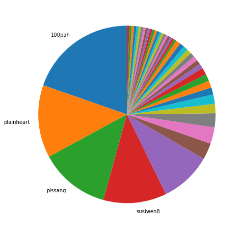
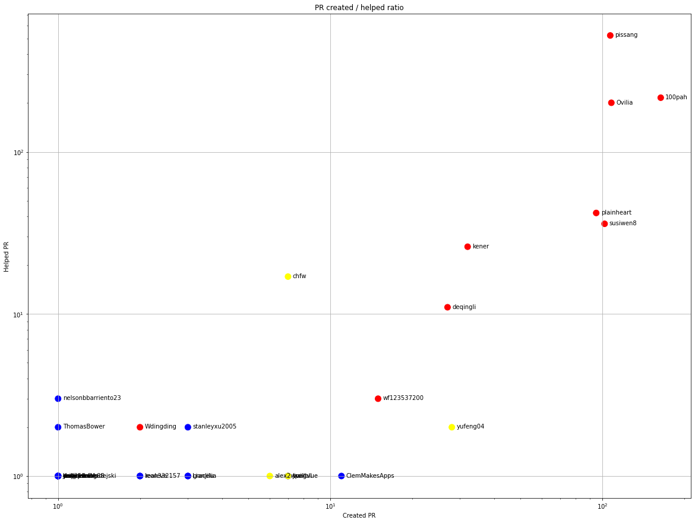
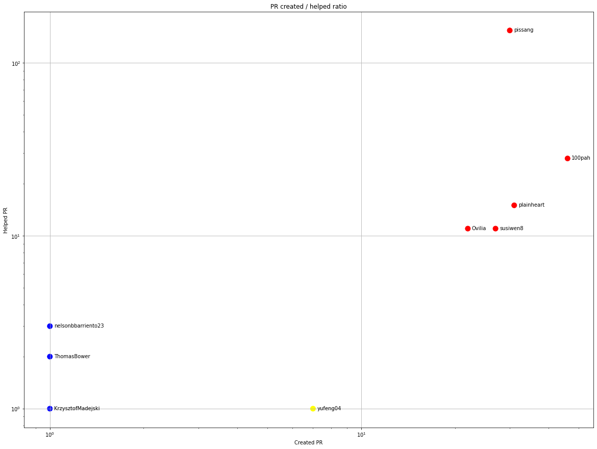
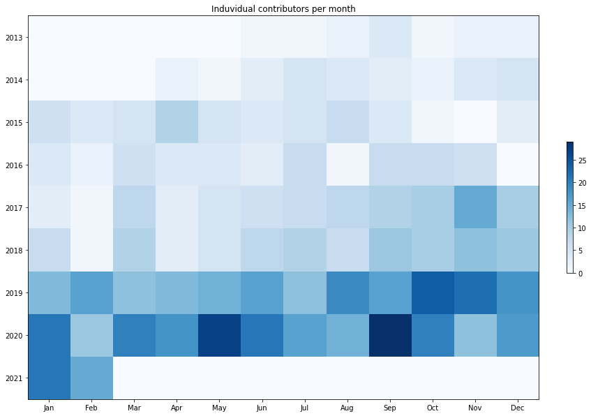
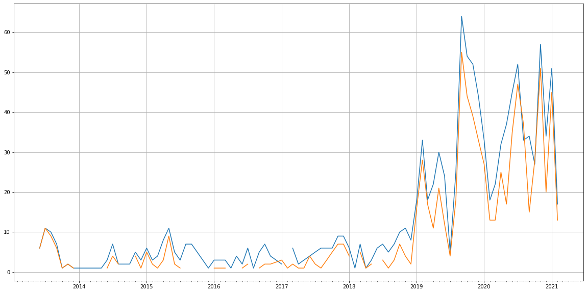
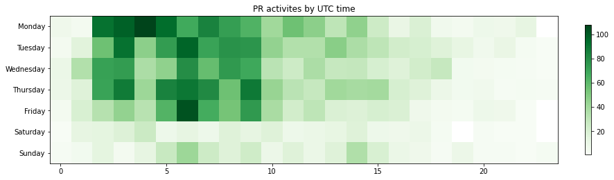

Latest record from the dataset:

<table border="1" class="dataframe">
  <thead>
    <tr style="text-align: right;">
      <th></th>
      <th>org</th>
      <th>repo</th>
      <th>type</th>
      <th>identifier</th>
      <th>subidentifier</th>
      <th>date</th>
      <th>author</th>
      <th>owner</th>
      <th>project</th>
    </tr>
  </thead>
  <tbody>
    <tr>
      <th>3448</th>
      <td>apache</td>
      <td>echarts</td>
      <td>PR_COMMENTED</td>
      <td>14267</td>
      <td>NaN</td>
      <td>2021-02-13 04:44:37+00:00</td>
      <td>susiwen8</td>
      <td>qortex</td>
      <td>echarts</td>
    </tr>
  </tbody>
</table>

# Github Contributions per user

<table border="1" class="dataframe">
  <thead>
    <tr style="text-align: right;">
      <th></th>
      <th>contributions</th>
    </tr>
    <tr>
      <th>author</th>
      <th></th>
    </tr>
  </thead>
  <tbody>
    <tr>
      <th>pissang</th>
      <td>969</td>
    </tr>
    <tr>
      <th>echarts-bot</th>
      <td>571</td>
    </tr>
    <tr>
      <th>Ovilia</th>
      <td>427</td>
    </tr>
    <tr>
      <th>100pah</th>
      <td>342</td>
    </tr>
    <tr>
      <th>plainheart</th>
      <td>98</td>
    </tr>
    <tr>
      <th>susiwen8</th>
      <td>76</td>
    </tr>
    <tr>
      <th>chfw</th>
      <td>44</td>
    </tr>
    <tr>
      <th>kener</th>
      <td>37</td>
    </tr>
    <tr>
      <th>stale</th>
      <td>26</td>
    </tr>
    <tr>
      <th>deqingli</th>
      <td>16</td>
    </tr>
  </tbody>
</table>

## Contributors per participations in PRs which are not created by self (helping PRs)

<table border="1" class="dataframe">
  <thead>
    <tr style="text-align: right;">
      <th></th>
      <th>identifier</th>
    </tr>
    <tr>
      <th>author</th>
      <th></th>
    </tr>
  </thead>
  <tbody>
    <tr>
      <th>pissang</th>
      <td>523</td>
    </tr>
    <tr>
      <th>echarts-bot</th>
      <td>339</td>
    </tr>
    <tr>
      <th>100pah</th>
      <td>216</td>
    </tr>
    <tr>
      <th>Ovilia</th>
      <td>201</td>
    </tr>
    <tr>
      <th>plainheart</th>
      <td>42</td>
    </tr>
    <tr>
      <th>susiwen8</th>
      <td>36</td>
    </tr>
    <tr>
      <th>stale</th>
      <td>26</td>
    </tr>
    <tr>
      <th>kener</th>
      <td>26</td>
    </tr>
    <tr>
      <th>chfw</th>
      <td>17</td>
    </tr>
    <tr>
      <th>deqingli</th>
      <td>11</td>
    </tr>
    <tr>
      <th>wf123537200</th>
      <td>3</td>
    </tr>
    <tr>
      <th>nelsonbbarriento23</th>
      <td>3</td>
    </tr>
    <tr>
      <th>yufeng04</th>
      <td>2</td>
    </tr>
    <tr>
      <th>stanleyxu2005</th>
      <td>2</td>
    </tr>
    <tr>
      <th>ThomasBower</th>
      <td>2</td>
    </tr>
    <tr>
      <th>Wdingding</th>
      <td>2</td>
    </tr>
    <tr>
      <th>YiYingWu1302</th>
      <td>2</td>
    </tr>
    <tr>
      <th>chriswong</th>
      <td>2</td>
    </tr>
    <tr>
      <th>mihaimaruseac</th>
      <td>1</td>
    </tr>
    <tr>
      <th>marcinja</th>
      <td>1</td>
    </tr>
  </tbody>
</table>

## Contributors per participations in any PRs

<table border="1" class="dataframe">
  <thead>
    <tr style="text-align: right;">
      <th></th>
      <th>identifier</th>
    </tr>
    <tr>
      <th>author</th>
      <th></th>
    </tr>
  </thead>
  <tbody>
    <tr>
      <th>pissang</th>
      <td>628</td>
    </tr>
    <tr>
      <th>100pah</th>
      <td>380</td>
    </tr>
    <tr>
      <th>echarts-bot</th>
      <td>339</td>
    </tr>
    <tr>
      <th>Ovilia</th>
      <td>306</td>
    </tr>
    <tr>
      <th>susiwen8</th>
      <td>138</td>
    </tr>
    <tr>
      <th>plainheart</th>
      <td>133</td>
    </tr>
    <tr>
      <th>kener</th>
      <td>58</td>
    </tr>
    <tr>
      <th>deqingli</th>
      <td>38</td>
    </tr>
    <tr>
      <th>yufeng04</th>
      <td>30</td>
    </tr>
    <tr>
      <th>stale</th>
      <td>26</td>
    </tr>
    <tr>
      <th>chfw</th>
      <td>24</td>
    </tr>
    <tr>
      <th>wf123537200</th>
      <td>18</td>
    </tr>
    <tr>
      <th>loutongbing</th>
      <td>16</td>
    </tr>
    <tr>
      <th>cuijian-dexter</th>
      <td>15</td>
    </tr>
    <tr>
      <th>dependabot</th>
      <td>12</td>
    </tr>
    <tr>
      <th>ClemMakesApps</th>
      <td>12</td>
    </tr>
    <tr>
      <th>SnailSword</th>
      <td>9</td>
    </tr>
    <tr>
      <th>Jivanvl</th>
      <td>8</td>
    </tr>
    <tr>
      <th>quillblue</th>
      <td>8</td>
    </tr>
    <tr>
      <th>JackHlw</th>
      <td>7</td>
    </tr>
  </tbody>
</table>

# Bus factor (number of contributors responsible for the 50% of the prs) from last half year

## Contributors until the half of the all contributions

<table border="1" class="dataframe">
  <thead>
    <tr style="text-align: right;">
      <th></th>
      <th>author</th>
      <th>identifier</th>
      <th>cs</th>
      <th>ratio</th>
    </tr>
  </thead>
  <tbody>
    <tr>
      <th>0</th>
      <td>100pah</td>
      <td>46</td>
      <td>46</td>
      <td>19.658120</td>
    </tr>
    <tr>
      <th>1</th>
      <td>plainheart</td>
      <td>31</td>
      <td>77</td>
      <td>13.247863</td>
    </tr>
    <tr>
      <th>2</th>
      <td>pissang</td>
      <td>30</td>
      <td>107</td>
      <td>12.820513</td>
    </tr>
  </tbody>
</table>

## Pony number (bus factor)

    4

## Dev power (All the contributions in the ration of the top contributor)

    5.086956521739129

    

    

## People with created PRs > reviewed/commented PRS

    

    

## Same graph with focusing to the last 6 month

Only contributors with both created pr and helped pr visible

    

    

# Number of individual contributors per month

Number of different Github users who either created PR, commented PR, added review to a PR

Note: only events from apache/hadoop-ozone repository are included. Earlier PRs/comments are not here.

    

    

# Number of PRs closed/created per month

    /usr/lib/python3.9/site-packages/pandas/core/arrays/datetimes.py:1101: UserWarning: Converting to PeriodArray/Index representation will drop timezone information.
      warnings.warn(

    

    

# PR activity heatmap

    

    

