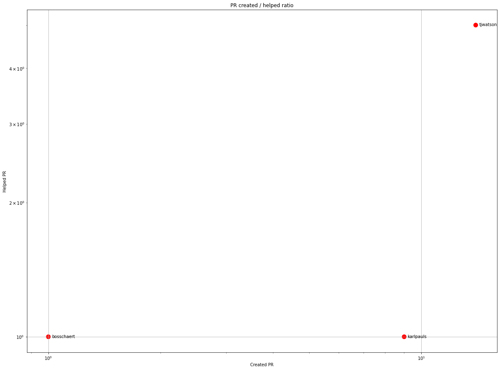

Latest record from the dataset:

<table border="1" class="dataframe">
  <thead>
    <tr style="text-align: right;">
      <th></th>
      <th>org</th>
      <th>repo</th>
      <th>type</th>
      <th>identifier</th>
      <th>subidentifier</th>
      <th>date</th>
      <th>author</th>
      <th>owner</th>
      <th>project</th>
    </tr>
  </thead>
  <tbody>
    <tr>
      <th>533</th>
      <td>apache</td>
      <td>felix-atomos</td>
      <td>PR_CREATED</td>
      <td>46</td>
      <td>NaN</td>
      <td>2021-02-12 22:59:05+00:00</td>
      <td>karlpauls</td>
      <td>karlpauls</td>
      <td>felix</td>
    </tr>
  </tbody>
</table>

# Github Contributions per user

<table border="1" class="dataframe">
  <thead>
    <tr style="text-align: right;">
      <th></th>
      <th>contributions</th>
    </tr>
    <tr>
      <th>author</th>
      <th></th>
    </tr>
  </thead>
  <tbody>
    <tr>
      <th>tjwatson</th>
      <td>52</td>
    </tr>
    <tr>
      <th>bosschaert</th>
      <td>45</td>
    </tr>
    <tr>
      <th>cziegeler</th>
      <td>36</td>
    </tr>
    <tr>
      <th>jbonofre</th>
      <td>25</td>
    </tr>
    <tr>
      <th>lgtm-com</th>
      <td>21</td>
    </tr>
    <tr>
      <th>rotty3000</th>
      <td>20</td>
    </tr>
    <tr>
      <th>karlpauls</th>
      <td>12</td>
    </tr>
    <tr>
      <th>ghenzler</th>
      <td>12</td>
    </tr>
    <tr>
      <th>gnodet</th>
      <td>6</td>
    </tr>
    <tr>
      <th>kwin</th>
      <td>5</td>
    </tr>
  </tbody>
</table>

## Contributors per participations in PRs which are not created by self (helping PRs)

<table border="1" class="dataframe">
  <thead>
    <tr style="text-align: right;">
      <th></th>
      <th>identifier</th>
    </tr>
    <tr>
      <th>author</th>
      <th></th>
    </tr>
  </thead>
  <tbody>
    <tr>
      <th>bosschaert</th>
      <td>25</td>
    </tr>
    <tr>
      <th>cziegeler</th>
      <td>23</td>
    </tr>
    <tr>
      <th>tjwatson</th>
      <td>19</td>
    </tr>
    <tr>
      <th>jbonofre</th>
      <td>15</td>
    </tr>
    <tr>
      <th>karlpauls</th>
      <td>11</td>
    </tr>
    <tr>
      <th>rotty3000</th>
      <td>8</td>
    </tr>
    <tr>
      <th>gnodet</th>
      <td>5</td>
    </tr>
    <tr>
      <th>ghenzler</th>
      <td>4</td>
    </tr>
    <tr>
      <th>njbartlett</th>
      <td>3</td>
    </tr>
    <tr>
      <th>stbischof</th>
      <td>3</td>
    </tr>
    <tr>
      <th>lgtm-com</th>
      <td>3</td>
    </tr>
    <tr>
      <th>rombert</th>
      <td>2</td>
    </tr>
    <tr>
      <th>cschneider</th>
      <td>2</td>
    </tr>
    <tr>
      <th>bjhargrave</th>
      <td>2</td>
    </tr>
    <tr>
      <th>amitjoy</th>
      <td>2</td>
    </tr>
    <tr>
      <th>timothyjward</th>
      <td>2</td>
    </tr>
    <tr>
      <th>kwin</th>
      <td>2</td>
    </tr>
    <tr>
      <th>pderop</th>
      <td>1</td>
    </tr>
    <tr>
      <th>Andrea-Campanella</th>
      <td>1</td>
    </tr>
    <tr>
      <th>jsedding</th>
      <td>1</td>
    </tr>
  </tbody>
</table>

## Contributors per participations in any PRs

<table border="1" class="dataframe">
  <thead>
    <tr style="text-align: right;">
      <th></th>
      <th>identifier</th>
    </tr>
    <tr>
      <th>author</th>
      <th></th>
    </tr>
  </thead>
  <tbody>
    <tr>
      <th>tjwatson</th>
      <td>55</td>
    </tr>
    <tr>
      <th>bosschaert</th>
      <td>27</td>
    </tr>
    <tr>
      <th>rotty3000</th>
      <td>24</td>
    </tr>
    <tr>
      <th>cziegeler</th>
      <td>23</td>
    </tr>
    <tr>
      <th>jbonofre</th>
      <td>22</td>
    </tr>
    <tr>
      <th>karlpauls</th>
      <td>21</td>
    </tr>
    <tr>
      <th>coheigea</th>
      <td>17</td>
    </tr>
    <tr>
      <th>timothyjward</th>
      <td>13</td>
    </tr>
    <tr>
      <th>stbischof</th>
      <td>10</td>
    </tr>
    <tr>
      <th>dleangen</th>
      <td>10</td>
    </tr>
    <tr>
      <th>cschneider</th>
      <td>10</td>
    </tr>
    <tr>
      <th>cvgaviao</th>
      <td>10</td>
    </tr>
    <tr>
      <th>njbartlett</th>
      <td>9</td>
    </tr>
    <tr>
      <th>amitjoy</th>
      <td>8</td>
    </tr>
    <tr>
      <th>CodingFabian</th>
      <td>8</td>
    </tr>
    <tr>
      <th>kwin</th>
      <td>7</td>
    </tr>
    <tr>
      <th>gnodet</th>
      <td>6</td>
    </tr>
    <tr>
      <th>xfournet</th>
      <td>6</td>
    </tr>
    <tr>
      <th>abhishekgarg18</th>
      <td>6</td>
    </tr>
    <tr>
      <th>ghenzler</th>
      <td>5</td>
    </tr>
  </tbody>
</table>

# Bus factor (number of contributors responsible for the 50% of the prs) from last half year

## Contributors until the half of the all contributions

<table border="1" class="dataframe">
  <thead>
    <tr style="text-align: right;">
      <th></th>
      <th>author</th>
      <th>identifier</th>
      <th>cs</th>
      <th>ratio</th>
    </tr>
  </thead>
  <tbody>
    <tr>
      <th>0</th>
      <td>tjwatson</td>
      <td>14</td>
      <td>14</td>
      <td>30.434783</td>
    </tr>
  </tbody>
</table>

## Pony number (bus factor)

    2

## Dev power (All the contributions in the ration of the top contributor)

    3.2857142857142856

    

    

## People with created PRs > reviewed/commented PRS

    

    

## Same graph with focusing to the last 6 month

Only contributors with both created pr and helped pr visible

    

    

# Number of individual contributors per month

Number of different Github users who either created PR, commented PR, added review to a PR

Note: only events from apache/hadoop-ozone repository are included. Earlier PRs/comments are not here.

    

    

# Number of PRs closed/created per month

    /usr/lib/python3.9/site-packages/pandas/core/arrays/datetimes.py:1101: UserWarning: Converting to PeriodArray/Index representation will drop timezone information.
      warnings.warn(

    

    

# PR activity heatmap

    

    

