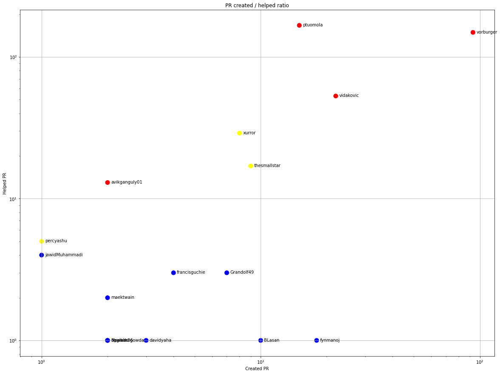

Latest record from the dataset:

<table border="1" class="dataframe">
  <thead>
    <tr style="text-align: right;">
      <th></th>
      <th>org</th>
      <th>repo</th>
      <th>type</th>
      <th>identifier</th>
      <th>subidentifier</th>
      <th>date</th>
      <th>author</th>
      <th>owner</th>
      <th>project</th>
    </tr>
  </thead>
  <tbody>
    <tr>
      <th>3365</th>
      <td>apache</td>
      <td>fineract</td>
      <td>PR_MERGED</td>
      <td>1610</td>
      <td>NaN</td>
      <td>2021-02-14 04:54:33+00:00</td>
      <td>ptuomola</td>
      <td>renovate-bot</td>
      <td>fineract</td>
    </tr>
  </tbody>
</table>

# Github Contributions per user

<table border="1" class="dataframe">
  <thead>
    <tr style="text-align: right;">
      <th></th>
      <th>contributions</th>
    </tr>
    <tr>
      <th>author</th>
      <th></th>
    </tr>
  </thead>
  <tbody>
    <tr>
      <th>vorburger</th>
      <td>1630</td>
    </tr>
    <tr>
      <th>awasum</th>
      <td>751</td>
    </tr>
    <tr>
      <th>ptuomola</th>
      <td>467</td>
    </tr>
    <tr>
      <th>asfgit</th>
      <td>249</td>
    </tr>
    <tr>
      <th>xurror</th>
      <td>234</td>
    </tr>
    <tr>
      <th>nazeer1100126</th>
      <td>179</td>
    </tr>
    <tr>
      <th>vidakovic</th>
      <td>108</td>
    </tr>
    <tr>
      <th>myrle-krantz</th>
      <td>103</td>
    </tr>
    <tr>
      <th>thesmallstar</th>
      <td>101</td>
    </tr>
    <tr>
      <th>avikganguly01</th>
      <td>88</td>
    </tr>
  </tbody>
</table>

## Contributors per participations in PRs which are not created by self (helping PRs)

<table border="1" class="dataframe">
  <thead>
    <tr style="text-align: right;">
      <th></th>
      <th>identifier</th>
    </tr>
    <tr>
      <th>author</th>
      <th></th>
    </tr>
  </thead>
  <tbody>
    <tr>
      <th>vorburger</th>
      <td>541</td>
    </tr>
    <tr>
      <th>awasum</th>
      <td>290</td>
    </tr>
    <tr>
      <th>asfgit</th>
      <td>253</td>
    </tr>
    <tr>
      <th>ptuomola</th>
      <td>236</td>
    </tr>
    <tr>
      <th>xurror</th>
      <td>129</td>
    </tr>
    <tr>
      <th>nazeer1100126</th>
      <td>79</td>
    </tr>
    <tr>
      <th>thesmallstar</th>
      <td>62</td>
    </tr>
    <tr>
      <th>therajanmaurya</th>
      <td>61</td>
    </tr>
    <tr>
      <th>vidakovic</th>
      <td>55</td>
    </tr>
    <tr>
      <th>vishwasbabu</th>
      <td>51</td>
    </tr>
    <tr>
      <th>avikganguly01</th>
      <td>49</td>
    </tr>
    <tr>
      <th>github-actions</th>
      <td>47</td>
    </tr>
    <tr>
      <th>edcable</th>
      <td>25</td>
    </tr>
    <tr>
      <th>myrle-krantz</th>
      <td>25</td>
    </tr>
    <tr>
      <th>ShruthiRajaram</th>
      <td>23</td>
    </tr>
    <tr>
      <th>jawidMuhammadi</th>
      <td>22</td>
    </tr>
    <tr>
      <th>Anh3h</th>
      <td>22</td>
    </tr>
    <tr>
      <th>maektwain</th>
      <td>20</td>
    </tr>
    <tr>
      <th>conradsp</th>
      <td>20</td>
    </tr>
    <tr>
      <th>miPlodder</th>
      <td>19</td>
    </tr>
  </tbody>
</table>

## Contributors per participations in any PRs

<table border="1" class="dataframe">
  <thead>
    <tr style="text-align: right;">
      <th></th>
      <th>identifier</th>
    </tr>
    <tr>
      <th>author</th>
      <th></th>
    </tr>
  </thead>
  <tbody>
    <tr>
      <th>vorburger</th>
      <td>878</td>
    </tr>
    <tr>
      <th>awasum</th>
      <td>303</td>
    </tr>
    <tr>
      <th>ptuomola</th>
      <td>296</td>
    </tr>
    <tr>
      <th>asfgit</th>
      <td>253</td>
    </tr>
    <tr>
      <th>renovate-bot</th>
      <td>250</td>
    </tr>
    <tr>
      <th>nazeer1100126</th>
      <td>191</td>
    </tr>
    <tr>
      <th>xurror</th>
      <td>173</td>
    </tr>
    <tr>
      <th>thesmallstar</th>
      <td>161</td>
    </tr>
    <tr>
      <th>vidakovic</th>
      <td>77</td>
    </tr>
    <tr>
      <th>vishwasbabu</th>
      <td>71</td>
    </tr>
    <tr>
      <th>percyashu</th>
      <td>62</td>
    </tr>
    <tr>
      <th>therajanmaurya</th>
      <td>61</td>
    </tr>
    <tr>
      <th>ShruthiRajaram</th>
      <td>60</td>
    </tr>
    <tr>
      <th>avikganguly01</th>
      <td>56</td>
    </tr>
    <tr>
      <th>github-actions</th>
      <td>47</td>
    </tr>
    <tr>
      <th>jawidMuhammadi</th>
      <td>40</td>
    </tr>
    <tr>
      <th>Anh3h</th>
      <td>39</td>
    </tr>
    <tr>
      <th>miPlodder</th>
      <td>39</td>
    </tr>
    <tr>
      <th>nikpawar89</th>
      <td>38</td>
    </tr>
    <tr>
      <th>maektwain</th>
      <td>35</td>
    </tr>
  </tbody>
</table>

# Bus factor (number of contributors responsible for the 50% of the prs) from last half year

## Contributors until the half of the all contributions

<table border="1" class="dataframe">
  <thead>
    <tr style="text-align: right;">
      <th></th>
      <th>author</th>
      <th>identifier</th>
      <th>cs</th>
      <th>ratio</th>
    </tr>
  </thead>
  <tbody>
    <tr>
      <th>0</th>
      <td>renovate-bot</td>
      <td>159</td>
      <td>159</td>
      <td>40.151515</td>
    </tr>
  </tbody>
</table>

## Pony number (bus factor)

    2

## Dev power (All the contributions in the ration of the top contributor)

    2.490566037735849

    

    

## People with created PRs > reviewed/commented PRS

    

    

## Same graph with focusing to the last 6 month

Only contributors with both created pr and helped pr visible

    

    

# Number of individual contributors per month

Number of different Github users who either created PR, commented PR, added review to a PR

Note: only events from apache/hadoop-ozone repository are included. Earlier PRs/comments are not here.

    

    

# Number of PRs closed/created per month

    /usr/lib/python3.9/site-packages/pandas/core/arrays/datetimes.py:1101: UserWarning: Converting to PeriodArray/Index representation will drop timezone information.
      warnings.warn(

    

    

# PR activity heatmap

    

    

