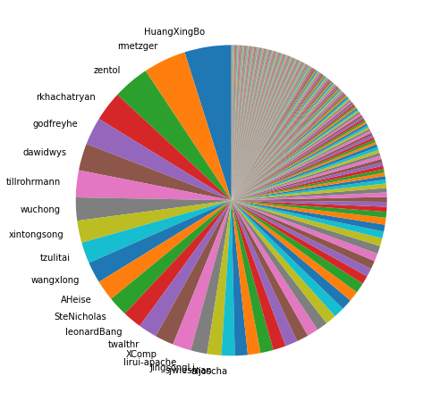
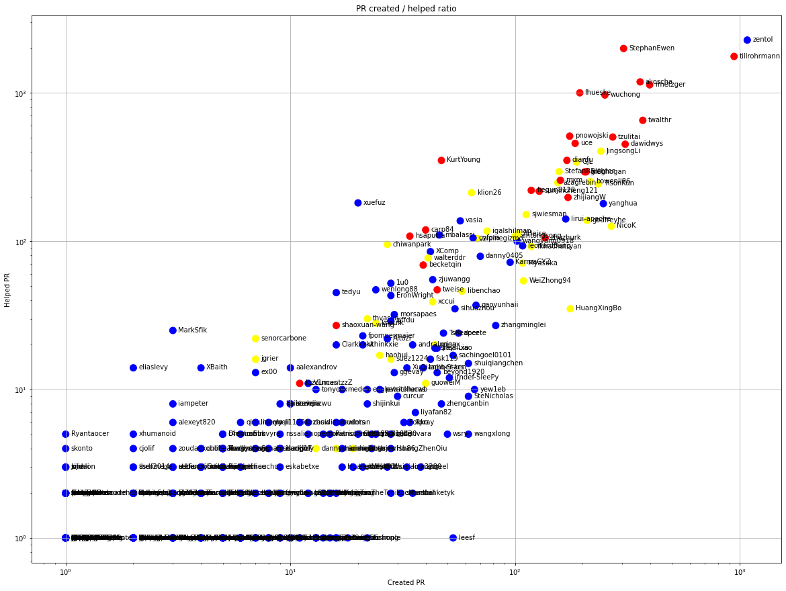
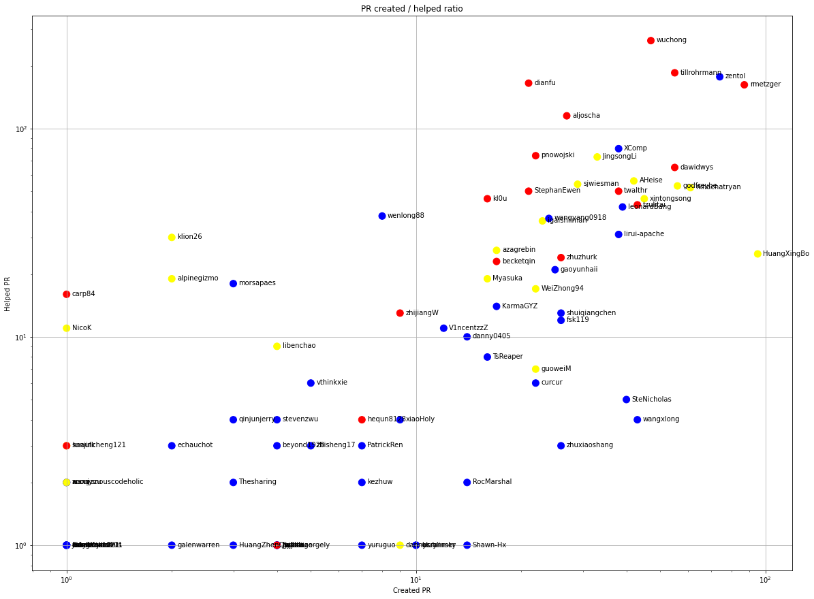
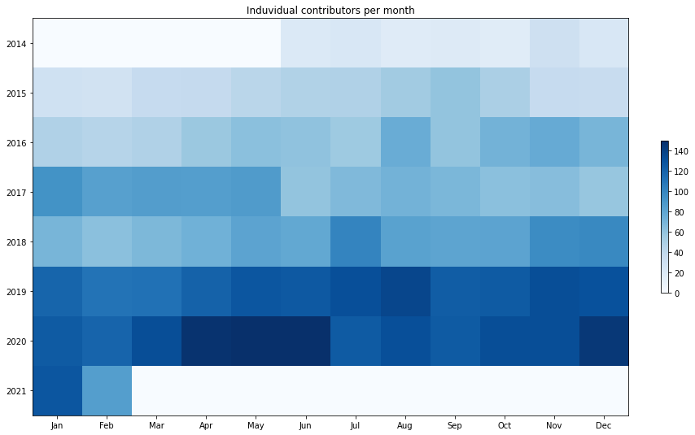
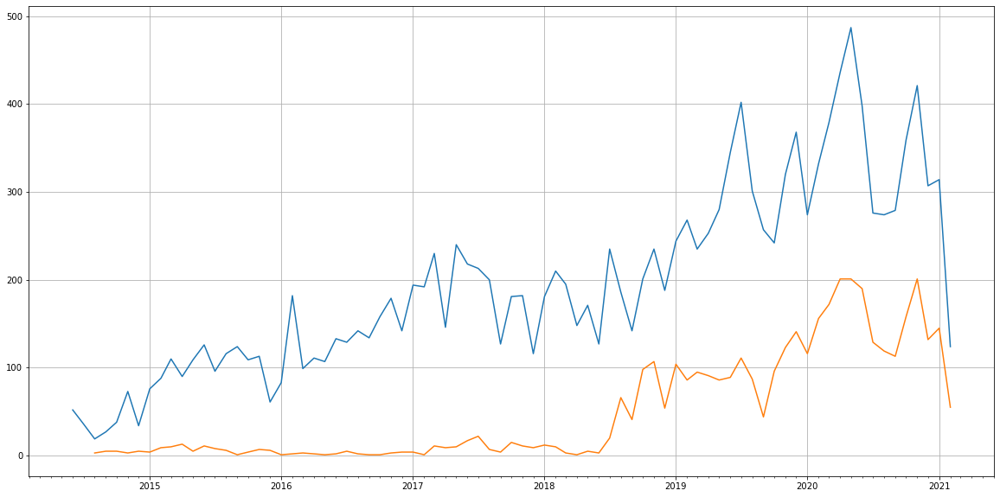
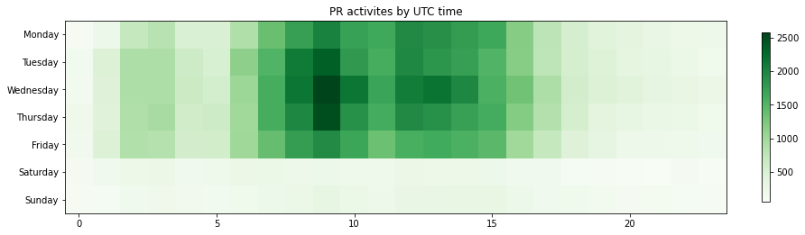

Latest record from the dataset:

<table border="1" class="dataframe">
  <thead>
    <tr style="text-align: right;">
      <th></th>
      <th>org</th>
      <th>repo</th>
      <th>type</th>
      <th>identifier</th>
      <th>subidentifier</th>
      <th>date</th>
      <th>author</th>
      <th>owner</th>
      <th>project</th>
    </tr>
  </thead>
  <tbody>
    <tr>
      <th>52098</th>
      <td>apache</td>
      <td>flink</td>
      <td>PR_COMMENTED</td>
      <td>14938</td>
      <td>NaN</td>
      <td>2021-02-14 07:27:06+00:00</td>
      <td>LadyForest</td>
      <td>LadyForest</td>
      <td>flink</td>
    </tr>
  </tbody>
</table>

# Github Contributions per user

<table border="1" class="dataframe">
  <thead>
    <tr style="text-align: right;">
      <th></th>
      <th>contributions</th>
    </tr>
    <tr>
      <th>author</th>
      <th></th>
    </tr>
  </thead>
  <tbody>
    <tr>
      <th>flinkbot</th>
      <td>13427</td>
    </tr>
    <tr>
      <th>zentol</th>
      <td>5156</td>
    </tr>
    <tr>
      <th>tillrohrmann</th>
      <td>4078</td>
    </tr>
    <tr>
      <th>StephanEwen</th>
      <td>3817</td>
    </tr>
    <tr>
      <th>wuchong</th>
      <td>2756</td>
    </tr>
    <tr>
      <th>rmetzger</th>
      <td>2608</td>
    </tr>
    <tr>
      <th>fhueske</th>
      <td>2547</td>
    </tr>
    <tr>
      <th>aljoscha</th>
      <td>2536</td>
    </tr>
    <tr>
      <th>zhijiangW</th>
      <td>1880</td>
    </tr>
    <tr>
      <th>pnowojski</th>
      <td>1775</td>
    </tr>
  </tbody>
</table>

## Contributors per participations in PRs which are not created by self (helping PRs)

<table border="1" class="dataframe">
  <thead>
    <tr style="text-align: right;">
      <th></th>
      <th>identifier</th>
    </tr>
    <tr>
      <th>author</th>
      <th></th>
    </tr>
  </thead>
  <tbody>
    <tr>
      <th>flinkbot</th>
      <td>7304</td>
    </tr>
    <tr>
      <th>zentol</th>
      <td>2265</td>
    </tr>
    <tr>
      <th>StephanEwen</th>
      <td>1988</td>
    </tr>
    <tr>
      <th>tillrohrmann</th>
      <td>1757</td>
    </tr>
    <tr>
      <th>aljoscha</th>
      <td>1184</td>
    </tr>
    <tr>
      <th>rmetzger</th>
      <td>1131</td>
    </tr>
    <tr>
      <th>fhueske</th>
      <td>999</td>
    </tr>
    <tr>
      <th>wuchong</th>
      <td>966</td>
    </tr>
    <tr>
      <th>twalthr</th>
      <td>652</td>
    </tr>
    <tr>
      <th>pnowojski</th>
      <td>510</td>
    </tr>
    <tr>
      <th>tzulitai</th>
      <td>503</td>
    </tr>
    <tr>
      <th>uce</th>
      <td>456</td>
    </tr>
    <tr>
      <th>dawidwys</th>
      <td>450</td>
    </tr>
    <tr>
      <th>JingsongLi</th>
      <td>404</td>
    </tr>
    <tr>
      <th>dianfu</th>
      <td>350</td>
    </tr>
    <tr>
      <th>KurtYoung</th>
      <td>350</td>
    </tr>
    <tr>
      <th>GJL</th>
      <td>341</td>
    </tr>
    <tr>
      <th>asfgit</th>
      <td>324</td>
    </tr>
    <tr>
      <th>StefanRRichter</th>
      <td>294</td>
    </tr>
    <tr>
      <th>kl0u</th>
      <td>293</td>
    </tr>
  </tbody>
</table>

## Contributors per participations in any PRs

<table border="1" class="dataframe">
  <thead>
    <tr style="text-align: right;">
      <th></th>
      <th>identifier</th>
    </tr>
    <tr>
      <th>author</th>
      <th></th>
    </tr>
  </thead>
  <tbody>
    <tr>
      <th>flinkbot</th>
      <td>7304</td>
    </tr>
    <tr>
      <th>zentol</th>
      <td>3308</td>
    </tr>
    <tr>
      <th>tillrohrmann</th>
      <td>2695</td>
    </tr>
    <tr>
      <th>StephanEwen</th>
      <td>2283</td>
    </tr>
    <tr>
      <th>aljoscha</th>
      <td>1542</td>
    </tr>
    <tr>
      <th>rmetzger</th>
      <td>1496</td>
    </tr>
    <tr>
      <th>wuchong</th>
      <td>1217</td>
    </tr>
    <tr>
      <th>fhueske</th>
      <td>1184</td>
    </tr>
    <tr>
      <th>twalthr</th>
      <td>1021</td>
    </tr>
    <tr>
      <th>dawidwys</th>
      <td>759</td>
    </tr>
    <tr>
      <th>tzulitai</th>
      <td>752</td>
    </tr>
    <tr>
      <th>pnowojski</th>
      <td>685</td>
    </tr>
    <tr>
      <th>JingsongLi</th>
      <td>645</td>
    </tr>
    <tr>
      <th>uce</th>
      <td>633</td>
    </tr>
    <tr>
      <th>GJL</th>
      <td>529</td>
    </tr>
    <tr>
      <th>dianfu</th>
      <td>520</td>
    </tr>
    <tr>
      <th>kl0u</th>
      <td>500</td>
    </tr>
    <tr>
      <th>greghogan</th>
      <td>497</td>
    </tr>
    <tr>
      <th>TisonKun</th>
      <td>478</td>
    </tr>
    <tr>
      <th>bowenli86</th>
      <td>468</td>
    </tr>
  </tbody>
</table>

# Bus factor (number of contributors responsible for the 50% of the prs) from last half year

## Contributors until the half of the all contributions

<table border="1" class="dataframe">
  <thead>
    <tr style="text-align: right;">
      <th></th>
      <th>author</th>
      <th>identifier</th>
      <th>cs</th>
      <th>ratio</th>
    </tr>
  </thead>
  <tbody>
    <tr>
      <th>0</th>
      <td>HuangXingBo</td>
      <td>95</td>
      <td>95</td>
      <td>4.856851</td>
    </tr>
    <tr>
      <th>1</th>
      <td>rmetzger</td>
      <td>87</td>
      <td>182</td>
      <td>4.447853</td>
    </tr>
    <tr>
      <th>2</th>
      <td>zentol</td>
      <td>74</td>
      <td>256</td>
      <td>3.783231</td>
    </tr>
    <tr>
      <th>3</th>
      <td>rkhachatryan</td>
      <td>61</td>
      <td>317</td>
      <td>3.118609</td>
    </tr>
    <tr>
      <th>4</th>
      <td>godfreyhe</td>
      <td>56</td>
      <td>373</td>
      <td>2.862986</td>
    </tr>
    <tr>
      <th>5</th>
      <td>dawidwys</td>
      <td>55</td>
      <td>428</td>
      <td>2.811861</td>
    </tr>
    <tr>
      <th>6</th>
      <td>tillrohrmann</td>
      <td>55</td>
      <td>483</td>
      <td>2.811861</td>
    </tr>
    <tr>
      <th>7</th>
      <td>wuchong</td>
      <td>47</td>
      <td>530</td>
      <td>2.402863</td>
    </tr>
    <tr>
      <th>8</th>
      <td>xintongsong</td>
      <td>45</td>
      <td>575</td>
      <td>2.300613</td>
    </tr>
    <tr>
      <th>9</th>
      <td>tzulitai</td>
      <td>43</td>
      <td>618</td>
      <td>2.198364</td>
    </tr>
    <tr>
      <th>10</th>
      <td>wangxlong</td>
      <td>43</td>
      <td>661</td>
      <td>2.198364</td>
    </tr>
    <tr>
      <th>11</th>
      <td>AHeise</td>
      <td>42</td>
      <td>703</td>
      <td>2.147239</td>
    </tr>
    <tr>
      <th>12</th>
      <td>SteNicholas</td>
      <td>40</td>
      <td>743</td>
      <td>2.044990</td>
    </tr>
    <tr>
      <th>13</th>
      <td>leonardBang</td>
      <td>39</td>
      <td>782</td>
      <td>1.993865</td>
    </tr>
    <tr>
      <th>14</th>
      <td>twalthr</td>
      <td>38</td>
      <td>820</td>
      <td>1.942740</td>
    </tr>
    <tr>
      <th>15</th>
      <td>XComp</td>
      <td>38</td>
      <td>858</td>
      <td>1.942740</td>
    </tr>
    <tr>
      <th>16</th>
      <td>lirui-apache</td>
      <td>38</td>
      <td>896</td>
      <td>1.942740</td>
    </tr>
    <tr>
      <th>17</th>
      <td>JingsongLi</td>
      <td>33</td>
      <td>929</td>
      <td>1.687117</td>
    </tr>
    <tr>
      <th>18</th>
      <td>sjwiesman</td>
      <td>29</td>
      <td>958</td>
      <td>1.482618</td>
    </tr>
  </tbody>
</table>

## Pony number (bus factor)

    20

## Dev power (All the contributions in the ration of the top contributor)

    20.589473684210528

    

    

## People with created PRs > reviewed/commented PRS

    

    

## Same graph with focusing to the last 6 month

Only contributors with both created pr and helped pr visible

    

    

# Number of individual contributors per month

Number of different Github users who either created PR, commented PR, added review to a PR

Note: only events from apache/hadoop-ozone repository are included. Earlier PRs/comments are not here.

    

    

# Number of PRs closed/created per month

    /usr/lib/python3.9/site-packages/pandas/core/arrays/datetimes.py:1101: UserWarning: Converting to PeriodArray/Index representation will drop timezone information.
      warnings.warn(

    

    

# PR activity heatmap

    

    

