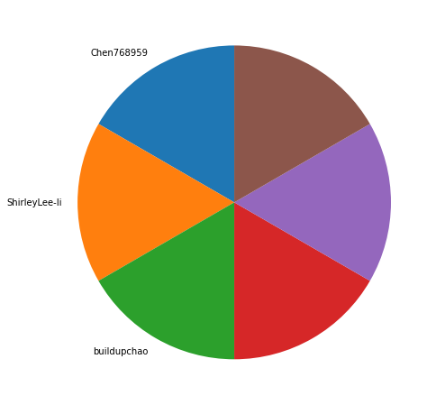
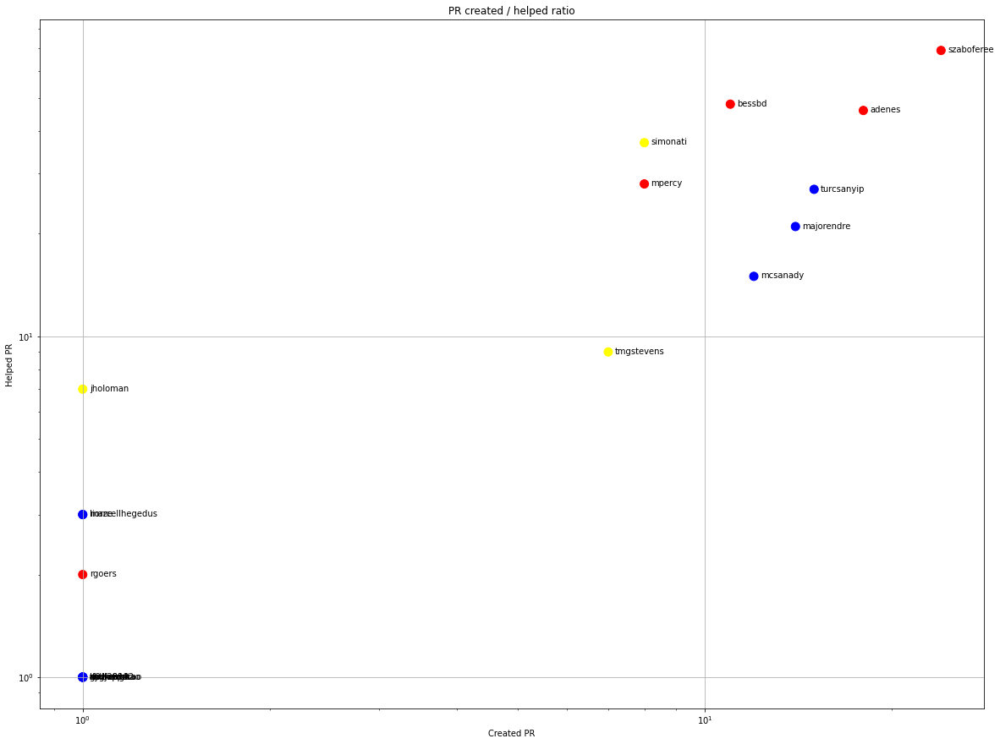
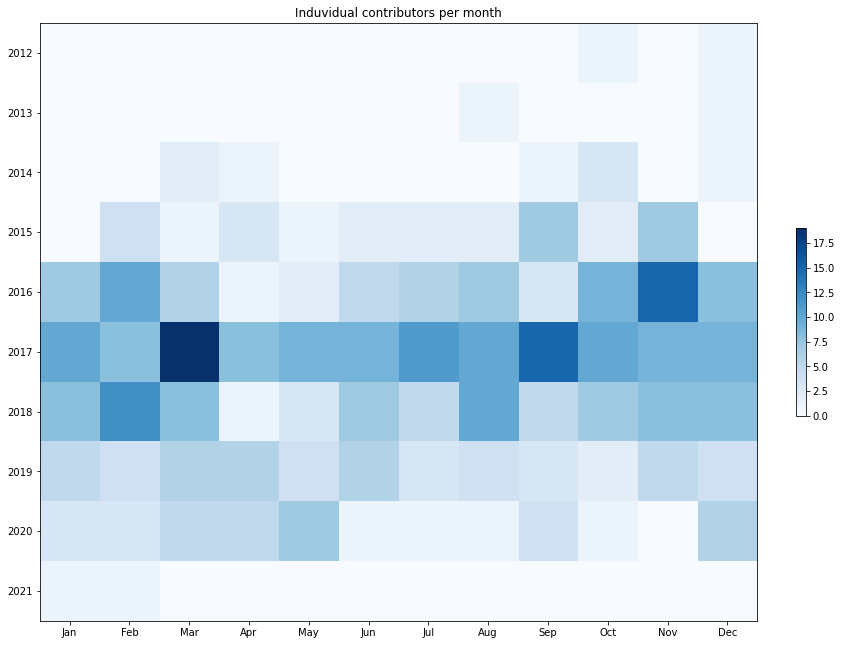
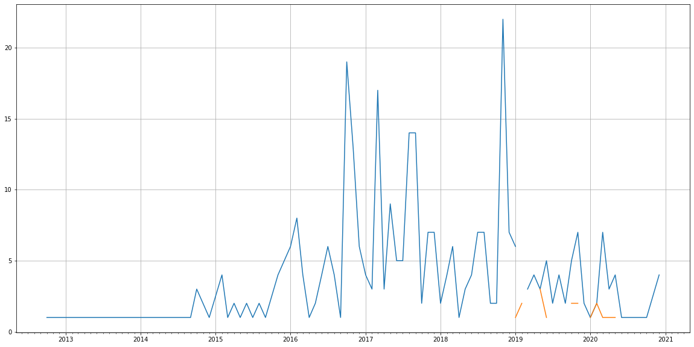
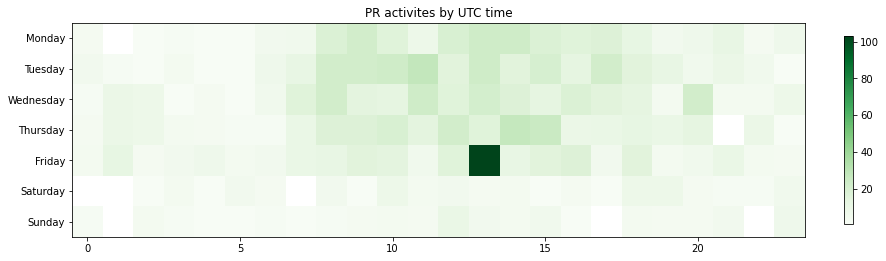

Latest record from the dataset:

<table border="1" class="dataframe">
  <thead>
    <tr style="text-align: right;">
      <th></th>
      <th>org</th>
      <th>repo</th>
      <th>type</th>
      <th>identifier</th>
      <th>subidentifier</th>
      <th>date</th>
      <th>author</th>
      <th>owner</th>
      <th>project</th>
    </tr>
  </thead>
  <tbody>
    <tr>
      <th>1147</th>
      <td>apache</td>
      <td>flume</td>
      <td>PR_COMMENTED</td>
      <td>326</td>
      <td>NaN</td>
      <td>2021-02-02 08:43:43+00:00</td>
      <td>avinashk07</td>
      <td>avinashk07</td>
      <td>flume</td>
    </tr>
  </tbody>
</table>

# Github Contributions per user

<table border="1" class="dataframe">
  <thead>
    <tr style="text-align: right;">
      <th></th>
      <th>contributions</th>
    </tr>
    <tr>
      <th>author</th>
      <th></th>
    </tr>
  </thead>
  <tbody>
    <tr>
      <th>bessbd</th>
      <td>118</td>
    </tr>
    <tr>
      <th>szaboferee</th>
      <td>105</td>
    </tr>
    <tr>
      <th>asfgit</th>
      <td>84</td>
    </tr>
    <tr>
      <th>adenes</th>
      <td>76</td>
    </tr>
    <tr>
      <th>simonati</th>
      <td>73</td>
    </tr>
    <tr>
      <th>mpercy</th>
      <td>67</td>
    </tr>
    <tr>
      <th>tmgstevens</th>
      <td>60</td>
    </tr>
    <tr>
      <th>turcsanyip</th>
      <td>37</td>
    </tr>
    <tr>
      <th>majorendre</th>
      <td>31</td>
    </tr>
    <tr>
      <th>harishreedharan</th>
      <td>26</td>
    </tr>
  </tbody>
</table>

## Contributors per participations in PRs which are not created by self (helping PRs)

<table border="1" class="dataframe">
  <thead>
    <tr style="text-align: right;">
      <th></th>
      <th>identifier</th>
    </tr>
    <tr>
      <th>author</th>
      <th></th>
    </tr>
  </thead>
  <tbody>
    <tr>
      <th>asfgit</th>
      <td>84</td>
    </tr>
    <tr>
      <th>szaboferee</th>
      <td>69</td>
    </tr>
    <tr>
      <th>bessbd</th>
      <td>48</td>
    </tr>
    <tr>
      <th>adenes</th>
      <td>46</td>
    </tr>
    <tr>
      <th>simonati</th>
      <td>37</td>
    </tr>
    <tr>
      <th>mpercy</th>
      <td>28</td>
    </tr>
    <tr>
      <th>turcsanyip</th>
      <td>27</td>
    </tr>
    <tr>
      <th>harishreedharan</th>
      <td>23</td>
    </tr>
    <tr>
      <th>majorendre</th>
      <td>21</td>
    </tr>
    <tr>
      <th>mcsanady</th>
      <td>15</td>
    </tr>
    <tr>
      <th>tmgstevens</th>
      <td>9</td>
    </tr>
    <tr>
      <th>jholoman</th>
      <td>7</td>
    </tr>
    <tr>
      <th>marcellhegedus</th>
      <td>3</td>
    </tr>
    <tr>
      <th>liorze</th>
      <td>3</td>
    </tr>
    <tr>
      <th>jarcec</th>
      <td>2</td>
    </tr>
    <tr>
      <th>meou</th>
      <td>2</td>
    </tr>
    <tr>
      <th>rgoers</th>
      <td>2</td>
    </tr>
    <tr>
      <th>qqj1979</th>
      <td>2</td>
    </tr>
    <tr>
      <th>martinKindall</th>
      <td>1</td>
    </tr>
    <tr>
      <th>JerryShaoPro</th>
      <td>1</td>
    </tr>
  </tbody>
</table>

## Contributors per participations in any PRs

<table border="1" class="dataframe">
  <thead>
    <tr style="text-align: right;">
      <th></th>
      <th>identifier</th>
    </tr>
    <tr>
      <th>author</th>
      <th></th>
    </tr>
  </thead>
  <tbody>
    <tr>
      <th>szaboferee</th>
      <td>93</td>
    </tr>
    <tr>
      <th>asfgit</th>
      <td>84</td>
    </tr>
    <tr>
      <th>adenes</th>
      <td>64</td>
    </tr>
    <tr>
      <th>bessbd</th>
      <td>59</td>
    </tr>
    <tr>
      <th>simonati</th>
      <td>45</td>
    </tr>
    <tr>
      <th>turcsanyip</th>
      <td>42</td>
    </tr>
    <tr>
      <th>mpercy</th>
      <td>36</td>
    </tr>
    <tr>
      <th>majorendre</th>
      <td>35</td>
    </tr>
    <tr>
      <th>mcsanady</th>
      <td>27</td>
    </tr>
    <tr>
      <th>harishreedharan</th>
      <td>23</td>
    </tr>
    <tr>
      <th>tmgstevens</th>
      <td>16</td>
    </tr>
    <tr>
      <th>dependabot</th>
      <td>8</td>
    </tr>
    <tr>
      <th>jholoman</th>
      <td>8</td>
    </tr>
    <tr>
      <th>AndreLouisCaron</th>
      <td>6</td>
    </tr>
    <tr>
      <th>zhulh200868</th>
      <td>6</td>
    </tr>
    <tr>
      <th>andrasbeni</th>
      <td>5</td>
    </tr>
    <tr>
      <th>JohnZZGithub</th>
      <td>5</td>
    </tr>
    <tr>
      <th>liorze</th>
      <td>4</td>
    </tr>
    <tr>
      <th>geoffroyvergne</th>
      <td>4</td>
    </tr>
    <tr>
      <th>stakafum</th>
      <td>4</td>
    </tr>
  </tbody>
</table>

# Bus factor (number of contributors responsible for the 50% of the prs) from last half year

## Contributors until the half of the all contributions

<table border="1" class="dataframe">
  <thead>
    <tr style="text-align: right;">
      <th></th>
      <th>author</th>
      <th>identifier</th>
      <th>cs</th>
      <th>ratio</th>
    </tr>
  </thead>
  <tbody>
    <tr>
      <th>0</th>
      <td>Chen768959</td>
      <td>1</td>
      <td>1</td>
      <td>16.666667</td>
    </tr>
    <tr>
      <th>1</th>
      <td>ShirleyLee-li</td>
      <td>1</td>
      <td>2</td>
      <td>16.666667</td>
    </tr>
  </tbody>
</table>

## Pony number (bus factor)

    3

## Dev power (All the contributions in the ration of the top contributor)

    6.0

    

    

## People with created PRs > reviewed/commented PRS

    

    

## Same graph with focusing to the last 6 month

Only contributors with both created pr and helped pr visible

    

    

# Number of individual contributors per month

Number of different Github users who either created PR, commented PR, added review to a PR

Note: only events from apache/hadoop-ozone repository are included. Earlier PRs/comments are not here.

    

    

# Number of PRs closed/created per month

    /usr/lib/python3.9/site-packages/pandas/core/arrays/datetimes.py:1101: UserWarning: Converting to PeriodArray/Index representation will drop timezone information.
      warnings.warn(

    

    

# PR activity heatmap

    

    

