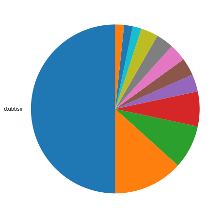
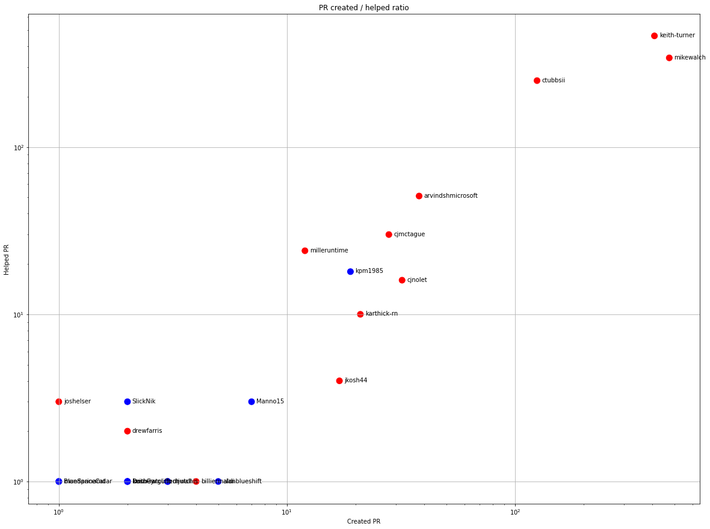
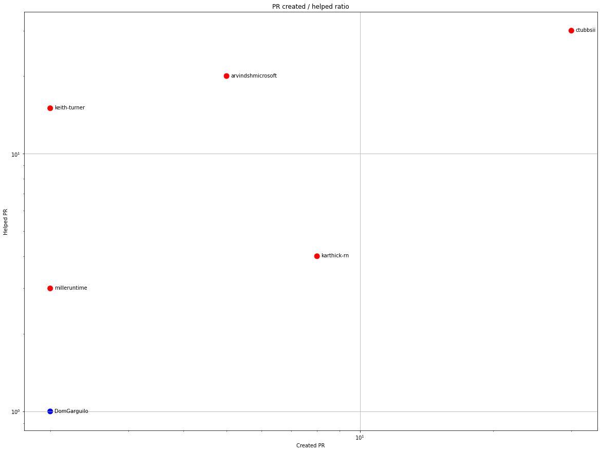
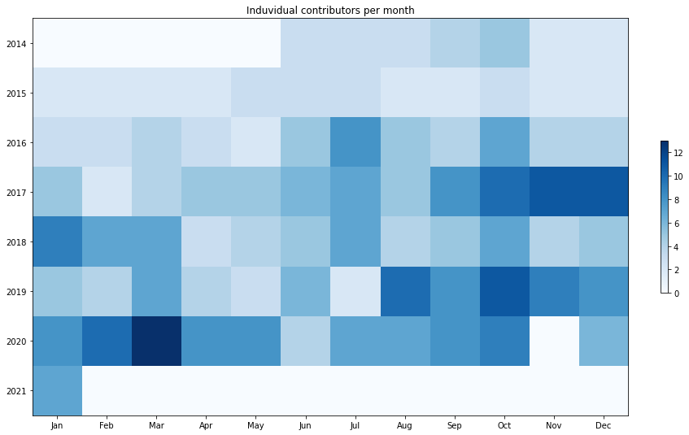
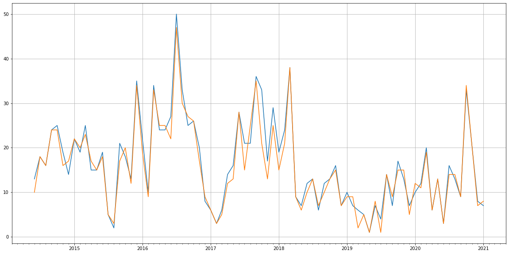
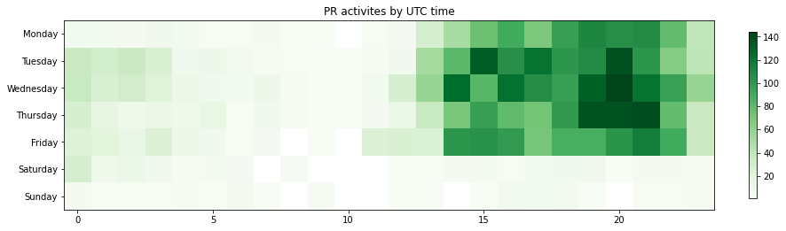

Latest record from the dataset:

<table border="1" class="dataframe">
  <thead>
    <tr style="text-align: right;">
      <th></th>
      <th>org</th>
      <th>repo</th>
      <th>type</th>
      <th>identifier</th>
      <th>subidentifier</th>
      <th>date</th>
      <th>author</th>
      <th>owner</th>
      <th>project</th>
    </tr>
  </thead>
  <tbody>
    <tr>
      <th>3805</th>
      <td>apache</td>
      <td>fluo-muchos</td>
      <td>PR_COMMENTED</td>
      <td>386</td>
      <td>NaN</td>
      <td>2021-01-28 20:07:52+00:00</td>
      <td>keith-turner</td>
      <td>GreenCee</td>
      <td>fluo</td>
    </tr>
  </tbody>
</table>

# Github Contributions per user

<table border="1" class="dataframe">
  <thead>
    <tr style="text-align: right;">
      <th></th>
      <th>contributions</th>
    </tr>
    <tr>
      <th>author</th>
      <th></th>
    </tr>
  </thead>
  <tbody>
    <tr>
      <th>keith-turner</th>
      <td>1227</td>
    </tr>
    <tr>
      <th>mikewalch</th>
      <td>585</td>
    </tr>
    <tr>
      <th>ctubbsii</th>
      <td>535</td>
    </tr>
    <tr>
      <th>asfgit</th>
      <td>175</td>
    </tr>
    <tr>
      <th>arvindshmicrosoft</th>
      <td>130</td>
    </tr>
    <tr>
      <th>cjmctague</th>
      <td>55</td>
    </tr>
    <tr>
      <th>milleruntime</th>
      <td>35</td>
    </tr>
    <tr>
      <th>kpm1985</th>
      <td>32</td>
    </tr>
    <tr>
      <th>SlickNik</th>
      <td>27</td>
    </tr>
    <tr>
      <th>cjnolet</th>
      <td>25</td>
    </tr>
  </tbody>
</table>

## Contributors per participations in PRs which are not created by self (helping PRs)

<table border="1" class="dataframe">
  <thead>
    <tr style="text-align: right;">
      <th></th>
      <th>identifier</th>
    </tr>
    <tr>
      <th>author</th>
      <th></th>
    </tr>
  </thead>
  <tbody>
    <tr>
      <th>keith-turner</th>
      <td>463</td>
    </tr>
    <tr>
      <th>mikewalch</th>
      <td>342</td>
    </tr>
    <tr>
      <th>ctubbsii</th>
      <td>250</td>
    </tr>
    <tr>
      <th>asfgit</th>
      <td>174</td>
    </tr>
    <tr>
      <th>arvindshmicrosoft</th>
      <td>51</td>
    </tr>
    <tr>
      <th>cjmctague</th>
      <td>30</td>
    </tr>
    <tr>
      <th>milleruntime</th>
      <td>24</td>
    </tr>
    <tr>
      <th>kpm1985</th>
      <td>18</td>
    </tr>
    <tr>
      <th>cjnolet</th>
      <td>16</td>
    </tr>
    <tr>
      <th>karthick-rn</th>
      <td>10</td>
    </tr>
    <tr>
      <th>jkosh44</th>
      <td>4</td>
    </tr>
    <tr>
      <th>joshelser</th>
      <td>3</td>
    </tr>
    <tr>
      <th>Manno15</th>
      <td>3</td>
    </tr>
    <tr>
      <th>SlickNik</th>
      <td>3</td>
    </tr>
    <tr>
      <th>ivakegg</th>
      <td>3</td>
    </tr>
    <tr>
      <th>drewfarris</th>
      <td>2</td>
    </tr>
    <tr>
      <th>keith-ratcliffe</th>
      <td>1</td>
    </tr>
    <tr>
      <th>mandarinamdar</th>
      <td>1</td>
    </tr>
    <tr>
      <th>mjwall</th>
      <td>1</td>
    </tr>
    <tr>
      <th>lstav</th>
      <td>1</td>
    </tr>
  </tbody>
</table>

## Contributors per participations in any PRs

<table border="1" class="dataframe">
  <thead>
    <tr style="text-align: right;">
      <th></th>
      <th>identifier</th>
    </tr>
    <tr>
      <th>author</th>
      <th></th>
    </tr>
  </thead>
  <tbody>
    <tr>
      <th>keith-turner</th>
      <td>672</td>
    </tr>
    <tr>
      <th>mikewalch</th>
      <td>572</td>
    </tr>
    <tr>
      <th>ctubbsii</th>
      <td>336</td>
    </tr>
    <tr>
      <th>asfgit</th>
      <td>174</td>
    </tr>
    <tr>
      <th>arvindshmicrosoft</th>
      <td>89</td>
    </tr>
    <tr>
      <th>cjmctague</th>
      <td>58</td>
    </tr>
    <tr>
      <th>cjnolet</th>
      <td>48</td>
    </tr>
    <tr>
      <th>kpm1985</th>
      <td>37</td>
    </tr>
    <tr>
      <th>milleruntime</th>
      <td>36</td>
    </tr>
    <tr>
      <th>karthick-rn</th>
      <td>31</td>
    </tr>
    <tr>
      <th>jkosh44</th>
      <td>21</td>
    </tr>
    <tr>
      <th>kamaci</th>
      <td>10</td>
    </tr>
    <tr>
      <th>Manno15</th>
      <td>10</td>
    </tr>
    <tr>
      <th>ericnewton</th>
      <td>10</td>
    </tr>
    <tr>
      <th>plainolneesh</th>
      <td>7</td>
    </tr>
    <tr>
      <th>shannawaz</th>
      <td>6</td>
    </tr>
    <tr>
      <th>alanblueshift</th>
      <td>6</td>
    </tr>
    <tr>
      <th>jmark99</th>
      <td>6</td>
    </tr>
    <tr>
      <th>SlickNik</th>
      <td>5</td>
    </tr>
    <tr>
      <th>billierinaldi</th>
      <td>5</td>
    </tr>
  </tbody>
</table>

# Bus factor (number of contributors responsible for the 50% of the prs) from last half year

## Contributors until the half of the all contributions

<table border="1" class="dataframe">
  <thead>
    <tr style="text-align: right;">
      <th></th>
      <th>author</th>
      <th>identifier</th>
      <th>cs</th>
      <th>ratio</th>
    </tr>
  </thead>
  <tbody>
  </tbody>
</table>

## Pony number (bus factor)

    1

## Dev power (All the contributions in the ration of the top contributor)

    2.0

    

    

## People with created PRs > reviewed/commented PRS

    

    

## Same graph with focusing to the last 6 month

Only contributors with both created pr and helped pr visible

    

    

# Number of individual contributors per month

Number of different Github users who either created PR, commented PR, added review to a PR

Note: only events from apache/hadoop-ozone repository are included. Earlier PRs/comments are not here.

    

    

# Number of PRs closed/created per month

    /usr/lib/python3.9/site-packages/pandas/core/arrays/datetimes.py:1101: UserWarning: Converting to PeriodArray/Index representation will drop timezone information.
      warnings.warn(

    

    

# PR activity heatmap

    

    

