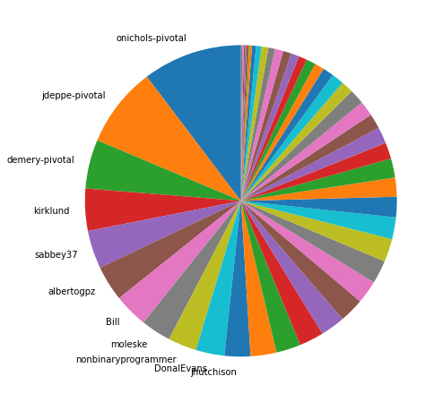
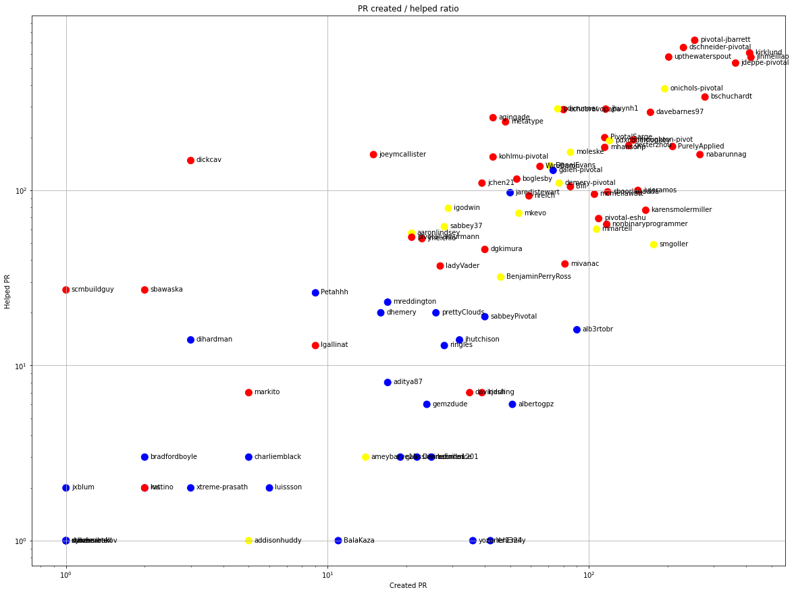
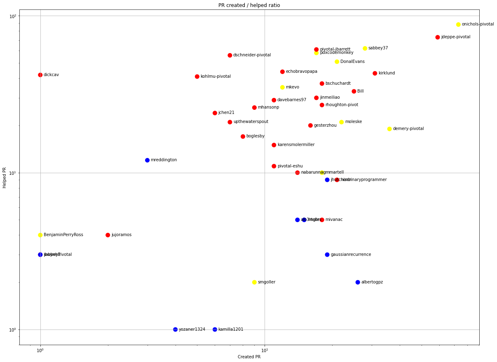
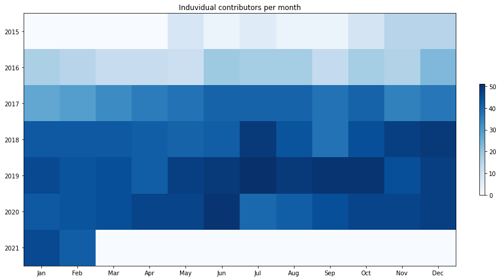
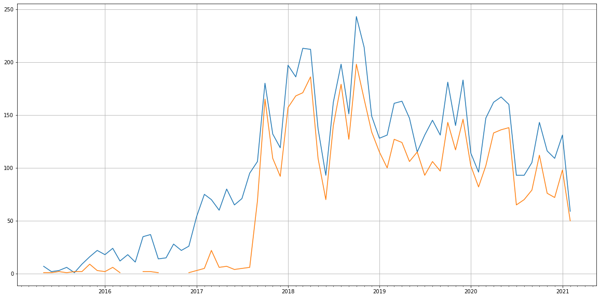
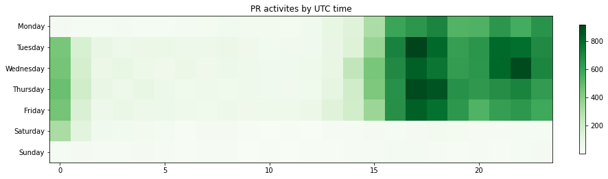

Latest record from the dataset:

<table border="1" class="dataframe">
  <thead>
    <tr style="text-align: right;">
      <th></th>
      <th>org</th>
      <th>repo</th>
      <th>type</th>
      <th>identifier</th>
      <th>subidentifier</th>
      <th>date</th>
      <th>author</th>
      <th>owner</th>
      <th>project</th>
    </tr>
  </thead>
  <tbody>
    <tr>
      <th>29940</th>
      <td>apache</td>
      <td>geode</td>
      <td>PR_REVIEW_APPROVED</td>
      <td>6030</td>
      <td>NaN</td>
      <td>2021-02-12 20:59:25+00:00</td>
      <td>onichols-pivotal</td>
      <td>demery-pivotal</td>
      <td>geode</td>
    </tr>
  </tbody>
</table>

# Github Contributions per user

<table border="1" class="dataframe">
  <thead>
    <tr style="text-align: right;">
      <th></th>
      <th>contributions</th>
    </tr>
    <tr>
      <th>author</th>
      <th></th>
    </tr>
  </thead>
  <tbody>
    <tr>
      <th>pivotal-jbarrett</th>
      <td>1765</td>
    </tr>
    <tr>
      <th>dschneider-pivotal</th>
      <td>1264</td>
    </tr>
    <tr>
      <th>jinmeiliao</th>
      <td>1034</td>
    </tr>
    <tr>
      <th>kirklund</th>
      <td>967</td>
    </tr>
    <tr>
      <th>upthewaterspout</th>
      <td>844</td>
    </tr>
    <tr>
      <th>jdeppe-pivotal</th>
      <td>813</td>
    </tr>
    <tr>
      <th>lgtm-com</th>
      <td>579</td>
    </tr>
    <tr>
      <th>onichols-pivotal</th>
      <td>571</td>
    </tr>
    <tr>
      <th>bschuchardt</th>
      <td>513</td>
    </tr>
    <tr>
      <th>pdxrunner</th>
      <td>488</td>
    </tr>
  </tbody>
</table>

## Contributors per participations in PRs which are not created by self (helping PRs)

<table border="1" class="dataframe">
  <thead>
    <tr style="text-align: right;">
      <th></th>
      <th>identifier</th>
    </tr>
    <tr>
      <th>author</th>
      <th></th>
    </tr>
  </thead>
  <tbody>
    <tr>
      <th>pivotal-jbarrett</th>
      <td>719</td>
    </tr>
    <tr>
      <th>dschneider-pivotal</th>
      <td>654</td>
    </tr>
    <tr>
      <th>kirklund</th>
      <td>609</td>
    </tr>
    <tr>
      <th>upthewaterspout</th>
      <td>577</td>
    </tr>
    <tr>
      <th>jinmeiliao</th>
      <td>575</td>
    </tr>
    <tr>
      <th>jdeppe-pivotal</th>
      <td>533</td>
    </tr>
    <tr>
      <th>onichols-pivotal</th>
      <td>380</td>
    </tr>
    <tr>
      <th>bschuchardt</th>
      <td>341</td>
    </tr>
    <tr>
      <th>pdxrunner</th>
      <td>292</td>
    </tr>
    <tr>
      <th>jhuynh1</th>
      <td>291</td>
    </tr>
    <tr>
      <th>echobravopapa</th>
      <td>289</td>
    </tr>
    <tr>
      <th>davebarnes97</th>
      <td>279</td>
    </tr>
    <tr>
      <th>agingade</th>
      <td>260</td>
    </tr>
    <tr>
      <th>metatype</th>
      <td>246</td>
    </tr>
    <tr>
      <th>PivotalSarge</th>
      <td>200</td>
    </tr>
    <tr>
      <th>lgtm-com</th>
      <td>196</td>
    </tr>
    <tr>
      <th>rhoughton-pivot</th>
      <td>194</td>
    </tr>
    <tr>
      <th>pdxcodemonkey</th>
      <td>192</td>
    </tr>
    <tr>
      <th>gesterzhou</th>
      <td>180</td>
    </tr>
    <tr>
      <th>PurelyApplied</th>
      <td>178</td>
    </tr>
  </tbody>
</table>

## Contributors per participations in any PRs

<table border="1" class="dataframe">
  <thead>
    <tr style="text-align: right;">
      <th></th>
      <th>identifier</th>
    </tr>
    <tr>
      <th>author</th>
      <th></th>
    </tr>
  </thead>
  <tbody>
    <tr>
      <th>kirklund</th>
      <td>1021</td>
    </tr>
    <tr>
      <th>jinmeiliao</th>
      <td>992</td>
    </tr>
    <tr>
      <th>pivotal-jbarrett</th>
      <td>951</td>
    </tr>
    <tr>
      <th>jdeppe-pivotal</th>
      <td>897</td>
    </tr>
    <tr>
      <th>dschneider-pivotal</th>
      <td>883</td>
    </tr>
    <tr>
      <th>upthewaterspout</th>
      <td>765</td>
    </tr>
    <tr>
      <th>bschuchardt</th>
      <td>619</td>
    </tr>
    <tr>
      <th>onichols-pivotal</th>
      <td>575</td>
    </tr>
    <tr>
      <th>davebarnes97</th>
      <td>439</td>
    </tr>
    <tr>
      <th>nabarunnag</th>
      <td>426</td>
    </tr>
    <tr>
      <th>jhuynh1</th>
      <td>407</td>
    </tr>
    <tr>
      <th>PurelyApplied</th>
      <td>387</td>
    </tr>
    <tr>
      <th>pdxrunner</th>
      <td>368</td>
    </tr>
    <tr>
      <th>echobravopapa</th>
      <td>365</td>
    </tr>
    <tr>
      <th>rhoughton-pivot</th>
      <td>342</td>
    </tr>
    <tr>
      <th>gesterzhou</th>
      <td>322</td>
    </tr>
    <tr>
      <th>pdxcodemonkey</th>
      <td>312</td>
    </tr>
    <tr>
      <th>agingade</th>
      <td>303</td>
    </tr>
    <tr>
      <th>PivotalSarge</th>
      <td>297</td>
    </tr>
    <tr>
      <th>mhansonp</th>
      <td>291</td>
    </tr>
  </tbody>
</table>

# Bus factor (number of contributors responsible for the 50% of the prs) from last half year

## Contributors until the half of the all contributions

<table border="1" class="dataframe">
  <thead>
    <tr style="text-align: right;">
      <th></th>
      <th>author</th>
      <th>identifier</th>
      <th>cs</th>
      <th>ratio</th>
    </tr>
  </thead>
  <tbody>
    <tr>
      <th>0</th>
      <td>onichols-pivotal</td>
      <td>73</td>
      <td>73</td>
      <td>10.310734</td>
    </tr>
    <tr>
      <th>1</th>
      <td>jdeppe-pivotal</td>
      <td>59</td>
      <td>132</td>
      <td>8.333333</td>
    </tr>
    <tr>
      <th>2</th>
      <td>demery-pivotal</td>
      <td>36</td>
      <td>168</td>
      <td>5.084746</td>
    </tr>
    <tr>
      <th>3</th>
      <td>kirklund</td>
      <td>31</td>
      <td>199</td>
      <td>4.378531</td>
    </tr>
    <tr>
      <th>4</th>
      <td>sabbey37</td>
      <td>28</td>
      <td>227</td>
      <td>3.954802</td>
    </tr>
    <tr>
      <th>5</th>
      <td>albertogpz</td>
      <td>26</td>
      <td>253</td>
      <td>3.672316</td>
    </tr>
    <tr>
      <th>6</th>
      <td>Bill</td>
      <td>25</td>
      <td>278</td>
      <td>3.531073</td>
    </tr>
    <tr>
      <th>7</th>
      <td>moleske</td>
      <td>22</td>
      <td>300</td>
      <td>3.107345</td>
    </tr>
    <tr>
      <th>8</th>
      <td>nonbinaryprogrammer</td>
      <td>21</td>
      <td>321</td>
      <td>2.966102</td>
    </tr>
    <tr>
      <th>9</th>
      <td>DonalEvans</td>
      <td>21</td>
      <td>342</td>
      <td>2.966102</td>
    </tr>
  </tbody>
</table>

## Pony number (bus factor)

    11

## Dev power (All the contributions in the ration of the top contributor)

    9.698630136986303

    

    

## People with created PRs > reviewed/commented PRS

    

    

## Same graph with focusing to the last 6 month

Only contributors with both created pr and helped pr visible

    

    

# Number of individual contributors per month

Number of different Github users who either created PR, commented PR, added review to a PR

Note: only events from apache/hadoop-ozone repository are included. Earlier PRs/comments are not here.

    

    

# Number of PRs closed/created per month

    /usr/lib/python3.9/site-packages/pandas/core/arrays/datetimes.py:1101: UserWarning: Converting to PeriodArray/Index representation will drop timezone information.
      warnings.warn(

    

    

# PR activity heatmap

    

    

