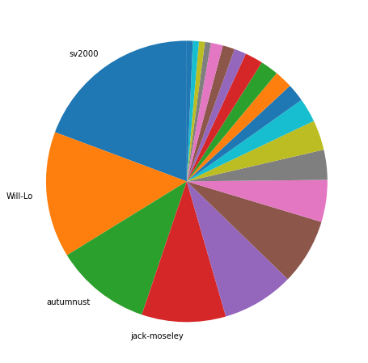
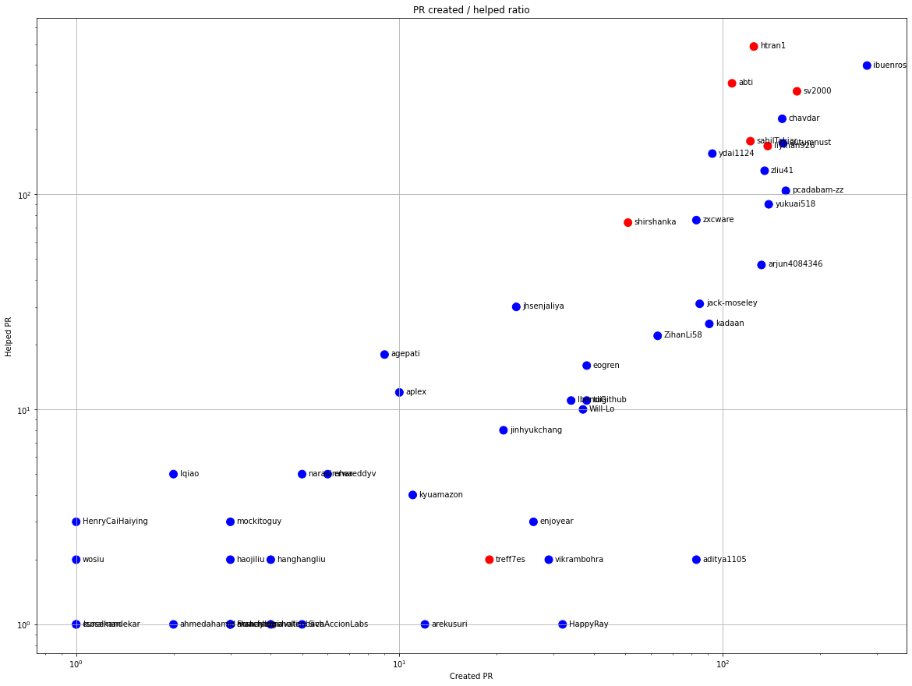
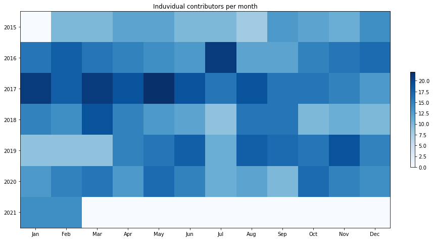
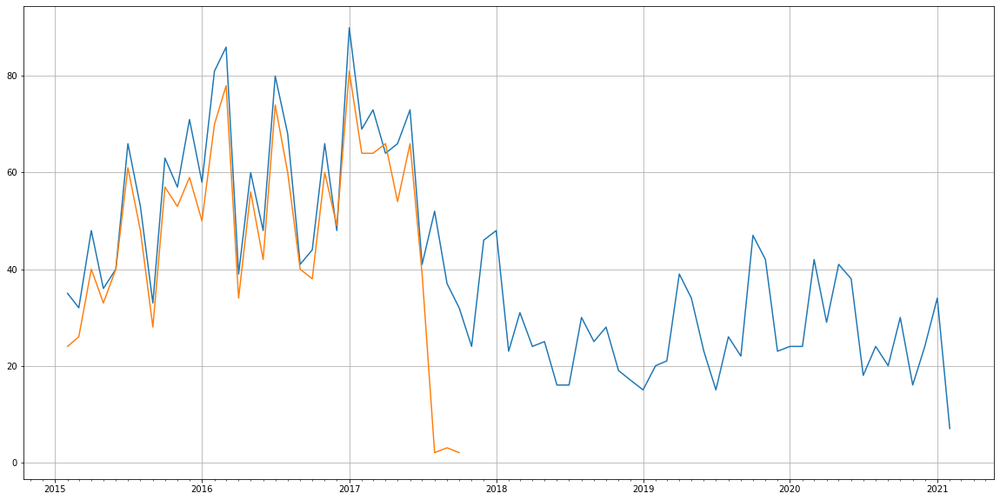
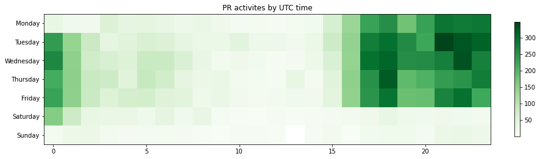

Latest record from the dataset:

<table border="1" class="dataframe">
  <thead>
    <tr style="text-align: right;">
      <th></th>
      <th>org</th>
      <th>repo</th>
      <th>type</th>
      <th>identifier</th>
      <th>subidentifier</th>
      <th>date</th>
      <th>author</th>
      <th>owner</th>
      <th>project</th>
    </tr>
  </thead>
  <tbody>
    <tr>
      <th>11997</th>
      <td>apache</td>
      <td>incubator-gobblin</td>
      <td>PR_REVIEW_APPROVED</td>
      <td>3204</td>
      <td>NaN</td>
      <td>2021-02-11 19:46:20+00:00</td>
      <td>aplex</td>
      <td>sekikn</td>
      <td>gobblin</td>
    </tr>
  </tbody>
</table>

# Github Contributions per user

<table border="1" class="dataframe">
  <thead>
    <tr style="text-align: right;">
      <th></th>
      <th>contributions</th>
    </tr>
    <tr>
      <th>author</th>
      <th></th>
    </tr>
  </thead>
  <tbody>
    <tr>
      <th>htran1</th>
      <td>728</td>
    </tr>
    <tr>
      <th>ibuenros</th>
      <td>721</td>
    </tr>
    <tr>
      <th>sv2000</th>
      <td>664</td>
    </tr>
    <tr>
      <th>abti</th>
      <td>517</td>
    </tr>
    <tr>
      <th>chavdar</th>
      <td>420</td>
    </tr>
    <tr>
      <th>coveralls</th>
      <td>401</td>
    </tr>
    <tr>
      <th>sahilTakiar</th>
      <td>336</td>
    </tr>
    <tr>
      <th>autumnust</th>
      <td>322</td>
    </tr>
    <tr>
      <th>codecov-io</th>
      <td>319</td>
    </tr>
    <tr>
      <th>liyinan926</th>
      <td>248</td>
    </tr>
  </tbody>
</table>

## Contributors per participations in PRs which are not created by self (helping PRs)

<table border="1" class="dataframe">
  <thead>
    <tr style="text-align: right;">
      <th></th>
      <th>identifier</th>
    </tr>
    <tr>
      <th>author</th>
      <th></th>
    </tr>
  </thead>
  <tbody>
    <tr>
      <th>htran1</th>
      <td>488</td>
    </tr>
    <tr>
      <th>ibuenros</th>
      <td>398</td>
    </tr>
    <tr>
      <th>abti</th>
      <td>329</td>
    </tr>
    <tr>
      <th>codecov-io</th>
      <td>319</td>
    </tr>
    <tr>
      <th>sv2000</th>
      <td>302</td>
    </tr>
    <tr>
      <th>coveralls</th>
      <td>228</td>
    </tr>
    <tr>
      <th>chavdar</th>
      <td>225</td>
    </tr>
    <tr>
      <th>sahilTakiar</th>
      <td>177</td>
    </tr>
    <tr>
      <th>autumnust</th>
      <td>173</td>
    </tr>
    <tr>
      <th>liyinan926</th>
      <td>168</td>
    </tr>
    <tr>
      <th>ydai1124</th>
      <td>155</td>
    </tr>
    <tr>
      <th>zliu41</th>
      <td>129</td>
    </tr>
    <tr>
      <th>pcadabam-zz</th>
      <td>104</td>
    </tr>
    <tr>
      <th>yukuai518</th>
      <td>90</td>
    </tr>
    <tr>
      <th>zxcware</th>
      <td>76</td>
    </tr>
    <tr>
      <th>shirshanka</th>
      <td>74</td>
    </tr>
    <tr>
      <th>arjun4084346</th>
      <td>47</td>
    </tr>
    <tr>
      <th>codecov-commenter</th>
      <td>31</td>
    </tr>
    <tr>
      <th>jack-moseley</th>
      <td>31</td>
    </tr>
    <tr>
      <th>jhsenjaliya</th>
      <td>30</td>
    </tr>
  </tbody>
</table>

## Contributors per participations in any PRs

<table border="1" class="dataframe">
  <thead>
    <tr style="text-align: right;">
      <th></th>
      <th>identifier</th>
    </tr>
    <tr>
      <th>author</th>
      <th></th>
    </tr>
  </thead>
  <tbody>
    <tr>
      <th>ibuenros</th>
      <td>678</td>
    </tr>
    <tr>
      <th>htran1</th>
      <td>613</td>
    </tr>
    <tr>
      <th>sv2000</th>
      <td>472</td>
    </tr>
    <tr>
      <th>abti</th>
      <td>436</td>
    </tr>
    <tr>
      <th>chavdar</th>
      <td>378</td>
    </tr>
    <tr>
      <th>autumnust</th>
      <td>327</td>
    </tr>
    <tr>
      <th>codecov-io</th>
      <td>319</td>
    </tr>
    <tr>
      <th>liyinan926</th>
      <td>306</td>
    </tr>
    <tr>
      <th>sahilTakiar</th>
      <td>299</td>
    </tr>
    <tr>
      <th>zliu41</th>
      <td>264</td>
    </tr>
    <tr>
      <th>pcadabam-zz</th>
      <td>261</td>
    </tr>
    <tr>
      <th>ydai1124</th>
      <td>248</td>
    </tr>
    <tr>
      <th>yukuai518</th>
      <td>229</td>
    </tr>
    <tr>
      <th>coveralls</th>
      <td>228</td>
    </tr>
    <tr>
      <th>arjun4084346</th>
      <td>179</td>
    </tr>
    <tr>
      <th>zxcware</th>
      <td>159</td>
    </tr>
    <tr>
      <th>shirshanka</th>
      <td>125</td>
    </tr>
    <tr>
      <th>jack-moseley</th>
      <td>116</td>
    </tr>
    <tr>
      <th>kadaan</th>
      <td>116</td>
    </tr>
    <tr>
      <th>ZihanLi58</th>
      <td>85</td>
    </tr>
  </tbody>
</table>

# Bus factor (number of contributors responsible for the 50% of the prs) from last half year

## Contributors until the half of the all contributions

<table border="1" class="dataframe">
  <thead>
    <tr style="text-align: right;">
      <th></th>
      <th>author</th>
      <th>identifier</th>
      <th>cs</th>
      <th>ratio</th>
    </tr>
  </thead>
  <tbody>
    <tr>
      <th>0</th>
      <td>sv2000</td>
      <td>28</td>
      <td>28</td>
      <td>19.310345</td>
    </tr>
    <tr>
      <th>1</th>
      <td>Will-Lo</td>
      <td>21</td>
      <td>49</td>
      <td>14.482759</td>
    </tr>
    <tr>
      <th>2</th>
      <td>autumnust</td>
      <td>16</td>
      <td>65</td>
      <td>11.034483</td>
    </tr>
  </tbody>
</table>

## Pony number (bus factor)

    4

## Dev power (All the contributions in the ration of the top contributor)

    5.178571428571427

    

    

## People with created PRs > reviewed/commented PRS

    

    

## Same graph with focusing to the last 6 month

Only contributors with both created pr and helped pr visible

    

    

# Number of individual contributors per month

Number of different Github users who either created PR, commented PR, added review to a PR

Note: only events from apache/hadoop-ozone repository are included. Earlier PRs/comments are not here.

    

    

# Number of PRs closed/created per month

    /usr/lib/python3.9/site-packages/pandas/core/arrays/datetimes.py:1101: UserWarning: Converting to PeriodArray/Index representation will drop timezone information.
      warnings.warn(

    

    

# PR activity heatmap

    

    

