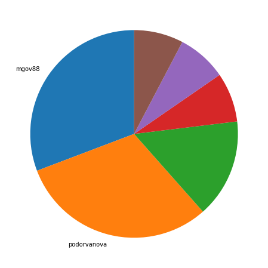
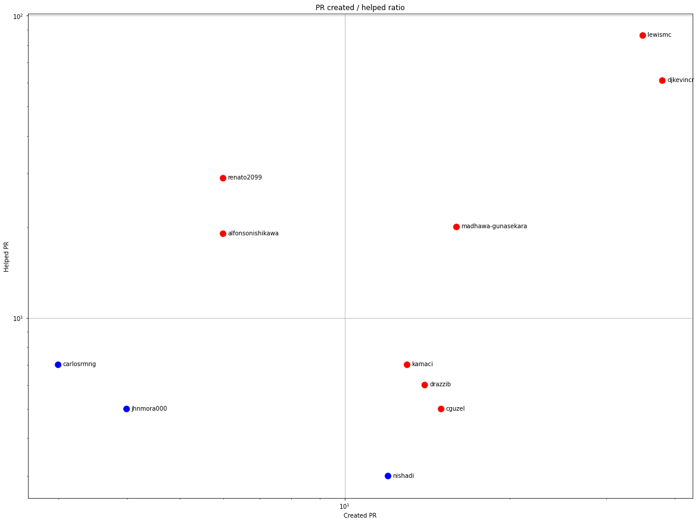
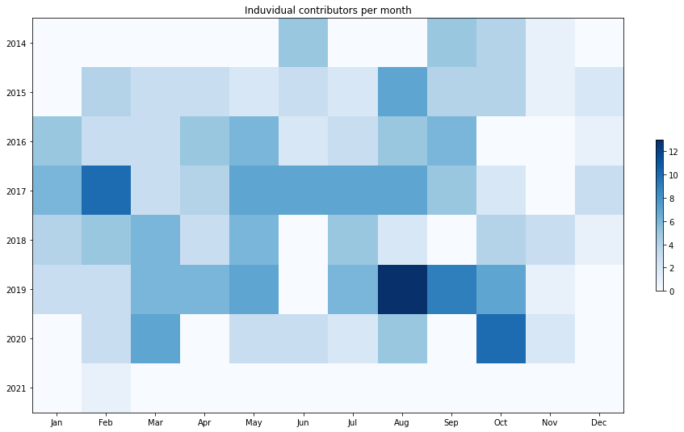
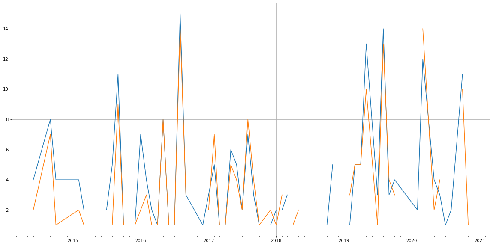
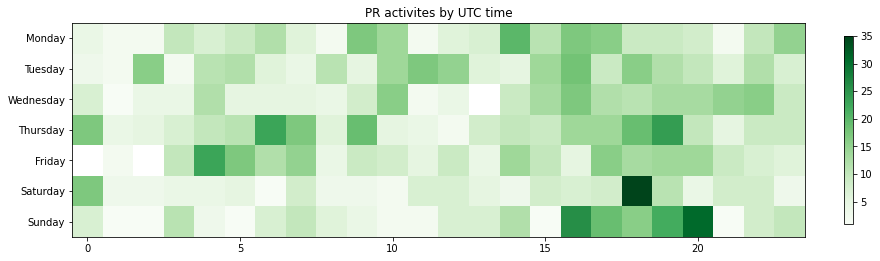

Latest record from the dataset:

<table border="1" class="dataframe">
  <thead>
    <tr style="text-align: right;">
      <th></th>
      <th>org</th>
      <th>repo</th>
      <th>type</th>
      <th>identifier</th>
      <th>subidentifier</th>
      <th>date</th>
      <th>author</th>
      <th>owner</th>
      <th>project</th>
    </tr>
  </thead>
  <tbody>
    <tr>
      <th>1044</th>
      <td>apache</td>
      <td>gora</td>
      <td>PR_COMMENTED</td>
      <td>218</td>
      <td>NaN</td>
      <td>2021-02-13 17:23:45+00:00</td>
      <td>SemanticBeeng</td>
      <td>dinuka-perera</td>
      <td>gora</td>
    </tr>
  </tbody>
</table>

# Github Contributions per user

<table border="1" class="dataframe">
  <thead>
    <tr style="text-align: right;">
      <th></th>
      <th>contributions</th>
    </tr>
    <tr>
      <th>author</th>
      <th></th>
    </tr>
  </thead>
  <tbody>
    <tr>
      <th>djkevincr</th>
      <td>312</td>
    </tr>
    <tr>
      <th>lewismc</th>
      <td>203</td>
    </tr>
    <tr>
      <th>asfgit</th>
      <td>111</td>
    </tr>
    <tr>
      <th>alfonsonishikawa</th>
      <td>67</td>
    </tr>
    <tr>
      <th>kamaci</th>
      <td>59</td>
    </tr>
    <tr>
      <th>renato2099</th>
      <td>51</td>
    </tr>
    <tr>
      <th>madhawa-gunasekara</th>
      <td>40</td>
    </tr>
    <tr>
      <th>hsaputra</th>
      <td>22</td>
    </tr>
    <tr>
      <th>carlosrmng</th>
      <td>12</td>
    </tr>
    <tr>
      <th>nishadi</th>
      <td>11</td>
    </tr>
  </tbody>
</table>

## Contributors per participations in PRs which are not created by self (helping PRs)

<table border="1" class="dataframe">
  <thead>
    <tr style="text-align: right;">
      <th></th>
      <th>identifier</th>
    </tr>
    <tr>
      <th>author</th>
      <th></th>
    </tr>
  </thead>
  <tbody>
    <tr>
      <th>asfgit</th>
      <td>111</td>
    </tr>
    <tr>
      <th>lewismc</th>
      <td>86</td>
    </tr>
    <tr>
      <th>djkevincr</th>
      <td>61</td>
    </tr>
    <tr>
      <th>renato2099</th>
      <td>29</td>
    </tr>
    <tr>
      <th>madhawa-gunasekara</th>
      <td>20</td>
    </tr>
    <tr>
      <th>alfonsonishikawa</th>
      <td>19</td>
    </tr>
    <tr>
      <th>hsaputra</th>
      <td>15</td>
    </tr>
    <tr>
      <th>carlosrmng</th>
      <td>7</td>
    </tr>
    <tr>
      <th>kamaci</th>
      <td>7</td>
    </tr>
    <tr>
      <th>drazzib</th>
      <td>6</td>
    </tr>
    <tr>
      <th>jhnmora000</th>
      <td>5</td>
    </tr>
    <tr>
      <th>cguzel</th>
      <td>5</td>
    </tr>
    <tr>
      <th>nishadi</th>
      <td>3</td>
    </tr>
    <tr>
      <th>ssedumeone</th>
      <td>1</td>
    </tr>
    <tr>
      <th>SemanticBeeng</th>
      <td>1</td>
    </tr>
    <tr>
      <th>otrack</th>
      <td>1</td>
    </tr>
    <tr>
      <th>bsideup</th>
      <td>1</td>
    </tr>
    <tr>
      <th>tedyu</th>
      <td>1</td>
    </tr>
  </tbody>
</table>

## Contributors per participations in any PRs

<table border="1" class="dataframe">
  <thead>
    <tr style="text-align: right;">
      <th></th>
      <th>identifier</th>
    </tr>
    <tr>
      <th>author</th>
      <th></th>
    </tr>
  </thead>
  <tbody>
    <tr>
      <th>lewismc</th>
      <td>121</td>
    </tr>
    <tr>
      <th>asfgit</th>
      <td>111</td>
    </tr>
    <tr>
      <th>djkevincr</th>
      <td>99</td>
    </tr>
    <tr>
      <th>madhawa-gunasekara</th>
      <td>36</td>
    </tr>
    <tr>
      <th>renato2099</th>
      <td>35</td>
    </tr>
    <tr>
      <th>alfonsonishikawa</th>
      <td>25</td>
    </tr>
    <tr>
      <th>drazzib</th>
      <td>20</td>
    </tr>
    <tr>
      <th>cguzel</th>
      <td>20</td>
    </tr>
    <tr>
      <th>kamaci</th>
      <td>20</td>
    </tr>
    <tr>
      <th>nishadi</th>
      <td>15</td>
    </tr>
    <tr>
      <th>hsaputra</th>
      <td>15</td>
    </tr>
    <tr>
      <th>carlosrmng</th>
      <td>10</td>
    </tr>
    <tr>
      <th>jhnmora000</th>
      <td>9</td>
    </tr>
    <tr>
      <th>chanakadkb</th>
      <td>6</td>
    </tr>
    <tr>
      <th>rumesh-perera</th>
      <td>5</td>
    </tr>
    <tr>
      <th>sneceesay77</th>
      <td>5</td>
    </tr>
    <tr>
      <th>podorvanova</th>
      <td>4</td>
    </tr>
    <tr>
      <th>mgov88</th>
      <td>4</td>
    </tr>
    <tr>
      <th>cloudysunny14</th>
      <td>4</td>
    </tr>
    <tr>
      <th>cuent</th>
      <td>4</td>
    </tr>
  </tbody>
</table>

# Bus factor (number of contributors responsible for the 50% of the prs) from last half year

## Contributors until the half of the all contributions

<table border="1" class="dataframe">
  <thead>
    <tr style="text-align: right;">
      <th></th>
      <th>author</th>
      <th>identifier</th>
      <th>cs</th>
      <th>ratio</th>
    </tr>
  </thead>
  <tbody>
    <tr>
      <th>0</th>
      <td>mgov88</td>
      <td>4</td>
      <td>4</td>
      <td>30.769231</td>
    </tr>
  </tbody>
</table>

## Pony number (bus factor)

    2

## Dev power (All the contributions in the ration of the top contributor)

    3.25

    

    

## People with created PRs > reviewed/commented PRS

    

    

## Same graph with focusing to the last 6 month

Only contributors with both created pr and helped pr visible

    

    

# Number of individual contributors per month

Number of different Github users who either created PR, commented PR, added review to a PR

Note: only events from apache/hadoop-ozone repository are included. Earlier PRs/comments are not here.

    

    

# Number of PRs closed/created per month

    /usr/lib/python3.9/site-packages/pandas/core/arrays/datetimes.py:1101: UserWarning: Converting to PeriodArray/Index representation will drop timezone information.
      warnings.warn(

    

    

# PR activity heatmap

    

    

