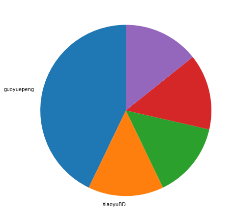
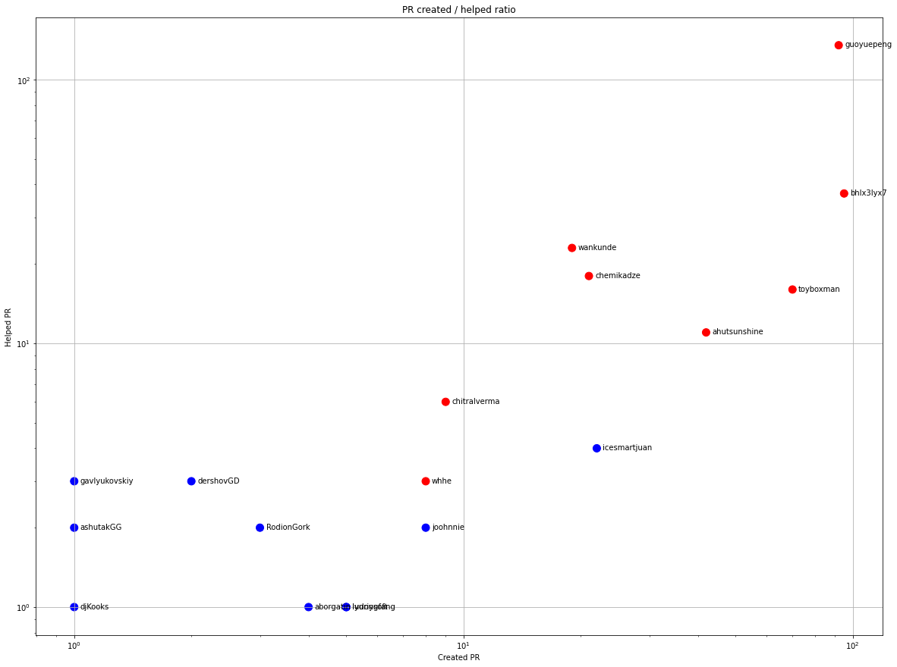
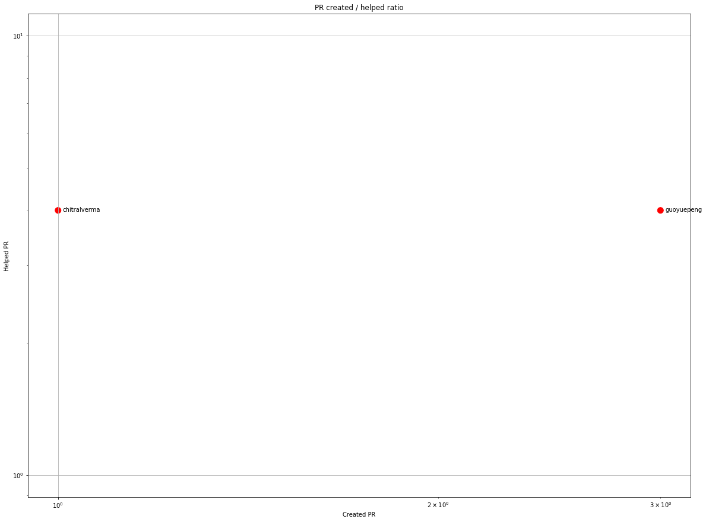
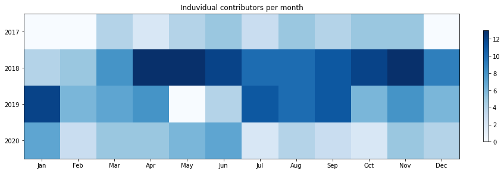
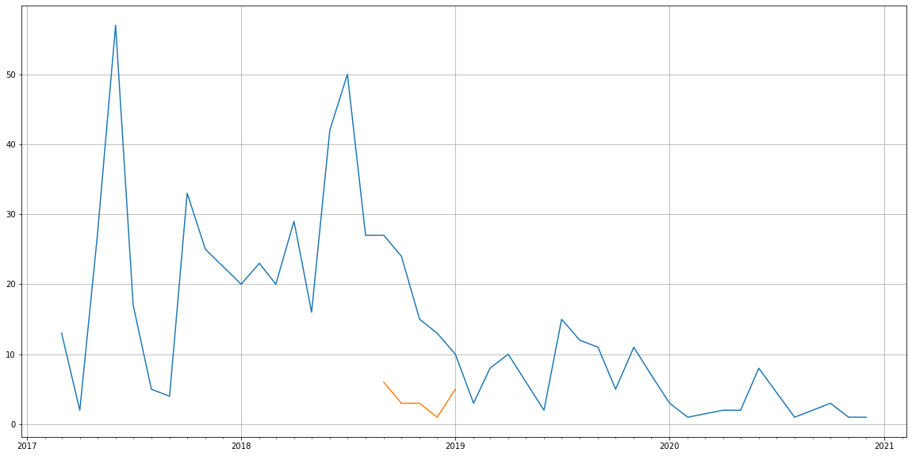
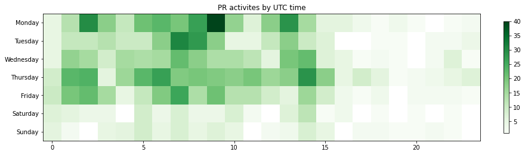

Latest record from the dataset:

<table border="1" class="dataframe">
  <thead>
    <tr style="text-align: right;">
      <th></th>
      <th>org</th>
      <th>repo</th>
      <th>type</th>
      <th>identifier</th>
      <th>subidentifier</th>
      <th>date</th>
      <th>author</th>
      <th>owner</th>
      <th>project</th>
    </tr>
  </thead>
  <tbody>
    <tr>
      <th>1438</th>
      <td>apache</td>
      <td>griffin</td>
      <td>PR_COMMENTED</td>
      <td>587</td>
      <td>NaN</td>
      <td>2020-12-07 03:57:52+00:00</td>
      <td>wankunde</td>
      <td>XiaoyuBD</td>
      <td>griffin</td>
    </tr>
  </tbody>
</table>

# Github Contributions per user

<table border="1" class="dataframe">
  <thead>
    <tr style="text-align: right;">
      <th></th>
      <th>contributions</th>
    </tr>
    <tr>
      <th>author</th>
      <th></th>
    </tr>
  </thead>
  <tbody>
    <tr>
      <th>guoyuepeng</th>
      <td>262</td>
    </tr>
    <tr>
      <th>bhlx3lyx7</th>
      <td>63</td>
    </tr>
    <tr>
      <th>wankunde</th>
      <td>58</td>
    </tr>
    <tr>
      <th>chemikadze</th>
      <td>52</td>
    </tr>
    <tr>
      <th>ahutsunshine</th>
      <td>27</td>
    </tr>
    <tr>
      <th>toyboxman</th>
      <td>24</td>
    </tr>
    <tr>
      <th>chitralverma</th>
      <td>22</td>
    </tr>
    <tr>
      <th>asfgit</th>
      <td>18</td>
    </tr>
    <tr>
      <th>fusonghe</th>
      <td>14</td>
    </tr>
    <tr>
      <th>dershovGD</th>
      <td>8</td>
    </tr>
  </tbody>
</table>

## Contributors per participations in PRs which are not created by self (helping PRs)

<table border="1" class="dataframe">
  <thead>
    <tr style="text-align: right;">
      <th></th>
      <th>identifier</th>
    </tr>
    <tr>
      <th>author</th>
      <th></th>
    </tr>
  </thead>
  <tbody>
    <tr>
      <th>guoyuepeng</th>
      <td>135</td>
    </tr>
    <tr>
      <th>bhlx3lyx7</th>
      <td>37</td>
    </tr>
    <tr>
      <th>wankunde</th>
      <td>23</td>
    </tr>
    <tr>
      <th>chemikadze</th>
      <td>18</td>
    </tr>
    <tr>
      <th>asfgit</th>
      <td>18</td>
    </tr>
    <tr>
      <th>toyboxman</th>
      <td>16</td>
    </tr>
    <tr>
      <th>ahutsunshine</th>
      <td>11</td>
    </tr>
    <tr>
      <th>chitralverma</th>
      <td>6</td>
    </tr>
    <tr>
      <th>icesmartjuan</th>
      <td>4</td>
    </tr>
    <tr>
      <th>dershovGD</th>
      <td>3</td>
    </tr>
    <tr>
      <th>guotechfin</th>
      <td>3</td>
    </tr>
    <tr>
      <th>fusonghe</th>
      <td>3</td>
    </tr>
    <tr>
      <th>gavlyukovskiy</th>
      <td>3</td>
    </tr>
    <tr>
      <th>whhe</th>
      <td>3</td>
    </tr>
    <tr>
      <th>joohnnie</th>
      <td>2</td>
    </tr>
    <tr>
      <th>ashutakGG</th>
      <td>2</td>
    </tr>
    <tr>
      <th>RodionGork</th>
      <td>2</td>
    </tr>
    <tr>
      <th>pshingavi</th>
      <td>1</td>
    </tr>
    <tr>
      <th>wangmiao1002</th>
      <td>1</td>
    </tr>
    <tr>
      <th>ludongfang</th>
      <td>1</td>
    </tr>
  </tbody>
</table>

## Contributors per participations in any PRs

<table border="1" class="dataframe">
  <thead>
    <tr style="text-align: right;">
      <th></th>
      <th>identifier</th>
    </tr>
    <tr>
      <th>author</th>
      <th></th>
    </tr>
  </thead>
  <tbody>
    <tr>
      <th>guoyuepeng</th>
      <td>221</td>
    </tr>
    <tr>
      <th>bhlx3lyx7</th>
      <td>132</td>
    </tr>
    <tr>
      <th>toyboxman</th>
      <td>86</td>
    </tr>
    <tr>
      <th>ahutsunshine</th>
      <td>53</td>
    </tr>
    <tr>
      <th>wankunde</th>
      <td>42</td>
    </tr>
    <tr>
      <th>dodobel</th>
      <td>39</td>
    </tr>
    <tr>
      <th>chemikadze</th>
      <td>39</td>
    </tr>
    <tr>
      <th>justACT</th>
      <td>27</td>
    </tr>
    <tr>
      <th>icesmartjuan</th>
      <td>26</td>
    </tr>
    <tr>
      <th>RachelYang2</th>
      <td>22</td>
    </tr>
    <tr>
      <th>asfgit</th>
      <td>18</td>
    </tr>
    <tr>
      <th>chitralverma</th>
      <td>15</td>
    </tr>
    <tr>
      <th>whhe</th>
      <td>11</td>
    </tr>
    <tr>
      <th>joohnnie</th>
      <td>10</td>
    </tr>
    <tr>
      <th>grant-xuexu</th>
      <td>10</td>
    </tr>
    <tr>
      <th>jasonliaoxiaoge</th>
      <td>9</td>
    </tr>
    <tr>
      <th>iyuriysoft</th>
      <td>6</td>
    </tr>
    <tr>
      <th>ludongfang</th>
      <td>6</td>
    </tr>
    <tr>
      <th>SparshSinghalHM</th>
      <td>6</td>
    </tr>
    <tr>
      <th>aborgatin</th>
      <td>5</td>
    </tr>
  </tbody>
</table>

# Bus factor (number of contributors responsible for the 50% of the prs) from last half year

## Contributors until the half of the all contributions

<table border="1" class="dataframe">
  <thead>
    <tr style="text-align: right;">
      <th></th>
      <th>author</th>
      <th>identifier</th>
      <th>cs</th>
      <th>ratio</th>
    </tr>
  </thead>
  <tbody>
    <tr>
      <th>0</th>
      <td>guoyuepeng</td>
      <td>3</td>
      <td>3</td>
      <td>42.857143</td>
    </tr>
  </tbody>
</table>

## Pony number (bus factor)

    2

## Dev power (All the contributions in the ration of the top contributor)

    2.333333333333333

    

    

## People with created PRs > reviewed/commented PRS

    

    

## Same graph with focusing to the last 6 month

Only contributors with both created pr and helped pr visible

    

    

# Number of individual contributors per month

Number of different Github users who either created PR, commented PR, added review to a PR

Note: only events from apache/hadoop-ozone repository are included. Earlier PRs/comments are not here.

    

    

# Number of PRs closed/created per month

    /usr/lib/python3.9/site-packages/pandas/core/arrays/datetimes.py:1101: UserWarning: Converting to PeriodArray/Index representation will drop timezone information.
      warnings.warn(

    

    

# PR activity heatmap

    

    

