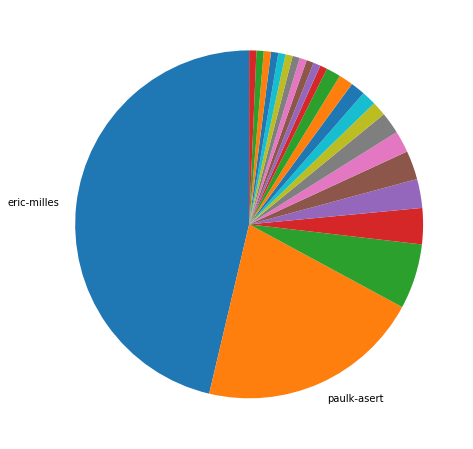
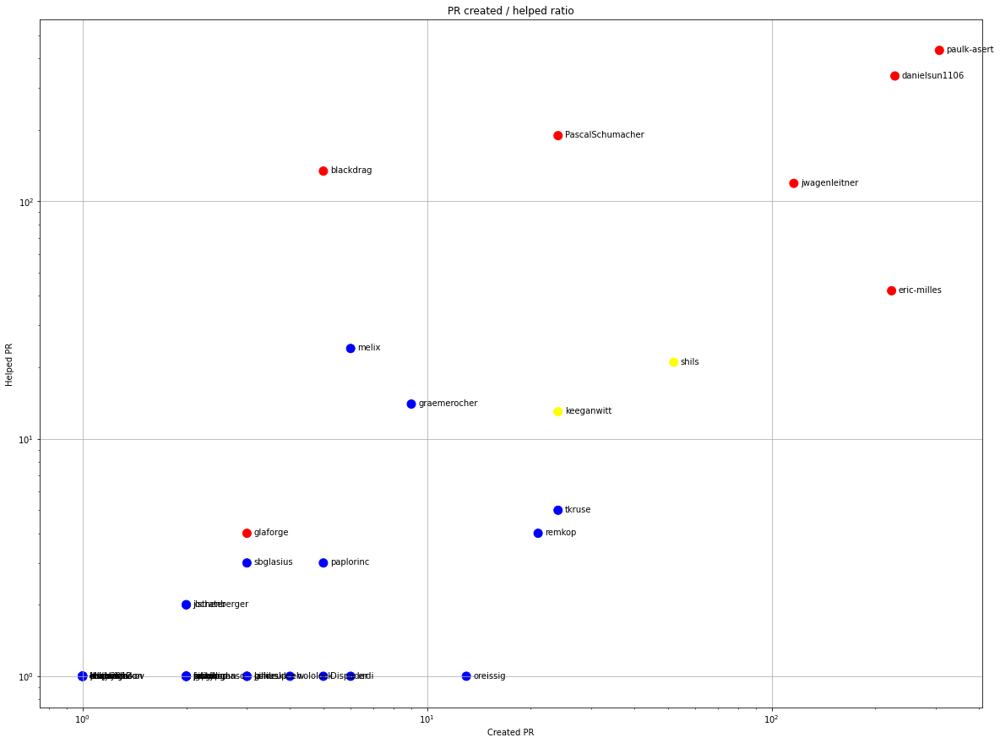
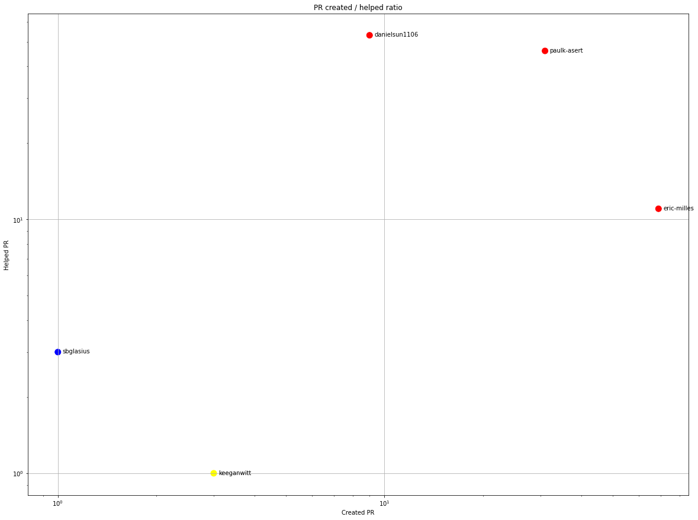
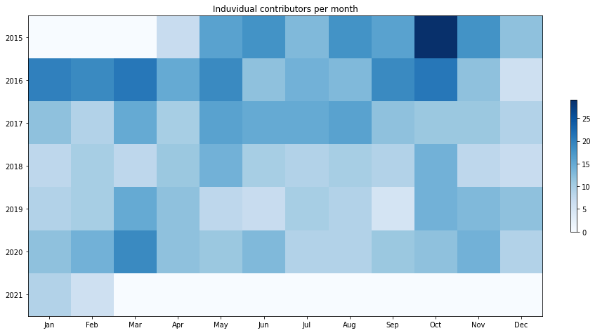
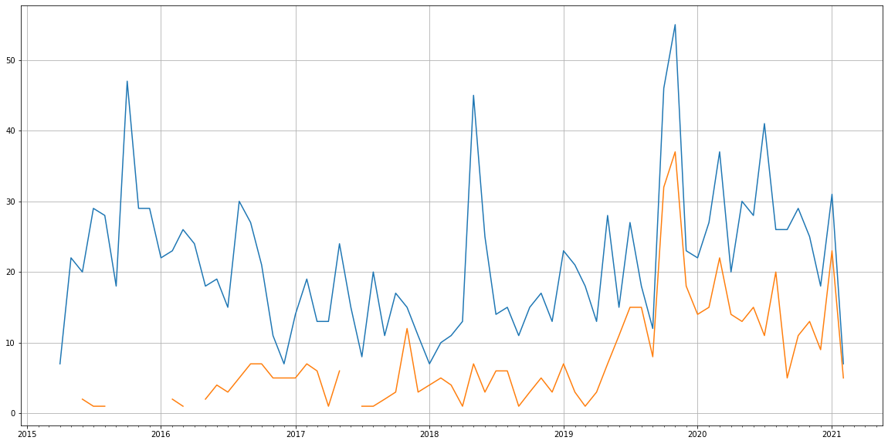
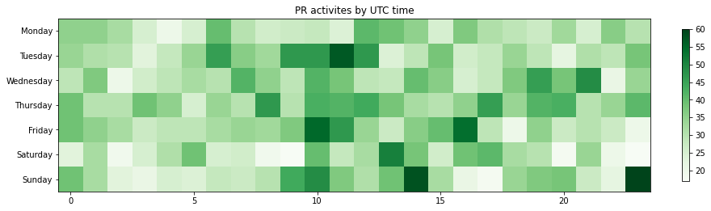

Latest record from the dataset:

<table border="1" class="dataframe">
  <thead>
    <tr style="text-align: right;">
      <th></th>
      <th>org</th>
      <th>repo</th>
      <th>type</th>
      <th>identifier</th>
      <th>subidentifier</th>
      <th>date</th>
      <th>author</th>
      <th>owner</th>
      <th>project</th>
    </tr>
  </thead>
  <tbody>
    <tr>
      <th>1948</th>
      <td>apache</td>
      <td>groovy</td>
      <td>PR_CREATED</td>
      <td>1489</td>
      <td>NaN</td>
      <td>2021-02-13 17:04:48+00:00</td>
      <td>eric-milles</td>
      <td>eric-milles</td>
      <td>groovy</td>
    </tr>
  </tbody>
</table>

# Github Contributions per user

<table border="1" class="dataframe">
  <thead>
    <tr style="text-align: right;">
      <th></th>
      <th>contributions</th>
    </tr>
    <tr>
      <th>author</th>
      <th></th>
    </tr>
  </thead>
  <tbody>
    <tr>
      <th>paulk-asert</th>
      <td>763</td>
    </tr>
    <tr>
      <th>danielsun1106</th>
      <td>686</td>
    </tr>
    <tr>
      <th>PascalSchumacher</th>
      <td>276</td>
    </tr>
    <tr>
      <th>blackdrag</th>
      <td>212</td>
    </tr>
    <tr>
      <th>asfgit</th>
      <td>200</td>
    </tr>
    <tr>
      <th>jwagenleitner</th>
      <td>170</td>
    </tr>
    <tr>
      <th>eric-milles</th>
      <td>79</td>
    </tr>
    <tr>
      <th>melix</th>
      <td>32</td>
    </tr>
    <tr>
      <th>shils</th>
      <td>22</td>
    </tr>
    <tr>
      <th>keeganwitt</th>
      <td>21</td>
    </tr>
  </tbody>
</table>

## Contributors per participations in PRs which are not created by self (helping PRs)

<table border="1" class="dataframe">
  <thead>
    <tr style="text-align: right;">
      <th></th>
      <th>identifier</th>
    </tr>
    <tr>
      <th>author</th>
      <th></th>
    </tr>
  </thead>
  <tbody>
    <tr>
      <th>paulk-asert</th>
      <td>432</td>
    </tr>
    <tr>
      <th>danielsun1106</th>
      <td>337</td>
    </tr>
    <tr>
      <th>asfgit</th>
      <td>200</td>
    </tr>
    <tr>
      <th>PascalSchumacher</th>
      <td>189</td>
    </tr>
    <tr>
      <th>blackdrag</th>
      <td>134</td>
    </tr>
    <tr>
      <th>jwagenleitner</th>
      <td>119</td>
    </tr>
    <tr>
      <th>eric-milles</th>
      <td>42</td>
    </tr>
    <tr>
      <th>melix</th>
      <td>24</td>
    </tr>
    <tr>
      <th>shils</th>
      <td>21</td>
    </tr>
    <tr>
      <th>graemerocher</th>
      <td>14</td>
    </tr>
    <tr>
      <th>keeganwitt</th>
      <td>13</td>
    </tr>
    <tr>
      <th>tkruse</th>
      <td>5</td>
    </tr>
    <tr>
      <th>remkop</th>
      <td>4</td>
    </tr>
    <tr>
      <th>muse-dev</th>
      <td>4</td>
    </tr>
    <tr>
      <th>glaforge</th>
      <td>4</td>
    </tr>
    <tr>
      <th>sbglasius</th>
      <td>3</td>
    </tr>
    <tr>
      <th>paplorinc</th>
      <td>3</td>
    </tr>
    <tr>
      <th>pzygielo</th>
      <td>2</td>
    </tr>
    <tr>
      <th>jochenberger</th>
      <td>2</td>
    </tr>
    <tr>
      <th>jlstrater</th>
      <td>2</td>
    </tr>
  </tbody>
</table>

## Contributors per participations in any PRs

<table border="1" class="dataframe">
  <thead>
    <tr style="text-align: right;">
      <th></th>
      <th>identifier</th>
    </tr>
    <tr>
      <th>author</th>
      <th></th>
    </tr>
  </thead>
  <tbody>
    <tr>
      <th>paulk-asert</th>
      <td>734</td>
    </tr>
    <tr>
      <th>danielsun1106</th>
      <td>565</td>
    </tr>
    <tr>
      <th>eric-milles</th>
      <td>265</td>
    </tr>
    <tr>
      <th>jwagenleitner</th>
      <td>235</td>
    </tr>
    <tr>
      <th>PascalSchumacher</th>
      <td>213</td>
    </tr>
    <tr>
      <th>asfgit</th>
      <td>200</td>
    </tr>
    <tr>
      <th>blackdrag</th>
      <td>139</td>
    </tr>
    <tr>
      <th>shils</th>
      <td>73</td>
    </tr>
    <tr>
      <th>keeganwitt</th>
      <td>37</td>
    </tr>
    <tr>
      <th>melix</th>
      <td>30</td>
    </tr>
    <tr>
      <th>tkruse</th>
      <td>29</td>
    </tr>
    <tr>
      <th>remkop</th>
      <td>25</td>
    </tr>
    <tr>
      <th>graemerocher</th>
      <td>23</td>
    </tr>
    <tr>
      <th>blindpirate</th>
      <td>16</td>
    </tr>
    <tr>
      <th>vmj</th>
      <td>15</td>
    </tr>
    <tr>
      <th>fpavageau</th>
      <td>14</td>
    </tr>
    <tr>
      <th>oreissig</th>
      <td>14</td>
    </tr>
    <tr>
      <th>anshbansal</th>
      <td>13</td>
    </tr>
    <tr>
      <th>mattisonchao</th>
      <td>12</td>
    </tr>
    <tr>
      <th>paplorinc</th>
      <td>8</td>
    </tr>
  </tbody>
</table>

# Bus factor (number of contributors responsible for the 50% of the prs) from last half year

## Contributors until the half of the all contributions

<table border="1" class="dataframe">
  <thead>
    <tr style="text-align: right;">
      <th></th>
      <th>author</th>
      <th>identifier</th>
      <th>cs</th>
      <th>ratio</th>
    </tr>
  </thead>
  <tbody>
    <tr>
      <th>0</th>
      <td>eric-milles</td>
      <td>69</td>
      <td>69</td>
      <td>46.308725</td>
    </tr>
  </tbody>
</table>

## Pony number (bus factor)

    2

## Dev power (All the contributions in the ration of the top contributor)

    2.1594202898550723

    

    

## People with created PRs > reviewed/commented PRS

    

    

## Same graph with focusing to the last 6 month

Only contributors with both created pr and helped pr visible

    

    

# Number of individual contributors per month

Number of different Github users who either created PR, commented PR, added review to a PR

Note: only events from apache/hadoop-ozone repository are included. Earlier PRs/comments are not here.

    

    

# Number of PRs closed/created per month

    /usr/lib/python3.9/site-packages/pandas/core/arrays/datetimes.py:1101: UserWarning: Converting to PeriodArray/Index representation will drop timezone information.
      warnings.warn(

    

    

# PR activity heatmap

    

    

