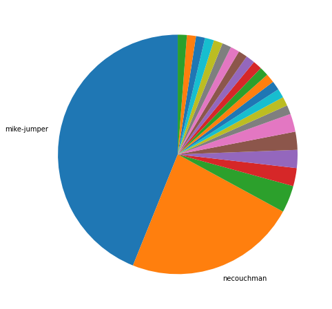
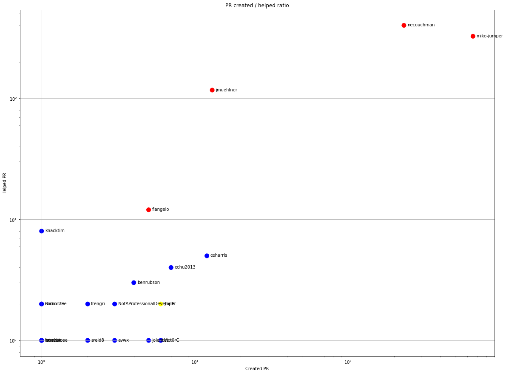
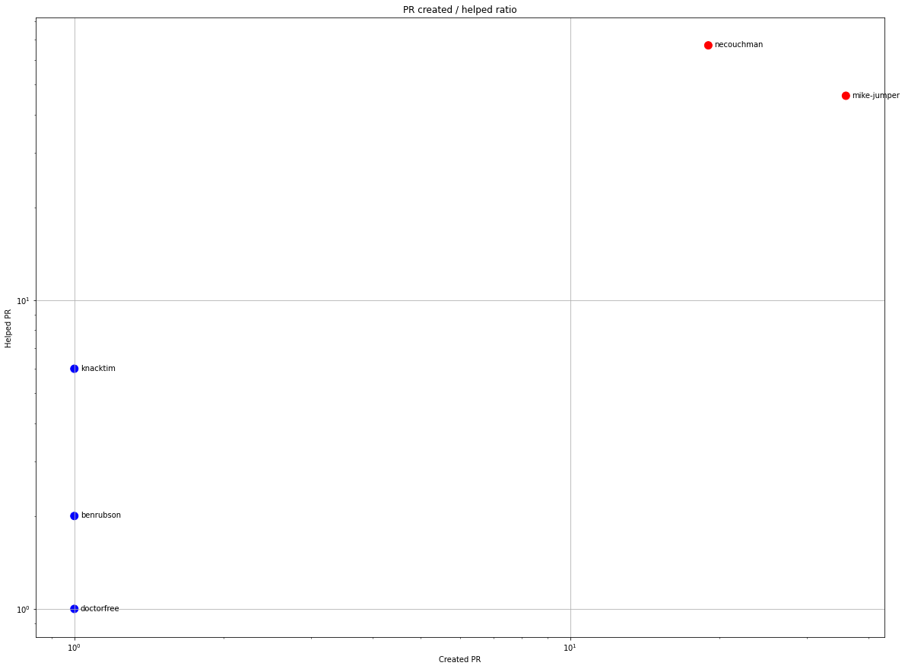
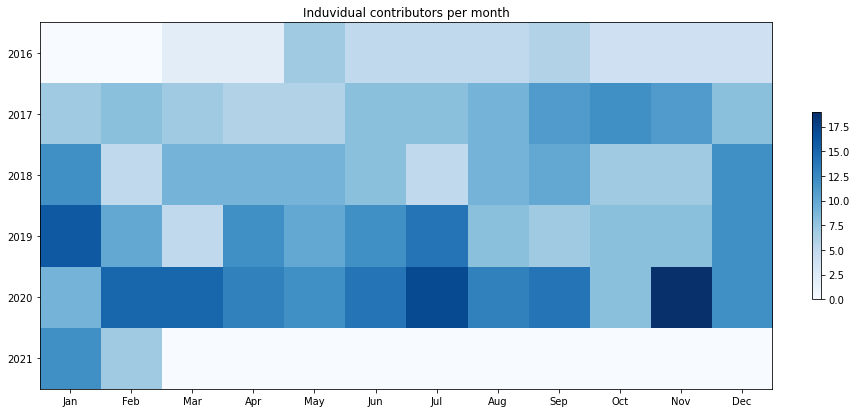
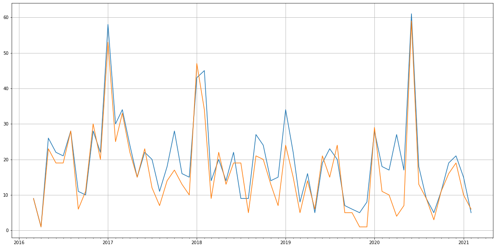
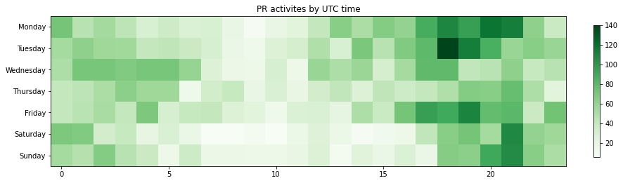

Latest record from the dataset:

<table border="1" class="dataframe">
  <thead>
    <tr style="text-align: right;">
      <th></th>
      <th>org</th>
      <th>repo</th>
      <th>type</th>
      <th>identifier</th>
      <th>subidentifier</th>
      <th>date</th>
      <th>author</th>
      <th>owner</th>
      <th>project</th>
    </tr>
  </thead>
  <tbody>
    <tr>
      <th>4535</th>
      <td>apache</td>
      <td>guacamole-client</td>
      <td>PR_MERGED</td>
      <td>591</td>
      <td>NaN</td>
      <td>2021-02-14 00:49:21+00:00</td>
      <td>necouchman</td>
      <td>mike-jumper</td>
      <td>guacamole</td>
    </tr>
  </tbody>
</table>

# Github Contributions per user

<table border="1" class="dataframe">
  <thead>
    <tr style="text-align: right;">
      <th></th>
      <th>contributions</th>
    </tr>
    <tr>
      <th>author</th>
      <th></th>
    </tr>
  </thead>
  <tbody>
    <tr>
      <th>mike-jumper</th>
      <td>1645</td>
    </tr>
    <tr>
      <th>necouchman</th>
      <td>1217</td>
    </tr>
    <tr>
      <th>asfgit</th>
      <td>649</td>
    </tr>
    <tr>
      <th>jmuehlner</th>
      <td>263</td>
    </tr>
    <tr>
      <th>echu2013</th>
      <td>21</td>
    </tr>
    <tr>
      <th>knacktim</th>
      <td>21</td>
    </tr>
    <tr>
      <th>flangelo</th>
      <td>13</td>
    </tr>
    <tr>
      <th>berndhose</th>
      <td>11</td>
    </tr>
    <tr>
      <th>ceharris</th>
      <td>11</td>
    </tr>
    <tr>
      <th>michaelbarkdoll</th>
      <td>7</td>
    </tr>
  </tbody>
</table>

## Contributors per participations in PRs which are not created by self (helping PRs)

<table border="1" class="dataframe">
  <thead>
    <tr style="text-align: right;">
      <th></th>
      <th>identifier</th>
    </tr>
    <tr>
      <th>author</th>
      <th></th>
    </tr>
  </thead>
  <tbody>
    <tr>
      <th>necouchman</th>
      <td>401</td>
    </tr>
    <tr>
      <th>mike-jumper</th>
      <td>326</td>
    </tr>
    <tr>
      <th>asfgit</th>
      <td>324</td>
    </tr>
    <tr>
      <th>jmuehlner</th>
      <td>117</td>
    </tr>
    <tr>
      <th>flangelo</th>
      <td>12</td>
    </tr>
    <tr>
      <th>knacktim</th>
      <td>8</td>
    </tr>
    <tr>
      <th>ceharris</th>
      <td>5</td>
    </tr>
    <tr>
      <th>echu2013</th>
      <td>4</td>
    </tr>
    <tr>
      <th>benrubson</th>
      <td>3</td>
    </tr>
    <tr>
      <th>lchanouha</th>
      <td>3</td>
    </tr>
    <tr>
      <th>ibuler</th>
      <td>2</td>
    </tr>
    <tr>
      <th>nfantone</th>
      <td>2</td>
    </tr>
    <tr>
      <th>manolan1</th>
      <td>2</td>
    </tr>
    <tr>
      <th>doctorfree</th>
      <td>2</td>
    </tr>
    <tr>
      <th>ralfbecker</th>
      <td>2</td>
    </tr>
    <tr>
      <th>limenghui614</th>
      <td>2</td>
    </tr>
    <tr>
      <th>zhangjianpinghik</th>
      <td>2</td>
    </tr>
    <tr>
      <th>lorengordon</th>
      <td>2</td>
    </tr>
    <tr>
      <th>Robin-73</th>
      <td>2</td>
    </tr>
    <tr>
      <th>JoelB</th>
      <td>2</td>
    </tr>
  </tbody>
</table>

## Contributors per participations in any PRs

<table border="1" class="dataframe">
  <thead>
    <tr style="text-align: right;">
      <th></th>
      <th>identifier</th>
    </tr>
    <tr>
      <th>author</th>
      <th></th>
    </tr>
  </thead>
  <tbody>
    <tr>
      <th>mike-jumper</th>
      <td>529</td>
    </tr>
    <tr>
      <th>necouchman</th>
      <td>513</td>
    </tr>
    <tr>
      <th>asfgit</th>
      <td>324</td>
    </tr>
    <tr>
      <th>jmuehlner</th>
      <td>122</td>
    </tr>
    <tr>
      <th>flangelo</th>
      <td>17</td>
    </tr>
    <tr>
      <th>ceharris</th>
      <td>17</td>
    </tr>
    <tr>
      <th>darchons</th>
      <td>11</td>
    </tr>
    <tr>
      <th>echu2013</th>
      <td>11</td>
    </tr>
    <tr>
      <th>knacktim</th>
      <td>9</td>
    </tr>
    <tr>
      <th>netromnetrom</th>
      <td>8</td>
    </tr>
    <tr>
      <th>JoelB</th>
      <td>8</td>
    </tr>
    <tr>
      <th>myjimmy</th>
      <td>8</td>
    </tr>
    <tr>
      <th>Vict0rC</th>
      <td>7</td>
    </tr>
    <tr>
      <th>benrubson</th>
      <td>7</td>
    </tr>
    <tr>
      <th>IT-Experte</th>
      <td>7</td>
    </tr>
    <tr>
      <th>jolentes</th>
      <td>6</td>
    </tr>
    <tr>
      <th>chipitsine</th>
      <td>6</td>
    </tr>
    <tr>
      <th>m-khan-glyptodon</th>
      <td>5</td>
    </tr>
    <tr>
      <th>NotAProfessionalDeveloper</th>
      <td>5</td>
    </tr>
    <tr>
      <th>avwx</th>
      <td>4</td>
    </tr>
  </tbody>
</table>

# Bus factor (number of contributors responsible for the 50% of the prs) from last half year

## Contributors until the half of the all contributions

<table border="1" class="dataframe">
  <thead>
    <tr style="text-align: right;">
      <th></th>
      <th>author</th>
      <th>identifier</th>
      <th>cs</th>
      <th>ratio</th>
    </tr>
  </thead>
  <tbody>
    <tr>
      <th>0</th>
      <td>mike-jumper</td>
      <td>36</td>
      <td>36</td>
      <td>43.902439</td>
    </tr>
  </tbody>
</table>

## Pony number (bus factor)

    2

## Dev power (All the contributions in the ration of the top contributor)

    2.277777777777777

    

    

## People with created PRs > reviewed/commented PRS

    

    

## Same graph with focusing to the last 6 month

Only contributors with both created pr and helped pr visible

    

    

# Number of individual contributors per month

Number of different Github users who either created PR, commented PR, added review to a PR

Note: only events from apache/hadoop-ozone repository are included. Earlier PRs/comments are not here.

    

    

# Number of PRs closed/created per month

    /usr/lib/python3.9/site-packages/pandas/core/arrays/datetimes.py:1101: UserWarning: Converting to PeriodArray/Index representation will drop timezone information.
      warnings.warn(

    

    

# PR activity heatmap

    

    

