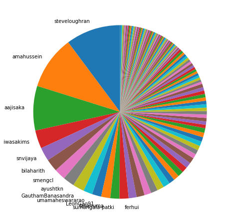
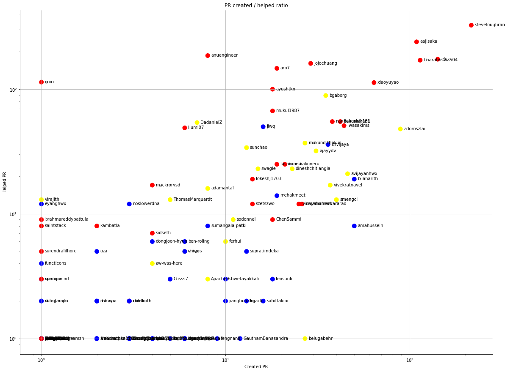
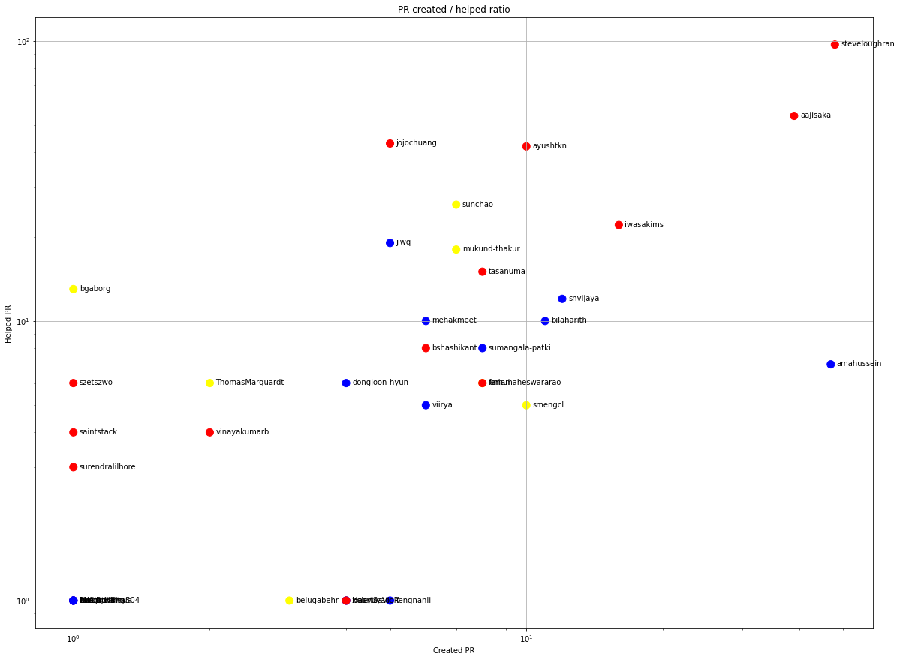
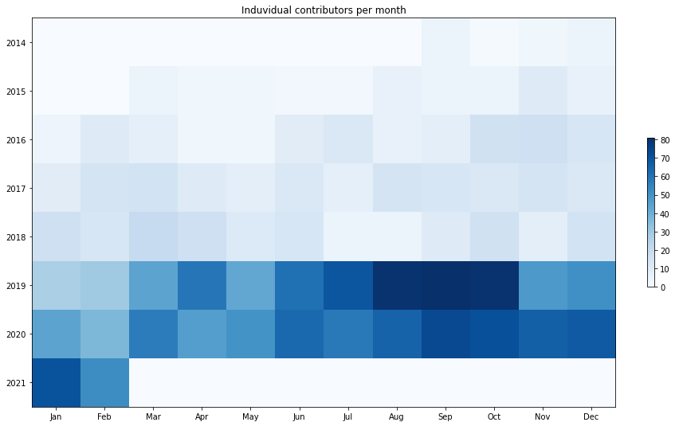
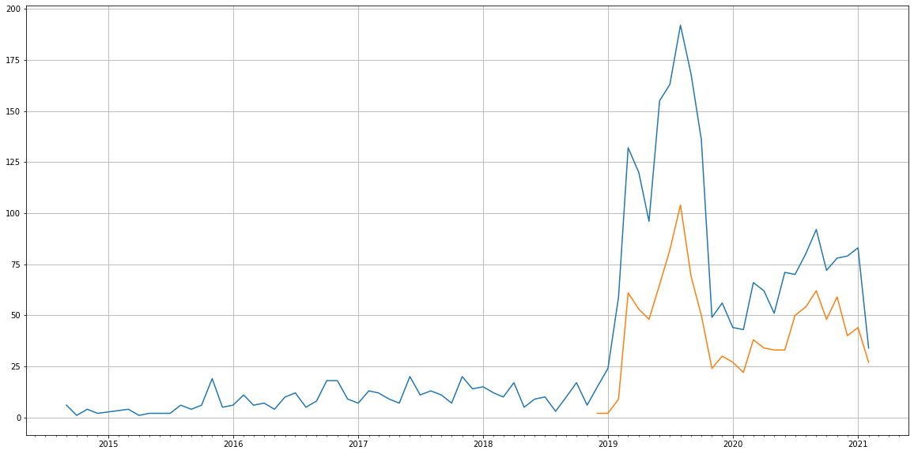
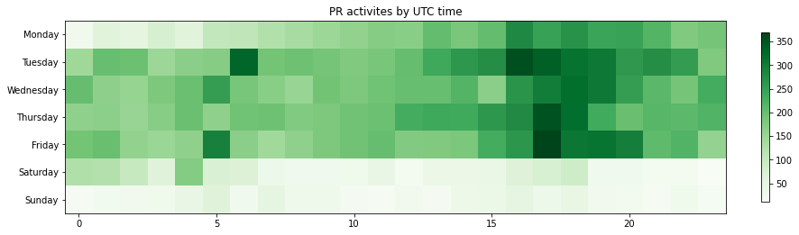

Latest record from the dataset:

<table border="1" class="dataframe">
  <thead>
    <tr style="text-align: right;">
      <th></th>
      <th>org</th>
      <th>repo</th>
      <th>type</th>
      <th>identifier</th>
      <th>subidentifier</th>
      <th>date</th>
      <th>author</th>
      <th>owner</th>
      <th>project</th>
    </tr>
  </thead>
  <tbody>
    <tr>
      <th>18482</th>
      <td>apache</td>
      <td>hadoop</td>
      <td>PR_COMMENTED</td>
      <td>2605</td>
      <td>NaN</td>
      <td>2021-02-14 07:13:03+00:00</td>
      <td>fengnanli</td>
      <td>fengnanli</td>
      <td>hadoop</td>
    </tr>
  </tbody>
</table>

# Github Contributions per user

<table border="1" class="dataframe">
  <thead>
    <tr style="text-align: right;">
      <th></th>
      <th>contributions</th>
    </tr>
    <tr>
      <th>author</th>
      <th></th>
    </tr>
  </thead>
  <tbody>
    <tr>
      <th>hadoop-yetus</th>
      <td>7717</td>
    </tr>
    <tr>
      <th>steveloughran</th>
      <td>1399</td>
    </tr>
    <tr>
      <th>bharatviswa504</th>
      <td>681</td>
    </tr>
    <tr>
      <th>aajisaka</th>
      <td>487</td>
    </tr>
    <tr>
      <th>xiaoyuyao</th>
      <td>470</td>
    </tr>
    <tr>
      <th>arp7</th>
      <td>438</td>
    </tr>
    <tr>
      <th>anuengineer</th>
      <td>368</td>
    </tr>
    <tr>
      <th>jojochuang</th>
      <td>346</td>
    </tr>
    <tr>
      <th>goiri</th>
      <td>341</td>
    </tr>
    <tr>
      <th>elek</th>
      <td>276</td>
    </tr>
  </tbody>
</table>

## Contributors per participations in PRs which are not created by self (helping PRs)

<table border="1" class="dataframe">
  <thead>
    <tr style="text-align: right;">
      <th></th>
      <th>identifier</th>
    </tr>
    <tr>
      <th>author</th>
      <th></th>
    </tr>
  </thead>
  <tbody>
    <tr>
      <th>hadoop-yetus</th>
      <td>2055</td>
    </tr>
    <tr>
      <th>steveloughran</th>
      <td>326</td>
    </tr>
    <tr>
      <th>aajisaka</th>
      <td>240</td>
    </tr>
    <tr>
      <th>anuengineer</th>
      <td>186</td>
    </tr>
    <tr>
      <th>elek</th>
      <td>174</td>
    </tr>
    <tr>
      <th>bharatviswa504</th>
      <td>171</td>
    </tr>
    <tr>
      <th>jojochuang</th>
      <td>161</td>
    </tr>
    <tr>
      <th>arp7</th>
      <td>147</td>
    </tr>
    <tr>
      <th>goiri</th>
      <td>114</td>
    </tr>
    <tr>
      <th>xiaoyuyao</th>
      <td>113</td>
    </tr>
    <tr>
      <th>ayushtkn</th>
      <td>100</td>
    </tr>
    <tr>
      <th>bgaborg</th>
      <td>89</td>
    </tr>
    <tr>
      <th>mukul1987</th>
      <td>67</td>
    </tr>
    <tr>
      <th>bshashikant</th>
      <td>55</td>
    </tr>
    <tr>
      <th>nandakumar131</th>
      <td>55</td>
    </tr>
    <tr>
      <th>DadanielZ</th>
      <td>54</td>
    </tr>
    <tr>
      <th>iwasakims</th>
      <td>51</td>
    </tr>
    <tr>
      <th>jiwq</th>
      <td>50</td>
    </tr>
    <tr>
      <th>liuml07</th>
      <td>49</td>
    </tr>
    <tr>
      <th>adoroszlai</th>
      <td>48</td>
    </tr>
  </tbody>
</table>

## Contributors per participations in any PRs

<table border="1" class="dataframe">
  <thead>
    <tr style="text-align: right;">
      <th></th>
      <th>identifier</th>
    </tr>
    <tr>
      <th>author</th>
      <th></th>
    </tr>
  </thead>
  <tbody>
    <tr>
      <th>hadoop-yetus</th>
      <td>2055</td>
    </tr>
    <tr>
      <th>steveloughran</th>
      <td>542</td>
    </tr>
    <tr>
      <th>aajisaka</th>
      <td>345</td>
    </tr>
    <tr>
      <th>elek</th>
      <td>316</td>
    </tr>
    <tr>
      <th>bharatviswa504</th>
      <td>285</td>
    </tr>
    <tr>
      <th>anuengineer</th>
      <td>194</td>
    </tr>
    <tr>
      <th>jojochuang</th>
      <td>190</td>
    </tr>
    <tr>
      <th>xiaoyuyao</th>
      <td>177</td>
    </tr>
    <tr>
      <th>arp7</th>
      <td>166</td>
    </tr>
    <tr>
      <th>adoroszlai</th>
      <td>137</td>
    </tr>
    <tr>
      <th>bgaborg</th>
      <td>124</td>
    </tr>
    <tr>
      <th>ayushtkn</th>
      <td>117</td>
    </tr>
    <tr>
      <th>goiri</th>
      <td>115</td>
    </tr>
    <tr>
      <th>bshashikant</th>
      <td>97</td>
    </tr>
    <tr>
      <th>iwasakims</th>
      <td>95</td>
    </tr>
    <tr>
      <th>nandakumar131</th>
      <td>93</td>
    </tr>
    <tr>
      <th>mukul1987</th>
      <td>85</td>
    </tr>
    <tr>
      <th>snvijaya</th>
      <td>72</td>
    </tr>
    <tr>
      <th>bilaharith</th>
      <td>69</td>
    </tr>
    <tr>
      <th>avijayanhwx</th>
      <td>67</td>
    </tr>
  </tbody>
</table>

# Bus factor (number of contributors responsible for the 50% of the prs) from last half year

## Contributors until the half of the all contributions

<table border="1" class="dataframe">
  <thead>
    <tr style="text-align: right;">
      <th></th>
      <th>author</th>
      <th>identifier</th>
      <th>cs</th>
      <th>ratio</th>
    </tr>
  </thead>
  <tbody>
    <tr>
      <th>0</th>
      <td>steveloughran</td>
      <td>48</td>
      <td>48</td>
      <td>10.191083</td>
    </tr>
    <tr>
      <th>1</th>
      <td>amahussein</td>
      <td>47</td>
      <td>95</td>
      <td>9.978769</td>
    </tr>
    <tr>
      <th>2</th>
      <td>aajisaka</td>
      <td>39</td>
      <td>134</td>
      <td>8.280255</td>
    </tr>
    <tr>
      <th>3</th>
      <td>iwasakims</td>
      <td>16</td>
      <td>150</td>
      <td>3.397028</td>
    </tr>
    <tr>
      <th>4</th>
      <td>snvijaya</td>
      <td>12</td>
      <td>162</td>
      <td>2.547771</td>
    </tr>
    <tr>
      <th>5</th>
      <td>bilaharith</td>
      <td>11</td>
      <td>173</td>
      <td>2.335456</td>
    </tr>
    <tr>
      <th>6</th>
      <td>smengcl</td>
      <td>10</td>
      <td>183</td>
      <td>2.123142</td>
    </tr>
    <tr>
      <th>7</th>
      <td>ayushtkn</td>
      <td>10</td>
      <td>193</td>
      <td>2.123142</td>
    </tr>
    <tr>
      <th>8</th>
      <td>GauthamBanasandra</td>
      <td>10</td>
      <td>203</td>
      <td>2.123142</td>
    </tr>
    <tr>
      <th>9</th>
      <td>umamaheswararao</td>
      <td>8</td>
      <td>211</td>
      <td>1.698514</td>
    </tr>
    <tr>
      <th>10</th>
      <td>LeonGao91</td>
      <td>8</td>
      <td>219</td>
      <td>1.698514</td>
    </tr>
    <tr>
      <th>11</th>
      <td>tasanuma</td>
      <td>8</td>
      <td>227</td>
      <td>1.698514</td>
    </tr>
    <tr>
      <th>12</th>
      <td>sumangala-patki</td>
      <td>8</td>
      <td>235</td>
      <td>1.698514</td>
    </tr>
  </tbody>
</table>

## Pony number (bus factor)

    14

## Dev power (All the contributions in the ration of the top contributor)

    9.8125

    

    

## People with created PRs > reviewed/commented PRS

    

    

## Same graph with focusing to the last 6 month

Only contributors with both created pr and helped pr visible

    

    

# Number of individual contributors per month

Number of different Github users who either created PR, commented PR, added review to a PR

Note: only events from apache/hadoop-ozone repository are included. Earlier PRs/comments are not here.

    

    

# Number of PRs closed/created per month

    /usr/lib/python3.9/site-packages/pandas/core/arrays/datetimes.py:1101: UserWarning: Converting to PeriodArray/Index representation will drop timezone information.
      warnings.warn(

    

    

# PR activity heatmap

    

    

