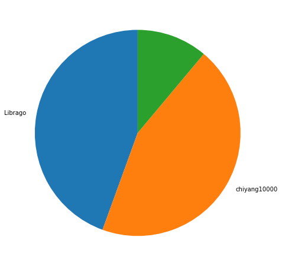
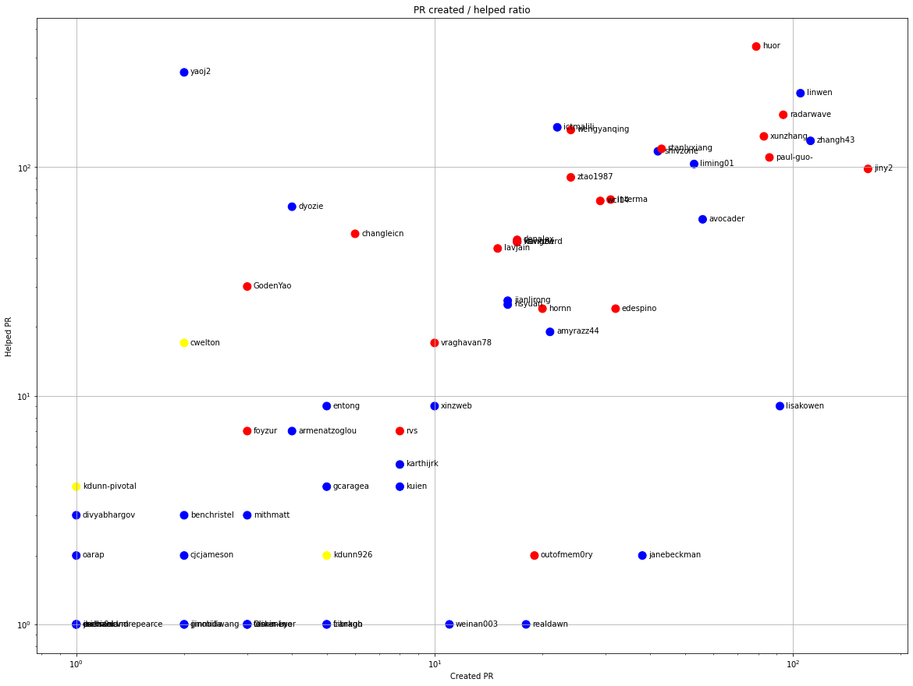
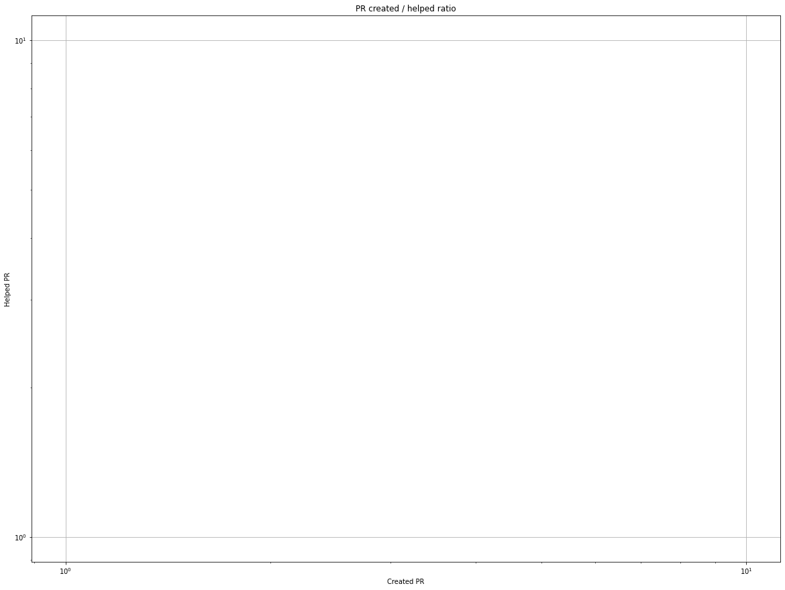
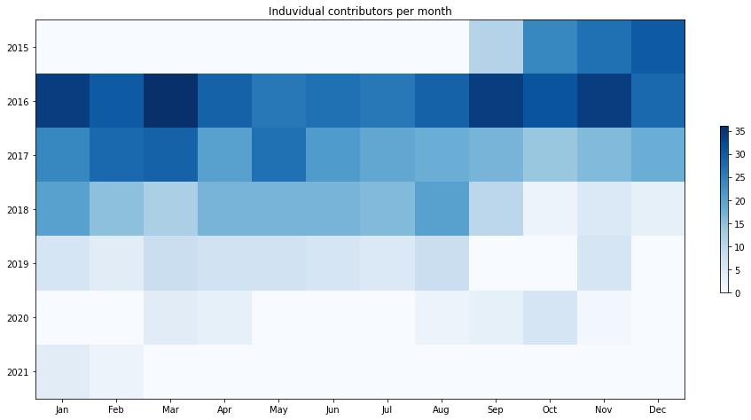
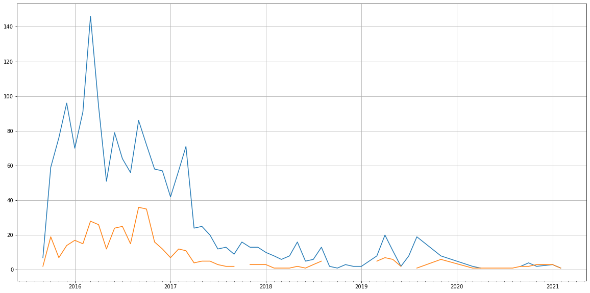
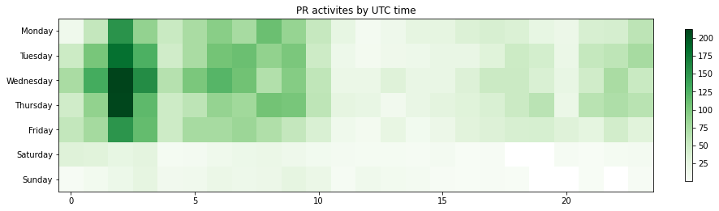

Latest record from the dataset:

<table border="1" class="dataframe">
  <thead>
    <tr style="text-align: right;">
      <th></th>
      <th>org</th>
      <th>repo</th>
      <th>type</th>
      <th>identifier</th>
      <th>subidentifier</th>
      <th>date</th>
      <th>author</th>
      <th>owner</th>
      <th>project</th>
    </tr>
  </thead>
  <tbody>
    <tr>
      <th>3268</th>
      <td>apache</td>
      <td>hawq</td>
      <td>PR_MERGED</td>
      <td>1505</td>
      <td>NaN</td>
      <td>2021-02-04 09:52:54+00:00</td>
      <td>huor</td>
      <td>chiyang10000</td>
      <td>hawq</td>
    </tr>
  </tbody>
</table>

# Github Contributions per user

<table border="1" class="dataframe">
  <thead>
    <tr style="text-align: right;">
      <th></th>
      <th>contributions</th>
    </tr>
    <tr>
      <th>author</th>
      <th></th>
    </tr>
  </thead>
  <tbody>
    <tr>
      <th>huor</th>
      <td>446</td>
    </tr>
    <tr>
      <th>asfgit</th>
      <td>397</td>
    </tr>
    <tr>
      <th>yaoj2</th>
      <td>260</td>
    </tr>
    <tr>
      <th>linwen</th>
      <td>248</td>
    </tr>
    <tr>
      <th>radarwave</th>
      <td>238</td>
    </tr>
    <tr>
      <th>shivzone</th>
      <td>217</td>
    </tr>
    <tr>
      <th>ictmalili</th>
      <td>187</td>
    </tr>
    <tr>
      <th>xunzhang</th>
      <td>183</td>
    </tr>
    <tr>
      <th>paul-guo-</th>
      <td>183</td>
    </tr>
    <tr>
      <th>wengyanqing</th>
      <td>168</td>
    </tr>
  </tbody>
</table>

## Contributors per participations in PRs which are not created by self (helping PRs)

<table border="1" class="dataframe">
  <thead>
    <tr style="text-align: right;">
      <th></th>
      <th>identifier</th>
    </tr>
    <tr>
      <th>author</th>
      <th></th>
    </tr>
  </thead>
  <tbody>
    <tr>
      <th>asfgit</th>
      <td>376</td>
    </tr>
    <tr>
      <th>huor</th>
      <td>336</td>
    </tr>
    <tr>
      <th>yaoj2</th>
      <td>259</td>
    </tr>
    <tr>
      <th>linwen</th>
      <td>210</td>
    </tr>
    <tr>
      <th>radarwave</th>
      <td>169</td>
    </tr>
    <tr>
      <th>ictmalili</th>
      <td>149</td>
    </tr>
    <tr>
      <th>wengyanqing</th>
      <td>145</td>
    </tr>
    <tr>
      <th>xunzhang</th>
      <td>136</td>
    </tr>
    <tr>
      <th>zhangh43</th>
      <td>130</td>
    </tr>
    <tr>
      <th>stanlyxiang</th>
      <td>120</td>
    </tr>
    <tr>
      <th>shivzone</th>
      <td>117</td>
    </tr>
    <tr>
      <th>paul-guo-</th>
      <td>110</td>
    </tr>
    <tr>
      <th>liming01</th>
      <td>103</td>
    </tr>
    <tr>
      <th>jiny2</th>
      <td>98</td>
    </tr>
    <tr>
      <th>ztao1987</th>
      <td>90</td>
    </tr>
    <tr>
      <th>interma</th>
      <td>72</td>
    </tr>
    <tr>
      <th>wcl14</th>
      <td>71</td>
    </tr>
    <tr>
      <th>dyozie</th>
      <td>67</td>
    </tr>
    <tr>
      <th>avocader</th>
      <td>59</td>
    </tr>
    <tr>
      <th>changleicn</th>
      <td>51</td>
    </tr>
  </tbody>
</table>

## Contributors per participations in any PRs

<table border="1" class="dataframe">
  <thead>
    <tr style="text-align: right;">
      <th></th>
      <th>identifier</th>
    </tr>
    <tr>
      <th>author</th>
      <th></th>
    </tr>
  </thead>
  <tbody>
    <tr>
      <th>huor</th>
      <td>415</td>
    </tr>
    <tr>
      <th>asfgit</th>
      <td>376</td>
    </tr>
    <tr>
      <th>linwen</th>
      <td>315</td>
    </tr>
    <tr>
      <th>radarwave</th>
      <td>262</td>
    </tr>
    <tr>
      <th>yaoj2</th>
      <td>261</td>
    </tr>
    <tr>
      <th>jiny2</th>
      <td>259</td>
    </tr>
    <tr>
      <th>zhangh43</th>
      <td>242</td>
    </tr>
    <tr>
      <th>xunzhang</th>
      <td>219</td>
    </tr>
    <tr>
      <th>paul-guo-</th>
      <td>196</td>
    </tr>
    <tr>
      <th>ictmalili</th>
      <td>171</td>
    </tr>
    <tr>
      <th>wengyanqing</th>
      <td>169</td>
    </tr>
    <tr>
      <th>stanlyxiang</th>
      <td>163</td>
    </tr>
    <tr>
      <th>shivzone</th>
      <td>159</td>
    </tr>
    <tr>
      <th>liming01</th>
      <td>156</td>
    </tr>
    <tr>
      <th>avocader</th>
      <td>115</td>
    </tr>
    <tr>
      <th>ztao1987</th>
      <td>114</td>
    </tr>
    <tr>
      <th>interma</th>
      <td>103</td>
    </tr>
    <tr>
      <th>lisakowen</th>
      <td>101</td>
    </tr>
    <tr>
      <th>wcl14</th>
      <td>100</td>
    </tr>
    <tr>
      <th>dyozie</th>
      <td>70</td>
    </tr>
  </tbody>
</table>

# Bus factor (number of contributors responsible for the 50% of the prs) from last half year

## Contributors until the half of the all contributions

<table border="1" class="dataframe">
  <thead>
    <tr style="text-align: right;">
      <th></th>
      <th>author</th>
      <th>identifier</th>
      <th>cs</th>
      <th>ratio</th>
    </tr>
  </thead>
  <tbody>
    <tr>
      <th>0</th>
      <td>Librago</td>
      <td>4</td>
      <td>4</td>
      <td>44.444444</td>
    </tr>
  </tbody>
</table>

## Pony number (bus factor)

    2

## Dev power (All the contributions in the ration of the top contributor)

    2.25

    

    

## People with created PRs > reviewed/commented PRS

    

    

## Same graph with focusing to the last 6 month

Only contributors with both created pr and helped pr visible

    

    

# Number of individual contributors per month

Number of different Github users who either created PR, commented PR, added review to a PR

Note: only events from apache/hadoop-ozone repository are included. Earlier PRs/comments are not here.

    

    

# Number of PRs closed/created per month

    /usr/lib/python3.9/site-packages/pandas/core/arrays/datetimes.py:1101: UserWarning: Converting to PeriodArray/Index representation will drop timezone information.
      warnings.warn(

    

    

# PR activity heatmap

    

    

