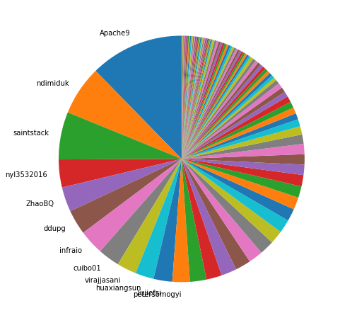
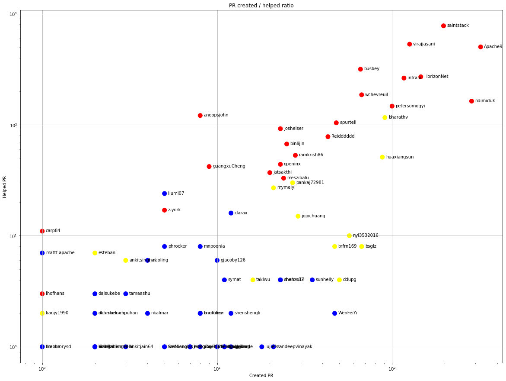
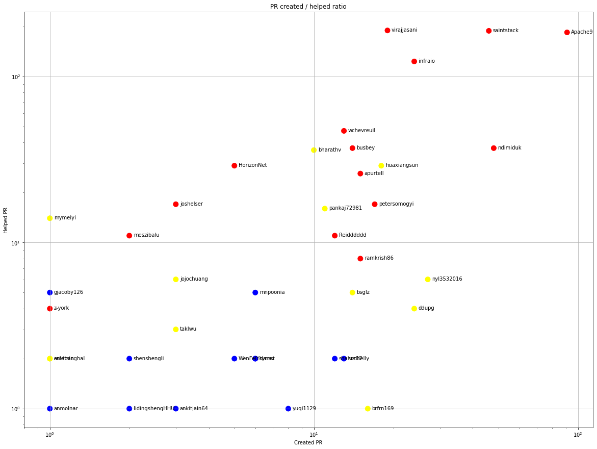
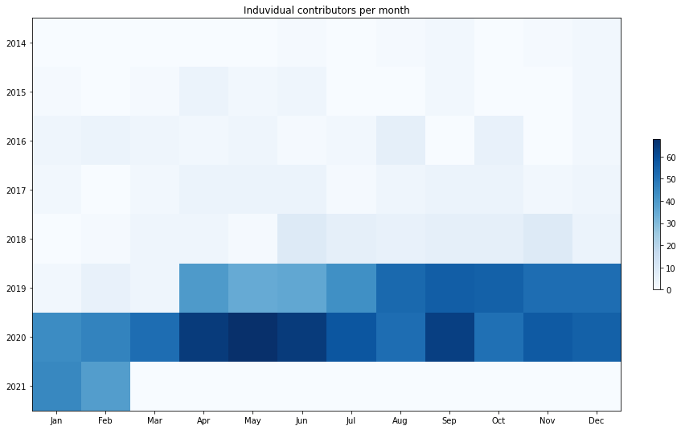
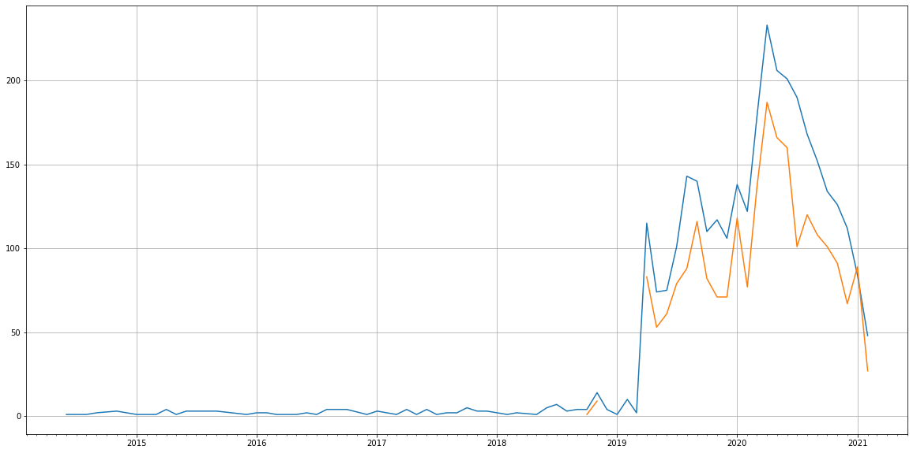
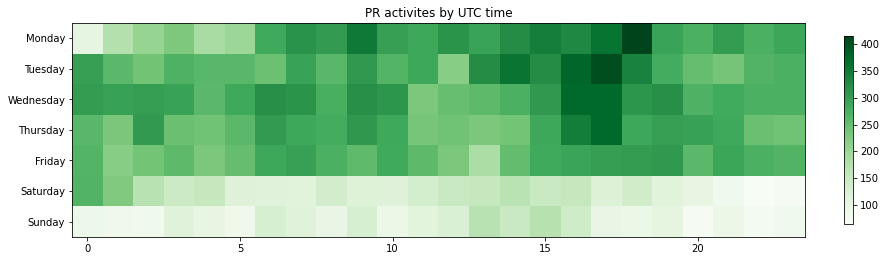

Latest record from the dataset:

<table border="1" class="dataframe">
  <thead>
    <tr style="text-align: right;">
      <th></th>
      <th>org</th>
      <th>repo</th>
      <th>type</th>
      <th>identifier</th>
      <th>subidentifier</th>
      <th>date</th>
      <th>author</th>
      <th>owner</th>
      <th>project</th>
    </tr>
  </thead>
  <tbody>
    <tr>
      <th>27414</th>
      <td>apache</td>
      <td>hbase</td>
      <td>PR_COMMENTED</td>
      <td>2950</td>
      <td>NaN</td>
      <td>2021-02-14 08:14:04+00:00</td>
      <td>Apache-HBase</td>
      <td>arshadmohammad</td>
      <td>hbase</td>
    </tr>
  </tbody>
</table>

# Github Contributions per user

<table border="1" class="dataframe">
  <thead>
    <tr style="text-align: right;">
      <th></th>
      <th>contributions</th>
    </tr>
    <tr>
      <th>author</th>
      <th></th>
    </tr>
  </thead>
  <tbody>
    <tr>
      <th>Apache-HBase</th>
      <td>17085</td>
    </tr>
    <tr>
      <th>saintstack</th>
      <td>1516</td>
    </tr>
    <tr>
      <th>Apache9</th>
      <td>1156</td>
    </tr>
    <tr>
      <th>virajjasani</th>
      <td>1111</td>
    </tr>
    <tr>
      <th>busbey</th>
      <td>856</td>
    </tr>
    <tr>
      <th>infraio</th>
      <td>616</td>
    </tr>
    <tr>
      <th>wchevreuil</th>
      <td>444</td>
    </tr>
    <tr>
      <th>HorizonNet</th>
      <td>431</td>
    </tr>
    <tr>
      <th>ndimiduk</th>
      <td>396</td>
    </tr>
    <tr>
      <th>anoopsjohn</th>
      <td>341</td>
    </tr>
  </tbody>
</table>

## Contributors per participations in PRs which are not created by self (helping PRs)

<table border="1" class="dataframe">
  <thead>
    <tr style="text-align: right;">
      <th></th>
      <th>identifier</th>
    </tr>
    <tr>
      <th>author</th>
      <th></th>
    </tr>
  </thead>
  <tbody>
    <tr>
      <th>Apache-HBase</th>
      <td>2704</td>
    </tr>
    <tr>
      <th>saintstack</th>
      <td>777</td>
    </tr>
    <tr>
      <th>virajjasani</th>
      <td>531</td>
    </tr>
    <tr>
      <th>Apache9</th>
      <td>502</td>
    </tr>
    <tr>
      <th>busbey</th>
      <td>316</td>
    </tr>
    <tr>
      <th>HorizonNet</th>
      <td>270</td>
    </tr>
    <tr>
      <th>infraio</th>
      <td>263</td>
    </tr>
    <tr>
      <th>wchevreuil</th>
      <td>186</td>
    </tr>
    <tr>
      <th>ndimiduk</th>
      <td>163</td>
    </tr>
    <tr>
      <th>petersomogyi</th>
      <td>147</td>
    </tr>
    <tr>
      <th>anoopsjohn</th>
      <td>121</td>
    </tr>
    <tr>
      <th>bharathv</th>
      <td>116</td>
    </tr>
    <tr>
      <th>apurtell</th>
      <td>104</td>
    </tr>
    <tr>
      <th>joshelser</th>
      <td>92</td>
    </tr>
    <tr>
      <th>Reidddddd</th>
      <td>78</td>
    </tr>
    <tr>
      <th>binlijin</th>
      <td>67</td>
    </tr>
    <tr>
      <th>asf-ci</th>
      <td>57</td>
    </tr>
    <tr>
      <th>ramkrish86</th>
      <td>53</td>
    </tr>
    <tr>
      <th>huaxiangsun</th>
      <td>51</td>
    </tr>
    <tr>
      <th>openinx</th>
      <td>44</td>
    </tr>
  </tbody>
</table>

## Contributors per participations in any PRs

<table border="1" class="dataframe">
  <thead>
    <tr style="text-align: right;">
      <th></th>
      <th>identifier</th>
    </tr>
    <tr>
      <th>author</th>
      <th></th>
    </tr>
  </thead>
  <tbody>
    <tr>
      <th>Apache-HBase</th>
      <td>2704</td>
    </tr>
    <tr>
      <th>saintstack</th>
      <td>961</td>
    </tr>
    <tr>
      <th>Apache9</th>
      <td>823</td>
    </tr>
    <tr>
      <th>virajjasani</th>
      <td>657</td>
    </tr>
    <tr>
      <th>ndimiduk</th>
      <td>448</td>
    </tr>
    <tr>
      <th>HorizonNet</th>
      <td>412</td>
    </tr>
    <tr>
      <th>infraio</th>
      <td>380</td>
    </tr>
    <tr>
      <th>busbey</th>
      <td>367</td>
    </tr>
    <tr>
      <th>wchevreuil</th>
      <td>249</td>
    </tr>
    <tr>
      <th>petersomogyi</th>
      <td>230</td>
    </tr>
    <tr>
      <th>bharathv</th>
      <td>206</td>
    </tr>
    <tr>
      <th>apurtell</th>
      <td>152</td>
    </tr>
    <tr>
      <th>huaxiangsun</th>
      <td>139</td>
    </tr>
    <tr>
      <th>anoopsjohn</th>
      <td>129</td>
    </tr>
    <tr>
      <th>Reidddddd</th>
      <td>121</td>
    </tr>
    <tr>
      <th>joshelser</th>
      <td>114</td>
    </tr>
    <tr>
      <th>binlijin</th>
      <td>92</td>
    </tr>
    <tr>
      <th>ramkrish86</th>
      <td>81</td>
    </tr>
    <tr>
      <th>bsglz</th>
      <td>75</td>
    </tr>
    <tr>
      <th>nyl3532016</th>
      <td>67</td>
    </tr>
  </tbody>
</table>

# Bus factor (number of contributors responsible for the 50% of the prs) from last half year

## Contributors until the half of the all contributions

<table border="1" class="dataframe">
  <thead>
    <tr style="text-align: right;">
      <th></th>
      <th>author</th>
      <th>identifier</th>
      <th>cs</th>
      <th>ratio</th>
    </tr>
  </thead>
  <tbody>
    <tr>
      <th>0</th>
      <td>Apache9</td>
      <td>91</td>
      <td>91</td>
      <td>12.330623</td>
    </tr>
    <tr>
      <th>1</th>
      <td>ndimiduk</td>
      <td>48</td>
      <td>139</td>
      <td>6.504065</td>
    </tr>
    <tr>
      <th>2</th>
      <td>saintstack</td>
      <td>46</td>
      <td>185</td>
      <td>6.233062</td>
    </tr>
    <tr>
      <th>3</th>
      <td>nyl3532016</td>
      <td>27</td>
      <td>212</td>
      <td>3.658537</td>
    </tr>
    <tr>
      <th>4</th>
      <td>ZhaoBQ</td>
      <td>24</td>
      <td>236</td>
      <td>3.252033</td>
    </tr>
    <tr>
      <th>5</th>
      <td>ddupg</td>
      <td>24</td>
      <td>260</td>
      <td>3.252033</td>
    </tr>
    <tr>
      <th>6</th>
      <td>infraio</td>
      <td>24</td>
      <td>284</td>
      <td>3.252033</td>
    </tr>
    <tr>
      <th>7</th>
      <td>cuibo01</td>
      <td>21</td>
      <td>305</td>
      <td>2.845528</td>
    </tr>
    <tr>
      <th>8</th>
      <td>virajjasani</td>
      <td>19</td>
      <td>324</td>
      <td>2.574526</td>
    </tr>
    <tr>
      <th>9</th>
      <td>huaxiangsun</td>
      <td>18</td>
      <td>342</td>
      <td>2.439024</td>
    </tr>
    <tr>
      <th>10</th>
      <td>lujiefsi</td>
      <td>18</td>
      <td>360</td>
      <td>2.439024</td>
    </tr>
  </tbody>
</table>

## Pony number (bus factor)

    12

## Dev power (All the contributions in the ration of the top contributor)

    8.10989010989011

    

    

## People with created PRs > reviewed/commented PRS

    

    

## Same graph with focusing to the last 6 month

Only contributors with both created pr and helped pr visible

    

    

# Number of individual contributors per month

Number of different Github users who either created PR, commented PR, added review to a PR

Note: only events from apache/hadoop-ozone repository are included. Earlier PRs/comments are not here.

    

    

# Number of PRs closed/created per month

    /usr/lib/python3.9/site-packages/pandas/core/arrays/datetimes.py:1101: UserWarning: Converting to PeriodArray/Index representation will drop timezone information.
      warnings.warn(

    

    

# PR activity heatmap

    

    

