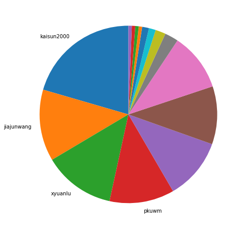
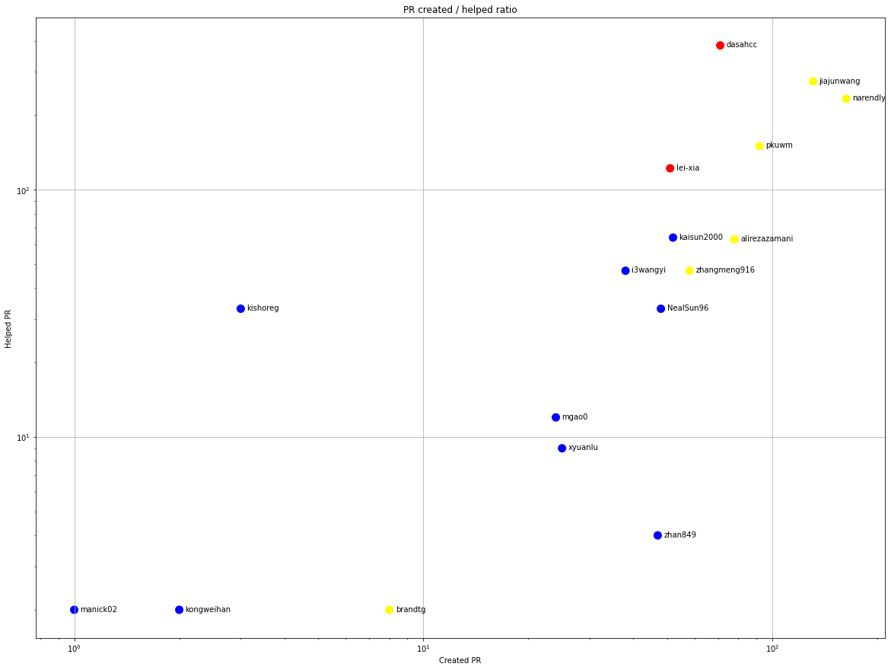
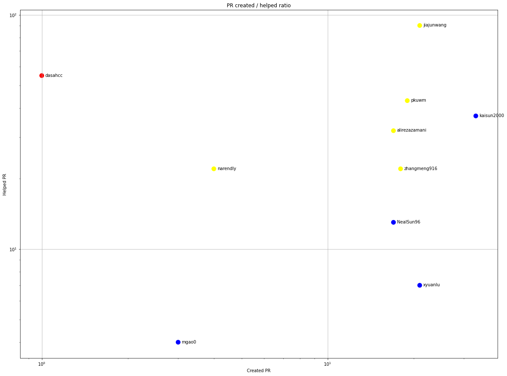
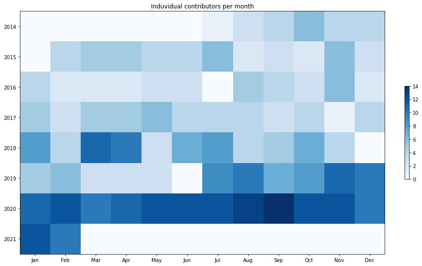
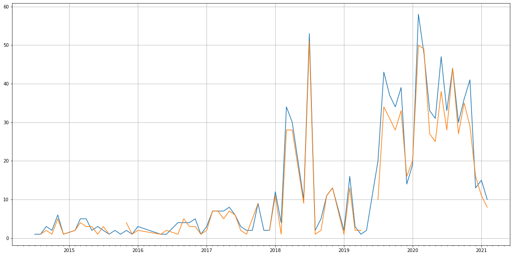
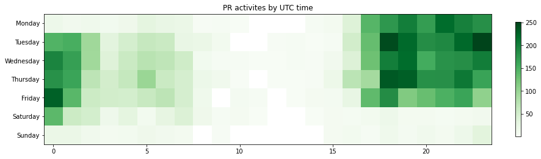

Latest record from the dataset:

<table border="1" class="dataframe">
  <thead>
    <tr style="text-align: right;">
      <th></th>
      <th>org</th>
      <th>repo</th>
      <th>type</th>
      <th>identifier</th>
      <th>subidentifier</th>
      <th>date</th>
      <th>author</th>
      <th>owner</th>
      <th>project</th>
    </tr>
  </thead>
  <tbody>
    <tr>
      <th>4405</th>
      <td>apache</td>
      <td>helix</td>
      <td>PR_MERGED</td>
      <td>1644</td>
      <td>NaN</td>
      <td>2021-02-12 19:36:04+00:00</td>
      <td>jiajunwang</td>
      <td>NealSun96</td>
      <td>helix</td>
    </tr>
  </tbody>
</table>

# Github Contributions per user

<table border="1" class="dataframe">
  <thead>
    <tr style="text-align: right;">
      <th></th>
      <th>contributions</th>
    </tr>
    <tr>
      <th>author</th>
      <th></th>
    </tr>
  </thead>
  <tbody>
    <tr>
      <th>narendly</th>
      <td>1108</td>
    </tr>
    <tr>
      <th>jiajunwang</th>
      <td>1058</td>
    </tr>
    <tr>
      <th>dasahcc</th>
      <td>689</td>
    </tr>
    <tr>
      <th>pkuwm</th>
      <td>357</td>
    </tr>
    <tr>
      <th>kaisun2000</th>
      <td>293</td>
    </tr>
    <tr>
      <th>lei-xia</th>
      <td>291</td>
    </tr>
    <tr>
      <th>asfgit</th>
      <td>273</td>
    </tr>
    <tr>
      <th>i3wangyi</th>
      <td>141</td>
    </tr>
    <tr>
      <th>alirezazamani</th>
      <td>110</td>
    </tr>
    <tr>
      <th>zhangmeng916</th>
      <td>94</td>
    </tr>
  </tbody>
</table>

## Contributors per participations in PRs which are not created by self (helping PRs)

<table border="1" class="dataframe">
  <thead>
    <tr style="text-align: right;">
      <th></th>
      <th>identifier</th>
    </tr>
    <tr>
      <th>author</th>
      <th></th>
    </tr>
  </thead>
  <tbody>
    <tr>
      <th>dasahcc</th>
      <td>383</td>
    </tr>
    <tr>
      <th>jiajunwang</th>
      <td>274</td>
    </tr>
    <tr>
      <th>asfgit</th>
      <td>273</td>
    </tr>
    <tr>
      <th>narendly</th>
      <td>233</td>
    </tr>
    <tr>
      <th>pkuwm</th>
      <td>150</td>
    </tr>
    <tr>
      <th>lei-xia</th>
      <td>122</td>
    </tr>
    <tr>
      <th>kaisun2000</th>
      <td>64</td>
    </tr>
    <tr>
      <th>alirezazamani</th>
      <td>63</td>
    </tr>
    <tr>
      <th>zhangmeng916</th>
      <td>47</td>
    </tr>
    <tr>
      <th>i3wangyi</th>
      <td>47</td>
    </tr>
    <tr>
      <th>NealSun96</th>
      <td>33</td>
    </tr>
    <tr>
      <th>kishoreg</th>
      <td>33</td>
    </tr>
    <tr>
      <th>kanakb</th>
      <td>29</td>
    </tr>
    <tr>
      <th>mgao0</th>
      <td>12</td>
    </tr>
    <tr>
      <th>xyuanlu</th>
      <td>9</td>
    </tr>
    <tr>
      <th>asfbot</th>
      <td>5</td>
    </tr>
    <tr>
      <th>zhan849</th>
      <td>4</td>
    </tr>
    <tr>
      <th>kongweihan</th>
      <td>2</td>
    </tr>
    <tr>
      <th>brandtg</th>
      <td>2</td>
    </tr>
    <tr>
      <th>lujiefsi</th>
      <td>2</td>
    </tr>
  </tbody>
</table>

## Contributors per participations in any PRs

<table border="1" class="dataframe">
  <thead>
    <tr style="text-align: right;">
      <th></th>
      <th>identifier</th>
    </tr>
    <tr>
      <th>author</th>
      <th></th>
    </tr>
  </thead>
  <tbody>
    <tr>
      <th>dasahcc</th>
      <td>454</td>
    </tr>
    <tr>
      <th>jiajunwang</th>
      <td>405</td>
    </tr>
    <tr>
      <th>narendly</th>
      <td>396</td>
    </tr>
    <tr>
      <th>asfgit</th>
      <td>273</td>
    </tr>
    <tr>
      <th>pkuwm</th>
      <td>242</td>
    </tr>
    <tr>
      <th>lei-xia</th>
      <td>173</td>
    </tr>
    <tr>
      <th>alirezazamani</th>
      <td>141</td>
    </tr>
    <tr>
      <th>kaisun2000</th>
      <td>116</td>
    </tr>
    <tr>
      <th>zhangmeng916</th>
      <td>105</td>
    </tr>
    <tr>
      <th>i3wangyi</th>
      <td>85</td>
    </tr>
    <tr>
      <th>NealSun96</th>
      <td>81</td>
    </tr>
    <tr>
      <th>zhan849</th>
      <td>51</td>
    </tr>
    <tr>
      <th>kishoreg</th>
      <td>36</td>
    </tr>
    <tr>
      <th>mgao0</th>
      <td>36</td>
    </tr>
    <tr>
      <th>xyuanlu</th>
      <td>34</td>
    </tr>
    <tr>
      <th>kanakb</th>
      <td>29</td>
    </tr>
    <tr>
      <th>brandtg</th>
      <td>10</td>
    </tr>
    <tr>
      <th>hivivo</th>
      <td>9</td>
    </tr>
    <tr>
      <th>jicongrui</th>
      <td>6</td>
    </tr>
    <tr>
      <th>mikcire</th>
      <td>6</td>
    </tr>
  </tbody>
</table>

# Bus factor (number of contributors responsible for the 50% of the prs) from last half year

## Contributors until the half of the all contributions

<table border="1" class="dataframe">
  <thead>
    <tr style="text-align: right;">
      <th></th>
      <th>author</th>
      <th>identifier</th>
      <th>cs</th>
      <th>ratio</th>
    </tr>
  </thead>
  <tbody>
    <tr>
      <th>0</th>
      <td>kaisun2000</td>
      <td>33</td>
      <td>33</td>
      <td>20.496894</td>
    </tr>
    <tr>
      <th>1</th>
      <td>jiajunwang</td>
      <td>21</td>
      <td>54</td>
      <td>13.043478</td>
    </tr>
    <tr>
      <th>2</th>
      <td>xyuanlu</td>
      <td>21</td>
      <td>75</td>
      <td>13.043478</td>
    </tr>
  </tbody>
</table>

## Pony number (bus factor)

    4

## Dev power (All the contributions in the ration of the top contributor)

    4.878787878787878

    

    

## People with created PRs > reviewed/commented PRS

    

    

## Same graph with focusing to the last 6 month

Only contributors with both created pr and helped pr visible

    

    

# Number of individual contributors per month

Number of different Github users who either created PR, commented PR, added review to a PR

Note: only events from apache/hadoop-ozone repository are included. Earlier PRs/comments are not here.

    

    

# Number of PRs closed/created per month

    /usr/lib/python3.9/site-packages/pandas/core/arrays/datetimes.py:1101: UserWarning: Converting to PeriodArray/Index representation will drop timezone information.
      warnings.warn(

    

    

# PR activity heatmap

    

    

