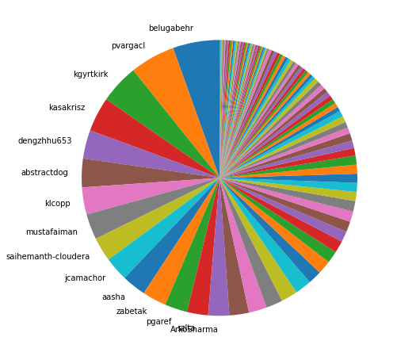
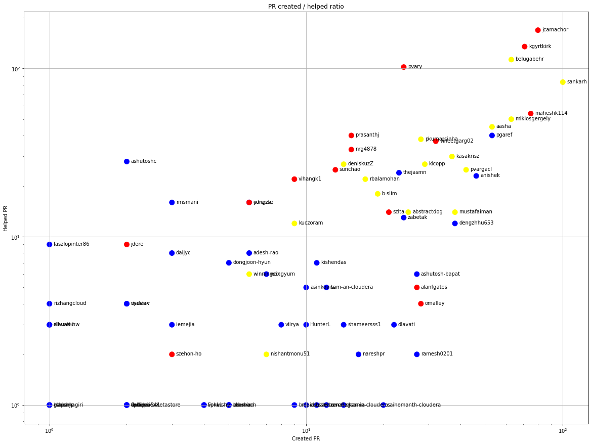
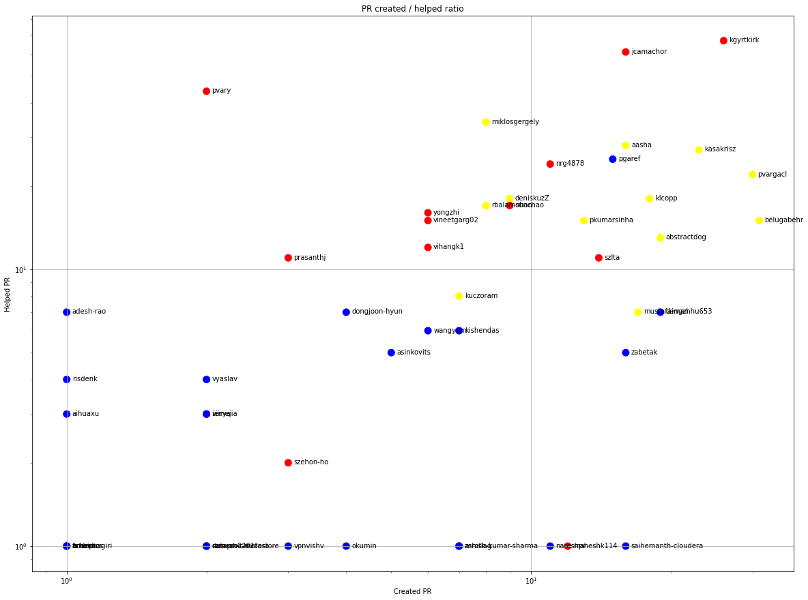
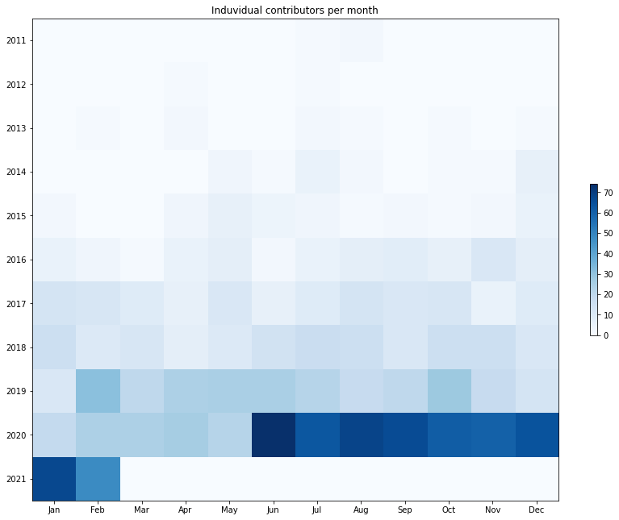
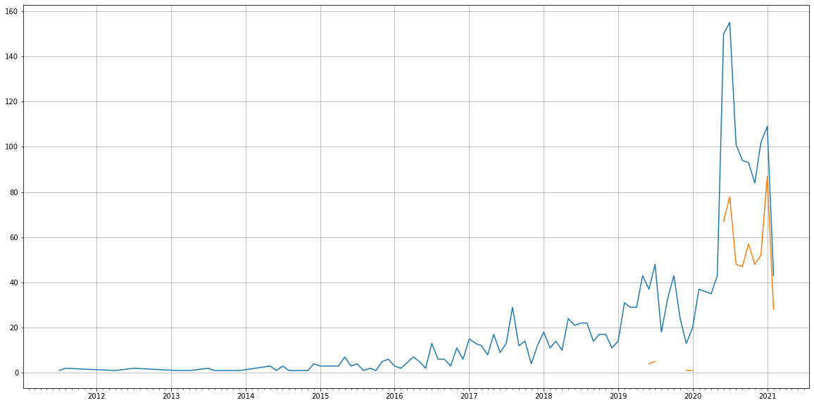
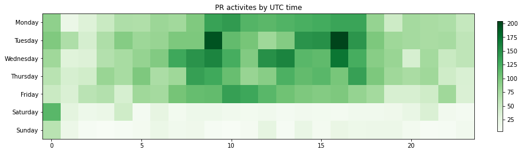

Latest record from the dataset:

<table border="1" class="dataframe">
  <thead>
    <tr style="text-align: right;">
      <th></th>
      <th>org</th>
      <th>repo</th>
      <th>type</th>
      <th>identifier</th>
      <th>subidentifier</th>
      <th>date</th>
      <th>author</th>
      <th>owner</th>
      <th>project</th>
    </tr>
  </thead>
  <tbody>
    <tr>
      <th>5804</th>
      <td>apache</td>
      <td>hive</td>
      <td>PR_COMMENTED</td>
      <td>1771</td>
      <td>NaN</td>
      <td>2021-02-13 00:45:46+00:00</td>
      <td>github-actions</td>
      <td>zabetak</td>
      <td>hive</td>
    </tr>
  </tbody>
</table>

# Github Contributions per user

<table border="1" class="dataframe">
  <thead>
    <tr style="text-align: right;">
      <th></th>
      <th>contributions</th>
    </tr>
    <tr>
      <th>author</th>
      <th></th>
    </tr>
  </thead>
  <tbody>
    <tr>
      <th>github-actions</th>
      <td>599</td>
    </tr>
    <tr>
      <th>sankarh</th>
      <td>467</td>
    </tr>
    <tr>
      <th>jcamachor</th>
      <td>401</td>
    </tr>
    <tr>
      <th>pvary</th>
      <td>397</td>
    </tr>
    <tr>
      <th>kgyrtkirk</th>
      <td>352</td>
    </tr>
    <tr>
      <th>belugabehr</th>
      <td>255</td>
    </tr>
    <tr>
      <th>deniskuzZ</th>
      <td>198</td>
    </tr>
    <tr>
      <th>aasha</th>
      <td>158</td>
    </tr>
    <tr>
      <th>sunchao</th>
      <td>131</td>
    </tr>
    <tr>
      <th>pgaref</th>
      <td>105</td>
    </tr>
  </tbody>
</table>

## Contributors per participations in PRs which are not created by self (helping PRs)

<table border="1" class="dataframe">
  <thead>
    <tr style="text-align: right;">
      <th></th>
      <th>identifier</th>
    </tr>
    <tr>
      <th>author</th>
      <th></th>
    </tr>
  </thead>
  <tbody>
    <tr>
      <th>github-actions</th>
      <td>585</td>
    </tr>
    <tr>
      <th>jcamachor</th>
      <td>169</td>
    </tr>
    <tr>
      <th>kgyrtkirk</th>
      <td>135</td>
    </tr>
    <tr>
      <th>belugabehr</th>
      <td>113</td>
    </tr>
    <tr>
      <th>pvary</th>
      <td>102</td>
    </tr>
    <tr>
      <th>sankarh</th>
      <td>83</td>
    </tr>
    <tr>
      <th>maheshk114</th>
      <td>54</td>
    </tr>
    <tr>
      <th>miklosgergely</th>
      <td>50</td>
    </tr>
    <tr>
      <th>aasha</th>
      <td>45</td>
    </tr>
    <tr>
      <th>prasanthj</th>
      <td>40</td>
    </tr>
    <tr>
      <th>pgaref</th>
      <td>40</td>
    </tr>
    <tr>
      <th>pkumarsinha</th>
      <td>38</td>
    </tr>
    <tr>
      <th>vineetgarg02</th>
      <td>37</td>
    </tr>
    <tr>
      <th>nrg4878</th>
      <td>33</td>
    </tr>
    <tr>
      <th>kasakrisz</th>
      <td>30</td>
    </tr>
    <tr>
      <th>ashutoshc</th>
      <td>28</td>
    </tr>
    <tr>
      <th>deniskuzZ</th>
      <td>27</td>
    </tr>
    <tr>
      <th>klcopp</th>
      <td>27</td>
    </tr>
    <tr>
      <th>sunchao</th>
      <td>25</td>
    </tr>
    <tr>
      <th>pvargacl</th>
      <td>25</td>
    </tr>
  </tbody>
</table>

## Contributors per participations in any PRs

<table border="1" class="dataframe">
  <thead>
    <tr style="text-align: right;">
      <th></th>
      <th>identifier</th>
    </tr>
    <tr>
      <th>author</th>
      <th></th>
    </tr>
  </thead>
  <tbody>
    <tr>
      <th>github-actions</th>
      <td>585</td>
    </tr>
    <tr>
      <th>jcamachor</th>
      <td>249</td>
    </tr>
    <tr>
      <th>kgyrtkirk</th>
      <td>206</td>
    </tr>
    <tr>
      <th>sankarh</th>
      <td>183</td>
    </tr>
    <tr>
      <th>belugabehr</th>
      <td>176</td>
    </tr>
    <tr>
      <th>maheshk114</th>
      <td>129</td>
    </tr>
    <tr>
      <th>pvary</th>
      <td>126</td>
    </tr>
    <tr>
      <th>miklosgergely</th>
      <td>113</td>
    </tr>
    <tr>
      <th>aasha</th>
      <td>98</td>
    </tr>
    <tr>
      <th>pgaref</th>
      <td>93</td>
    </tr>
    <tr>
      <th>vineetgarg02</th>
      <td>69</td>
    </tr>
    <tr>
      <th>anishek</th>
      <td>69</td>
    </tr>
    <tr>
      <th>kasakrisz</th>
      <td>67</td>
    </tr>
    <tr>
      <th>pvargacl</th>
      <td>67</td>
    </tr>
    <tr>
      <th>pkumarsinha</th>
      <td>66</td>
    </tr>
    <tr>
      <th>klcopp</th>
      <td>56</td>
    </tr>
    <tr>
      <th>prasanthj</th>
      <td>55</td>
    </tr>
    <tr>
      <th>mustafaiman</th>
      <td>52</td>
    </tr>
    <tr>
      <th>dengzhhu653</th>
      <td>50</td>
    </tr>
    <tr>
      <th>nrg4878</th>
      <td>48</td>
    </tr>
  </tbody>
</table>

# Bus factor (number of contributors responsible for the 50% of the prs) from last half year

## Contributors until the half of the all contributions

<table border="1" class="dataframe">
  <thead>
    <tr style="text-align: right;">
      <th></th>
      <th>author</th>
      <th>identifier</th>
      <th>cs</th>
      <th>ratio</th>
    </tr>
  </thead>
  <tbody>
    <tr>
      <th>0</th>
      <td>belugabehr</td>
      <td>31</td>
      <td>31</td>
      <td>5.467372</td>
    </tr>
    <tr>
      <th>1</th>
      <td>pvargacl</td>
      <td>30</td>
      <td>61</td>
      <td>5.291005</td>
    </tr>
    <tr>
      <th>2</th>
      <td>kgyrtkirk</td>
      <td>26</td>
      <td>87</td>
      <td>4.585538</td>
    </tr>
    <tr>
      <th>3</th>
      <td>kasakrisz</td>
      <td>23</td>
      <td>110</td>
      <td>4.056437</td>
    </tr>
    <tr>
      <th>4</th>
      <td>dengzhhu653</td>
      <td>19</td>
      <td>129</td>
      <td>3.350970</td>
    </tr>
    <tr>
      <th>5</th>
      <td>abstractdog</td>
      <td>19</td>
      <td>148</td>
      <td>3.350970</td>
    </tr>
    <tr>
      <th>6</th>
      <td>klcopp</td>
      <td>18</td>
      <td>166</td>
      <td>3.174603</td>
    </tr>
    <tr>
      <th>7</th>
      <td>mustafaiman</td>
      <td>17</td>
      <td>183</td>
      <td>2.998236</td>
    </tr>
    <tr>
      <th>8</th>
      <td>saihemanth-cloudera</td>
      <td>16</td>
      <td>199</td>
      <td>2.821869</td>
    </tr>
    <tr>
      <th>9</th>
      <td>jcamachor</td>
      <td>16</td>
      <td>215</td>
      <td>2.821869</td>
    </tr>
    <tr>
      <th>10</th>
      <td>aasha</td>
      <td>16</td>
      <td>231</td>
      <td>2.821869</td>
    </tr>
    <tr>
      <th>11</th>
      <td>zabetak</td>
      <td>16</td>
      <td>247</td>
      <td>2.821869</td>
    </tr>
    <tr>
      <th>12</th>
      <td>pgaref</td>
      <td>15</td>
      <td>262</td>
      <td>2.645503</td>
    </tr>
    <tr>
      <th>13</th>
      <td>szlta</td>
      <td>14</td>
      <td>276</td>
      <td>2.469136</td>
    </tr>
  </tbody>
</table>

## Pony number (bus factor)

    15

## Dev power (All the contributions in the ration of the top contributor)

    18.290322580645153

    

    

## People with created PRs > reviewed/commented PRS

    

    

## Same graph with focusing to the last 6 month

Only contributors with both created pr and helped pr visible

    

    

# Number of individual contributors per month

Number of different Github users who either created PR, commented PR, added review to a PR

Note: only events from apache/hadoop-ozone repository are included. Earlier PRs/comments are not here.

    

    

# Number of PRs closed/created per month

    /usr/lib/python3.9/site-packages/pandas/core/arrays/datetimes.py:1101: UserWarning: Converting to PeriodArray/Index representation will drop timezone information.
      warnings.warn(

    

    

# PR activity heatmap

    

    

